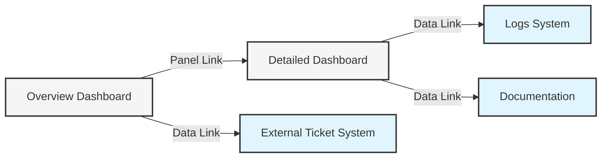

# Panel Data Links

## Introduction

Data links are a powerful feature in Grafana that allow you to transform static dashboard panels into interactive elements. By adding data links to your panels, you can enable users to navigate to other dashboards, external systems, or detailed views based on the data they're viewing. This creates a more dynamic and interconnected visualization experience, allowing users to drill down into data and explore related information with just a click.

In this guide, we'll explore how to set up and use data links in Grafana panels, along with best practices and real-world applications.

## Understanding Data Links

Data links are clickable elements that can be added to panels in Grafana. When clicked, these links direct users to:

- Other dashboards with pre-filled variables
- External websites
- Detailed data explorations
- Documentation or knowledge bases

The links can be enriched with variables from the current context, making them dynamic and context-aware.

## Types of Data Links in Grafana

Grafana offers several types of data links:

1. **Panel Links** - Applied to the entire panel
2. **Data Links** - Applied to specific data points
3. **Field Links** - Applied to specific fields in your data

Let's explore each type in detail.

## Panel Links

Panel links appear as icons in the panel header and apply to the entire panel.

### How to Add Panel Links

1. Navigate to your dashboard and select the panel you want to add links to
2. Click on the panel title and select "Edit"
3. In the panel options sidebar, find and click on "Panel links"
4. Click "Add link"
5. Configure the link with the following options:
   - Title: Displayed name of the link
   - URL: Destination of the link
   - Open in new tab: Toggle whether the link should open in a new browser tab

### Example Configuration

```
Title: CPU Details
URL: /d/abc123/cpu-details?var-server=${__series.name}
Open in new tab: true
```

## Data Links

Data links are attached to specific data points in visualizations like graphs or tables. When users click on a data point, they can access these links.

### How to Add Data Links

1. Edit your panel
2. Go to the "Field" tab in the panel editor
3. Under "Data links", click "Add link"
4. Configure the link with:
   - Title: Displayed name in the context menu
   - URL: Destination with variable substitution
   - Open in new tab: Toggle behavior

### Example Configuration

```
Title: Show logs for this server
URL: /d/logs?var-server=${__value.raw}&from=${__from}&to=${__to}
Open in new tab: true
```

## Using Variables in Data Links

The real power of data links comes from their ability to use variables from the current context. Here are some commonly used variables:

- `${__value.raw}` - The raw value of the clicked data point
- `${__value.text}` - The formatted text value
- `${__value.time}` - The timestamp of the data point
- `${__series.name}` - The name of the series
- `${__field.name}` - The name of the field
- `${__from}` and `${__to}` - Dashboard time range

## Code Example: Creating Dynamic Data Links

Here's a complete example showing how to create data links that pass context information:

```javascript
// This is a configuration example, not executable code
// You would implement this through the Grafana UI

// Panel link configuration
{
  "title": "Server Details",
  "url": "/d/server-details?var-server=${__series.name}&var-env=${env}",
  "targetBlank": true
}

// Data link configuration
{
  "title": "Logs for ${__value.text}",
  "url": "https://logs.example.com/query?host=${__field.labels.instance}&time=${__value.time}",
  "targetBlank": true
}
```

## Practical Examples

### Example 1: Dashboard Drill-Down

Create a high-level dashboard showing system metrics across multiple servers. Add data links to each server panel that navigate to a detailed dashboard for that specific server.

```
Title: View Server Details
URL: /d/server-detail?var-server=${__series.name}&var-timeRange=${__url_time_range}
```

### Example 2: Linking to External Documentation

When monitoring application components, link directly to the relevant documentation when anomalies are detected.

```
Title: View Component Docs
URL: https://docs.example.com/components/${__field.labels.component}
```

### Example 3: Linking to Incident Management

Create links to automatically create tickets in your incident management system.

```
Title: Create Incident Ticket
URL: https://tickets.example.com/new?title=Issue with ${__series.name}&description=Value: ${__value.raw} at time ${__value.time}
```

## Visualizing Data Link Flow

Here's a diagram showing how data links connect different dashboards and external systems:



## Best Practices for Data Links

1. **Be Descriptive**: Give your links clear, action-oriented titles
2. **Target New Tabs**: Open complex details in new browser tabs to maintain context
3. **Leverage Variables**: Make links dynamic by using dashboard and data variables
4. **Design a Navigation Flow**: Create a logical flow between dashboards
5. **Limit the Number of Links**: Avoid overwhelming users with too many options
6. **Test Thoroughly**: Ensure variables are properly escaped and links work in all scenarios

## Troubleshooting Data Links

If your data links aren't working as expected, check these common issues:

1. **Variable Syntax**: Ensure you're using the correct variable syntax (`${variable}`)
2. **Missing Values**: Verify that the variables you're using have values in the current context
3. **URL Encoding**: Some special characters may need URL encoding
4. **Permissions**: Ensure users have access to the linked dashboards/resources

## Advanced: URL Encoding and Special Characters

When using variables that might contain special characters, use the built-in URL encoding functions:

```
URL: /d/detail?query=${__url_encode:${__field.name}}
```

## Summary

Data links transform static Grafana dashboards into interactive exploration tools. By connecting panels to related dashboards, external systems, and detailed views, you create a more cohesive monitoring experience. With the ability to pass context through variables, users can maintain their focus while drilling down into exactly the information they need.

Remember to design your data links with the user journey in mind, making navigation intuitive and valuable. Well-implemented data links can significantly enhance the usability and effectiveness of your Grafana dashboards.

## Exercise: Build a Connected Dashboard System

Try this exercise to practice using data links:

1. Create a main dashboard with panels showing metrics for different servers
2. Create a detail dashboard that accepts a server variable
3. Add panel links from the main dashboard to the detail dashboard
4. Add data links in the detail dashboard that point to relevant logs
5. Test the navigation flow between dashboards

## Additional Resources

- [Grafana Data Links Documentation](https://grafana.com/docs/grafana/latest/panels/configure-data-links/)
- [Grafana Variables](https://grafana.com/docs/grafana/latest/variables/)
- [URL Encoding Reference](https://grafana.com/docs/grafana/latest/variables/url-variables/)