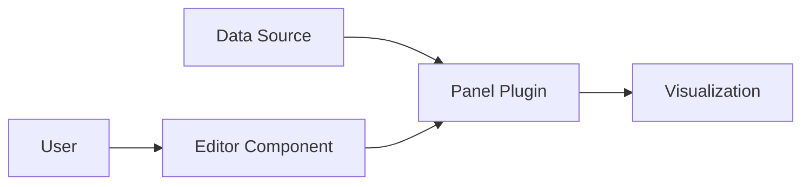

# Custom Panel Development

## Introduction

Grafana comes with a wide variety of built-in panels for data visualization, but sometimes you need something specific that doesn't exist out of the box. That's where custom panel development comes in. By creating your own panel plugins, you can extend Grafana's visualization capabilities to meet your unique requirements.

In this guide, you'll learn how to build a custom panel plugin for Grafana from scratch. We'll cover the essential concepts, tools, and techniques you need to create effective, reusable visualization components.

## Prerequisites

Before you begin developing custom Grafana panels, make sure you have:

- Basic knowledge of JavaScript/TypeScript
- Familiarity with React
- Node.js and npm installed
- Basic understanding of data visualization concepts
- Grafana installed (locally or access to a Grafana instance)

## Understanding Grafana Panel Plugins

Grafana panel plugins are React components that receive data from a data source and render it as a visualization. Each panel has:

1. A **panel component** that renders the visualization
2. An **editor component** that lets users configure the panel
3. **Options** that define how the panel behaves and appears



## Setting Up Your Development Environment

Let's start by setting up a development environment for your custom panel plugin.

### Step 1: Install the Grafana Plugin Development Tools

```bash
npm install -g @grafana/toolkit
```

### Step 2: Create a New Panel Plugin

```bash
npx @grafana/toolkit plugin:create my-custom-panel
```

This command creates a new plugin project with all the necessary files and dependencies.

### Step 3: Navigate to Your Plugin Directory

```bash
cd my-custom-panel
```

### Step 4: Install Dependencies

```bash
npm install
```

### Step 5: Build the Plugin

```bash
npm run dev
```

This command builds your plugin and watches for changes, rebuilding automatically when you modify files.

## Project Structure

After creating a new panel plugin, you'll have a directory structure similar to this:

```
my-custom-panel/
├── src/
│   ├── module.ts            # Main module file
│   ├── plugin.json          # Plugin metadata
│   ├── SimplePanel.tsx      # Panel component
│   ├── SimpleEditor.tsx     # Editor component
│   └── types.ts             # TypeScript type definitions
├── package.json
├── README.md
└── tsconfig.json
```

The most important files are:

- **module.ts**: Registers your panel plugin with Grafana
- **plugin.json**: Contains metadata about your plugin
- **SimplePanel.tsx**: The main React component for your visualization
- **types.ts**: TypeScript interfaces for your panel options

## Creating a Basic Panel

Let's examine the key parts of a custom panel by looking at a simple example:

### The Panel Component (SimplePanel.tsx)

```tsx
import React from 'react';
import { PanelProps } from '@grafana/data';
import { SimpleOptions } from 'types';
import { css, cx } from 'emotion';
import { stylesFactory } from '@grafana/ui';

interface Props extends PanelProps<SimpleOptions> {}

export const SimplePanel: React.FC<Props> = ({ options, data, width, height }) => {
  const styles = getStyles();
  
  // Extract data from the query results
  const values = data.series
    .flatMap((series) => series.fields.find((field) => field.type === 'number')?.values.toArray() || []);
  
  // Calculate the average value
  const avg = values.length ? values.reduce((sum, value) => sum + value, 0) / values.length : 0;
  
  return (
    <div
      className={cx(
        styles.wrapper,
        css`
          width: ${width}px;
          height: ${height}px;
        `
      )}
    >
      <div className={styles.textBox}>
        <div className={styles.title}>{options.showTitle ? options.title : ''}</div>
        <div className={styles.value}>{avg.toFixed(options.decimals)}</div>
      </div>
    </div>
  );
};

const getStyles = stylesFactory(() => {
  return {
    wrapper: css`
      position: relative;
      display: flex;
      align-items: center;
      justify-content: center;
    `,
    textBox: css`
      display: flex;
      flex-direction: column;
      text-align: center;
    `,
    title: css`
      font-size: 1.2rem;
      font-weight: 500;
      margin-bottom: 8px;
    `,
    value: css`
      font-size: 3rem;
      font-weight: 600;
    `,
  };
});
```

### Type Definitions (types.ts)

```typescript
export interface SimpleOptions {
  title: string;
  showTitle: boolean;
  decimals: number;
}
```

### Plugin Registration (module.ts)

```typescript
import { PanelPlugin } from '@grafana/data';
import { SimpleOptions } from './types';
import { SimplePanel } from './SimplePanel';

export const plugin = new PanelPlugin<SimpleOptions>(SimplePanel).setPanelOptions((builder) => {
  return builder
    .addTextInput({
      path: 'title',
      name: 'Panel Title',
      description: 'Title displayed in the panel',
      defaultValue: 'My Custom Panel',
    })
    .addBooleanSwitch({
      path: 'showTitle',
      name: 'Show Title',
      description: 'Whether to display the panel title',
      defaultValue: true,
    })
    .addNumberInput({
      path: 'decimals',
      name: 'Decimal Places',
      description: 'Number of decimal places to show',
      defaultValue: 2,
    });
});
```

## Handling Data in Custom Panels

One of the most important aspects of building a custom panel is understanding how to handle data from Grafana's data sources.

### Data Structure

Grafana provides data to your panel in the following structure:

```typescript
interface PanelData {
  series: DataFrame[];  // Array of data frames
  state: LoadingState;  // Loading state (Loading, Done, Error)
  timeRange: TimeRange; // Current time range
}

interface DataFrame {
  name?: string;
  fields: Field[];      // Array of fields (columns)
  length: number;       // Number of rows
}

interface Field {
  name: string;         // Field name
  type: FieldType;      // Field type (number, string, time, etc.)
  values: Vector;       // Field values
  config: FieldConfig;  // Field configuration
}
```

### Example: Processing Time Series Data

Here's an example of how to process time series data in a custom panel:

```tsx
import React from 'react';
import { PanelProps } from '@grafana/data';
import { SimpleOptions } from 'types';
import { css } from 'emotion';
import { useTheme } from '@grafana/ui';
import { LineChart, Line, XAxis, YAxis, CartesianGrid, Tooltip, ResponsiveContainer } from 'recharts';

interface Props extends PanelProps<SimpleOptions> {}

export const TimeSeriesPanel: React.FC<Props> = ({ options, data, width, height }) => {
  const theme = useTheme();
  
  // Process the data for the chart
  const chartData = [];
  
  if (data.series.length > 0) {
    const series = data.series[0];
    const timeField = series.fields.find((field) => field.type === 'time');
    const valueField = series.fields.find((field) => field.type === 'number');
    
    if (timeField && valueField) {
      const timeValues = timeField.values.toArray();
      const numValues = valueField.values.toArray();
      
      for (let i = 0; i < timeValues.length; i++) {
        chartData.push({
          time: new Date(timeValues[i]),
          value: numValues[i],
        });
      }
    }
  }
  
  return (
    <div
      className={css`
        width: ${width}px;
        height: ${height}px;
      `}
    >
      <ResponsiveContainer width="100%" height="100%">
        <LineChart data={chartData}>
          <CartesianGrid strokeDasharray="3 3" />
          <XAxis 
            dataKey="time" 
            tickFormatter={(time) => new Date(time).toLocaleTimeString()} 
          />
          <YAxis />
          <Tooltip 
            labelFormatter={(label) => new Date(label).toLocaleString()}
            formatter={(value) => [value.toFixed(options.decimals), options.title]}
          />
          <Line 
            type="monotone" 
            dataKey="value" 
            stroke={theme.colors.primary} 
            dot={false} 
          />
        </LineChart>
      </ResponsiveContainer>
    </div>
  );
};
```

## Building a Custom Visualization: Heatmap Example

Let's create a more complex custom panel - a simple heatmap visualization. This example shows how to create a panel that displays a heatmap of values.

```tsx
import React, { useMemo } from 'react';
import { PanelProps } from '@grafana/data';
import { css } from 'emotion';
import { useTheme } from '@grafana/ui';

interface HeatmapOptions {
  colorScheme: 'blues' | 'reds' | 'greens';
  showValues: boolean;
  cellPadding: number;
}

export const HeatmapPanel: React.FC<PanelProps<HeatmapOptions>> = ({ options, data, width, height }) => {
  const theme = useTheme();
  
  // Process data for the heatmap
  const heatmapData = useMemo(() => {
    if (!data.series.length) return [];
    
    const series = data.series[0];
    const rows = series.length;
    
    // Assuming the first field is labels for rows and the rest are values
    const rowLabels = series.fields[0].values.toArray();
    const columns = series.fields.length - 1;
    const columnLabels = series.fields.slice(1).map(field => field.name);
    
    // Get all values to determine min/max for color scaling
    const allValues = [];
    for (let i = 1; i < series.fields.length; i++) {
      allValues.push(...series.fields[i].values.toArray());
    }
    
    const minValue = Math.min(...allValues);
    const maxValue = Math.max(...allValues);
    
    return {
      rows,
      columns,
      rowLabels,
      columnLabels,
      values: series.fields.slice(1).map(field => field.values.toArray()),
      minValue,
      maxValue,
    };
  }, [data]);
  
  // Get color based on value and selected color scheme
  const getColor = (value, min, max) => {
    const normalized = (value - min) / (max - min);
    
    switch (options.colorScheme) {
      case 'reds':
        return `rgba(255, ${Math.floor(255 * (1 - normalized))}, ${Math.floor(255 * (1 - normalized))}, 1)`;
      case 'greens':
        return `rgba(${Math.floor(255 * (1 - normalized))}, 255, ${Math.floor(255 * (1 - normalized))}, 1)`;
      case 'blues':
      default:
        return `rgba(${Math.floor(255 * (1 - normalized))}, ${Math.floor(255 * (1 - normalized))}, 255, 1)`;
    }
  };
  
  // Return empty state if no data
  if (!heatmapData.rows) {
    return (
      <div className={css`
        display: flex;
        align-items: center;
        justify-content: center;
        width: ${width}px;
        height: ${height}px;
      `}>
        No data available
      </div>
    );
  }
  
  // Calculate cell dimensions
  const cellWidth = (width - 100) / heatmapData.columns;
  const cellHeight = (height - 50) / heatmapData.rows;
  
  return (
    <div className={css`
      width: ${width}px;
      height: ${height}px;
      padding: 10px;
    `}>
      <div className={css`
        display: flex;
        margin-left: 100px;
      `}>
        {heatmapData.columnLabels.map((label, i) => (
          <div
            key={`col-${i}`}
            className={css`
              width: ${cellWidth}px;
              text-align: center;
              font-weight: bold;
              padding-bottom: 5px;
              overflow: hidden;
              text-overflow: ellipsis;
              white-space: nowrap;
            `}
          >
            {label}
          </div>
        ))}
      </div>
      
      <div>
        {Array.from({ length: heatmapData.rows }).map((_, rowIndex) => (
          <div
            key={`row-${rowIndex}`}
            className={css`
              display: flex;
              height: ${cellHeight}px;
            `}
          >
            <div className={css`
              width: 100px;
              display: flex;
              align-items: center;
              font-weight: bold;
              padding-right: 5px;
              overflow: hidden;
              text-overflow: ellipsis;
              white-space: nowrap;
            `}>
              {heatmapData.rowLabels[rowIndex]}
            </div>
            
            {Array.from({ length: heatmapData.columns }).map((_, colIndex) => {
              const value = heatmapData.values[colIndex][rowIndex];
              return (
                <div
                  key={`cell-${rowIndex}-${colIndex}`}
                  className={css`
                    width: ${cellWidth}px;
                    height: ${cellHeight}px;
                    background-color: ${getColor(value, heatmapData.minValue, heatmapData.maxValue)};
                    display: flex;
                    align-items: center;
                    justify-content: center;
                    margin: ${options.cellPadding}px;
                  `}
                >
                  {options.showValues && value !== undefined && (
                    <span className={css`
                      color: ${theme.colors.text};
                      font-size: 0.85rem;
                    `}>
                      {value.toFixed(1)}
                    </span>
                  )}
                </div>
              );
            })}
          </div>
        ))}
      </div>
    </div>
  );
};
```

And in the module.ts file:

```typescript
export const plugin = new PanelPlugin<HeatmapOptions>(HeatmapPanel).setPanelOptions((builder) => {
  return builder
    .addSelect({
      path: 'colorScheme',
      name: 'Color Scheme',
      description: 'Select the color scheme for the heatmap',
      defaultValue: 'blues',
      options: [
        { label: 'Blues', value: 'blues' },
        { label: 'Reds', value: 'reds' },
        { label: 'Greens', value: 'greens' },
      ],
    })
    .addBooleanSwitch({
      path: 'showValues',
      name: 'Show Values',
      description: 'Display the numerical values in each cell',
      defaultValue: true,
    })
    .addNumberInput({
      path: 'cellPadding',
      name: 'Cell Padding',
      description: 'Padding between cells in pixels',
      defaultValue: 2,
    });
});
```

## Panel Options & Configuration

Grafana panels use a builder pattern to define panel options. This creates a user-friendly editor interface automatically.

Here are the common option types:

- **addTextInput**: For text values
- **addNumberInput**: For numerical values
- **addSelect**: For selecting from predefined options
- **addBooleanSwitch**: For toggling settings on and off
- **addRadio**: For selecting a single option from a small set
- **addColorPicker**: For selecting colors
- **addFieldNamePicker**: For selecting a field from the data

### Custom Editor Components

For more complex configuration needs, you can create custom editor components:

```tsx
import React from 'react';
import { StandardEditorProps } from '@grafana/data';
import { Button, VerticalGroup } from '@grafana/ui';

interface CustomOptions {
  points: Array<{x: number, y: number}>;
}

export const CustomPointsEditor: React.FC<StandardEditorProps<Array<{x: number, y: number}>, any, CustomOptions>> = 
  ({ value, onChange }) => {
  
  const points = value || [];
  
  const addPoint = () => {
    onChange([...points, { x: 0, y: 0 }]);
  };
  
  const updatePoint = (index: number, newPoint: {x: number, y: number}) => {
    const newPoints = [...points];
    newPoints[index] = newPoint;
    onChange(newPoints);
  };
  
  const removePoint = (index: number) => {
    const newPoints = [...points];
    newPoints.splice(index, 1);
    onChange(newPoints);
  };
  
  return (
    <VerticalGroup>
      {points.map((point, index) => (
        <div key={index} style={{ display: 'flex', marginBottom: '8px' }}>
          <input
            type="number"
            value={point.x}
            onChange={(e) => updatePoint(index, { ...point, x: parseInt(e.target.value, 10) })}
            style={{ width: '80px', marginRight: '8px' }}
          />
          <input
            type="number"
            value={point.y}
            onChange={(e) => updatePoint(index, { ...point, y: parseInt(e.target.value, 10) })}
            style={{ width: '80px', marginRight: '8px' }}
          />
          <Button size="sm" variant="destructive" onClick={() => removePoint(index)}>
            Remove
          </Button>
        </div>
      ))}
      <Button size="sm" onClick={addPoint}>
        Add Point
      </Button>
    </VerticalGroup>
  );
};
```

Then register it in your module.ts:

```typescript
import { CustomPointsEditor } from './CustomPointsEditor';

export const plugin = new PanelPlugin<CustomOptions>(CustomPanel).setPanelOptions((builder) => {
  return builder
    .addCustomEditor({
      id: 'points',
      path: 'points',
      name: 'Data Points',
      description: 'Custom data points for the visualization',
      editor: CustomPointsEditor,
      defaultValue: [{ x: 0, y: 0 }],
    });
});
```

## Testing Your Custom Panel

Testing is an essential part of developing reliable panel plugins. Grafana Toolkit provides tools for writing and running tests.

### Unit Testing with Jest

Create a test file for your panel, e.g., `SimplePanel.test.tsx`:

```tsx
import React from 'react';
import { render, screen } from '@testing-library/react';
import { SimplePanel } from './SimplePanel';
import { toDataFrame, FieldType } from '@grafana/data';

describe('SimplePanel', () => {
  it('renders without crashing', () => {
    const data = {
      series: [
        toDataFrame({
          fields: [
            { name: 'time', type: FieldType.time, values: [1, 2, 3] },
            { name: 'value', type: FieldType.number, values: [10, 20, 30] },
          ],
        }),
      ],
      state: 'Done',
      timeRange: {
        from: new Date(1000),
        to: new Date(2000),
        raw: {
          from: 'now-1h',
          to: 'now',
        },
      },
    };
    
    const options = {
      title: 'Test Panel',
      showTitle: true,
      decimals: 2,
    };
    
    render(
      <SimplePanel
        data={data}
        options={options}
        width={400}
        height={300}
        id={1}
        timeRange={data.timeRange}
        timeZone="browser"
        title="Test"
        transparent={false}
        onChangeTimeRange={() => {}}
        eventBus={{} as any}
        replaceVariables={(str) => str}
        fieldConfig={{defaults: {}, overrides: []}}
        onFieldConfigChange={() => {}}
      />
    );
    
    expect(screen.getByText('Test Panel')).toBeInTheDocument();
    expect(screen.getByText('20.00')).toBeInTheDocument(); // The average of 10, 20, 30
  });
});
```

Run the tests:

```bash
npm test
```

## Building and Deploying Your Plugin

Once your panel plugin is ready, you need to build and deploy it.

### Building for Production

```bash
npm run build
```

This command creates a production-ready plugin in the `dist` folder.

### Signing Your Plugin

For plugins to be installed in Grafana, they need to be signed or marked as unsigned in the Grafana configuration.

To sign a plugin, you need to:

1. Create a Grafana API key
2. Use the Grafana CLI to sign your plugin
3. Publish your plugin to the Grafana plugins catalog

### Local Development Installation

For local development, you can install your plugin directly in your Grafana installation:

1. Build your plugin: `npm run build`
2. Create a directory for your plugin in the Grafana plugins directory:
   ```bash
   mkdir -p /var/lib/grafana/plugins/my-custom-panel
   ```
3. Copy your plugin files:
   ```bash
   cp -r dist/* /var/lib/grafana/plugins/my-custom-panel/
   ```
4. Restart Grafana:
   ```bash
   sudo systemctl restart grafana-server
   ```

## Real-World Example: Building a Traffic Light Panel

Let's build a practical example - a traffic light panel that shows red, yellow, or green based on thresholds.

```tsx
import React from 'react';
import { PanelProps } from '@grafana/data';
import { css } from 'emotion';

interface TrafficLightOptions {
  yellowThreshold: number;
  redThreshold: number;
  showValue: boolean;
}

export const TrafficLightPanel: React.FC<PanelProps<TrafficLightOptions>> = ({ options, data, width, height }) => {
  // Extract the value from the data
  let value = 0;
  if (data.series.length > 0) {
    const series = data.series[0];
    const field = series.fields.find(field => field.type === 'number');
    if (field && field.values.length > 0) {
      // For traffic light, we'll use the last value
      value = field.values.get(field.values.length - 1);
    }
  }
  
  // Determine the color based on thresholds
  let color = 'green';
  if (value >= options.redThreshold) {
    color = 'red';
  } else if (value >= options.yellowThreshold) {
    color = 'yellow';
  }
  
  // Size calculations for responsive layout
  const size = Math.min(width, height) * 0.8;
  const lightSize = size / 3 - 10;
  
  return (
    <div
      className={css`
        width: ${width}px;
        height: ${height}px;
        display: flex;
        flex-direction: column;
        align-items: center;
        justify-content: center;
      `}
    >
      <div
        className={css`
          background-color: #333;
          border-radius: 10px;
          padding: 10px;
          display: flex;
          flex-direction: column;
          align-items: center;
          width: ${size}px;
        `}
      >
        {/* Red light */}
        <div
          className={css`
            width: ${lightSize}px;
            height: ${lightSize}px;
            border-radius: 50%;
            background-color: ${color === 'red' ? '#ff0000' : '#550000'};
            margin: 5px;
            box-shadow: ${color === 'red' ? '0 0 15px #ff0000' : 'none'};
          `}
        />
        
        {/* Yellow light */}
        <div
          className={css`
            width: ${lightSize}px;
            height: ${lightSize}px;
            border-radius: 50%;
            background-color: ${color === 'yellow' ? '#ffff00' : '#555500'};
            margin: 5px;
            box-shadow: ${color === 'yellow' ? '0 0 15px #ffff00' : 'none'};
          `}
        />
        
        {/* Green light */}
        <div
          className={css`
            width: ${lightSize}px;
            height: ${lightSize}px;
            border-radius: 50%;
            background-color: ${color === 'green' ? '#00ff00' : '#005500'};
            margin: 5px;
            box-shadow: ${color === 'green' ? '0 0 15px #00ff00' : 'none'};
          `}
        />
      </div>
      
      {options.showValue && (
        <div
          className={css`
            margin-top: 20px;
            font-size: 24px;
            font-weight: bold;
          `}
        >
          {value.toFixed(1)}
        </div>
      )}
    </div>
  );
};
```

And in the module.ts file:

```typescript
export const plugin = new PanelPlugin<TrafficLightOptions>(TrafficLightPanel).setPanelOptions((builder) => {
  return builder
    .addNumberInput({
      path: 'yellowThreshold',
      name: 'Yellow Threshold',
      description: 'Value at which the light turns yellow',
      defaultValue: 70,
    })
    .addNumberInput({
      path: 'redThreshold',
      name: 'Red Threshold',
      description: 'Value at which the light turns red',
      defaultValue: 90,
    })
    .addBooleanSwitch({
      path: 'showValue',
      name: 'Show Value',
      description: 'Display the numerical value below the traffic light',
      defaultValue: true,
    });
});
```

## Best Practices for Custom Panel Development

As you develop custom panels, keep these best practices in mind:

1. **Follow Grafana UI Guidelines**: Use Grafana's UI components and styling to maintain a consistent look and feel.

2. **Handle Various Data Types**: Your panel should gracefully handle different types of data and query results.

3. **Error Handling**: Implement proper error handling and display meaningful error messages.

4. **Responsive Design**: Make sure your panel works well at different sizes and screen resolutions.

5. **Performance Optimization**: Be mindful of performance, especially with large datasets.

6. **Accessibility**: Ensure your panel is accessible to all users, including those with disabilities.

7. **Documentation**: Provide clear documentation on how to use your panel, its options, and required data format.

8. **Testing**: Thoroughly test your panel with different data and configurations.

## Troubleshooting Common Issues

Here are solutions to some common issues you might encounter:

### Panel Not Showing Up in Grafana

- Check that your plugin is in the correct directory
- Ensure plugin.json is properly formatted
- Restart Grafana after installing the plugin
- Check Grafana server logs for errors

### Data Not Rendering Correctly

- Use console.log to debug what data is being received
- Verify your data processing logic
- Check if you're handling edge cases (empty data, null values, etc.)

### Panel Options Not Working

- Verify that the option paths in your builder match the property names in your options interface
- Make sure you're using the correct option types
- Check that default values are appropriate

## Summary

In this guide, you've learned how to develop custom panel plugins for Grafana. We covered:

- Setting up a development environment
- Creating basic and advanced panel components
- Working with Grafana's data structures
- Implementing panel options and custom editors
- Testing and deploying your plugins
- Real-world examples of custom visualizations

Custom panel development allows you to extend Grafana's capabilities to meet your specific visualization needs. By combining React, TypeScript, and Grafana's plugin API, you can create powerful, interactive, and reusable visualization components.

## Additional Resources

- [Grafana Plugin Development Documentation](https://grafana.com/docs/grafana/latest/developers/plugins/)
- [Grafana UI Components Library](https://developers.grafana.com/ui/latest/index.html)
- [React Documentation](https://reactjs.org/docs/getting-started.html)
- [TypeScript Documentation](https://www.typescriptlang.org/docs/)
- [D3.js for Advanced Visualizations](https://d3js.org/)

## Exercises

1. Create a simple stat panel that displays the minimum, maximum, and average values of a time series.

2. Extend the traffic light panel to include a fourth state (blue) for values below a certain threshold.

3. Build a gauge panel that shows progress toward a goal with customizable colors and thresholds.

4. Create a panel that visualizes data as a radar/spider chart.

5. Develop a panel that integrates with an external API to enrich your dashboard data.