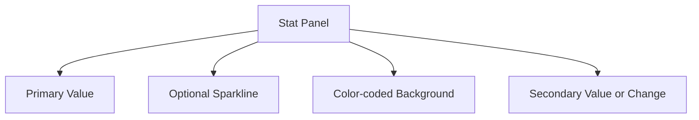

# Stat Panels

## Introduction

Stat panels are one of the most versatile and commonly used visualization types in Grafana. They are designed to display single-value metrics prominently, with optional visual indicators like colors, gauges, or sparklines to provide additional context. Stat panels are perfect for showing key performance indicators (KPIs), current status values, or other important single metrics that require immediate attention.

In this guide, we'll explore how to create and customize Stat panels in Grafana, including various display options, thresholds, and practical use cases.

## What Are Stat Panels?

Stat panels are single-value visualizations that:
- Display a primary value prominently (typically the most recent or aggregate value)
- Can show secondary information (like change from previous value)
- Support color-coding based on thresholds
- Can include optional sparklines or gauge visualizations
- Allow for highly customizable text formatting

Here's how a basic Stat panel might look in your Grafana dashboard:



## Creating Your First Stat Panel

Let's start by creating a basic Stat panel to display server uptime:

1. From your Grafana dashboard, click the "Add panel" button
2. Select "Add a new panel"
3. In the visualization options, select "Stat"
4. Configure a query to return a single value (e.g., server uptime in hours)

### Basic Configuration

Here's a simple PromQL query to get server uptime:

```
uptime_seconds / 3600
```

This will return the uptime in hours. The Stat panel will automatically display the most recent value.

## Customizing Your Stat Panel

Stat panels offer extensive customization options to make your metrics stand out and convey additional information through visual cues.

### Display Options

In the panel edit view, under the "Panel options" tab, you can configure:

1. **Panel title**: Give your panel a descriptive name
2. **Description**: Add helpful context that appears when hovering over the (i) icon
3. **Transparent background**: Toggle for a transparent panel background

Under the "Standard options" section, you can set:

1. **Unit**: Choose from a wide range of units (percent, bytes, seconds, etc.)
2. **Min/Max**: Set display range limits
3. **Decimals**: Control precision of displayed values

### Value Options

The "Value options" section under the "Panel" tab provides control over how the stat value is calculated and displayed:

1. **Show**: Choose what value to display
   - Calculate: Apply a calculation to the entire series (mean, max, min, etc.)
   - All values: Show all values in separate stats
   - Last value: Show only the most recent value

2. **Value Field**: Select which field to display when multiple fields exist

3. **Orientation**: Choose between "Auto", "Horizontal", or "Vertical"

4. **Color mode**: 
   - Value: Only the value is colored based on thresholds
   - Background: The entire background changes color
   - None: No coloring applied

5. **Graph mode**:
   - None: No additional visualization
   - Area: Show a small area graph (sparkline)
   - Line: Show a line graph

6. **Text alignment**: Control where the text appears in the panel

## Working with Thresholds

Thresholds are one of the most powerful features of Stat panels, allowing you to quickly identify when metrics cross important boundaries.

### Setting Up Thresholds

1. In the panel edit view, go to the "Thresholds" section
2. Click "Add threshold" to create a new threshold
3. Set a numeric value and select a color
4. Add as many thresholds as needed

Example threshold configuration:

```jsx
// This represents the configuration structure, not actual code
thresholds: {
  mode: 'absolute', // or 'percentage'
  steps: [
    { value: null, color: 'green' }, // Base state
    { value: 80, color: 'yellow' },  // Warning level
    { value: 90, color: 'red' }      // Critical level
  ]
}
```

### Threshold Modes

There are two threshold modes available:

- **Absolute**: Thresholds based on the actual value
- **Percentage**: Thresholds based on the percentage of min/max range

## Practical Examples

Let's look at some real-world applications of Stat panels:

### Example 1: Server CPU Usage

Create a Stat panel showing the current CPU usage with color thresholds:

1. Query: 
```
avg by(instance) (rate(node_cpu_seconds_total{mode!="idle"}[1m]) * 100)
```

2. Panel settings:
   - Unit: Percent (0-100)
   - Color mode: Background
   - Thresholds: 
     - Base: Green (0%)
     - Warning: Yellow (70%)
     - Critical: Red (85%)
   - Graph mode: Area (to show recent trend)

This creates a panel that prominently displays current CPU usage, changes color as it crosses thresholds, and shows a small graph of recent usage.

### Example 2: Error Rate Monitoring

Create a Stat panel showing the current error rate with a secondary value showing the change:

1. Query:
```
sum(rate(http_requests_total{status=~"5.."}[5m])) / sum(rate(http_requests_total[5m])) * 100
```

2. Panel settings:
   - Unit: Percent (0-100)
   - Show: Last value
   - Color mode: Value
   - Text mode: Value and name
   - Thresholds:
     - Base: Green (0%)
     - Warning: Orange (1%)
     - Critical: Red (5%)
   - Graph mode: None

This creates a panel that displays the current error rate, changes color based on severity, and clearly shows the metric name.

### Example 3: Database Connections

Create a Stat panel showing current database connections with a gauge:

1. Query:
```
sum(mysql_global_status_threads_connected)
```

2. Panel settings:
   - Color mode: Value
   - Graph mode: None
   - Text mode: Auto
   - Add another visualization: Gauge
   - Gauge settings:
     - Min: 0
     - Max: 100 (or your connection limit)
     - Thresholds: 
       - Green: 0-60
       - Yellow: 61-80
       - Red: 81-100

This creates a panel showing current connections with both a number and a gauge visualization.

## Advanced Features

### Value Mapping

Value mapping allows you to replace specific numeric values with text labels:

1. Go to "Value mappings" in the panel options
2. Click "Add value mappings"
3. Choose a mapping type:
   - Value: Map specific values
   - Range: Map ranges of values
   - Regex: Map values matching a regex pattern
   - Special: Map null, NaN, etc.

Example: Map database status codes to readable labels:
- 0 → "Offline"
- 1 → "Online" 
- 2 → "Maintenance"

### Text Formatting

You can control how the text appears in your Stat panel:

1. **Text size**: Adjust the size of the value display
2. **Color mode**: Choose between "Value" and "Background"
3. **Text mode**: 
   - Auto: Displays just the value
   - Value: Shows only the value
   - Value and name: Shows both metric name and value
   - Name and value: Reverses the order
   - None: Hides the text entirely (useful for pure visual indicators)

### Using Math Expressions

You can apply math expressions to your data before display:

1. Add a query to get raw data
2. Add a Transformation of type "Add field from calculation"
3. Define a math expression (e.g., `$A * 100` to convert to percentage)
4. Choose the new calculated field to display

## Common Use Cases for Stat Panels

Stat panels are particularly effective for:

1. **Executive dashboards**: Displaying high-level KPIs
2. **Monitoring dashboards**: Showing current system status
3. **Alert overviews**: Indicating metrics near or exceeding thresholds
4. **Capacity planning**: Visualizing resource utilization
5. **Service level objectives (SLOs)**: Tracking performance against targets

## Best Practices

To make the most of your Stat panels:

1. **Keep it simple**: Stat panels are best for single, important values
2. **Use meaningful thresholds**: Set thresholds based on actual performance targets
3. **Choose colors wisely**: Follow conventional color meanings (green=good, red=bad)
4. **Include context**: Add descriptions and appropriate units
5. **Combine with other panels**: Use Stat panels alongside graphs for both immediate status and historical context

## Summary

Stat panels are powerful visualization tools in Grafana that allow you to:
- Display single values prominently
- Add visual context through colors and sparklines
- Set thresholds for quick status indication
- Customize the appearance to highlight important metrics

When used effectively, Stat panels can make your dashboards more informative and actionable, allowing users to quickly understand the current state of their systems.

## Exercises

1. Create a Stat panel showing system memory usage with appropriate thresholds.
2. Build a dashboard with multiple Stat panels showing different aspects of a web service (response time, error rate, request count).
3. Create a Stat panel with value mappings to convert numeric states to descriptive text.
4. Design a Stat panel with a sparkline that shows disk I/O with appropriate units and formatting.

## Additional Resources

- Grafana Documentation: [Stat Panel](https://grafana.com/docs/grafana/latest/panels-visualizations/visualizations/stat/)
- Grafana Blog: [Building Effective Dashboards](https://grafana.com/blog/2022/01/13/how-to-build-grafana-dashboards-the-definitive-guide/)
- Grafana Tutorials: [Working with Thresholds](https://grafana.com/tutorials/thresholds-in-grafana/)

Remember that Stat panels are just one of many visualization options in Grafana. Combine them with other panel types to create comprehensive and insightful dashboards that tell the complete story of your systems and applications.