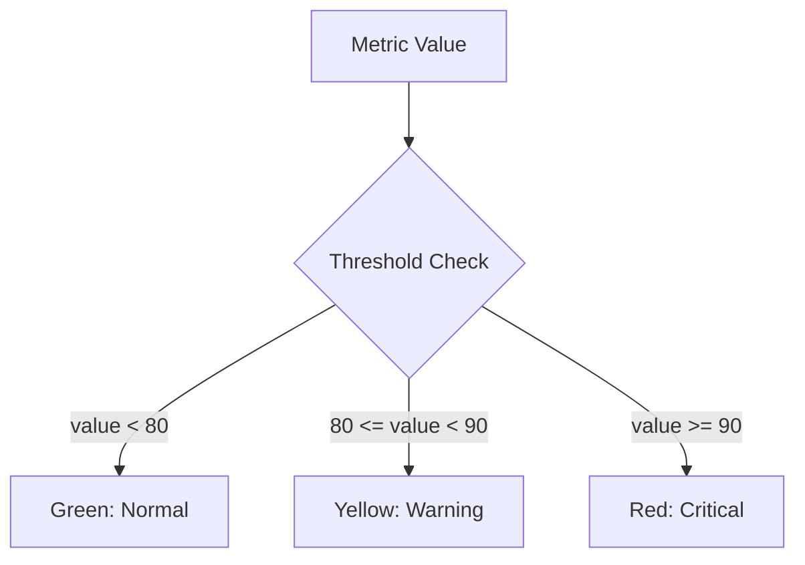

# Gauge Panels

## Introduction

Gauge panels are one of the most intuitive visualization types in Grafana, designed to display single-value metrics in a way that resembles physical gauges like those found in cars or industrial systems. They provide a quick visual indication of where a measurement falls within a defined range, making them excellent for displaying performance indicators, resource utilization, or any metric that has meaningful minimum and maximum values.

In this guide, you'll learn:
- What gauge panels are and when to use them
- How to create and configure basic gauge panels
- Advanced customization options
- Real-world applications and best practices

## What are Gauge Panels?

A gauge panel in Grafana represents a single metric value within a defined range. The gauge visually indicates:

1. The current value of the metric
2. Where that value falls within a predetermined range (min to max)
3. How the value compares to defined thresholds (often color-coded)

Gauges are particularly useful when you need to see at a glance whether a value is within acceptable parameters or approaching critical levels.

## Creating Your First Gauge Panel

Let's walk through creating a basic gauge panel step by step:

### Step 1: Add a new panel

1. Navigate to your dashboard and click the "Add panel" button
2. Click "Add new panel"

### Step 2: Configure your data source

1. Select your data source (e.g., Prometheus, InfluxDB, etc.)
2. Write a query that returns a single value

For example, with Prometheus, you might query CPU usage:

```sql
100 - (avg by (instance) (irate(node_cpu_seconds_total{mode="idle"}[5m])) * 100)
```

### Step 3: Change the visualization type

1. In the right sidebar, click on the visualization type (default is usually "Time series")
2. Select "Gauge" from the visualization options

### Step 4: Configure basic gauge settings

1. Under the "Panel options" section, set a meaningful title (e.g., "CPU Usage")
2. Under "Standard options":
   - Set "Unit" (e.g., "Percent (0-100)")
   - Set "Min" and "Max" values (e.g., 0 and 100 for percentages)
3. Under "Threshold" options:
   - Add threshold values and colors (e.g., 80 for warning, 90 for critical)

Here's what a basic configuration might look like in JSON:

```json
{
  "options": {
    "reduceOptions": {
      "values": false,
      "calcs": ["lastNotNull"],
      "fields": ""
    },
    "orientation": "auto",
    "showThresholdLabels": false,
    "showThresholdMarkers": true
  },
  "fieldConfig": {
    "defaults": {
      "color": {
        "mode": "thresholds"
      },
      "mappings": [],
      "thresholds": {
        "mode": "absolute",
        "steps": [
          { "color": "green", "value": null },
          { "color": "yellow", "value": 80 },
          { "color": "red", "value": 90 }
        ]
      },
      "unit": "percent",
      "min": 0,
      "max": 100
    }
  }
}
```

## Gauge Panel Visualization Modes

Grafana's gauge panels provide three visualization modes to choose from:

### 1. Basic Gauge (Default)

This is the standard circular gauge that shows the value with a needle pointer.

### 2. Reduced Bar Gauge

A simplified horizontal or vertical bar representation of the gauge, useful when space is limited or when you want to display multiple gauges in a compact area.

### 3. Angular Gauge

Similar to the basic gauge but with additional customization options for the angle and styling.

You can change the visualization mode in the "Display" options section.

## Advanced Customization Options

Gauge panels in Grafana offer numerous customization options:

### Threshold Configuration

Thresholds are critical for gauges as they provide visual indicators of metric status:



To set thresholds:

1. Go to the "Field" tab in the right panel
2. Under "Thresholds", click "Add threshold"
3. Set the value and associated color
4. Arrange thresholds in ascending order

### Value Mapping

Value mapping allows you to display custom text instead of the actual numeric value:

1. Go to the "Field" tab
2. Under "Value mappings", click "Add value mappings"
3. You can add:
   - Value mappings (exact matches)
   - Range mappings (values within a range)
   - Special mappings (for null, NaN, etc.)

For example, you might map:
- 0-10 to "Low"
- 11-70 to "Normal"
- 71-90 to "High"
- 91-100 to "Critical"

### Text Modes

You can customize how text is displayed within the gauge:

1. Under the "Display" section
2. Look for "Text mode" options:
   - Value: Shows only the numeric value
   - Value and name: Shows both the metric name and value
   - None: No text is displayed

### Gauge Orientation

You can change the orientation of the gauge:

1. Under "Display" options
2. Find "Orientation" and select:
   - Auto (adapts to panel size)
   - Horizontal
   - Vertical

## Practical Examples

Let's look at some real-world applications of gauge panels in Grafana:

### Example 1: Server CPU Utilization

```
Query (Prometheus): 
100 - (avg by (instance) (irate(node_cpu_seconds_total{mode="idle",instance="server-01:9100"}[5m])) * 100)
```

**Configuration:**
- Title: "Server-01 CPU Usage"
- Unit: Percent (0-100)
- Min: 0
- Max: 100
- Thresholds:
  - 0-70: Green (Normal operation)
  - 70-85: Yellow (Warning - high load)
  - 85-100: Red (Critical - potential performance issues)

### Example 2: Database Connection Pool

```
Query (MySQL):
SELECT used_connections/max_connections*100 FROM performance_schema.global_status;
```

**Configuration:**
- Title: "DB Connection Pool Utilization"
- Unit: Percent (0-100)
- Min: 0
- Max: 100
- Thresholds:
  - 0-60: Green
  - 60-80: Yellow
  - 80-100: Red
- Value mapping:
  - < 60: "Healthy"
  - 60-80: "Moderate"
  - > 80: "Near capacity"

### Example 3: Service Health Score

```
Query (Custom data):
SELECT avg(health_score) FROM service_health WHERE time > now() - 5m;
```

**Configuration:**
- Title: "Service Health Score"
- Unit: Score
- Min: 0
- Max: 100
- Thresholds:
  - 0-50: Red (Critical issues)
  - 50-80: Yellow (Some issues)
  - 80-100: Green (Healthy)
- Text mode: Value and name

## Multiple Values in Gauge Panels

When your query returns multiple series or values, the gauge will display according to the reduction option you've selected. Common reduction options include:

- Last: Shows the most recent value
- Min: Shows the minimum value
- Max: Shows the maximum value
- Mean: Shows the average value
- Total: Shows the sum of all values

To configure this:
1. In the panel options, find "Value options" or "Reduce options"
2. Select the appropriate calculation method

## Best Practices for Using Gauge Panels

### When to Use Gauge Panels

Gauge panels are best for:
- Single metrics that have a defined range
- Values where thresholds have meaning
- Quick status indicators
- Resource utilization monitoring

### When NOT to Use Gauge Panels

Avoid gauges when:
- Tracking values over time (use Time Series instead)
- Comparing multiple metrics (use Bar Gauge or Stat panels)
- Displaying values without context or meaningful min/max values

### Design Tips

1. **Keep it simple** - Gauge panels are meant for quick visualization
2. **Use meaningful ranges** - Always set min/max values that make sense
3. **Choose appropriate thresholds** - Ensure threshold colors convey the right level of urgency
4. **Add context with text** - Include units and descriptive titles
5. **Group related gauges** - Use dashboard rows to organize similar gauges

## Summary

Gauge panels in Grafana provide an intuitive way to display single-value metrics within a defined range. They excel at showing at a glance whether a value falls within acceptable parameters through the use of visual indicators and color-coded thresholds.

In this guide, you've learned:
- What gauge panels are and when they're most effective
- How to create and configure basic gauge visualizations
- Advanced customization options including thresholds, orientations, and value mappings
- Real-world applications and best practices

Gauge panels are especially valuable for operational dashboards where quick status assessment is critical, such as monitoring resource utilization, service health, or performance metrics against established baselines.

## Additional Resources

To further enhance your Grafana gauge panel skills:

1. Experiment with different threshold configurations to find what works best for your use case
2. Try combining gauge panels with other visualizations for more comprehensive dashboards
3. Practice creating gauges that display different types of metrics

## Exercises

1. Create a dashboard with three gauge panels showing system metrics (CPU, Memory, and Disk usage)
2. Set up appropriate thresholds and value mappings for each
3. Experiment with different orientations and display modes
4. Create a gauge that uses a complex query with a reduction function
5. Build a dashboard row with multiple gauges showing related metrics