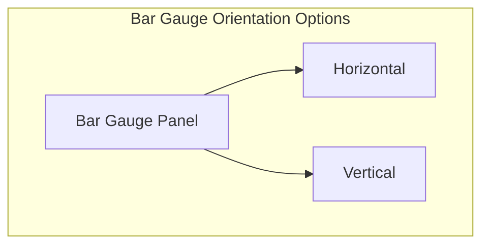

# Bar Gauge Panels

## Introduction

Bar Gauge panels are one of Grafana's most effective visualization tools for displaying single-value metrics with thresholds. Unlike standard gauges that use a dial or meter, Bar Gauges represent values as colored bars, making them excellent for dashboards where you need to monitor multiple related metrics at a glance.

In this guide, you'll learn:
- What Bar Gauge panels are and when to use them
- How to create and configure Bar Gauge panels
- Different display modes and orientation options
- How to set up thresholds and color mapping
- Real-world applications and best practices

## What is a Bar Gauge Panel?

A Bar Gauge panel is a visualization type in Grafana that displays single values as colored bars or circles. It's particularly useful for showing:

- Current values against thresholds
- Progress toward goals
- Health status of services or components
- Resource utilization metrics (CPU, memory, disk space)

The key advantage of Bar Gauge panels is their visual clarity and space efficiency - they allow you to display multiple metrics in a compact, easily scannable format.

## Creating Your First Bar Gauge Panel

Let's walk through creating a basic Bar Gauge panel in Grafana:

1. From your Grafana dashboard, click the "Add panel" button
2. Select "Add a new panel"
3. In the visualization options, select "Bar Gauge"
4. Configure your data source and query to return a single value

Here's what a simple configuration might look like:

```javascript
// Example query returning CPU usage for a server
SELECT
  last("usage_idle")
FROM "cpu"
WHERE $timeFilter
GROUP BY time($__interval)
```

## Display Modes

Bar Gauge panels offer multiple display modes to suit different visualization needs:

### 1. Basic (Default)

The basic mode displays values as horizontal or vertical bars, depending on your orientation setting.

### 2. Gradient

Gradient mode applies a color gradient across the bar based on your thresholds, creating a smoother visual transition between states.

### 3. LCD

LCD mode mimics a digital display, showing the value as segments similar to an LCD screen. This mode works well for numeric displays where you want a technical aesthetic.

### 4. Retro LCD

A variation of LCD mode with a more vintage appearance, featuring rounded segments.

To change the display mode:
1. Go to the "Display" tab in the panel editor
2. Find the "Display mode" option
3. Select your preferred mode from the dropdown

## Orientation Options

Bar Gauge panels can be displayed in different orientations:

- **Horizontal** (default): Bars extend from left to right
- **Vertical**: Bars extend from bottom to top

To change orientation:
1. Go to the "Display" tab
2. Find the "Orientation" option
3. Select either "Horizontal" or "Vertical"



## Value Display Options

You can customize how values are displayed within your Bar Gauge:

### Text Size and Mode

Control the size of text and how it's displayed:

```javascript
// Example panel JSON config showing text options
{
  "options": {
    "text": {
      "titleSize": 16,
      "valueSize": 32
    }
  }
}
```

### Units and Decimals

Configure appropriate units and decimal precision:

1. In the "Field" tab, find the "Standard options" section
2. Set the "Unit" to an appropriate measurement (percentage, bytes, etc.)
3. Adjust "Decimals" to control precision

### Value Mapping

Map specific numeric values to text for better context:

1. In the "Field" tab, find "Value mappings"
2. Click "Add value mapping"
3. Choose between "Value", "Range", or "Regex" mapping types
4. Define your mappings (e.g., map 0 to "Offline" or 100 to "Full Capacity")

## Thresholds and Color Mapping

One of the most powerful features of Bar Gauge panels is threshold-based coloring, which helps highlight values that need attention.

### Setting Up Thresholds

1. Go to the "Field" tab in panel edit mode
2. Find "Thresholds" and click "Add threshold"
3. Define your threshold values and corresponding colors

For example, a server health metric might use:
- 0-70: Green (healthy)
- 70-90: Yellow (warning)
- 90-100: Red (critical)

```javascript
// Example threshold configuration
{
  "thresholds": {
    "mode": "absolute",
    "steps": [
      { "color": "green", "value": null },
      { "color": "yellow", "value": 70 },
      { "color": "red", "value": 90 }
    ]
  }
}
```

### Color Mode Options

You can choose how colors are applied to your bar gauges:

- **Value**: Colors only the value text
- **Background**: Colors the entire background
- **Bar**: Colors only the bar (most common)

## Multiple Stats in One Panel

Bar Gauge panels excel at displaying multiple related metrics in a single panel:

1. Configure your query to return multiple series
2. Each series will automatically be displayed as a separate bar
3. Use the "Layout" options to control how multiple bars are arranged

For instance, to show CPU usage across multiple servers:

```javascript
// Example query returning CPU usage for multiple servers
SELECT
  last("usage_idle")
FROM "cpu"
WHERE $timeFilter
GROUP BY "host"
```

## Practical Example: Server Resource Dashboard

Let's create a practical example of using Bar Gauge panels to monitor server resources:

```javascript
// CPU Usage Query
SELECT 100 - mean("usage_idle") as "CPU Usage %" 
FROM "cpu" 
WHERE $timeFilter 
GROUP BY time($__interval)

// Memory Usage Query
SELECT mean("used_percent") as "Memory Usage %"
FROM "mem"
WHERE $timeFilter
GROUP BY time($__interval)

// Disk Usage Query
SELECT mean("used_percent") as "Disk Usage %"
FROM "disk"
WHERE $timeFilter
GROUP BY time($__interval)
```

Configure these with appropriate thresholds:
- 0-60%: Green
- 60-85%: Yellow 
- 85-100%: Red

This creates a compact dashboard showing all key server metrics at a glance, with color-coding to immediately highlight potential issues.

## Advanced Configurations

### Min and Max Values

Control the scale of your bar gauges by setting min and max values:

1. In the "Field" tab under "Standard options"
2. Set "Min" and "Max" values (e.g., 0 and 100 for percentage displays)

### Calculation Options

For time series data, you can control how the single value is calculated:

1. In the "Panel options" section
2. Find "Calculation" and select from options like:
   - Last value
   - Mean
   - Max/Min
   - Total

### Custom Tooltips

Enhance your Bar Gauge with informative tooltips:

```javascript
// Example tooltip configuration
{
  "options": {
    "tooltip": {
      "mode": "single",
      "sort": "none"
    }
  }
}
```

## Real-World Applications

Bar Gauge panels are versatile and can be used in many scenarios:

### 1. Infrastructure Monitoring

Monitor server farm health with bar gauges showing:
- CPU usage
- Memory utilization
- Network throughput
- Disk space

### 2. Application Performance

Track application metrics:
- Request latency
- Error rates
- Active users
- Queue depths

### 3. Business KPIs

Visualize business metrics:
- Sales targets (% achieved)
- Customer satisfaction scores
- Project completion percentages
- Inventory levels

### 4. IoT and Sensor Data

Display sensor readings:
- Temperature ranges
- Humidity levels
- Battery levels
- Signal strength

## Best Practices

### DO:
- Use consistent colors across your dashboard
- Group related metrics together
- Set appropriate min/max values for context
- Add clear titles and descriptions
- Use appropriate units

### DON'T:
- Mix unrelated metrics in a single panel
- Overcrowd panels with too many bars
- Use Bar Gauges for time series trends (use Graph panels instead)
- Set arbitrary thresholds without business context

## Summary

Bar Gauge panels are powerful tools in your Grafana visualization toolkit. They excel at displaying single-value metrics with threshold context in a compact, visually intuitive format. By properly configuring display modes, thresholds, and orientation, you can create information-dense dashboards that communicate status at a glance.

Remember these key points:
- Bar Gauges are ideal for single values, not trends over time
- Use thresholds to add context through color
- Multiple related metrics can be grouped in one panel
- Different display modes (Basic, Gradient, LCD) offer visual variety
- Proper unit selection enhances readability

## Additional Resources

- Practice creating different types of Bar Gauge panels with various display modes
- Experiment with combining Bar Gauges with other panel types in a dashboard
- Try creating a resource monitoring dashboard for your own infrastructure

## Exercise

Create a dashboard with the following Bar Gauge panels:
1. A horizontal Bar Gauge showing CPU usage
2. A vertical Bar Gauge showing memory usage
3. An LCD-style gauge showing disk space
4. A multi-stat Bar Gauge showing network metrics for different interfaces

Configure appropriate thresholds and experiment with different display options to see which works best for each metric type.