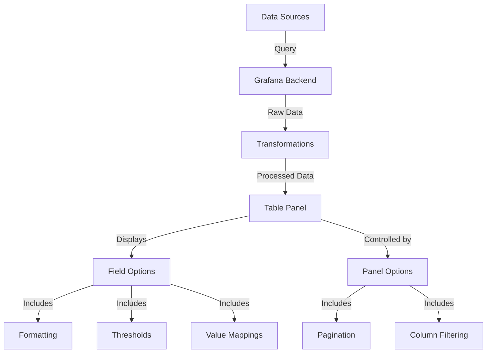
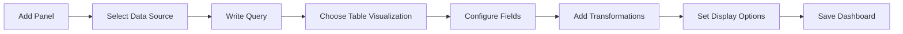

# Table Panels in Grafana

## Introduction

Table panels are one of the most versatile and information-dense visualization types available in Grafana. Unlike graphical visualizations that focus on trends and patterns, table panels display your data in a structured tabular format, allowing you to see precise values, compare multiple metrics side by side, and organize information in rows and columns.

In this tutorial, you'll learn how to create and configure table panels in Grafana, customize their appearance, and leverage advanced features to make your tabular data more useful and easier to interpret.

## What Are Table Panels?

Table panels in Grafana display your query results in a tabular format with rows and columns. They're ideal for:

- Displaying precise numeric values
- Comparing multiple metrics side by side
- Viewing detailed information about specific events or entities
- Presenting data that doesn't fit well in graphical visualizations
- Creating interactive dashboards with sortable and filterable data

## Creating Your First Table Panel

Let's start by creating a basic table panel:

1. Open your Grafana dashboard
2. Click the "Add panel" button (+ icon) in the top navigation bar
3. Select "Add a new panel"
4. Configure your data source and query to fetch the data you want to display
5. In the visualization options, select "Table"

Congratulations! You've created your first table panel. Now let's explore how to configure and customize it.

## Basic Table Panel Configuration

### Query Configuration

Table panels can display data from any data source that Grafana supports. Here's an example of a simple SQL query that would work well in a table panel:

```sql
SELECT 
  hostname, 
  cpu_usage, 
  memory_usage, 
  disk_usage, 
  last_updated
FROM 
  server_metrics
WHERE 
  time > $__timeFrom AND time < $__timeTo
ORDER BY 
  hostname
```

### Field Options

After setting up your data query, you'll want to configure how each field (column) appears in your table. In the panel edit mode:

1. Navigate to the "Field" tab in the right sidebar
2. Here you can set:
   - Column width
   - Column alignment (left, center, right)
   - Value formatting (numbers, dates, strings)
   - Unit display (bytes, percentage, time, etc.)

### Table Display Options

Under the "Panel options" tab, you can configure general table display settings:

- Pagination: Control how many rows to show per page
- Sorting: Set default sort columns and order
- Filtering: Enable or disable column filters
- Cell display mode: Choose between colored text, colored background, gradient, or LCD gauge

## Advanced Table Features

### Cell Formatting and Coloring

One of the most powerful features of table panels is the ability to apply conditional formatting to cells based on their values:

1. Go to the "Field" tab
2. Select the field you want to format
3. Scroll down to "Thresholds" and click "Add threshold"
4. Define value ranges and corresponding colors

For example, you might color CPU usage values:
- Green for values below 70%
- Yellow for values between 70% and 90%
- Red for values above 90%

### Example: CPU Usage Table with Thresholds

```jsx
// This represents your Grafana configuration, not actual code you need to write
{
  "fieldConfig": {
    "defaults": {
      "color": {
        "mode": "thresholds"
      },
      "thresholds": {
        "mode": "absolute",
        "steps": [
          { "color": "green", "value": null },
          { "color": "yellow", "value": 70 },
          { "color": "red", "value": 90 }
        ]
      }
    },
    "overrides": []
  }
}
```

The result would be a table where CPU usage values are colored green, yellow, or red based on their values, making it easy to spot problematic servers at a glance.

### Cell Value Transformation

You can transform how values appear in your table:

1. Go to the "Field" tab
2. Select the field you want to transform
3. Choose from transformations like:
   - Convert units (bytes to MB, seconds to hours, etc.)
   - String replacement
   - Value mapping

For example, mapping status codes to meaningful labels:

```jsx
// Value mapping configuration
[
  { "value": 0, "text": "Offline", "color": "red" },
  { "value": 1, "text": "Online", "color": "green" },
  { "value": 2, "text": "Maintenance", "color": "blue" }
]
```

### Table Data Transformations

Grafana offers powerful data transformations that are particularly useful for tables:

1. In the panel edit mode, click on the "Transform" tab
2. Select from transformations like:
   - Organize fields: Reorder, rename, or hide columns
   - Join by field: Combine multiple queries
   - Group by: Aggregate data by specific fields
   - Filter by value: Show only rows that match criteria

Here's a practical use case - transforming time series data into a table showing the last values:

```jsx
// Transformation configuration to show last values
{
  "transformations": [
    {
      "id": "reduce",
      "options": {
        "reducers": ["last"]
      }
    }
  ]
}
```

## Practical Example: Server Monitoring Dashboard

Let's put everything together with a real-world example - a server monitoring dashboard that uses a table panel to display server status:

1. Create a new dashboard
2. Add a table panel
3. Configure a query to fetch server metrics:

```sql
SELECT 
  hostname,
  status,
  uptime_days,
  cpu_usage,
  memory_usage,
  disk_usage,
  last_checked
FROM 
  server_status
WHERE 
  time > $__timeFrom AND time < $__timeTo
```

4. Configure field options:
   - Format `uptime_days` with the "Days" unit
   - Format `cpu_usage`, `memory_usage`, and `disk_usage` as percentages
   - Format `last_checked` as a datetime
   - Add thresholds to CPU, memory, and disk usage fields
   - Map status values to human-readable labels

5. Configure table options:
   - Enable pagination with 10 rows per page
   - Add a search filter
   - Enable column sorting

The result will be a comprehensive server monitoring table that clearly shows the status of all your servers, with problematic values highlighted in yellow or red.

## Interactive Features

Table panels in Grafana offer several interactive features:

### Sorting

Users can click on column headers to sort the table by that column, making it easy to identify top or bottom values.

### Filtering

If enabled, users can filter the table to show only rows matching specific criteria.

### Cell Links

You can make cells clickable by adding data links:

1. In the "Field" tab, select the field you want to make clickable
2. Scroll down to "Data links" and click "Add link"
3. Configure the link to:
   - Open another dashboard
   - Go to an external URL
   - Execute an action

This is particularly useful for drilling down from summary data to detailed information.

## Common Use Cases for Table Panels

Table panels are versatile and can be used in many scenarios:

1. **System Monitoring**: Display server status, resource usage, and health metrics
2. **Log Analysis**: Show filtered log entries with important details
3. **User Activity**: Display recent user actions or session information
4. **Error Tracking**: List recent errors with details and frequency
5. **Inventory Management**: Track stock levels, usage, and alerts
6. **Performance Metrics**: Compare KPIs across different entities or time periods

## Best Practices

To get the most out of your table panels:

1. **Keep it focused**: Include only the most relevant columns
2. **Use clear column names**: Rename technical field names to be user-friendly
3. **Apply appropriate formatting**: Format numbers, dates, and units for easy reading
4. **Use conditional formatting**: Highlight important values with colors
5. **Enable interactivity**: Add sorting, filtering, and links where helpful
6. **Consider pagination**: For large datasets, limit rows per page to maintain performance
7. **Add a descriptive title and description**: Help users understand the purpose of the table

## Advanced Table Panel Diagrams

Let's visualize how table panels fit into the Grafana ecosystem:



## Example Table Panel Configuration Flow:



## Summary

Table panels are a powerful visualization type in Grafana that allow you to display detailed data in a structured format. In this tutorial, we've covered:

- Creating basic table panels
- Configuring fields and display options
- Using advanced features like conditional formatting and value mapping
- Applying transformations to reshape your data
- Building a practical server monitoring dashboard
- Interactive features like sorting, filtering, and data links
- Best practices for effective table panels

By mastering table panels, you can create dashboards that provide both a high-level overview and detailed information, giving users the ability to explore and analyze data in a format that's easy to understand.

## Additional Resources

To further enhance your Grafana table panel skills, explore these topics:

1. Learn about Grafana variables to make your table panels dynamic
2. Explore additional transformations for complex data manipulation
3. Combine table panels with other visualization types for comprehensive dashboards

## Exercises

To practice what you've learned:

1. Create a table panel showing the top 5 CPU-consuming processes on a server
2. Build a table that shows error rates by service, with conditional formatting
3. Design a table panel that uses transformations to show week-over-week comparison of key metrics
4. Create a table with clickable links that drill down to detailed information