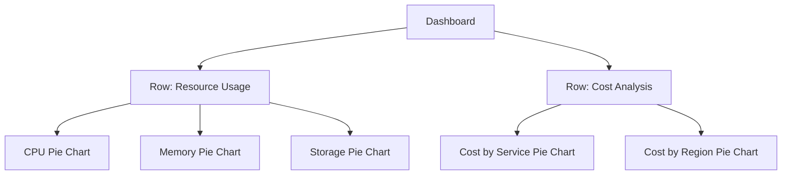

# Pie Chart Panels

## Introduction

Pie chart panels in Grafana are powerful visualization tools that display data as proportional segments of a circle. They're particularly useful when you need to show how individual parts contribute to a whole, making them ideal for visualizing percentage distributions, resource allocations, or composition breakdowns.

In this guide, you'll learn how to create, customize, and effectively use pie chart panels in your Grafana dashboards. By the end, you'll understand when to use pie charts and how to configure them for maximum insight.

## Understanding Pie Chart Panels

### What is a Pie Chart Panel?

A pie chart panel represents data as segments (or slices) of a circular chart, where:

- Each slice represents a category or data point
- The size of each slice is proportional to the value it represents
- The entire circle represents 100% of the measured data

Pie charts excel at showing:
- Part-to-whole relationships
- Proportions and percentages
- Simple comparisons between categories

### When to Use Pie Charts

Pie charts work best when:

- You have a small number of categories (ideally 2-7)
- You want to emphasize proportional relationships
- Your audience needs to quickly understand relative contributions
- You're showing composition of a single dimension of data

## Creating a Basic Pie Chart Panel

Let's walk through creating a simple pie chart panel in Grafana:

### Step 1: Add a New Panel

1. Navigate to the dashboard where you want to add the pie chart
2. Click the "Add panel" button (usually a + icon)
3. Select "Add a new panel"

### Step 2: Select Pie Chart Visualization

1. In the panel editor, click on the visualization dropdown
2. Search for and select "Pie chart"

### Step 3: Configure Your Data Source

Let's use a simple example where we want to show disk space usage:

```sql
SELECT
  mount_point as "Mount Point",
  used_percent as "Used Space"
FROM
  disk_usage
WHERE
  time > $__timeFrom() AND time < $__timeTo()
```

This query retrieves mount points and their usage percentages, which works well for a pie chart.

### Step 4: Configure Pie Chart Options

In the panel options section, you'll find several settings to customize your pie chart:

1. **Field Options**: Configure which field to use for slice values and labels.
```json
{
  "defaults": {
    "color": {
      "mode": "palette-classic"
    }
  },
  "overrides": []
}
```

2. **Display Options**: Set the pie chart type and style:
   - Type: Choose between "Pie", "Donut", or "Gauge"
   - Tooltip mode: "Single" or "All"
   - Legend placement: "Bottom", "Right" or other positions

## Advanced Pie Chart Customization

Now that we have a basic pie chart, let's explore more advanced configurations:

### Value Mapping

Value mapping allows you to assign custom display texts to specific values:

1. Go to the "Field" tab
2. Expand "Value mappings" and click "Add value mappings"
3. Define mappings like:
   - Map value `root` to display `/` with a custom color
   - Map ranges like 90-100% to display "Critical" in red

### Thresholds

Thresholds let you color slices based on their values:

```json
{
  "steps": [
    {
      "color": "green",
      "value": null
    },
    {
      "color": "orange",
      "value": 70
    },
    {
      "color": "red",
      "value": 90
    }
  ]
}
```

This configuration would color slices:
- Green: < 70%
- Orange: 70% - 90%
- Red: > 90%

### Pie Chart Layout Options

Customize the appearance with these common layout settings:

1. **Donut**: Turn your pie chart into a donut by setting a inner radius percentage
2. **Labels**: Configure what information appears in the labels:
   - Name
   - Percent
   - Value
3. **Legend**: Customize the legend appearance and placement

## Real-World Example: Resource Usage Dashboard

Let's create a more practical example - a dashboard showing cloud resource allocation by service:

```sql
SELECT
  service_name,
  SUM(cost) as total_cost
FROM
  cloud_billing
WHERE
  time > $__timeFrom() AND time < $__timeTo()
GROUP BY
  service_name
ORDER BY
  total_cost DESC
```

This query aggregates cloud costs by service name, perfect for a pie chart showing cost distribution.

### Panel Configuration:

```json
{
  "type": "piechart",
  "options": {
    "tooltip": {
      "mode": "single",
      "sort": "desc"
    },
    "legend": {
      "displayMode": "table",
      "placement": "right",
      "values": ["value", "percent"]
    },
    "pieType": "donut",
    "reduceOptions": {
      "values": true,
      "calcs": ["sum"],
      "fields": "/^total_cost$/"
    },
    "text": {
      "valueSize": 32
    }
  }
}
```

This configuration creates:
- A donut chart of service costs
- A table legend on the right showing values and percentages
- Slices ordered descending by value
- Sum calculation for aggregation

## Best Practices for Pie Charts

To create effective pie charts in Grafana, follow these guidelines:

1. **Limit the number of slices**: Keep to 7 or fewer categories for readability
2. **Order slices logically**: Arrange slices by size or in a meaningful sequence
3. **Use clear labels**: Make sure labels are descriptive and not overlapping
4. **Consider using a donut chart**: For a more modern look with space for a central metric
5. **Add a good title and description**: Clearly explain what the chart represents
6. **Use consistent colors**: Maintain color meaning across related dashboards

## Common Pitfalls to Avoid

Be careful of these common pie chart issues:

1. **Too many slices**: Creates a "sliver chart" that's hard to interpret
2. **Similar sized slices**: Makes comparison difficult; consider a bar chart instead
3. **3D effects**: Avoid 3D pie charts as they distort proportions
4. **Missing labels**: Always include clear labels or a legend

## Alternatives to Pie Charts

Sometimes a pie chart isn't the best choice. Consider these alternatives:

1. **Bar charts**: Better for comparing individual values precisely
2. **Gauge charts**: Good for showing a single value against thresholds
3. **Stat panels**: Ideal for displaying key metrics with sparklines
4. **Tables**: Best when exact values are more important than proportions

## Creating a Multi-Pie Chart Panel

For more complex visualizations, you can create dashboards with multiple related pie charts:



This approach lets you compare different dimensions of your data side by side.

## Troubleshooting Pie Charts

If your pie chart isn't displaying correctly, check these common issues:

1. **No data appears**: Verify your query returns values and has no syntax errors
2. **Strange proportions**: Check for outliers or negative values that might skew the chart
3. **Missing legends**: Ensure field names are properly configured
4. **Poor color contrast**: Adjust the color scheme in field options

## Advanced Topic: Dynamic Pie Charts with Variables

Make your pie charts interactive using Grafana variables:

```sql
SELECT
  $dimension as dimension,
  SUM(value) as total
FROM
  metrics
WHERE
  time > $__timeFrom() AND time < $__timeTo()
GROUP BY
  $dimension
```

Where `$dimension` is a dashboard variable that users can change (e.g., "region", "service", "customer").

## Summary

Pie chart panels in Grafana are excellent tools for visualizing proportional data and showing part-to-whole relationships. While they have limitations and shouldn't be used for every scenario, they provide an intuitive way to understand composition and distribution.

You've learned how to:
- Create basic pie charts in Grafana
- Configure advanced options like thresholds and value mappings
- Apply best practices for effective data visualization
- Avoid common pitfalls and know when to use alternatives

## Additional Resources

To deepen your understanding of Grafana pie charts:

- Explore the official Grafana documentation for the latest features
- Practice creating different types of pie charts with your own data
- Study visualization principles to better communicate with your charts

## Exercises

1. Create a pie chart showing CPU usage across different processes
2. Build a donut chart of website traffic by source with appropriate thresholds
3. Design a dashboard with multiple pie charts showing different aspects of system health
4. Configure a pie chart with variables to allow users to change the displayed dimension