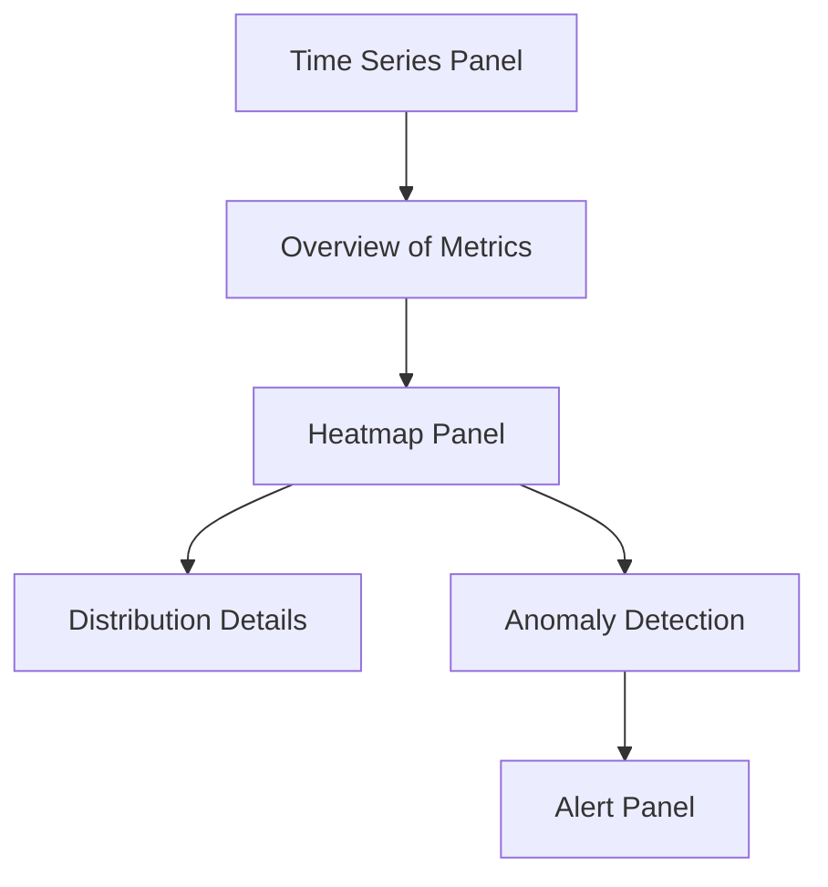

# Heatmap Panels

## Introduction

Heatmaps are powerful visualization tools that display data density and distribution across two dimensions using color intensity. In Grafana, heatmap panels allow you to visualize large amounts of data points, making it easier to identify patterns, anomalies, and trends that might be difficult to spot with other visualization types.

Heatmaps are particularly useful when:
- You need to analyze the distribution of values over time
- You want to identify patterns in large datasets
- You're looking for outliers or anomalies
- You need to visualize the frequency of events

In this guide, we'll explore how to create and configure heatmap panels in Grafana, understand their use cases, and learn best practices for effective data visualization.

## Understanding Heatmap Visualization

A heatmap represents data through color variations. Each "cell" in the heatmap corresponds to a bucket of data, with color intensity indicating the value or count within that bucket.

### Key Components of a Heatmap

- **X-axis**: Typically represents time in Grafana heatmaps
- **Y-axis**: Represents the metric value range, divided into buckets
- **Color**: Represents the count or frequency of data points in each bucket
- **Cells**: The intersection of x and y buckets, colored according to frequency

## Creating Your First Heatmap Panel

Let's walk through the process of creating a basic heatmap panel in Grafana:

### Step 1: Add a New Panel

1. Navigate to your Grafana dashboard
2. Click the "Add panel" button
3. Select "Add a new panel"

### Step 2: Select Heatmap Visualization

In the panel editor:
1. Select "Heatmap" from the visualization options
2. Configure your data source query to return time-series data

### Step 3: Basic Configuration

```json
{
  "datasource": "Prometheus",
  "targets": [
    {
      "expr": "rate(http_request_duration_seconds_bucket[1m])",
      "format": "heatmap",
      "intervalFactor": 2,
      "legendFormat": "{{le}}",
      "refId": "A"
    }
  ],
  "type": "heatmap"
}
```

This configuration uses Prometheus to query HTTP request duration metrics and displays them as a heatmap.

## Data Formatting for Heatmaps

Grafana heatmaps work best with properly formatted data. There are two main approaches:

### 1. Pre-bucketed Data

When your data source already provides bucketed data:

```sql
SELECT 
  $__timeGroup(time_column, '1m') AS time,
  value_bucket AS metric,
  COUNT(value) AS count
FROM your_table
WHERE $__timeFilter(time_column)
GROUP BY 1, 2
ORDER BY 1, 2
```

### 2. Raw Metrics with Bucketing in Grafana

When using raw metrics that Grafana will bucket:

```json
{
  "datasource": "Prometheus",
  "targets": [
    {
      "expr": "node_cpu_seconds_total",
      "format": "time_series",
      "refId": "A"
    }
  ],
  "type": "heatmap",
  "options": {
    "calculation": "count",
    "yBucketBound": "auto",
    "yBucketSize": null
  }
}
```

## Configuring Heatmap Options

Grafana offers numerous options to customize your heatmap visualization:

### Color Scheme

The color scheme determines how values are represented visually:

```javascript
{
  "options": {
    "color": {
      "mode": "scheme",
      "scheme": "Spectral",
      "reverse": false,
      "min": 0,
      "max": null
    }
  }
}
```

Common color modes include:
- **Opacity**: Uses a single color with varying opacity
- **Spectrum**: Uses a gradient between two colors
- **Scheme**: Uses predefined color schemes like "Spectral" or "YlOrRd"

### Cell Display

Configure how cells are displayed:

```javascript
{
  "options": {
    "cellGap": 1,
    "cellValues": {
      "unit": "short"
    },
    "cellSize": {
      "min": 10,
      "max": 100
    }
  }
}
```

### Axis and Legend

Customize axis labels and legend display:

```javascript
{
  "options": {
    "yAxis": {
      "axisPlacement": "left",
      "decimals": null,
      "unit": "s"
    },
    "showValue": "auto",
    "tooltip": {
      "show": true,
      "yHistogram": false
    }
  }
}
```

## Real-World Examples

Let's explore some practical applications of heatmap panels in Grafana:

### Example 1: System CPU Usage by Core

Monitoring CPU usage across multiple cores to identify resource bottlenecks:

```json
{
  "datasource": "Prometheus",
  "targets": [
    {
      "expr": "rate(node_cpu_seconds_total{mode!=\"idle\"}[1m])",
      "format": "heatmap",
      "legendFormat": "{{cpu}}"
    }
  ],
  "type": "heatmap",
  "options": {
    "yAxis": {
      "min": 0,
      "max": 1,
      "unit": "percentunit"
    },
    "calculation": "mean"
  }
}
```

This visualization helps identify:
- Which CPU cores are under heavy load
- Patterns of CPU usage over time
- Potential imbalances in workload distribution

### Example 2: HTTP Request Latency Distribution

Analyzing the distribution of HTTP request latencies to identify performance issues:

```json
{
  "datasource": "Prometheus",
  "targets": [
    {
      "expr": "sum(increase(http_request_duration_seconds_bucket[5m])) by (le)",
      "format": "heatmap",
      "legendFormat": "{{le}}"
    }
  ],
  "type": "heatmap",
  "options": {
    "yAxis": {
      "logBase": 2,
      "unit": "s"
    }
  }
}
```

This visualization reveals:
- The distribution of request latencies
- Shifts in performance patterns over time
- Outliers and anomalies in request handling

### Example 3: Temperature Sensors Across Locations

Monitoring temperature data from multiple sensors:

```json
{
  "datasource": "InfluxDB",
  "targets": [
    {
      "query": "SELECT sensor_id, temperature FROM sensors WHERE $timeFilter GROUP BY time($__interval), sensor_id",
      "format": "time_series"
    }
  ],
  "type": "heatmap",
  "options": {
    "color": {
      "mode": "scheme",
      "scheme": "RdYlBu"
    },
    "yAxis": {
      "unit": "celsius"
    }
  }
}
```

This helps visualize:
- Temperature variations across different locations
- Temporal patterns in temperature changes
- Anomalies or issues with specific sensors

## Best Practices for Heatmap Visualization

To create effective heatmap visualizations, follow these guidelines:

### Choose the Right Color Scheme

The color scheme should:
- Provide sufficient contrast to distinguish different values
- Use color scales appropriate for your data type
- Consider accessibility for color-blind users

For example:
- Sequential data: Use single-hue progressions (e.g., light blue to dark blue)
- Diverging data: Use schemes with distinct midpoints (e.g., blue-white-red)
- Categorical data: Use qualitative color schemes that distinguish categories

### Optimize Bucket Sizes

Appropriate bucket sizes are crucial:
- Too large: Lose important details
- Too small: Create visual noise

```javascript
{
  "options": {
    "yBucketSize": 10,  // Adjust based on your data range
    "yBucketBound": "auto"
  }
}
```

### Use Logarithmic Scales When Appropriate

For data with wide value ranges, consider logarithmic scales:

```javascript
{
  "options": {
    "yAxis": {
      "logBase": 2,
      "min": null,
      "max": null
    }
  }
}
```

### Add Context with Annotations

Combine heatmaps with annotations to add context to your data:

```javascript
{
  "annotations": {
    "list": [
      {
        "name": "Deployments",
        "datasource": "Prometheus",
        "enable": true,
        "expr": "changes(app_version[1m]) > 0",
        "iconColor": "rgba(255, 96, 96, 1)"
      }
    ]
  }
}
```

## Advanced Heatmap Techniques

Once you're comfortable with basic heatmap configuration, explore these advanced techniques:

### Custom Tooltip Formatting

Enhance tooltips to display more meaningful information:

```javascript
{
  "options": {
    "tooltip": {
      "show": true,
      "showHistogram": true,
      "decimals": 2
    }
  }
}
```

### Dynamic Thresholds

Use dynamic thresholds to adapt your heatmap to changing data patterns:

```javascript
{
  "options": {
    "color": {
      "mode": "scheme",
      "scheme": "RdYlGn",
      "steps": 10
    },
    "calculation": {
      "xBuckets": {
        "mode": "auto"
      },
      "yBuckets": {
        "mode": "auto",
        "scale": {
          "type": "linear"
        }
      }
    }
  }
}
```

### Combining with Other Visualizations

Create comprehensive dashboards by pairing heatmaps with complementary visualizations:



This approach provides both high-level trends and detailed distribution insights.

## Troubleshooting Common Issues

### No Data Appearing in Heatmap

If your heatmap appears empty:

1. Check your query to ensure it returns data
2. Verify the correct format (time series or bucketed data)
3. Adjust the bucket sizes to match your data range

```javascript
// Example fix for empty heatmap
{
  "options": {
    "yBucketSize": null,  // Set to null for auto-sizing
    "yBucketBound": "auto"
  }
}
```

### Uneven Color Distribution

If colors are concentrated in a small range:

1. Adjust the color min/max values
2. Consider a logarithmic scale for skewed distributions
3. Try different color schemes

```javascript
// Example fix for poor color distribution
{
  "options": {
    "color": {
      "min": 0,
      "max": 100,  // Adjust based on your data
      "mode": "scheme",
      "scheme": "Spectral"
    }
  }
}
```

## Summary

Heatmap panels in Grafana are powerful tools for visualizing data density and distribution. They excel at revealing patterns, trends, and anomalies that might be missed with traditional graphs.

Key takeaways:
- Heatmaps display data density using color intensity
- They're ideal for visualizing distributions and identifying patterns
- Proper configuration of buckets and color schemes is essential
- They complement other visualization types in comprehensive dashboards

By mastering heatmap panels, you can create more insightful and actionable dashboards in Grafana, enhancing your monitoring and analytical capabilities.

## Additional Resources

To deepen your understanding of Grafana heatmap panels:

- Experiment with different datasets and configurations
- Create custom dashboards that combine heatmaps with other visualization types
- Explore real-time monitoring scenarios

## Exercises

1. Create a heatmap showing CPU usage distribution across multiple servers.
2. Configure a heatmap to visualize network traffic patterns by time of day.
3. Build a dashboard combining a heatmap with time series panels to monitor application performance.
4. Experiment with different color schemes and evaluate their effectiveness for your specific data.
5. Create a heatmap visualization for log event frequency by category and severity.