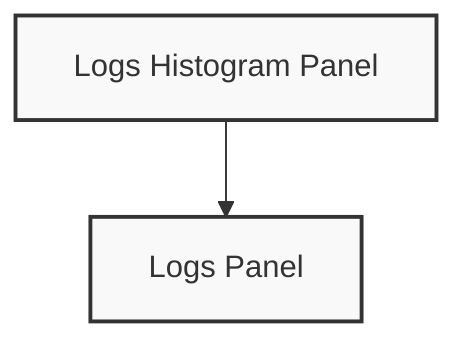

# Logs Panels

## Introduction

Logs panels in Grafana are specialized visualization tools designed to display and explore log data from various sources. Unlike metrics panels that show numerical data in charts, logs panels present textual log entries in a readable format, allowing you to investigate system behavior, troubleshoot issues, and gain insights from your application logs.

Log data is essential for understanding what's happening in your systems, particularly when debugging problems or monitoring application behavior. Grafana's logs panels provide a powerful interface to search, filter, and analyze log data directly within your dashboards.

## Understanding Logs Panels

### What are Logs Panels?

Logs panels display log lines from your data sources in a scrollable list format. They allow you to:

- View log entries in real-time or historical contexts
- Search and filter log content
- Highlight specific patterns or log levels
- Explore log details and structured metadata

### When to Use Logs Panels

Logs panels are ideal when you need to:

- Troubleshoot application errors
- Monitor system events
- Track user activity
- Investigate security incidents
- Correlate log data with metrics visualizations

## Creating a Logs Panel

Let's walk through the process of adding a logs panel to your Grafana dashboard:

1. **Create a new panel**: Click the "Add panel" button in your dashboard and select "Add a new panel"
2. **Select visualization**: In the visualization options, choose "Logs"
3. **Configure data source**: Select a logs-supported data source (like Loki, Elasticsearch, or CloudWatch)
4. **Write your query**: Craft a log query appropriate for your data source

Here's how a basic Loki query might look:

```sql
{job="myapp"} |= "error"
```

This query will show all logs from the job "myapp" that contain the word "error".

## Configuring Logs Panels

### Basic Panel Options

After creating your logs panel, you can configure several options:

- **Time range**: Set the time window for log display
- **Refresh rate**: Control how frequently logs update
- **Order**: Display newest or oldest logs first

### Advanced Display Options

Logs panels offer several advanced visualization features:

#### Log Levels

Grafana can recognize standard log levels (like debug, info, warn, error) and color-code them accordingly. You can customize these colors in the panel options.

#### Deduplication

To reduce repetitive entries, enable deduplication:

1. Go to panel options
2. Find the "Deduplication" setting
3. Choose one of the options:
   - Exact: Group identical log lines
   - Numbers: Group lines that differ only by numbers
   - Signature: Group similar lines regardless of variable content

#### Pretty JSON

If your logs contain JSON objects, enable the "Pretty" option to format them for readability:

```json
// Before formatting
{"level":"error","msg":"Connection failed","service":"database","error":"timeout","attempts":3}

// After pretty formatting
{
  "level": "error",
  "msg": "Connection failed",
  "service": "database",
  "error": "timeout",
  "attempts": 3
}
```

## Practical Examples

### Example 1: Monitoring Application Errors

Let's create a logs panel to monitor application errors in a production environment:

1. Create a new logs panel
2. Select your logs data source (e.g., Loki)
3. Configure the query:

```sql
{app="production-service"} |= "error" | json | level="error"
```

4. Set the time range to the last 6 hours
5. Enable deduplication with the "Signature" option
6. Add a panel title: "Production Errors"

This panel will display all error-level logs from your production service, making it easy to spot issues quickly.

### Example 2: Creating a Multi-Query Logs Panel

You can combine logs from multiple sources in a single panel:

1. Create a new logs panel
2. Add your first query for application logs:

```sql
{service="api"} |= "request" | json
```

3. Click "Add query" and add a second query for database logs:

```sql
{service="database"} | json
```

4. Enable the "Unique labels" option to distinguish between sources

This setup gives you a unified view of both API requests and database operations, helping to trace requests through your system.

## Working with Log Context

Grafana's logs panel allows you to explore the context around specific log entries:

1. Find an interesting log line in your panel
2. Click the "Show context" button
3. Grafana will display logs before and after the selected entry

This feature is invaluable for understanding the sequence of events surrounding errors or unusual behavior.

## Visualizing Logs Flow

To understand the volume and pattern of logs over time, you can add a logs histogram above your logs panel:



The histogram shows log volume patterns, while the logs panel below shows the actual entries. This combination helps identify spikes in log activity that might indicate problems.

## Combining with Other Panels

Logs panels are most powerful when combined with other visualizations. A common dashboard setup includes:

1. **Metrics panels**: Show system performance metrics
2. **Logs panel**: Display relevant logs
3. **Alert annotations**: Mark when alerts fired

This combination provides a complete picture of your system's behavior, helping correlate metrics changes with specific log events.

## Best Practices

For effective use of logs panels:

- **Target your queries**: Be specific to avoid overwhelming volumes of logs
- **Use structured logging**: JSON or key-value pairs make filtering easier
- **Set appropriate time ranges**: Start with narrow windows for better performance
- **Create dedicated log dashboards**: For deep-dive troubleshooting sessions
- **Use variable templates**: To quickly switch between services or environments

## Common Troubleshooting

If your logs panel isn't displaying expected results:

1. **Check time range**: Ensure the panel's time range contains log data
2. **Verify data source**: Confirm the data source is properly configured
3. **Simplify query**: Start with a basic query and add complexity gradually
4. **Check log volume**: Very high log volumes might require sampling or filtering

## Summary

Logs panels in Grafana provide a powerful way to visualize, search, and analyze log data alongside your metrics and other visualizations. By following the steps outlined in this guide, you can create effective logs panels that help you monitor your systems, troubleshoot issues, and gain deeper insights into your applications.

As you become more comfortable with logs panels, you'll discover how to craft more sophisticated queries, combine multiple data sources, and create comprehensive dashboards that tell the complete story of your system's behavior.

## Additional Resources

For further learning:

- Explore log query languages specific to your data source (LogQL for Loki, Lucene for Elasticsearch)
- Learn about log processing pipelines to transform and enrich your logs
- Practice creating alerts based on log patterns

## Exercises

1. Create a logs panel showing all error logs from a service of your choice
2. Set up a split view with a logs panel and a metric panel showing related data
3. Create a logs panel with a custom parsing step to extract and display specific fields
4. Build a dashboard combining logs from multiple services with appropriate filtering