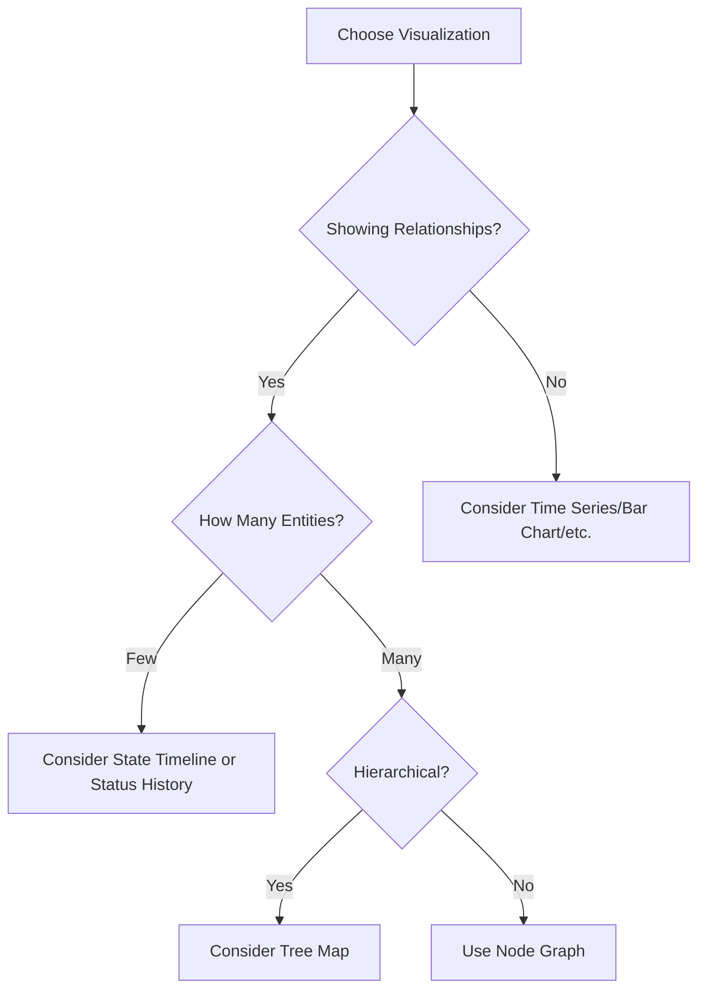

# Node Graph Panels

## Introduction

Node Graph panels are a powerful visualization type in Grafana that allow you to display relationships between entities in your data. These panels represent entities as nodes (points) and their relationships as edges (connecting lines), making them ideal for visualizing network topologies, service dependencies, hierarchical structures, and other relationship-based data.

Whether you're mapping microservice dependencies, exploring infrastructure connections, or visualizing social networks, Node Graph panels provide an interactive and intuitive way to explore complex relationships in your data.

## Understanding Node Graph Basics

At its core, a Node Graph visualization consists of two primary components:

1. **Nodes** - Represent entities or objects in your data (e.g., services, servers, users)
2. **Edges** - Represent relationships or connections between the nodes

Let's explore how Node Graph panels work in Grafana and how you can use them effectively.

## When to Use Node Graph Panels

Node Graph panels are particularly useful when:

- Visualizing network topologies
- Mapping service dependencies in microservice architectures
- Displaying hierarchical structures or organizational relationships
- Exploring relationships between different components in your infrastructure
- Analyzing traffic flow or request paths between services
- Identifying clusters or tightly connected components in your system

## Data Requirements for Node Graph Panels

To create a Node Graph panel, your data source needs to provide:

1. **Nodes table** - Contains information about each entity
2. **Edges table** - Contains information about connections between entities

### Nodes Table Structure

Your nodes data should include:

- A unique identifier for each node
- Display information (name, title, etc.)
- Optional metrics or attributes to enhance visualization

### Edges Table Structure

Your edges data should include:

- Source node identifier
- Target node identifier
- Optional metrics or attributes for the connection

## Setting Up a Node Graph Panel

Let's walk through the process of creating and configuring a Node Graph panel in Grafana:

1. Create a new dashboard or edit an existing one
2. Add a new panel and select "Node Graph" as the visualization type
3. Configure your data source query to return the required nodes and edges data
4. Configure the panel options to customize the appearance and behavior

### Basic Configuration Example

Here's a simple example using Prometheus with a metrics query that returns node and edge data:

```sql
// Query for nodes
MATCH (n) 
RETURN id(n) as id, labels(n) as labels, n.name as name

// Query for edges
MATCH (n)-[r]->(m)
RETURN id(n) as source, id(m) as target, type(r) as type
```

## Real-World Example: Microservice Dependency Mapping

Let's create a practical example of using Node Graph panels to visualize microservice dependencies.

Imagine you have a system with several microservices, and you want to visualize how they interact with each other. You can use OpenTelemetry or similar tools to collect trace data that shows communication between services.

### Step 1: Prepare Your Data

First, you need to transform your trace data into nodes and edges format. Each service will be a node, and each call between services will be an edge.

For this example, let's assume you're using Prometheus with a custom exporter that provides the following metrics:

```javascript
// Node data
[
  { id: "service1", title: "Authentication Service", mainStat: "99.95%", secondaryStat: "2.5ms" },
  { id: "service2", title: "User Service", mainStat: "99.8%", secondaryStat: "5.1ms" },
  { id: "service3", title: "Order Service", mainStat: "99.9%", secondaryStat: "3.3ms" },
  { id: "service4", title: "Inventory Service", mainStat: "99.7%", secondaryStat: "4.2ms" },
  { id: "service5", title: "Payment Service", mainStat: "99.99%", secondaryStat: "1.8ms" }
]

// Edge data
[
  { source: "service1", target: "service2", mainStat: "100 req/s" },
  { source: "service2", target: "service3", mainStat: "80 req/s" },
  { source: "service2", target: "service4", mainStat: "45 req/s" },
  { source: "service3", target: "service5", mainStat: "35 req/s" },
  { source: "service4", target: "service5", mainStat: "20 req/s" }
]
```

### Step 2: Configure Your Node Graph Panel

In your Grafana dashboard:

1. Add a new panel
2. Select "Node Graph" as the visualization type
3. Configure your data source to query the node and edge data
4. In the panel options, map the node and edge fields accordingly:
   - For nodes: id, title, mainStat (availability), secondaryStat (latency)
   - For edges: source, target, mainStat (request volume)

### Step 3: Interpret the Visualization

Once configured, your Node Graph panel will display:

- Each service as a node with its name and performance metrics
- Connections between services as edges with request volume
- The overall architecture and dependencies of your microservice system

This visualization allows you to:

- Identify critical paths in your application
- Spot potential bottlenecks
- Understand the impact of service failures
- Plan scaling and optimization strategies

## Advanced Node Graph Features

Grafana's Node Graph panels offer several advanced features to enhance your visualizations:

### Interactive Exploration

Node Graph panels are interactive by default, allowing you to:

- Click on nodes to highlight connected components
- Drag nodes to rearrange the layout
- Hover over nodes and edges to see additional details
- Zoom and pan to focus on specific parts of the graph

### Visual Customization

You can customize the appearance of your Node Graph by:

- Using color-coding to represent different node types or statuses
- Sizing nodes based on importance or metrics
- Applying different edge thicknesses to represent connection strength
- Using icons or images to represent different node types

### Example: Color-Coding by Service Type

Here's how you might use color-coding to differentiate service types:

```javascript
// In the Node Graph panel options
{
  "nodeColorField": "type",
  "nodeColorScheme": "categorical",
  "colorByValue": false,
  "colorMappings": [
    { "value": "frontend", "color": "green" },
    { "value": "backend", "color": "blue" },
    { "value": "database", "color": "red" },
    { "value": "cache", "color": "orange" }
  ]
}
```

## Implementing a Node Graph Panel with Grafana API

For more advanced use cases, you might want to create a custom Node Graph implementation using Grafana's API. Here's a simplified example:

```javascript
import { PanelPlugin } from '@grafana/data';
import { NodeGraphOptions } from './types';
import { NodeGraphPanel } from './NodeGraphPanel';

export const plugin = new PanelPlugin<NodeGraphOptions>(NodeGraphPanel)
  .setPanelOptions(builder => {
    return builder
      .addSelect({
        path: 'layout',
        name: 'Layout',
        description: 'Node graph layout algorithm',
        defaultValue: 'force',
        settings: {
          options: [
            { value: 'force', label: 'Force' },
            { value: 'dagre', label: 'Dagre (Directed)' },
          ],
        },
      })
      .addBooleanSwitch({
        path: 'showLabels',
        name: 'Show Labels',
        defaultValue: true,
      })
      .addNumberInput({
        path: 'nodeSize',
        name: 'Node Size',
        defaultValue: 30,
        settings: {
          min: 10,
          max: 100,
        },
      });
  });
```

## Troubleshooting Node Graph Panels

Here are some common issues and solutions when working with Node Graph panels:

1. **Graph appears empty or incomplete**
   - Check that your data source is returning both nodes and edges
   - Verify that node IDs in the edges table match the IDs in the nodes table
   - Ensure your query is not being limited by time range settings

2. **Performance issues with large graphs**
   - Consider filtering your data to show only the most important nodes
   - Use aggregation to combine similar nodes
   - Adjust the panel size to give more space to the visualization

3. **Layout appears chaotic**
   - Try different layout algorithms (force-directed vs. directed)
   - Manually arrange key nodes and use the "pin" feature to keep them in place
   - Filter out less important nodes to reduce complexity

## Node Graph vs. Other Visualizations

To better understand when to use Node Graph panels, let's compare them with other visualization types:



## Summary

Node Graph panels in Grafana provide a powerful way to visualize relationships and dependencies in your data. They are particularly valuable for understanding complex systems, exploring network topologies, and mapping service dependencies.

Key takeaways:

- Node Graph panels represent entities as nodes and relationships as edges
- They require data in a specific format with separate nodes and edges tables
- Interactive exploration features allow you to better understand your data
- Customization options let you highlight important aspects of your visualization
- Node Graphs excel at visualizing complex relationships that would be difficult to understand in other formats

## Further Learning

To deepen your understanding of Node Graph panels in Grafana:

1. Experiment with different data sources and query types
2. Try visualizing different types of relationship data
3. Combine Node Graph panels with other visualization types for a more complete dashboard
4. Explore graph theory concepts to better understand network visualizations

## Exercise: Create Your First Node Graph

As a practical exercise, try creating a Node Graph panel that visualizes the relationships between different parts of your infrastructure or application. This could include:

- Connections between servers in your network
- Dependencies between different software components
- Relationships between different APIs in your system
- User interaction patterns in your application

Start with a small subset of your data to get comfortable with the visualization, then gradually add more complexity as you become more familiar with Node Graph panels.