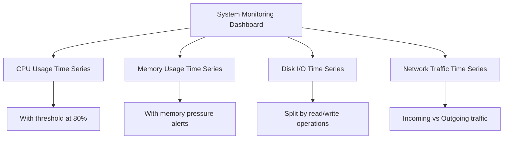

# Time Series Visualizations

## Introduction

Time series visualizations are one of the most fundamental and powerful ways to represent data in Grafana. These visualizations display how metrics change over time, making them ideal for monitoring systems, tracking performance, observing trends, and spotting anomalies.

In this guide, you'll learn about Grafana's time series visualization capabilities, including how to create effective time series panels, customize their appearance, and apply various transformation options to gain deeper insights from your data.

## What are Time Series Data?

Before diving into visualizations, let's understand what time series data actually is:

Time series data is a sequence of data points collected at consistent time intervals. Each data point consists of:
- A timestamp (when the measurement was taken)
- A value (what was measured)
- Optional metadata (like tags or labels)

Examples of time series data include:
- CPU usage over time
- Network traffic patterns
- Application response times
- Temperature readings
- Stock prices

## Creating Your First Time Series Panel

Let's start by creating a basic time series panel in Grafana:

1. Navigate to your dashboard and click the "Add panel" button.
2. Select "Add a new panel" from the options.
3. In the query editor, select your data source and write a query to fetch time series data.
4. From the visualization options, select "Time series".

Here's a simple example using Prometheus as a data source:

```sql
rate(http_requests_total{job="api-server"}[5m])
```

This query would show the rate of HTTP requests to your API server over 5-minute intervals.

## Time Series Panel Options

Grafana offers numerous customization options for time series panels. Let's explore the key settings:

### Display Options

Under the "Panel options" tab:

- **Legend**: Configure how the legend appears (placement, values to show, etc.)
- **Tooltip**: Customize what information appears when hovering over data points
- **Time Region**: Highlight specific time periods on your graph

### Graph Styles

Under the "Graph styles" section:

1. **Line**: Classic line graphs showing continuous data
   - Line width, fill opacity, gradient mode
   - Line interpolation (linear, smooth, step before/after)

2. **Bar**: Vertical bars for each data point
   - Bar width, alignment

3. **Points**: Individual data points as markers
   - Point size, shape

Here's how to customize the appearance:

```jsx
// This is pseudocode to illustrate the concept, not actual configuration code
lineOptions = {
  width: 2,
  fill: 0.5,
  gradient: true,
  interpolation: 'smooth'
}
```

### Thresholds and Colors

You can add thresholds to highlight when values cross certain boundaries:

1. Go to the "Thresholds" section.
2. Add threshold values and select colors.
3. Choose how thresholds are displayed (as lines, fill areas, etc.).

For example, you might set thresholds at:
- 70% (warning level) - yellow
- 90% (critical level) - red

### Field Overrides

Field overrides allow you to apply specific settings to particular series in your visualization:

1. Go to the "Overrides" tab.
2. Add a new override and select which fields it applies to.
3. Add override properties to customize that specific series.

This is particularly useful when displaying multiple metrics with different scales or units on the same graph.

## Time Series Transformations

Grafana provides powerful transformation capabilities to reshape your data:

### Common Transformations for Time Series

1. **Reduce**: Condense time series into single values
   ```jsx
   // Example of how reduce works (pseudocode)
   timeSeriesData.reduce((acc, point) => Math.max(acc, point.value), 0)
   ```

2. **Time Operations**: Shift, downsample, or filter by time range

3. **Join By Field**: Combine multiple queries or series

4. **Add Field From Calculation**: Create new series from existing ones
   ```jsx
   // Example: Creating a series that is the sum of two other series
   newSeries = seriesA.map((point, i) => ({
     time: point.time,
     value: point.value + seriesB[i].value
   }))
   ```

## Advanced Visualization Techniques

### Stacking

Stacking allows you to display multiple series on top of each other:

1. In the "Graph styles" section, find the "Stack series" option.
2. Choose between:
   - Normal stacking: Values add up
   - Percent stacking: Shows the relative percentage of each series

Stacking is useful for showing:
- Component parts of a whole (like disk usage by service)
- Relative proportions between related metrics

### Annotations

Annotations allow you to mark important events on your time series graphs:

1. Go to Dashboard settings > Annotations.
2. Add a new annotation query that pulls events from your data source.
3. Configure how annotations appear on your graphs.

Example uses include marking:
- Deployments
- System restarts
- Alerts that were triggered
- Configuration changes

### Multiple Y-Axes

For comparing metrics with different scales:

1. Go to the "Standard options" section for a field.
2. Enable "Use right y-axis".

This allows you to plot metrics like "requests per second" and "latency" on the same graph with appropriate scales.

## Real-World Examples

### System Monitoring Dashboard

A typical server monitoring dashboard might include time series panels for:



Each panel would be configured with appropriate thresholds, colors, and alerts to quickly identify issues.

### Application Performance Dashboard

For monitoring a web application:

- **Response Time**: Line graph showing p95, p99, and median response times
- **Throughput**: Bar chart of requests per second
- **Error Rate**: Line graph with critical threshold at 1%
- **Saturation Metrics**: CPU, memory, connection pool usage

Example configuration for response time visualization:

```jsx
// Field configuration (pseudocode)
fields: [
  {
    name: 'p95',
    color: 'red',
    lineWidth: 1,
    fillOpacity: 0
  },
  {
    name: 'p50',
    color: 'green',
    lineWidth: 2,
    fillOpacity: 0.2
  }
]
```

## Best Practices for Time Series Visualizations

1. **Choose the right time range**: Too long and patterns get compressed; too short and you might miss trends.

2. **Set appropriate refresh intervals**: Balance between real-time data and resource usage.

3. **Use template variables**: Make dashboards flexible and reusable across different services/servers.

4. **Add context with annotations**: Mark important events that might explain patterns in your data.

5. **Configure thoughtful alerting**: Set thresholds that indicate actual problems, not normal variations.

6. **Apply consistent color schemes**: Use similar colors for related metrics across dashboards.

7. **Label clearly**: Ensure your axes, legends, and panels have clear descriptions.

8. **Beware of data density**: Too many series on one graph becomes unreadable.

## Troubleshooting Common Issues

### No Data Appears on Graph

Check:
- Time range selection
- Query syntax
- Data source connectivity
- Permissions for accessing the data

### Graph Appears Broken or Incomplete

Possible causes:
- Data gaps or irregular sampling
- Incompatible units or extreme value ranges
- Transformation errors

Solution:
- Adjust the "Connect null values" option
- Check for outliers in your data
- Verify query time alignment

### Performance Issues

If your time series panels are slow to load:
- Reduce the time range
- Increase the minimum interval between points
- Use pre-aggregated metrics when possible
- Limit the number of series displayed

## Summary

Time series visualizations are the backbone of monitoring and observability in Grafana. In this guide, we've covered:

- Creating basic time series panels
- Customizing their appearance with various style options
- Working with transformations to reshape and enhance your data
- Advanced techniques like stacking and annotations
- Real-world examples and best practices

With these skills, you can create effective, informative dashboards that provide clear insights into your systems and applications over time.

## Additional Resources

- [Grafana Time Series Documentation](https://grafana.com/docs/grafana/latest/panels/visualizations/time-series/)
- [Prometheus Query Examples](https://prometheus.io/docs/prometheus/latest/querying/examples/)
- [PromQL for Monitoring](https://promlabs.com/promql-cheat-sheet/)

## Exercises

1. Create a dashboard with CPU, memory, and disk usage time series for a server.
2. Add thresholds at appropriate warning and critical levels.
3. Configure annotations to show when system updates occur.
4. Create a stacked graph showing disk usage by directory or service.
5. Set up a time series visualization that compares this week's metrics to last week's.