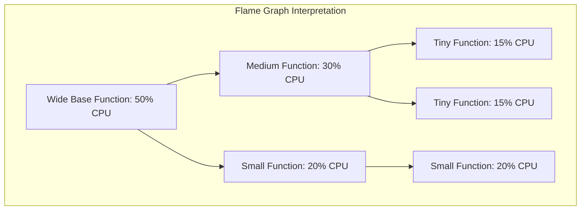

# Flame Graphs

## Introduction

Flame Graphs are a powerful visualization technique used to identify performance bottlenecks and understand resource consumption patterns in applications. Originally created by Brendan Gregg in 2011, Flame Graphs provide an intuitive way to visualize hierarchical data, making them particularly useful for analyzing CPU usage, memory allocation, and other performance-related metrics.

In Grafana, Flame Graphs offer a rich, interactive experience that helps developers and operators quickly identify performance issues that might otherwise remain hidden in traditional graphs or tables.

## What are Flame Graphs?

Flame Graphs are a visualization that represents hierarchical data in the form of stacked rectangles. Each rectangle represents a function call or a component in the stack, and the width of the rectangle corresponds to the relative time or resources consumed by that function.


The key characteristics of Flame Graphs include:

- **Hierarchical representation**: Functions that call other functions are stacked on top of each other.
- **Width corresponds to value**: The wider a block, the more time or resources it consumed.
- **Color is typically used for differentiation**: Different colors often represent different types of functions or libraries.
- **Interactive exploration**: Modern Flame Graphs in Grafana allow zooming, panning, and filtering.

## Flame Graphs vs. Traditional Profiling Tools

Before diving deeper, let's understand how Flame Graphs differ from traditional profiling tools:

| Traditional Profiling                    | Flame Graphs                                      |
|------------------------------------------|---------------------------------------------------|
| Often text-based or simple bar charts    | Visually rich and hierarchical                    |
| Limited context about call relationships | Clear visualization of parent-child relationships |
| Can be overwhelming with large datasets  | Scales well with large datasets                   |
| Difficult to spot patterns               | Makes patterns immediately visible                |

## How to Read Flame Graphs

Reading a Flame Graph correctly is essential to deriving valuable insights:

1. **Bottom-up reading**: The bottom layer represents the entry functions, with each layer above showing called functions.
2. **Width interpretation**: The wider a function block, the more time it consumed.
3. **Plateaus and towers**: Look for wide plateaus (indicating time-consuming functions) and tall towers (indicating deep call stacks).
4. **Color interpretation**: In Grafana, colors typically represent different function types or libraries.

Consider this simplified example:



## Setting Up Flame Graphs in Grafana

To use Flame Graphs in Grafana, you'll need:

1. **Grafana version 7.0 or higher**: Ensure you're running a compatible version.
2. **Data source with profiling data**: Common sources include Prometheus with pprof, Jaeger, or Pyroscope.
3. **The Flame Graph panel plugin**: This is included in recent Grafana versions.

### Basic Setup Steps:

1. Create a new dashboard or edit an existing one.
2. Add a new panel and select "Flame Graph" as the visualization type.
3. Configure your data source and query to retrieve profiling data.
4. Adjust the Flame Graph settings for optimal visualization.

## Configuring Flame Graphs

Grafana offers several configuration options for Flame Graphs:

```javascript
// Example configuration object for a Flame Graph in Grafana
const flameGraphConfig = {
  type: 'flamegraph',
  datasource: 'prometheus',
  query: 'go_goroutines{job="myapp"}',
  display: {
    mode: 'cpu', // Options: 'cpu', 'memory', 'custom'
    colorScheme: 'oranges', // Color scheme for the graph
    showValues: true // Show values on hover
  }
};
```

Key configuration options include:

- **Display Mode**: Select between CPU profile, memory profile, or custom metrics.
- **Color Scheme**: Choose a color palette that makes sense for your data.
- **Value Display**: Configure how values are displayed on hover.
- **Sorting**: Sort blocks by various criteria (alphabetical, value, etc.).

## Practical Examples

Let's look at some real-world applications of Flame Graphs in Grafana.

### Example 1: CPU Profiling for a Node.js Application

When profiling a Node.js application, a Flame Graph might help identify bottlenecks in the event loop:

```javascript
// Node.js example of generating profiling data
const profiler = require('v8-profiler-next');
const fs = require('fs');

// Start CPU profiling
profiler.startProfiling('CPU profile');

// Your application code runs here
// ...

// Stop profiling after some time
setTimeout(() => {
  const cpuProfile = profiler.stopProfiling('CPU profile');
  
  // Save the profile to a file
  fs.writeFileSync('./profile.cpuprofile', JSON.stringify(cpuProfile));
  
  console.log('Profile saved to profile.cpuprofile');
}, 30000);
```

This profile can then be imported into Grafana for visualization. In the resulting Flame Graph, you might notice:

- Wide blocks representing CPU-intensive operations
- Recurring patterns indicating repetitive operations
- Unexpected functions consuming significant resources

### Example 2: Memory Allocation in a Go Application

For Go applications, memory profiling can help identify memory leaks and allocation patterns:

```go
package main

import (
    "net/http"
    _ "net/http/pprof" // Import pprof
    "log"
)

func main() {
    // Start the pprof HTTP server on port 6060
    go func() {
        log.Println(http.ListenAndServe("localhost:6060", nil))
    }()
    
    // Your application code here
    // ...
}
```

With this setup, Prometheus can scrape the `/debug/pprof/heap` endpoint to collect memory profiling data, which Grafana can visualize as a Flame Graph.

### Example 3: Database Query Performance

When profiling database queries, a Flame Graph can reveal which queries are consuming the most resources:

```python
# Python example using pyinstrument for profiling
from pyinstrument import Profiler
from my_database_module import run_queries

profiler = Profiler()
profiler.start()

# Run your database queries
run_queries()

profiler.stop()
profiler.save(path='profile.speedscope')  # Compatible with Grafana
```

## Advanced Techniques

Once you're comfortable with basic Flame Graphs, you can explore these advanced techniques:

### Differential Flame Graphs

Differential Flame Graphs compare two profiles (e.g., before and after a code change) to highlight differences:

```javascript
// Example query for a differential Flame Graph in Grafana
{
  "datasource": "Prometheus",
  "query": {
    "a": "profile_cpu{job='app',version='v1'}",
    "b": "profile_cpu{job='app',version='v2'}"
  },
  "type": "flamegraph",
  "mode": "differential"
}
```

### Time-Series Flame Graphs

By combining Flame Graphs with time series data, you can observe how performance profiles change over time:

1. Create a dashboard with a time picker.
2. Add a Flame Graph panel that respects the dashboard time range.
3. As you change the time range, the Flame Graph updates to show profiles from that period.

### Custom Metrics Flame Graphs

Beyond CPU and memory, you can create Flame Graphs for any hierarchical metric:

- HTTP request latency by endpoint and handler
- Database query time by table and operation
- UI rendering time by component

## Common Pitfalls and How to Avoid Them

When working with Flame Graphs, be aware of these common issues:

1. **Sampling bias**: Ensure your profiling frequency is appropriate for your application's behavior.
2. **Misinterpreting colors**: Always check the legend to understand what colors represent.
3. **Ignoring the context**: A Flame Graph is one tool; combine it with other metrics for a complete picture.
4. **Overhead effects**: Be aware that profiling itself adds overhead that may affect results.

## Integrating Flame Graphs with Other Grafana Visualizations

For maximum insight, combine Flame Graphs with other Grafana panels:

```javascript
// Dashboard configuration example
const dashboard = {
  title: 'Application Performance',
  panels: [
    {
      title: 'CPU Usage Over Time',
      type: 'graph',
      // ... configuration ...
    },
    {
      title: 'CPU Profile Flame Graph',
      type: 'flamegraph',
      // ... configuration ...
    },
    {
      title: 'Error Rate',
      type: 'stat',
      // ... configuration ...
    }
  ]
};
```

This approach allows you to correlate Flame Graph patterns with other metrics like error rates or response times.

## Summary

Flame Graphs are a powerful visualization technique in Grafana that enable you to:

- Identify performance bottlenecks in your applications
- Understand resource consumption patterns
- Visualize complex hierarchical data intuitively
- Make data-driven optimization decisions

By mastering Flame Graphs, you'll add a valuable tool to your performance analysis toolkit that can significantly reduce the time spent debugging performance issues.

## Further Resources and Exercises

### Additional Resources

- [Brendan Gregg's Flame Graph page](http://www.brendangregg.com/flamegraphs.html)
- [Grafana Flame Graph documentation](https://grafana.com/docs/grafana/latest/visualizations/flamegraph/)
- [Pyroscope: Continuous Profiling Platform](https://pyroscope.io/)

### Exercises

1. **Basic Flame Graph Analysis**:
   - Generate a CPU profile from a simple application
   - Import it into Grafana and identify the top 3 functions consuming CPU

2. **Comparative Analysis**:
   - Profile your application before and after an optimization
   - Create a differential Flame Graph to visualize the impact

3. **Custom Metric Flame Graph**:
   - Create a custom hierarchical metric for your application
   - Visualize it as a Flame Graph in Grafana

4. **Dashboard Integration**:
   - Build a comprehensive dashboard that includes Flame Graphs alongside traditional metrics
   - Use template variables to filter the Flame Graph by service or environment