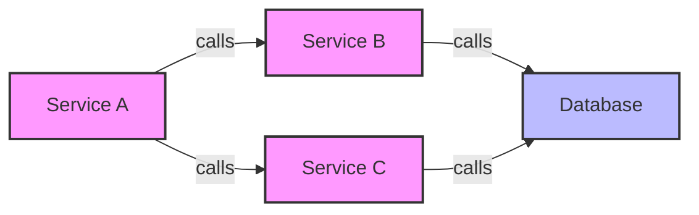
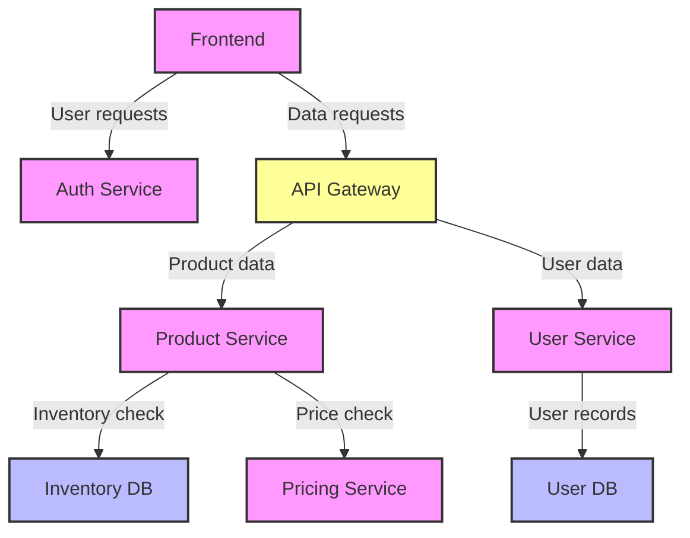
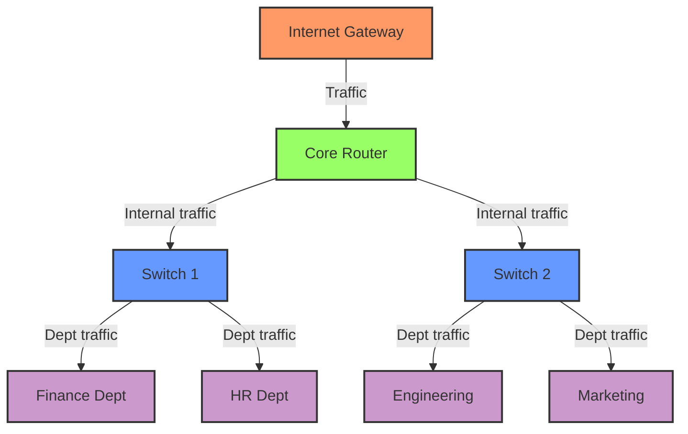

# Node Graphs in Grafana

## Introduction

Node Graphs are a powerful visualization type in Grafana that help you understand complex relationships between different entities in your data. Unlike time series charts that focus on metrics over time, node graphs illustrate how different components connect and interact with each other.

Think of them as maps of relationships - they're perfect for visualizing:
- Network topologies
- Service dependencies
- Distributed traces
- Application architectures
- Any data where connections between entities matter

In this guide, we'll explore how Node Graphs work in Grafana, when to use them, and how to create effective node graph visualizations with your data.

## Understanding Node Graphs

### Core Concepts

Node Graphs consist of two primary elements:

1. **Nodes** - The entities or components in your system (represented as circles)
2. **Edges** - The connections or relationships between nodes (represented as lines)

Each node and edge can have various properties:

- **Nodes**: Size, color, labels, and additional metadata
- **Edges**: Direction, thickness, color, and labels




### When to Use Node Graphs

Node Graphs are most valuable when:

- You need to understand relationships and dependencies
- You want to visualize service maps or network topologies
- You're troubleshooting complex distributed systems
- You need to identify bottlenecks or critical paths in a system

They're less useful for:
- Precise metric analysis over time
- Comparing numeric values
- Displaying statistical distributions

## Creating Node Graphs in Grafana

### Prerequisites

To create a Node Graph visualization in Grafana, you'll need:

1. Grafana 7.4 or newer
2. A data source that supports Node Graph format or data that can be transformed
3. Data with nodes and edges information

### Step-by-Step Creation Process

#### 1. Create a new dashboard or edit an existing one

Start by navigating to the dashboard where you want to add a Node Graph visualization.

#### 2. Add a new panel

Click the "Add panel" button and then select "Add a new panel".

#### 3. Select or query your data source

Configure your data source query to retrieve the necessary node and edge data.

#### 4. Select Node Graph visualization

In the visualization options, select "Node Graph" from the visualization types.

#### 5. Configure the data format

Node Graphs require specific data formats. Your data needs to include:

- A nodes table with at least an `id` field
- An edges table with at least `source` and `target` fields

Here's an example of the expected data format:

**Nodes table:**
```
| id      | title       | subtitle    | mainstat | secondarystat | arc__success | arc__error |
|---------|-------------|-------------|----------|---------------|--------------|------------|
| service1| Service 1   | Healthy     | 100      | 200ms         | 0.9          | 0.1        |
| service2| Service 2   | Degraded    | 80       | 400ms         | 0.7          | 0.3        |
| service3| Service 3   | Healthy     | 90       | 300ms         | 0.8          | 0.2        |
```

**Edges table:**
```
| id          | source    | target    | mainstat | secondarystat |
|-------------|-----------|-----------|----------|---------------|
| edge1       | service1  | service2  | 100      | 200ms         |
| edge2       | service1  | service3  | 50       | 100ms         |
| edge3       | service2  | service3  | 80       | 150ms         |
```

#### 6. Configure the visualization

Adjust the Node Graph options to customize your visualization:

- **Layout**: Choose between force layout (automatic) or directed layout
- **Node size**: Configure how node metrics correspond to sizes
- **Node color**: Set color schemes based on node metrics
- **Edge metrics**: Define what the edge thickness and labels represent

### Transforming Data for Node Graphs

If your data isn't already in the required format, you can use Grafana's transformations to convert it:

1. Go to the "Transform" tab in the panel editor
2. Add transformations to reshape your data into nodes and edges tables
3. Make sure the final result has the required fields (id for nodes, source/target for edges)

Here's an example of how to transform relational data into a Node Graph format:

```javascript
// Example transformation using Grafana's transform functions
// This is conceptual and would be done via the UI
const nodes = data.map(item => ({
  id: item.service_name,
  title: item.service_name,
  mainstat: item.request_count,
  secondarystat: item.error_rate
}));

const edges = data.map(item => ({
  id: `${item.source_service}-${item.destination_service}`,
  source: item.source_service,
  target: item.destination_service,
  mainstat: item.traffic_volume
}));
```

## Real-World Examples

### Example 1: Visualizing Microservice Dependencies

Imagine you have a microservice architecture and want to understand how services interact:



In this example, a Node Graph helps you:
- Identify critical services (like the API Gateway)
- Understand dependency chains
- Spot potential bottlenecks or single points of failure

#### Implementation Code

```sql
-- Prometheus query example (using metrics and metadata from service mesh)
-- This would be configured in Grafana's query editor
sum by(source_service, destination_service) (rate(request_total{namespace="production"}[5m]))
```

Then use transformations to convert this into the Node Graph format.

### Example 2: Network Traffic Analysis

For network engineers, Node Graphs can visualize traffic flows between network devices:



In this example, you can:
- Monitor traffic flows through your network
- Identify high-traffic paths
- Spot unusual connection patterns

#### Implementation with Streaming Data

```javascript
// Sample code to process network traffic data for a Node Graph
// This would typically be done by a data collection script

function processNetworkData(trafficData) {
  const nodes = [];
  const edges = [];
  
  // Extract unique devices as nodes
  trafficData.forEach(flow => {
    if (!nodes.some(n => n.id === flow.source_device)) {
      nodes.push({
        id: flow.source_device,
        title: flow.source_name,
        mainstat: flow.total_connections,
        secondarystat: `${flow.avg_latency}ms`
      });
    }
    
    if (!nodes.some(n => n.id === flow.destination_device)) {
      nodes.push({
        id: flow.destination_device,
        title: flow.destination_name,
        mainstat: flow.total_connections,
        secondarystat: `${flow.avg_latency}ms`
      });
    }
    
    // Create edges
    edges.push({
      id: `${flow.source_device}-${flow.destination_device}`,
      source: flow.source_device,
      target: flow.destination_device,
      mainstat: flow.bytes_transferred,
      secondarystat: flow.protocol
    });
  });
  
  return { nodes, edges };
}
```

## Advanced Features

### Interactive Exploration

Node Graphs in Grafana are interactive. You can:

- Hover over nodes to see details
- Click nodes to highlight connected paths
- Drag nodes to rearrange the graph
- Zoom in/out to focus on specific areas
- Filter the graph based on node properties

### Node Graph with Trace Data

Grafana's Node Graph works especially well with distributed tracing data:

```javascript
// Transform trace data into Node Graph format
function traceToNodeGraph(traceData) {
  const nodes = traceData.spans.map(span => ({
    id: span.spanId,
    title: span.operationName,
    subtitle: span.serviceName,
    mainstat: `${span.duration}ms`,
    secondarystat: span.status
  }));
  
  const edges = [];
  traceData.spans.forEach(span => {
    if (span.parentSpanId) {
      edges.push({
        id: `${span.parentSpanId}-${span.spanId}`,
        source: span.parentSpanId,
        target: span.spanId
      });
    }
  });
  
  return { nodes, edges };
}
```

### Custom Node Styling

You can customize the appearance of nodes using various options:

- Arc sections to show proportions (like success/error rates)
- Color thresholds based on metrics
- Size variations according to importance
- Custom icons or images

## Best Practices

### Design Tips

1. **Limit the number of nodes**: Too many nodes create visual clutter. Filter or aggregate when necessary.
2. **Use meaningful metrics**: Choose node and edge metrics that highlight important information.
3. **Apply appropriate colors**: Use consistent color schemes to represent similar metrics.
4. **Add context in tooltips**: Include additional details in hover tooltips.
5. **Consider the layout**: Different layouts work better for different types of relationships.

### Performance Considerations

Node Graphs can be resource-intensive, especially with large datasets:

- Limit the total number of nodes and edges (fewer than 1,000 is ideal)
- Apply server-side filtering when possible
- Consider aggregating nodes for high-level views
- Use time range controls to limit the data being visualized

## Troubleshooting

### Common Issues

#### Empty Graph

If your Node Graph is empty, check:
- Data format (needs the correct node/edge structure)
- Missing required fields (id, source, target)
- Query returning no data

#### Performance Problems

If the graph is slow or unresponsive:
- Reduce the number of nodes/edges
- Simplify node/edge styling
- Check browser performance
- Consider using a more focused time range

#### Cluttered Visualization

If the graph is too cluttered:
- Filter less important nodes
- Adjust the layout settings
- Group related nodes
- Use size and color to highlight important elements

## Summary

Node Graphs in Grafana provide a powerful way to visualize relationships and dependencies in your data. They excel at showing how different entities connect and interact, making them ideal for network topologies, service maps, and distributed system analysis.

By following the steps and best practices outlined in this guide, you'll be able to create effective Node Graph visualizations that help you understand complex systems at a glance.

## Additional Resources

Here are some exercises to help you practice working with Node Graphs:

1. **Basic Node Graph**: Create a simple node graph showing the relationships between 5-10 services in a typical web application.

2. **Dynamic Node Graph**: Create a dashboard that updates a Node Graph in real-time based on changing data.

3. **Filtered Node Graph**: Implement variable-based filtering to allow users to focus on specific parts of a larger graph.

4. **Advanced Styling**: Experiment with different node styles, colors, and sizes to represent multiple metrics simultaneously.

5. **Trace Visualization**: Use Node Graph to visualize a distributed trace spanning multiple services.

Further reading:
- Grafana documentation on Node Graphs
- Network visualization principles
- Graph theory basics for better understanding of node-based visualizations