# State Timelines

## Introduction

State Timeline visualizations in Grafana are powerful tools that allow you to track and display state changes or categorical data over time. Unlike traditional time series graphs that show continuous numerical values, state timelines represent discrete states or categories as colored horizontal bars, making them perfect for visualizing:

- System states (online/offline/maintenance)
- Alert levels (critical/warning/ok)
- Workflow stages (pending/in progress/complete)
- Resource allocation (free/busy/reserved)
- Application status changes

This visualization type is especially valuable for operations teams, SRE (Site Reliability Engineering), and anyone who needs to monitor state transitions across multiple entities over time.

## Understanding State Timelines

State timelines organize data into rows (typically representing different entities or systems) and display state changes as colored segments along a horizontal time axis.

```mermaid
gantt
    title State Timeline Conceptual View
    dateFormat  HH:mm
    axisFormat  %H:%M
    
    section Server 1
    Online       :done, s1, 00:00, 02:00
    Maintenance  :active, s2, 02:00, 01:00
    Online       :done, s3, 03:00, 03:00
    
    section Server 2
    Online       :done, s4, 00:00, 01:30
    Warning      :crit, s5, 01:30, 00:30
    Online       :done, s6, 02:00, 04:00
    
    section Server 3
    Offline      :crit, s7, 00:00, 01:00
    Online       :done, s8, 01:00, 05:00
```



Key components include:

- **States**: Represented by different colored segments
- **Entities**: Typically shown as rows (servers, applications, etc.)
- **Time axis**: Shows when state changes occurred
- **Legend**: Explains what each color represents

## Creating a State Timeline in Grafana

### Prerequisites

- Grafana v8.0 or newer (state timelines were introduced in Grafana 8.0)
- A data source with time-series data that includes state information
- Appropriate permissions to create and edit dashboards

### Basic Setup

1. Create a new dashboard or edit an existing one
2. Add a new panel
3. Select "State timeline" from the visualization options
4. Configure your data source query to return appropriate data

### Data Requirements

State timelines require time-series data with:

- A timestamp
- A state/category value (string or number)
- An optional entity field to group by (creates multiple rows)

Your data might look like this:

```
| timestamp           | entity   | state      |
|---------------------|----------|------------|
| 2023-04-10 09:00:00 | Server1  | online     |
| 2023-04-10 09:15:00 | Server1  | warning    |
| 2023-04-10 09:45:00 | Server1  | online     |
| 2023-04-10 09:00:00 | Server2  | online     |
| 2023-04-10 09:30:00 | Server2  | offline    |
```

### Step-by-Step Configuration

#### Step 1: Create Your Query

For this example, let's use InfluxDB as our data source:

```sql
SELECT "state", "entity" FROM "server_states" WHERE $timeFilter GROUP BY "entity"
```

For Prometheus, you might use a query like:

```
server_state{job="monitoring"}
```

#### Step 2: Configure the Visualization

After running your query, select "State timeline" from the visualization dropdown. You'll see your data displayed as a state timeline with default settings.

#### Step 3: Customize the Display

Navigate to the panel options to customize your visualization:

1. **Show values**: Choose to display values always, on hover, or never
2. **Row height**: Adjust the height of each row
3. **Merging**: Enable to merge similar consecutive states
4. **Alignment mode**: Adjust how timestamps are aligned

### Configuration Examples

Let's look at a complete panel configuration:

```javascript
// Panel JSON configuration
{
  "datasource": "InfluxDB",
  "targets": [
    {
      "query": "SELECT \"state\", \"entity\" FROM \"server_states\" WHERE $timeFilter GROUP BY \"entity\"",
      "refId": "A"
    }
  ],
  "options": {
    "showValue": "auto",
    "rowHeight": 0.9,
    "mergeValues": false,
    "alignValue": "left"
  },
  "fieldConfig": {
    "defaults": {
      "custom": {
        "lineWidth": 1,
        "fillOpacity": 70
      },
      "mappings": [
        {
          "type": "value",
          "options": {
            "online": {
              "color": "green",
              "index": 0
            },
            "warning": {
              "color": "orange",
              "index": 1
            },
            "offline": {
              "color": "red",
              "index": 2
            },
            "maintenance": {
              "color": "blue",
              "index": 3
            }
          }
        }
      ]
    }
  }
}
```

## Value Mapping and Color Coding

One of the most important aspects of state timelines is setting up proper value mappings to assign colors and labels to each state.

### Basic Value Mapping

1. Go to the "Field" tab in the panel editor
2. Find "Value mappings" and click "Add value mappings"
3. Add each state and assign a color and display text

For example:

- Map "0" or "online" to green
- Map "1" or "warning" to orange
- Map "2" or "offline" to red

```javascript
// Value mapping configuration
"mappings": [
  {
    "type": "value",
    "options": {
      "online": {
        "color": "green",
        "text": "Online"
      },
      "warning": {
        "color": "orange",
        "text": "Warning"
      },
      "offline": {
        "color": "red",
        "text": "Offline"
      }
    }
  }
]
```

### Advanced Color Schemes

For more nuanced states, consider using color gradients or consistent color coding across your organization:

- Red: Critical issues, outages
- Orange/Yellow: Warnings, degraded performance
- Green: Normal operation
- Blue: Information, scheduled maintenance
- Purple: Special conditions

## Advanced Features

### Time Alignment Options

State timelines offer different ways to align state changes:

- **Left**: Aligns state text to the left of each segment
- **Center**: Centers state text within each segment
- **Right**: Aligns state text to the right of each segment

### Merging States

The "Merge equal consecutive values" option combines adjacent segments with the same state, creating a cleaner visualization when there are rapid oscillations between the same states.

### Legend Options

Configure the legend to show:
- State values and their corresponding colors
- Value percentages (how much time was spent in each state)
- Value counts (how many times each state occurred)

### Tooltip Customization

Enhance tooltips to display:
- State duration
- Previous and next states
- Additional metadata

```javascript
// Tooltip configuration
"tooltip": {
  "mode": "multi",
  "sort": "none"
}
```

## Real-World Examples

### Example 1: Server Monitoring Dashboard

Create a dashboard to monitor the status of multiple servers:

```sql
-- InfluxDB query
SELECT "status" FROM "server_metrics" WHERE $timeFilter GROUP BY "hostname"
```

Set up value mappings:
- 0 = "Down" (red)
- 1 = "Degraded" (yellow)
- 2 = "Healthy" (green)

This allows operations teams to quickly see when servers go down and identify patterns across the infrastructure.

### Example 2: CI/CD Pipeline Visualization

Track the stages of your CI/CD pipeline for different builds:

```sql
-- PostgreSQL query
SELECT 
  time, 
  build_id,
  stage,
  status
FROM ci_pipeline_events
WHERE $__timeFilter(time)
ORDER BY build_id, time
```

With mappings:
- "pending" = Gray
- "running" = Blue
- "failed" = Red
- "success" = Green

This helps development teams visualize bottlenecks in their pipeline and identify recurring failure patterns.

### Example 3: Application Status Monitoring

Monitor different components of your application:

```javascript
// Prometheus query
max by(component) (app_component_state{environment="$environment"})
```

Value mappings:
- 0 = "Offline" (red)
- 1 = "Starting" (blue)
- 2 = "Degraded" (orange)
- 3 = "Online" (green)

## Troubleshooting

### Common Issues

1. **No data appears in timeline**:
   - Ensure your query returns state values and timestamps
   - Check that your time range includes periods with state changes

2. **Colors not displaying correctly**:
   - Verify your value mappings are correctly set up
   - Check that state values in your data match your mappings

3. **Too many state changes creating visual noise**:
   - Enable the "Merge equal consecutive values" option
   - Consider aggregating your data to reduce rapid oscillations

4. **States appear as numbers instead of meaningful labels**:
   - Add value mappings to convert numeric states to text labels

## Best Practices

1. **Use consistent colors** across all dashboards for the same states
2. **Limit the number of rows** to prevent the visualization from becoming too crowded
3. **Add thresholds** to highlight critical state changes
4. **Use descriptive state names** rather than cryptic codes
5. **Consider time zones** when analyzing state changes across global systems

## Summary

State Timeline visualizations provide a powerful way to monitor and analyze state changes over time. They excel at:

- Visualizing system, service, or component states
- Identifying patterns in state transitions
- Comparing state behavior across multiple entities
- Tracking the duration of different states

By properly configuring state timelines with meaningful colors, appropriate groupings, and clear labels, you can create dashboards that provide immediate insight into the operational status of your systems.

## Additional Resources

- [Grafana State Timeline Documentation](https://grafana.com/docs/grafana/latest/visualizations/state-timeline/)
- [Time Series Visualization Best Practices](https://grafana.com/docs/grafana/latest/best-practices/best-practices-for-creating-dashboards/)
- [Value Mapping in Grafana](https://grafana.com/docs/grafana/latest/panels/format-data-using-value-mapping/)

## Exercises

1. Create a state timeline showing the status of three different services over a 24-hour period.
2. Set up value mappings for a state timeline that displays four different alert levels.
3. Modify an existing state timeline to merge equal consecutive values and evaluate the difference in clarity.
4. Create a dashboard with both state timelines and traditional graphs to compare system performance against system states.
5. Configure a state timeline to display the percentage of time spent in each state in the legend.