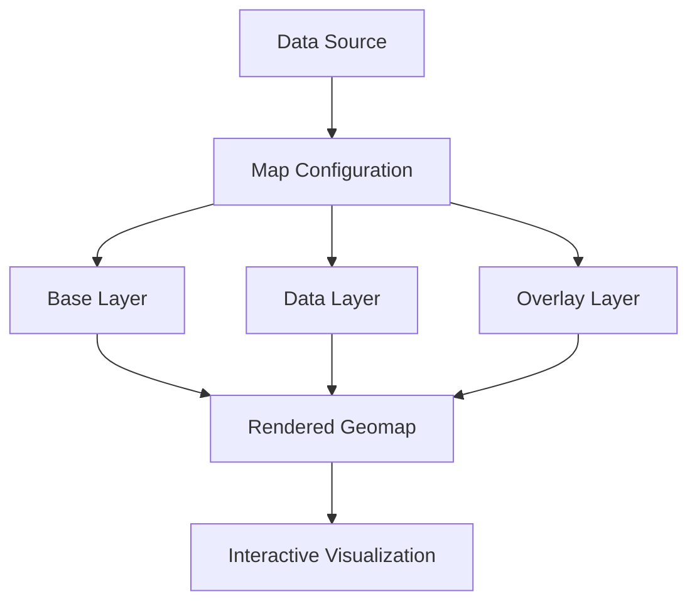

# Geomap Visualizations

## Introduction

Geomap visualizations in Grafana allow you to display geographical data on interactive maps. Whether you're tracking global server performance, monitoring weather patterns, or visualizing business metrics across different regions, geomaps provide a powerful way to represent location-based data visually.

Introduced in Grafana 8.1, the Geomap panel is a modern replacement for the older world map panel, offering enhanced features, better performance, and more customization options. This visualization type leverages the power of [OpenLayers](https://openlayers.org/) to render sophisticated map visualizations.

## Why Use Geomap Visualizations?

Geomaps are particularly useful when:

- Your data has geographical components (coordinates, regions, countries)
- You want to identify spatial patterns or trends
- You need to compare metrics across different geographical areas
- You want to provide an intuitive, interactive interface for exploring location-based data

## Basic Concepts

Before diving into implementation, let's understand some key concepts related to geomap visualizations:

### Map Layers

Geomap panels in Grafana use a layered approach:

1. **Base layer**: The background map (e.g., OpenStreetMap, CARTO, custom tile servers)
2. **Data layers**: Your data visualized as points, heatmaps, or polygons
3. **Overlay layers**: Additional context like boundaries or labels

### Coordinate Systems

Geospatial data typically uses two types of coordinate systems:

- **Latitude/Longitude**: Geographic coordinates that specify positions on Earth's surface
- **Projected Coordinates**: Transformations of geographic coordinates onto a flat surface

Grafana's geomap visualization works with latitude/longitude coordinates by default.

## Creating Your First Geomap Visualization

Let's walk through creating a basic geomap visualization in Grafana.

### Prerequisites

- A running Grafana instance (v8.1 or newer)
- A data source with geospatial data (coordinates)

### Step 1: Add a New Panel

1. Navigate to your dashboard
2. Click "Add panel"
3. Select "Geomap" from the visualization options

### Step 2: Configure Your Data Source

Your data needs to include location information in one of these formats:

- Separate latitude and longitude fields
- GeoJSON format
- Table data with geometry fields

Here's an example query using a SQL data source:

```sql
SELECT 
  time,
  location_name,
  latitude,
  longitude,
  metric_value
FROM server_metrics
WHERE time > $__timeFrom AND time < $__timeTo
```

### Step 3: Configure the Map Layers

#### Base Layer Configuration

1. In the panel options, find the "Layers" section
2. Configure the base map layer:

```javascript
{
  "type": "map",
  "config": {
    "style": "default",
    "provider": "OpenStreetMap"
  }
}
```

#### Data Layer Configuration

Configure how your data appears on the map:

1. Select a layer type (markers, heatmap, GeoJSON)
2. Map your data fields to visual properties

For a simple marker layer:

```javascript
{
  "type": "markers",
  "config": {
    "size": {
      "fixed": 5,
      "field": "metric_value", // Optional: scale marker size by a field
      "min": 2,
      "max": 15
    },
    "color": {
      "field": "metric_value",
      "scheme": "interpolateReds"
    },
    "showLegend": true
  }
}
```

### Step 4: Fine-Tune Your Visualization

Additional settings to enhance your geomap:

- **Controls**: Enable zoom, pan, and scale controls
- **Tooltip**: Configure what information appears when hovering over points
- **View**: Set the initial zoom level and map center



## Real-World Examples

Let's explore some practical examples of geomap visualizations.

### Example 1: Global Server Monitoring

Monitoring server performance across global data centers:

```javascript
// Panel JSON configuration example
{
  "layers": [
    {
      "type": "map",
      "config": {
        "style": "dark",
        "provider": "CARTO"
      }
    },
    {
      "type": "markers",
      "config": {
        "size": {
          "fixed": 10
        },
        "color": {
          "field": "response_time",
          "scheme": "interpolateRdYlGn",
          "reverse": true
        },
        "showLegend": true
      }
    }
  ],
  "view": {
    "id": "zero",
    "lat": 0,
    "lon": 0,
    "zoom": 1.5
  }
}
```

This configuration shows data centers as markers, with color indicating response time (red = slow, green = fast).

### Example 2: Regional Sales Dashboard

Visualizing sales performance by region:

```javascript
// Panel JSON configuration example
{
  "layers": [
    {
      "type": "map",
      "config": {
        "style": "light",
        "provider": "OpenStreetMap"
      }
    },
    {
      "type": "geojson",
      "config": {
        "src": {
          "id": "countries"
        },
        "style": {
          "color": {
            "field": "sales_revenue",
            "scheme": "interpolateBlues"
          }
        },
        "showLegend": true
      }
    }
  ]
}
```

This creates a choropleth map where countries or regions are colored based on sales revenue.

## Common Geomap Layer Types

Grafana offers several layer types for different visualization needs:

### Markers Layer

Best for:
- Discrete locations (servers, stores, events)
- Showing multiple attributes via size and color

```javascript
{
  "type": "markers",
  "config": {
    // Configuration options
  }
}
```

### Heatmap Layer

Best for:
- Density visualization
- Large datasets where individual markers would overcrowd

```javascript
{
  "type": "heatmap",
  "config": {
    "weight": {
      "field": "value_count"
    },
    "radius": 15
  }
}
```

### GeoJSON Layer

Best for:
- Region-based data (countries, states, custom polygons)
- Choropleth maps

```javascript
{
  "type": "geojson",
  "config": {
    // Configuration options
  }
}
```

## Advanced Features

Once you're comfortable with basic geomap visualizations, explore these advanced capabilities:

### Dynamic Data Points

Use time series data to show changes over time:

```javascript
// Time-based data query example
SELECT 
  time,
  latitude, 
  longitude, 
  value,
  location_name
FROM sensor_data
WHERE $__timeFilter(time)
ORDER BY time ASC
```

With animation controls enabled, users can "play" through the data chronologically.

### Custom Map Styles

Configure custom tile servers for specialized maps:

```javascript
{
  "type": "map",
  "config": {
    "provider": "custom",
    "url": "https://your-tile-server/{z}/{x}/{y}.png",
    "attribution": "Map data © Your Provider"
  }
}
```

### Thematic Mapping

Create maps that tell stories through data styling:

```javascript
{
  "type": "markers",
  "config": {
    "color": {
      "field": "status",
      "mappings": [
        { "value": "critical", "color": "red" },
        { "value": "warning", "color": "orange" },
        { "value": "normal", "color": "green" }
      ]
    },
    "showLegend": true
  }
}
```

## Troubleshooting

Common issues when working with geomap visualizations:

### Map Not Displaying

- Check that your Grafana version supports geomaps (8.1+)
- Verify network connectivity to tile servers
- Ensure proper CORS settings if using custom tile servers

### Data Not Appearing

- Confirm coordinate fields are properly mapped
- Check for valid latitude/longitude values (-90 to 90 for lat, -180 to 180 for long)
- Verify your query returns data within the visible map area

### Performance Issues

- Limit the number of data points (use aggregation)
- Consider using heatmap instead of markers for large datasets
- Optimize your data source queries

## Summary

Geomap visualizations in Grafana provide a powerful way to visualize location-based data. By combining different layers, styling options, and data mappings, you can create rich, interactive geographical visualizations that help users identify patterns and make data-driven decisions.

Remember these key points:

1. Geomaps use a layered approach with base maps and data overlays
2. Data needs geographic coordinates (latitude/longitude) or GeoJSON
3. Different layer types (markers, heatmap, GeoJSON) serve different visualization needs
4. Color and size mappings help encode additional dimensions of data

## Further Resources

To continue learning about Grafana Geomap visualizations:

- [Grafana Geomap Documentation](https://grafana.com/docs/grafana/latest/panels-visualizations/visualizations/geomap/)
- [OpenLayers Documentation](https://openlayers.org/doc/)
- [GeoJSON Specification](https://geojson.org/)

## Exercises

1. Create a geomap showing server locations with response time encoded by color
2. Build a heatmap visualization of user activity across different regions
3. Implement a choropleth map showing sales performance by country
4. Create a time-series geomap showing the progression of events over time
5. Design a multi-layer map combining different visualization types (e.g., markers on top of regions)