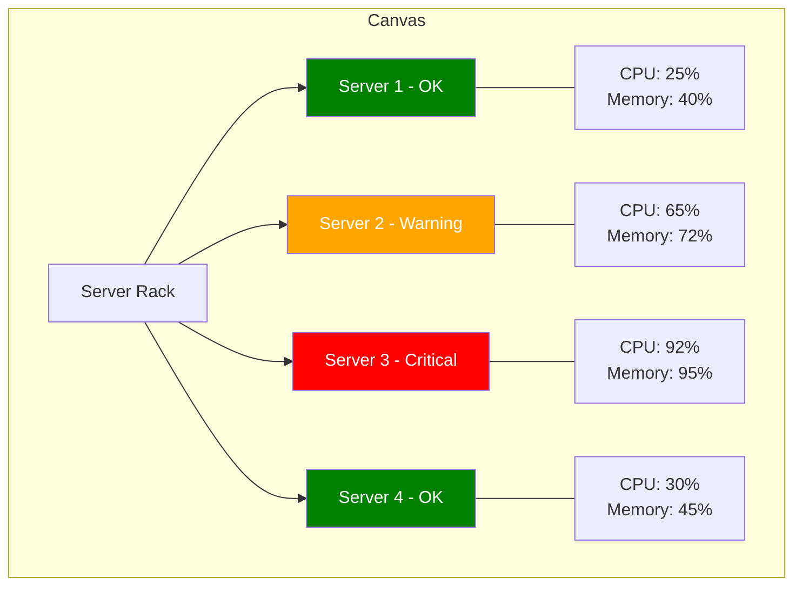

# Canvas Visualizations

## Introduction

Canvas is one of Grafana's most flexible visualization options, allowing you to create custom, freeform dashboards with precise control over the placement and appearance of elements. Unlike traditional panels that follow predetermined layouts, Canvas provides a blank slate where you can position, size, and style elements exactly as needed.

Canvas panels are especially useful when you want to:
- Create custom visualizations that don't fit into standard panel types
- Design operational dashboards that mimic real-world systems
- Build status boards with custom indicators and metrics
- Implement interactive displays with dynamic elements

In this guide, we'll explore how to use Canvas panels effectively, covering everything from basic setup to advanced customization techniques.

## Getting Started with Canvas

### Adding a Canvas Panel

To add a Canvas panel to your dashboard:

1. Edit your dashboard by clicking the "Edit" button in the top-right corner
2. Click "Add panel" (+ icon)
3. Search for and select "Canvas"
4. The empty Canvas panel will be added to your dashboard

### Understanding the Canvas Interface

When you first open a Canvas panel, you'll see a blank workspace with a toolbar at the top. This toolbar contains various options for adding and manipulating elements:

- **Elements**: Add new elements to your canvas
- **Layers**: Manage the stacking order of your elements
- **Connections**: Create lines connecting different elements
- **Background**: Set a background color or image for your canvas
- **Settings**: Configure panel-wide settings

## Working with Canvas Elements

Canvas provides several element types that you can add to your visualization:

### Text Elements

Text elements allow you to add labels, titles, and descriptive information to your canvas.

```javascript
// Example of configuring a text element via API
const text = {
  type: 'text',
  options: {
    text: 'Server Status',
    fontSize: 24,
    fontWeight: 'bold',
    color: '#FFFFFF',
    align: 'center',
  },
  position: { x: 100, y: 50, width: 200, height: 40 }
};
```

### Metric Elements

Metric elements display single values from your data sources.

```javascript
// Example of configuring a metric element via API
const metric = {
  type: 'metric',
  options: {
    valueText: '${server_status}',
    textMode: 'value',
    colorMode: 'value',
    textSize: 36,
    textAlign: 'center',
    thresholds: {
      mode: 'absolute',
      steps: [
        { value: null, color: 'green' },
        { value: 50, color: 'yellow' },
        { value: 80, color: 'red' }
      ]
    }
  },
  position: { x: 150, y: 100, width: 100, height: 80 }
};
```

### Shape Elements

Shapes can be used to create backgrounds, containers, or visual indicators.

```javascript
// Example of configuring a rectangle element via API
const rectangle = {
  type: 'rectangle',
  options: {
    color: 'rgba(0, 0, 255, 0.3)',
    borderColor: '#0000FF',
    borderWidth: 2,
    borderStyle: 'solid',
    cornerRadius: 8
  },
  position: { x: 100, y: 200, width: 200, height: 150 }
};
```

### Icon Elements

Icons can represent statuses, systems, or actions.

```javascript
// Example of configuring an icon element via API
const icon = {
  type: 'icon',
  options: {
    iconName: 'server',
    iconSize: 48,
    color: '#00FF00',
    dynamicColor: {
      field: 'server_status',
      thresholds: {
        mode: 'absolute',
        steps: [
          { value: null, color: 'green' },
          { value: 1, color: 'yellow' },
          { value: 2, color: 'red' }
        ]
      }
    }
  },
  position: { x: 150, y: 250, width: 100, height: 100 }
};
```

### Image Elements

Images can represent equipment, systems, or provide visual context.

```javascript
// Example of configuring an image element via API
const image = {
  type: 'image',
  options: {
    src: 'data:image/svg+xml;base64,...', // Base64 encoded SVG
    scale: 'fit'
  },
  position: { x: 300, y: 200, width: 150, height: 150 }
};
```

## Canvas Layout and Positioning

Canvas uses an absolute positioning system measured in pixels. Each element has:

- **X/Y coordinates**: Determine the position from the top-left corner
- **Width/Height**: Set the size of the element
- **Z-index**: Controls which elements appear on top (managed via layers)

### Aligning and Distributing Elements

To maintain a clean layout:

1. Select multiple elements by holding Shift and clicking them
2. Right-click and use the alignment options:
   - Align Left/Right/Top/Bottom
   - Distribute Horizontally/Vertically
   - Center Horizontally/Vertically

## Data Binding in Canvas

One of Canvas's most powerful features is its ability to bind data to visual properties.

### Binding Data to Elements

To bind data to an element:

1. Select the element you want to bind data to
2. In the element's settings, look for properties with a database icon
3. Click the icon to open the data binding options
4. Select the field you want to bind to
5. Configure any transformations or mappings

### Dynamic Properties

Properties that can be data-bound include:

- **Text values**: Display metrics or labels
- **Colors**: Change colors based on threshold values
- **Visibility**: Show/hide elements based on conditions
- **Positions**: Move elements based on data values
- **Sizes**: Resize elements to represent values

```javascript
// Example of binding data to element properties
const dynamicElement = {
  type: 'rectangle',
  options: {
    color: {
      field: 'cpu_usage',
      thresholds: {
        mode: 'percentage',
        steps: [
          { value: null, color: 'green' },
          { value: 70, color: 'yellow' },
          { value: 90, color: 'red' }
        ]
      }
    },
    tooltip: true
  },
  position: {
    width: {
      field: 'memory_usage',
      min: 10,
      max: 200
    },
    height: 40,
    x: 100,
    y: 300
  }
};
```

## Creating Interactive Elements

Canvas supports interactivity through:

### Tooltips

Add tooltips to provide additional information when users hover over elements:

1. Select an element
2. Enable the "Show tooltip" option in settings
3. Configure what information should appear in the tooltip

### Links

Add links to elements to navigate to other dashboards or external URLs:

1. Select an element
2. In the element's settings, find the "Links" section
3. Add a new link and specify the URL or dashboard

## Real-World Examples

### Example 1: Server Rack Visualization



In this example, we create a visual representation of server racks with:

- Server icons that change color based on status
- Text elements showing server names
- Metric displays showing CPU and memory usage
- Tooltips providing detailed information on hover

### Example 2: Network Topology Map

Create a network topology map showing:

- Routers and switches as icon elements
- Connection lines between network devices
- Status indicators showing network health
- Traffic metrics on connections

### Example 3: Industrial Control System Dashboard

Design a control system interface with:

- Tanks that fill based on level measurements
- Pump indicators that change color based on status
- Flow indicators showing movement between components
- Temperature gauges using color gradients

## Advanced Canvas Techniques

### Using Variables in Canvas

Grafana dashboard variables can be used in Canvas elements:

```javascript
// Example of using a dashboard variable
const variableElement = {
  type: 'text',
  options: {
    text: 'Environment: ${environment}',
    fontSize: 20
  },
  position: { x: 50, y: 20, width: 300, height: 30 }
};
```

### Custom Tooltips

Create more informative tooltips by combining multiple fields:

```javascript
// Example of custom tooltip configuration
const tooltipConfig = {
  tooltipField: {
    mode: 'custom',
    template: 'Server: ${server_name}
Status: ${server_status}
Uptime: ${uptime_days} days
Load: ${server_load}%'
  }
};
```

### Animation and Updates

Canvas elements update in real-time as your data changes. To enhance this:

1. Set an appropriate refresh rate for your dashboard
2. Consider adding subtle transition effects in your element styling
3. Use thresholds to make state changes more noticeable

## Best Practices

### Performance Considerations

Canvas can become resource-intensive with many elements:

- Limit the number of elements to what's necessary
- Avoid excessive data binding on frequently updating metrics
- Consider using groups to organize and manage complex layouts

### Design Guidelines

For effective Canvas visualizations:

- Maintain a consistent visual language across elements
- Use color purposefully, especially for status indicators
- Ensure text is readable against your backgrounds
- Create a clear visual hierarchy
- Test your visualization at different screen sizes

## Troubleshooting

Common issues and solutions:

1. **Elements not updating**: Check that data binding is configured correctly and that your query is returning data.
2. **Performance issues**: Reduce the number of elements or the frequency of data updates.
3. **Elements disappearing**: Verify element positions are within the visible canvas area.
4. **Inconsistent appearance**: Ensure you're using consistent units (px) for positioning and sizing.

## Summary

Canvas visualizations provide a powerful way to create custom, freeform dashboards in Grafana. By leveraging absolute positioning, data binding, and a variety of element types, you can design intuitive visualizations that go beyond standard charts and graphs.

Key takeaways:
- Canvas gives you pixel-perfect control over dashboard elements
- Data binding allows you to create dynamic, responsive visualizations
- Multiple element types support diverse visualization needs
- Interactive features enhance user experience
- Canvas is ideal for operational dashboards and status boards

## Additional Resources

- Experiment with the Canvas playground in Grafana's panel editor
- Study existing Canvas templates in the Grafana community
- Combine Canvas with other panel types for comprehensive dashboards

## Exercises

1. **Basic Canvas Layout**: Create a Canvas panel with text, metric, and icon elements arranged to show server status.
2. **Data Binding Practice**: Set up a panel where colors, sizes, or positions change based on your data.
3. **System Visualization**: Build a Canvas visualization that represents a real system you monitor, such as a server farm, application architecture, or industrial process.
4. **Interactive Dashboard**: Create a Canvas with elements that link to detailed dashboards for each component.
5. **Dynamic Status Board**: Design a status board that shows real-time metrics with appropriate visual indicators for different states.