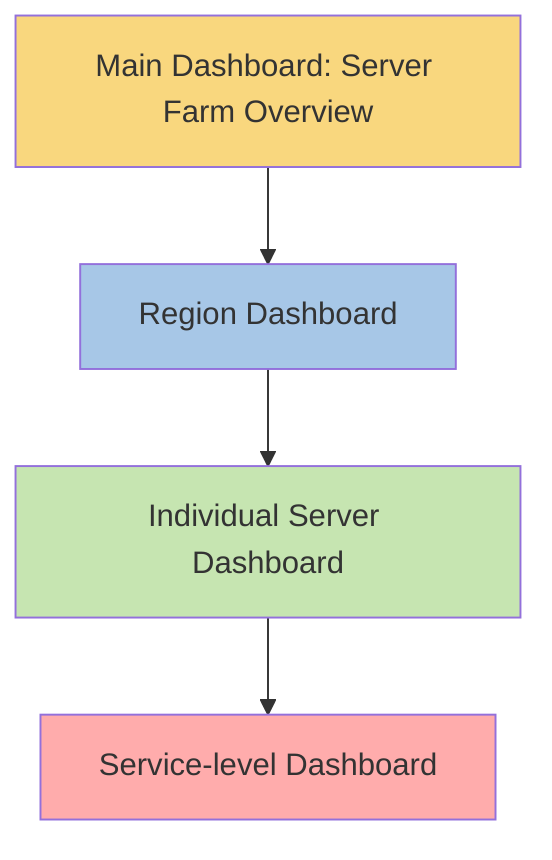

# Nested Visualizations

## Introduction

Nested visualizations in Grafana allow you to combine multiple visualization types within a single panel or to create hierarchical relationships between data displays. This powerful technique enables you to present complex data stories, allowing users to drill down from high-level overviews to detailed specifics without switching between dashboards.

In this guide, we'll explore how to create effective nested visualizations in Grafana, understand when to use them, and learn best practices for maintaining clarity when working with hierarchical data displays.

## What Are Nested Visualizations?

Nested visualizations refer to the practice of:

1. Embedding one visualization inside another
2. Creating linked visualizations with parent-child relationships
3. Building drill-down capabilities within dashboards

This approach is particularly useful when dealing with hierarchical data or when you need to present both summary and detailed information in a cohesive way.

## Types of Nested Visualizations in Grafana

### 1. Panel Within Panel

Grafana allows you to create advanced layouts where multiple visualization types work together within a single logical unit.

#### Example: Dashboard with Nested Stat Panels

```javascript
// Dashboard JSON snippet showing nested panels configuration
{
  "panels": [
    {
      "id": 1,
      "type": "row",
      "title": "System Overview",
      "panels": [
        {
          "id": 2,
          "type": "stat",
          "title": "CPU Usage",
          "targets": [
            {
              "expr": "avg(node_cpu_usage_percent)",
              "refId": "A"
            }
          ]
        },
        {
          "id": 3,
          "type": "stat",
          "title": "Memory Usage",
          "targets": [
            {
              "expr": "avg(node_memory_used_percent)",
              "refId": "A"
            }
          ]
        }
      ]
    }
  ]
}
```

### 2. Drill-Down Dashboards

One of the most common nested visualization patterns is creating drill-down capabilities that allow users to click on a high-level visualization to reveal more detailed information.

Let's create an example with a server infrastructure monitoring setup:



## Creating Your First Nested Visualization

Let's build a practical example of a nested visualization in Grafana that monitors an e-commerce application stack.

### Step 1: Create the Top-Level Dashboard

First, we'll create a dashboard that provides an overview of our entire application:

```javascript
// Top-level dashboard setup
{
  "title": "E-commerce Application Overview",
  "panels": [
    {
      "id": 1,
      "type": "stat",
      "title": "Active Users",
      "links": [
        {
          "title": "User Details",
          "url": "/d/user-details?${__url_time_range}"
        }
      ],
      "targets": [
        {
          "expr": "sum(active_users)",
          "refId": "A"
        }
      ]
    },
    {
      "id": 2,
      "type": "timeseries",
      "title": "Transaction Volume",
      "links": [
        {
          "title": "Transaction Details",
          "url": "/d/transaction-details?${__url_time_range}"
        }
      ],
      "targets": [
        {
          "expr": "sum(rate(transactions_total[5m]))",
          "refId": "A"
        }
      ]
    }
  ]
}
```

### Step 2: Create Drill-Down Dashboard

Now, let's create a drill-down dashboard for transaction details:

```javascript
// Transaction details dashboard
{
  "title": "Transaction Details",
  "panels": [
    {
      "id": 1,
      "type": "timeseries",
      "title": "Transactions by Type",
      "targets": [
        {
          "expr": "sum(rate(transactions_total[5m])) by (type)",
          "refId": "A"
        }
      ]
    },
    {
      "id": 2,
      "type": "piechart",
      "title": "Transaction Distribution",
      "targets": [
        {
          "expr": "sum(transactions_total) by (status)",
          "refId": "A"
        }
      ]
    }
  ]
}
```

### Step 3: Add Dashboard Variables for Filtering

To enhance our nested visualization experience, we'll add dashboard variables:

```javascript
// Dashboard variables configuration
{
  "templating": {
    "list": [
      {
        "name": "region",
        "type": "query",
        "datasource": "Prometheus",
        "query": "label_values(transactions_total, region)",
        "refresh": 1
      },
      {
        "name": "status",
        "type": "query",
        "datasource": "Prometheus",
        "query": "label_values(transactions_total{region=\"$region\"}, status)",
        "refresh": 1
      }
    ]
  }
}
```

## Advanced Nested Visualization Techniques

### Using Panel Links

Panel links are a powerful way to create relationships between visualizations:

```javascript
// Panel with detailed links to other dashboards
{
  "links": [
    {
      "title": "View Server Details",
      "url": "/d/server-details?var-server=${__cell_name}&${__url_time_range}",
      "targetBlank": false
    }
  ]
}
```

### Data Links for Point-Level Drill-Down

Data links allow users to click on specific data points to navigate to more detailed information:

```javascript
// Data link configuration
{
  "dataLinks": [
    {
      "title": "Show transaction details",
      "url": "/d/transaction-detail?var-transaction_id=${__value.raw}&${__url_time_range}",
      "targetBlank": true
    }
  ]
}
```

### Nested Tables with Expanding Rows

Tables can be configured to show nested information using expandable rows:

```javascript
// Table with expandable rows configuration
{
  "type": "table",
  "options": {
    "showHeader": true,
    "footer": {
      "show": true,
      "reducer": ["sum"],
      "fields": ["value"]
    }
  },
  "transformations": [
    {
      "id": "organize",
      "options": {
        "includeByName": {
          "Server": true,
          "Service": true,
          "Status": true,
          "Value": true
        }
      }
    }
  ],
  "fieldConfig": {
    "defaults": {
      "custom": {
        "displayMode": "color-background"
      }
    },
    "overrides": []
  }
}
```

## Real-World Example: Infrastructure Monitoring Dashboard

Let's create a complete example of a nested visualization system for infrastructure monitoring:

1. **Top Level**: Overall infrastructure health
2. **Second Level**: Cluster-specific metrics
3. **Third Level**: Node-specific metrics
4. **Fourth Level**: Service-specific metrics on a node

### Top Level Dashboard

```javascript
// Top level infrastructure dashboard
{
  "title": "Infrastructure Overview",
  "panels": [
    {
      "id": 1,
      "type": "stat",
      "title": "Clusters Health",
      "targets": [
        {
          "expr": "sum(cluster_health) by (status)",
          "refId": "A"
        }
      ],
      "links": [
        {
          "title": "View Clusters",
          "url": "/d/clusters-dashboard?${__url_time_range}"
        }
      ]
    },
    {
      "id": 2,
      "type": "gauge",
      "title": "Overall CPU Usage",
      "targets": [
        {
          "expr": "avg(node_cpu_usage_percent)",
          "refId": "A"
        }
      ]
    },
    {
      "id": 3,
      "type": "gauge",
      "title": "Overall Memory Usage",
      "targets": [
        {
          "expr": "avg(node_memory_used_percent)",
          "refId": "A"
        }
      ]
    }
  ]
}
```

The user can then click on "View Clusters" to drill down to specific clusters, and from there to specific nodes, and so on.

## Best Practices for Nested Visualizations

### 1. Maintain a Clear Hierarchy

When creating nested visualizations, maintain a logical hierarchy that guides users from general to specific information.

### 2. Consistent Navigation Cues

Use consistent visual cues to indicate where drill-downs are available:

```javascript
// Example of consistent styling for clickable elements
{
  "fieldConfig": {
    "defaults": {
      "color": {
        "mode": "thresholds"
      },
      "mappings": [],
      "thresholds": {
        "mode": "absolute",
        "steps": [
          {
            "color": "blue",
            "value": null
          }
        ]
      },
      "custom": {
        "cellOptions": {
          "type": "color-text",
          "mode": "basic"
        }
      }
    },
    "overrides": [
      {
        "matcher": {
          "id": "byName",
          "options": "Server"
        },
        "properties": [
          {
            "id": "custom.cellOptions",
            "value": {
              "type": "link",
              "linkTarget": "_self",
              "linkUrl": "/d/server-details?var-server=${__cell_name}&${__url_time_range}"
            }
          }
        ]
      }
    ]
  }
}
```

### 3. Breadcrumbs for Navigation

Implement breadcrumbs to help users understand their current position in the visualization hierarchy:

```javascript
// Dashboard with breadcrumbs configuration
{
  "links": [
    {
      "asDropdown": false,
      "icon": "external link",
      "includeVars": true,
      "keepTime": true,
      "tags": [],
      "targetBlank": false,
      "title": "↩ Back to Infrastructure Overview",
      "tooltip": "",
      "type": "link",
      "url": "/d/infrastructure-overview?${__url_time_range}"
    }
  ]
}
```

### 4. Consistent Time Ranges

Always pass time range parameters between dashboards to maintain context:

```javascript
// Example of a link with time range preservation
"/d/detailed-view?${__url_time_range}&var-server=${__cell_name}"
```

### 5. Limit Nesting Depth

Avoid creating too many levels of nesting (3-4 levels maximum) to prevent user confusion.

## Common Challenges and Solutions

### Challenge: Performance Issues with Complex Nesting

**Solution**: Use dashboard caching and optimize queries at each level.

```javascript
// Example of query optimization with pre-aggregation
{
  "targets": [
    {
      "expr": "avg by (cluster) (sum by (instance) (rate(node_cpu{mode!='idle'}[5m])) / sum by (instance) (rate(node_cpu[5m])))",
      "refId": "A"
    }
  ]
}
```

### Challenge: Maintaining Context Between Dashboards

**Solution**: Use template variables and URL parameters to maintain context.

```javascript
// Template variable that gets values from URL
{
  "templating": {
    "list": [
      {
        "name": "server",
        "type": "custom",
        "query": "${server:raw}",
        "current": {
          "text": "All",
          "value": "$__all"
        },
        "skipUrlSync": false
      }
    ]
  }
}
```

## Summary

Nested visualizations in Grafana provide a powerful way to present complex data hierarchies and relationships. By allowing users to drill down from high-level overviews to detailed specifics, you can create intuitive, interactive dashboards that tell a complete data story.

Key takeaways:
- Use nested visualizations to show relationships between different metrics
- Implement drill-down capabilities through panel links and data links
- Maintain a clear hierarchy with consistent navigation
- Remember to preserve context (like time ranges) between linked dashboards
- Limit nesting depth to avoid user confusion

## Exercises

1. Create a top-level dashboard showing overall system health with drill-down capabilities to component-level details.
2. Implement a nested table visualization that shows departments, teams, and individual team members' performance metrics.
3. Build a hierarchical visualization that starts with geographic regions and allows drilling down to cities, then to individual locations.

## Additional Resources

- Grafana Documentation: [Dashboard Links](https://grafana.com/docs/grafana/latest/dashboards/build-dashboards/manage-dashboard-links/)
- Grafana Documentation: [Data Links](https://grafana.com/docs/grafana/latest/panels-visualizations/configure-data-links/)
- Grafana Documentation: [Dashboard Variables](https://grafana.com/docs/grafana/latest/dashboards/variables/)