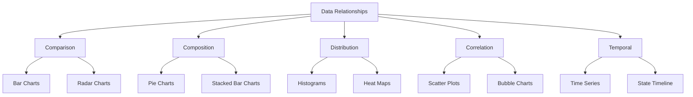
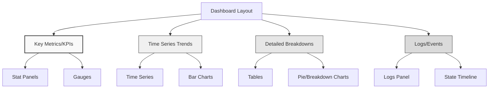

# Visualization Best Practices

## Introduction

Creating effective visualizations is both an art and a science. While Grafana offers a rich set of visualization options, knowing how to use them effectively can transform raw data into meaningful insights. This guide will walk you through best practices for creating visualizations in Grafana that are not only visually appealing but also communicate data clearly and effectively.

## Understanding Your Data

Before choosing a visualization type, it's crucial to understand the nature of your data and the story you want it to tell.

### Types of Data Relationships

<br />



### Matching Visualization to Purpose

| Data Relationship | Best Visualization Types | When to Use |
| ----------------- | ------------------------ | ----------- |
| Comparison | Bar/Column, Gauge, Stat | Comparing values across categories |
| Composition | Pie, Stacked Bar/Area | Showing parts of a whole |
| Distribution | Histogram, Heatmap | Understanding data spread |
| Correlation | Scatter Plot, XY Chart | Examining relationships between variables |
| Temporal | Time Series, State Timeline | Tracking changes over time |

## Color Usage in Visualizations

Colors play a critical role in data visualization. They can guide attention, represent values, and convey meaning.

### Color Best Practices

1. **Use consistent color schemes** across related visualizations
2. **Limit your palette** to 5-7 colors for better readability
3. **Consider color blindness** - use colorblind-friendly palettes
4. **Apply color purposefully** - highlight important data points
5. **Use sequential color schemes** for numeric ranges
6. **Use diverging color schemes** for data with meaningful midpoints

### Example: Setting Up a Color Blind Friendly Palette

In Grafana, you can set custom color palettes in the visualization options:

```javascript
// Custom color palette for color blind accessibility
const colorBlindFriendlyPalette = [
  '#003f5c', // Dark Blue
  '#58508d', // Purple
  '#bc5090', // Pink
  '#ff6361', // Red
  '#ffa600'  // Yellow
];

// Apply to visualization
panel.fieldConfig.defaults.custom.colors = colorBlindFriendlyPalette;
```

## Panel Design Principles

### Clarity and Simplicity

Every visualization should have a clear purpose and display only the information needed to fulfill that purpose.

#### Do's:
- Keep visualizations simple and focused
- Remove unnecessary grid lines, borders, and decorations
- Use appropriate scaling and units
- Include descriptive titles and legends

#### Don'ts:
- Avoid 3D charts (they distort data perception)
- Don't use too many visualizations in a single dashboard
- Avoid using pie charts for more than 5-7 categories
- Don't use excessive decimal places

### Example: Simplifying a Time Series Panel

Here's how you can configure a clean time series panel in Grafana:

```javascript
// Clean time series configuration
{
  "fieldConfig": {
    "defaults": {
      "custom": {
        "drawStyle": "line",
        "lineInterpolation": "smooth",
        "fillOpacity": 10,
        "showPoints": "never"
      },
      "decimals": 1,
      "unit": "percent"
    }
  },
  "options": {
    "legend": {
      "displayMode": "list",
      "placement": "bottom"
    },
    "tooltip": {
      "mode": "single",
      "sort": "none"
    }
  }
}
```

## Choosing the Right Visualization

### Time Series Data

Time series data is the most common type of data visualized in Grafana. The Time Series panel is highly versatile and can be configured in multiple ways.

**Best for:** Monitoring trends over time, detecting anomalies, and tracking system performance.

**Example config:**

```javascript
{
  "fieldConfig": {
    "defaults": {
      "custom": {
        "drawStyle": "line",
        "lineWidth": 2,
        "fillOpacity": 20,
        "gradientMode": "opacity"
      },
      "thresholds": {
        "mode": "absolute",
        "steps": [
          { "value": null, "color": "green" },
          { "value": 80, "color": "yellow" },
          { "value": 90, "color": "red" }
        ]
      }
    }
  }
}
```

This configuration creates a line chart with gradient fill, appropriate line thickness, and threshold colors to indicate warning and critical levels.

### Stat Panels for Key Metrics

Stat panels are perfect for displaying key performance indicators (KPIs) and important single values.

**Best for:** Displaying current values, showing percentage changes, and highlighting critical metrics.

**Example:**

```javascript
{
  "options": {
    "reduceOptions": {
      "values": false,
      "calcs": ["lastNotNull"],
      "fields": ""
    },
    "orientation": "horizontal",
    "textMode": "value_and_name",
    "colorMode": "value",
    "graphMode": "area",
    "justifyMode": "auto"
  }
}
```

### Bar Gauges for Thresholds

Bar Gauges are excellent for displaying values against thresholds or targets.

**Best for:** Resource utilization (CPU, memory, disk), SLA compliance, and progress tracking.

**Example:**

```javascript
{
  "options": {
    "orientation": "horizontal",
    "displayMode": "gradient",
    "showUnfilled": true
  },
  "fieldConfig": {
    "defaults": {
      "thresholds": {
        "mode": "percentage",
        "steps": [
          { "value": null, "color": "green" },
          { "value": 70, "color": "yellow" },
          { "value": 85, "color": "red" }
        ]
      },
      "min": 0,
      "max": 100,
      "unit": "percent"
    }
  }
}
```

## Layout and Organization

How you arrange visualizations on a dashboard impacts how effectively users can interpret the data.

### Dashboard Organization Principles

1. **Place related panels together**
2. **Organize by importance** (top-left to bottom-right)
3. **Use consistent sizes** for similar panel types
4. **Apply the F-pattern** for critical information (following natural eye movement)
5. **Group metrics by service or function**

### Example Dashboard Layout



## Handling Different Types of Data

### High-Cardinality Data

When dealing with data that has many unique values (high cardinality):

1. **Use filtering and aggregation** to reduce visual complexity
2. **Apply top-N queries** to show only the most significant values
3. **Consider using heatmaps** instead of line charts
4. **Implement dynamic drill-downs** for detailed exploration

### Example Query for Top-N Values:

```sql
SELECT
  metric_name,
  SUM(value) as total_value
FROM metrics
WHERE $__timeFilter(time_column)
GROUP BY metric_name
ORDER BY total_value DESC
LIMIT 5
```

### Sparse or Irregular Data

For data that isn't collected at regular intervals:

1. **Use appropriate null handling** (connected, null as zero)
2. **Consider bar charts** instead of line charts
3. **Apply smoothing** carefully and transparently
4. **Add annotations** to explain gaps or irregularities

## Crafting Effective Alerts and Thresholds

Visualization and alerting go hand in hand in monitoring environments.

### Threshold Best Practices

1. **Set meaningful thresholds** based on business impact
2. **Use consistent color coding** across dashboards
3. **Apply threshold bands** to show normal operating ranges
4. **Document threshold rationale** in panel descriptions
5. **Review and adjust thresholds** as systems evolve

### Example Threshold Configuration:

```javascript
{
  "thresholds": {
    "mode": "absolute",
    "steps": [
      { "value": null, "color": "green", "name": "Normal" },
      { "value": 100, "color": "yellow", "name": "Warning" },
      { "value": 200, "color": "orange", "name": "High" },
      { "value": 300, "color": "red", "name": "Critical" }
    ]
  }
}
```

## Accessibility Considerations

Creating visualizations that are accessible to all users is essential.

### Accessibility Tips

1. **Ensure sufficient color contrast**
2. **Don't rely solely on color** to convey information
3. **Add descriptive panel titles and descriptions**
4. **Use text alternatives where appropriate**
5. **Test with screen readers and keyboard navigation**

## Performance Optimization

Optimizing dashboard performance ensures a good user experience.

### Performance Tips

1. **Limit the number of panels** per dashboard (aim for 5-15)
2. **Use appropriate time intervals** in queries
3. **Apply data transformations** in the database when possible
4. **Configure reasonable refresh rates** (not too frequent)
5. **Use template variables** to filter data efficiently

### Example Efficient Query:

```sql
SELECT 
  time_column as time,
  AVG(value) as avg_value
FROM metrics
WHERE $__timeFilter(time_column)
  AND host IN ($host)
GROUP BY time_column
ORDER BY time_column
TIMEWINDOW($__interval)
```

## Real-World Example: System Monitoring Dashboard

Let's put everything together with a comprehensive example of a system monitoring dashboard following best practices:

1. **Top Section:** Stat panels showing current system status and health
2. **Middle Section:** Time series panels showing CPU, memory, disk, and network trends
3. **Bottom Section:** Detailed breakdowns and logs

### Panel Configuration Example (CPU Utilization Time Series):

```javascript
{
  "title": "CPU Utilization",
  "description": "Shows CPU usage percentage over time with warning thresholds at 70% and critical at 85%",
  "fieldConfig": {
    "defaults": {
      "unit": "percent",
      "min": 0,
      "max": 100,
      "custom": {
        "drawStyle": "line",
        "lineWidth": 2,
        "fillOpacity": 20,
        "pointSize": 0,
        "gradientMode": "opacity",
        "lineInterpolation": "smooth"
      },
      "thresholds": {
        "mode": "absolute",
        "steps": [
          { "value": null, "color": "green" },
          { "value": 70, "color": "yellow" },
          { "value": 85, "color": "red" }
        ]
      },
      "color": {
        "mode": "palette-classic"
      }
    }
  },
  "options": {
    "tooltip": {
      "mode": "multi",
      "sort": "desc"
    },
    "legend": {
      "displayMode": "table",
      "placement": "bottom",
      "calcs": ["mean", "max", "last"]
    }
  }
}
```

## Summary and Best Practices Checklist

Creating effective visualizations in Grafana requires thoughtful planning and design. Here's a checklist to ensure your visualizations follow best practices:

1. ✅ **Choose the right visualization type** for your data relationship
2. ✅ **Keep it simple** and focused on the key message
3. ✅ **Use color purposefully** and accessibly
4. ✅ **Set appropriate thresholds** based on business requirements
5. ✅ **Organize related panels** together
6. ✅ **Ensure consistency** across dashboards
7. ✅ **Add clear titles and descriptions**
8. ✅ **Optimize for performance**
9. ✅ **Consider all users' needs** including accessibility
10. ✅ **Regularly review and refine** visualizations

## Exercises

1. Create a dashboard that tells a story about a system's performance using at least three different visualization types.
2. Take an existing complex visualization and simplify it while maintaining the same information value.
3. Design a colorblind-friendly dashboard for monitoring a web application.
4. Create a set of visualizations that effectively show the relationship between system load and response time.

## Additional Resources

- **Grafana Documentation**: Check the official [Grafana documentation](https://grafana.com/docs/) for detailed information about visualization options.
- **Grafana Blog**: The [Grafana blog](https://grafana.com/blog/) regularly features articles about visualization best practices.
- **Books**: "Information Dashboard Design" by Stephen Few provides excellent guidance on dashboard design principles.
- **Community**: Join the [Grafana community](https://community.grafana.com/) to share and learn from other users' experiences.

Remember, the most effective visualizations evolve over time as you gather feedback and as your data needs change. Regular review and refinement are key parts of maintaining useful dashboards.