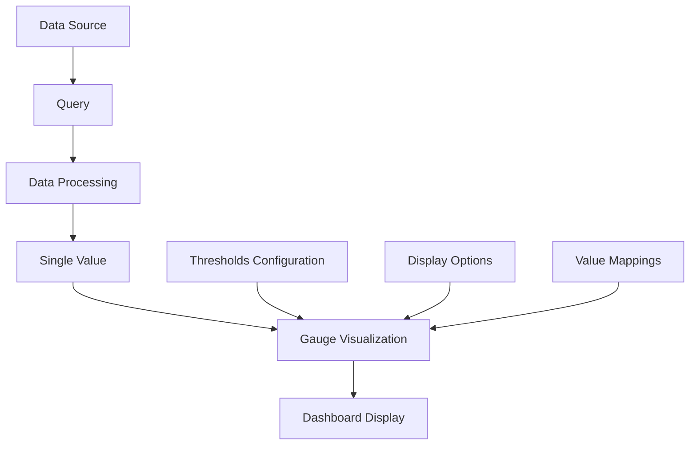

# Gauge Visualizations

## Introduction

Gauge visualizations in Grafana are powerful tools for displaying single-value metrics in a way that resembles physical gauges, such as speedometers or thermometers. They are particularly useful when you need to show how a measurement compares to minimum, maximum, and threshold values.

Gauges provide an intuitive representation of data, making them ideal for:
- Displaying system health indicators
- Showing progress toward goals or targets
- Visualizing capacity utilization
- Highlighting metrics that have predefined "good," "warning," and "critical" thresholds

In this tutorial, we'll explore how to create gauge visualizations in Grafana, customize their appearance, and apply them effectively in real-world monitoring scenarios.

## Types of Gauge Visualizations in Grafana

Grafana offers several types of gauge visualizations:

1. **Standard Gauge** - A traditional radial gauge that displays values on a curved scale
2. **Angular Gauge** - Similar to the standard gauge but with customizable start/end angles
3. **Bar Gauge** - A horizontal or vertical bar representation of gauge values
4. **Stat** - A simple numeric display that can use the same threshold colors as gauges

Let's explore each of these types in detail.

## Creating a Basic Gauge Visualization

To create a gauge visualization in Grafana:

1. Create a new dashboard or edit an existing one
2. Add a new panel
3. Select "Gauge" from the visualization options
4. Configure a query that returns a single value

Here's an example of how to set up a basic gauge:

```jsx
// This is pseudocode representing the configuration, not actual code you would write
const gaugeConfig = {
  type: 'gauge',
  query: 'SELECT last("cpu_usage_idle") FROM "cpu" WHERE time >= now() - 5m',
  min: 0,
  max: 100
};
```

## Customizing Your Gauge

### Setting Thresholds

Thresholds are one of the most important aspects of gauges. They allow you to visually indicate when a value falls into different ranges, typically representing "good," "warning," and "critical" states.

To add thresholds to your gauge:

1. In the panel editor, go to the "Field" tab
2. Find the "Thresholds" section
3. Add threshold values and assign colors to each range

For example, for CPU usage:

```jsx
const thresholds = [
  { value: 0, color: 'green' },    // 0-70% is green (good)
  { value: 70, color: 'orange' },  // 70-85% is orange (warning)
  { value: 85, color: 'red' }      // 85-100% is red (critical)
];
```

### Display Options

Grafana offers several options to customize the appearance of your gauge:

- **Show Threshold Labels** - Displays the threshold values on the gauge
- **Show Threshold Markers** - Adds visual markers at threshold points
- **Value Mapping** - Maps specific values to text (e.g., 0 = "Offline", 100 = "Fully Utilized")
- **Orientation** - For bar gauges, choose between vertical and horizontal layouts
- **Text Mode** - Display value, name, or both
- **Calculate** - Choose how to reduce the data (mean, max, min, last, etc.)

Here's how to configure some of these options:

```jsx
const displayOptions = {
  showThresholdLabels: true,
  showThresholdMarkers: true,
  orientation: 'horizontal', // For bar gauges
  textMode: 'value_and_name'
};
```

## Creating an Angular Gauge

Angular gauges allow you to set custom start and end angles for the gauge arc. This can be useful for creating specialized gauge designs.

To create an angular gauge:

1. Select the "Gauge" visualization
2. In the display options, adjust:
   - Start angle (typically 135°)
   - End angle (typically 45°)

Here's an example configuration:

```jsx
const angularGaugeOptions = {
  startAngle: 135,
  endAngle: 45
};
```

## Bar Gauge Example

Bar gauges are an alternative representation that display values as filled bars rather than dial-based gauges. They're especially useful when you want to display multiple metrics side by side.

To create a bar gauge:

1. Add a new panel
2. Select "Bar Gauge" from the visualization options
3. Configure your query and thresholds as described earlier
4. Choose between vertical or horizontal orientation

This is particularly effective when you want to monitor multiple related metrics:

```jsx
const multiMetricQuery = `
  SELECT 
    last("cpu_usage_user") as "User CPU",
    last("cpu_usage_system") as "System CPU",
    last("cpu_usage_iowait") as "I/O Wait"
  FROM "cpu" 
  WHERE time >= now() - 5m
`;
```

## Real-World Example: Server Resources Dashboard

Let's create a practical example of how you might use gauge visualizations in a server resources dashboard.

### CPU Utilization Gauge

```jsx
// Query to get the CPU utilization
const cpuQuery = 'SELECT 100 - mean("cpu_idle") AS "CPU Utilization" FROM "system" WHERE time >= now() - 5m GROUP BY time(5s) fill(null)';

// Gauge configuration
const cpuGauge = {
  min: 0,
  max: 100,
  thresholds: [
    { value: 0, color: 'green' },
    { value: 70, color: 'orange' },
    { value: 85, color: 'red' }
  ],
  unit: 'percent',
  decimals: 1
};
```

### Memory Usage Bar Gauge

```jsx
// Query to get memory utilization
const memoryQuery = 'SELECT mean("used_percent") AS "Memory Usage" FROM "mem" WHERE time >= now() - 5m GROUP BY time(5s) fill(null)';

// Bar gauge configuration
const memoryGauge = {
  min: 0,
  max: 100,
  thresholds: [
    { value: 0, color: 'green' },
    { value: 75, color: 'orange' },
    { value: 90, color: 'red' }
  ],
  orientation: 'horizontal',
  displayMode: 'gradient',
  unit: 'percent',
  decimals: 1
};
```

### Disk Space Utilization Gauge

```jsx
// Query to get disk utilization for multiple disks
const diskQuery = 'SELECT mean("used_percent") AS "Disk Usage" FROM "disk" WHERE time >= now() - 5m GROUP BY "path"';

// Gauge configuration with multiple fields
const diskGauge = {
  min: 0,
  max: 100,
  thresholds: [
    { value: 0, color: 'green' },
    { value: 80, color: 'orange' },
    { value: 90, color: 'red' }
  ],
  orientation: 'horizontal',
  displayMode: 'basic',
  unit: 'percent'
};
```

## Advanced Usage: Value Mapping

Value mapping allows you to display custom text instead of the raw values for specific ranges or exact values. This can make your gauges more informative at a glance.

For example, you might want to map server status values:

```jsx
const valueMappings = [
  { type: 'value', value: '0', display: 'Offline' },
  { type: 'range', from: '1', to: '30', display: 'Low' },
  { type: 'range', from: '31', to: '70', display: 'Medium' },
  { type: 'range', from: '71', to: '100', display: 'High' }
];
```

## Best Practices for Using Gauge Visualizations

To make the most effective use of gauge visualizations:

1. **Use gauges sparingly** - They work best for key metrics that need immediate attention
2. **Set appropriate thresholds** - Base them on established performance metrics for your systems
3. **Include context** - Use a descriptive title and tooltip to provide additional information
4. **Consider your audience** - Different users may need different threshold levels
5. **Choose the right type** - Standard gauges work well for single metrics, while bar gauges are better for comparisons
6. **Don't overload your dashboard** - Too many gauges can be visually overwhelming

## Gauge vs. Other Visualizations

When should you use a gauge instead of another visualization type?

### Use gauges when:
- You need to show a single metric against predefined thresholds
- The metric has a clear minimum and maximum value
- You want to emphasize how close a value is to critical thresholds

### Consider alternatives when:
- You need to show trends over time (use time series graphs)
- You're comparing many values (use bar charts or tables)
- You need to show relationships between metrics (use scatter plots)

## Visualizing Gauge Data Flow with Mermaid

Here's a diagram showing how data flows through a gauge visualization:



## Summary

Gauge visualizations in Grafana provide an intuitive way to display single-value metrics and their relationship to thresholds. They're particularly effective for monitoring system health, tracking progress toward goals, and highlighting metrics that require attention.

Key points to remember:
- Gauges are best for single metrics with defined min/max values and thresholds
- Multiple gauge types are available (standard, angular, bar gauge)
- Thresholds help users quickly identify problematic values
- Value mappings can provide additional context
- Use gauges sparingly for maximum impact

## Practice Exercises

1. Create a dashboard with CPU, memory, and disk usage gauges for a server
2. Set up appropriate thresholds based on best practices for system monitoring
3. Try different gauge types to see which one communicates your data most effectively
4. Create a gauge that uses value mappings to display status information
5. Build a dashboard that combines gauges with time series to show both current state and historical trends

## Additional Resources

- [Grafana Gauge Panel Documentation](https://grafana.com/docs/grafana/latest/panels/visualizations/gauge-panel/)
- [Grafana Bar Gauge Panel Documentation](https://grafana.com/docs/grafana/latest/panels/visualizations/bar-gauge-panel/)
- [Grafana Stat Panel Documentation](https://grafana.com/docs/grafana/latest/panels/visualizations/stat-panel/)
- [Grafana Thresholds Documentation](https://grafana.com/docs/grafana/latest/panels/thresholds/)
- [Dashboard Best Practices](https://grafana.com/docs/grafana/latest/best-practices/dashboard-best-practices/)