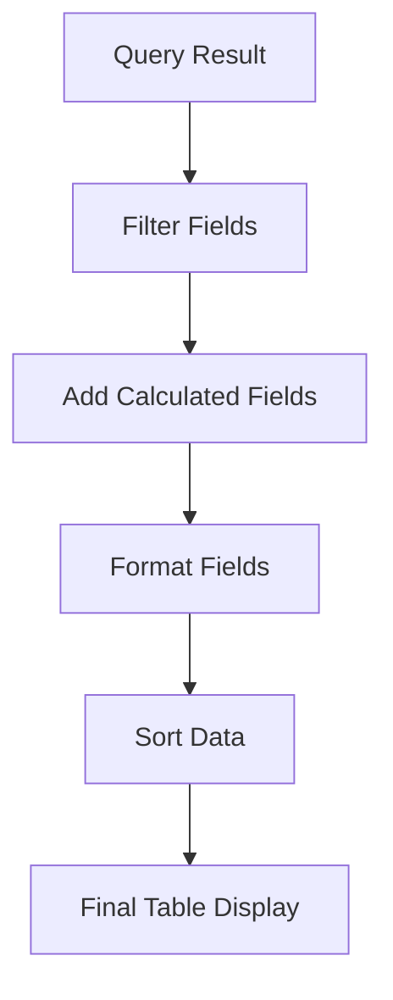

# Tables

## Introduction

Tables are one of the most fundamental and versatile visualization types in Grafana. While other visualizations like graphs and gauges transform your data into visual representations, tables present data in its raw, structured format. Tables allow you to display rows of data with multiple columns, making them ideal for showing precise values, comparing multiple metrics, and presenting detailed records.

In this guide, you'll learn how to create table visualizations in Grafana, customize their appearance, and implement advanced table features to effectively display your structured data.

## When to Use Tables

Tables are particularly useful when:

- You need to show exact numeric values rather than visual representations
- You want to compare multiple related metrics side by side
- You're displaying data that naturally fits into a row/column structure
- You need to show detailed records or logs with multiple dimensions
- You want to allow users to sort, filter, or paginate through larger datasets

## Creating Your First Table Visualization

### Basic Setup

Let's start by creating a simple table visualization:

1. Create a new dashboard or edit an existing one
2. Add a new panel
3. In the query editor, create a query that returns multiple columns of data
4. In the visualization options, select "Table"

```sql
-- Example query for a PostgreSQL data source
SELECT 
  time, 
  hostname, 
  cpu_usage, 
  memory_usage, 
  disk_usage 
FROM server_metrics 
WHERE time > NOW() - INTERVAL '1 day'
ORDER BY time DESC
```

By default, Grafana will display all returned columns in your table, but you can customize which fields are shown and how they appear.

## Table Configuration Options

### Field Options

Once you've created a table, you can configure how each field (column) is displayed:

#### Column Visibility and Order

1. Go to the Field tab in the panel editor
2. Use the "Organize fields" section to:
   - Show/hide specific columns
   - Reorder columns by dragging them
   - Rename columns using the display name property

#### Column Width and Alignment

For each field, you can set:

- **Column width**: Fixed width (in pixels) or auto-sized
- **Column alignment**: Left, center, or right alignment
- **Text alignment**: How text is aligned within cells

```javascript
// Example field configuration (in code editor)
{
  "fieldConfig": {
    "defaults": {},
    "overrides": [
      {
        "matcher": {
          "id": "byName",
          "options": "cpu_usage"
        },
        "properties": [
          {
            "id": "custom.width",
            "value": 120
          },
          {
            "id": "custom.align",
            "value": "center"
          }
        ]
      }
    ]
  }
}
```

### Cell Styling and Formatting

Tables in Grafana support rich formatting options:

#### Value Formatting

Apply standard Grafana units and decimals to numeric columns:

1. Select the field you want to format
2. Choose the appropriate unit (percent, bytes, seconds, etc.)
3. Set decimal precision

#### Cell Coloring

Apply color to cells based on their values:

1. Select the field you want to color
2. Add a "Color scheme" override
3. Choose a color mode:
   - **Single color**: All cells use the same color
   - **Threshold**: Colors based on value thresholds
   - **Classic palette**: Colors from a fixed palette
   - **Green-Yellow-Red (by value)**: Colors based on value range

Here's how to set up threshold-based coloring:

1. Select your field (e.g., "cpu_usage")
2. Add "Standard options" > "Color scheme" override
3. Select "Thresholds" mode
4. Define thresholds and colors:

```javascript
{
  "thresholds": {
    "mode": "absolute",
    "steps": [
      { "color": "green", "value": null },
      { "color": "yellow", "value": 70 },
      { "color": "red", "value": 90 }
    ]
  }
}
```

### Cell Display Options

Grafana tables support various ways to display cell content:

- **Plain text**: Simple text display
- **Colored text**: Text with color based on value
- **Colored background**: Cell background with color based on value
- **Gauge**: Mini gauge within the cell
- **Bar gauge**: Horizontal bar representing the value
- **JSON view**: Formatted display of JSON data
- **Image**: Display an image URL as an actual image

To configure a cell display mode:

1. Select the field
2. Add a "Table cell display mode" override
3. Choose your preferred display mode

## Advanced Table Features

### Cell Actions

You can configure cells to support actions when clicked:

1. Go to the "Cell actions" tab
2. Add a new action, such as:
   - **URL**: Open an external URL (can include variable substitution)
   - **Dashboard drilldown**: Navigate to another dashboard
   - **Panel drilldown**: Focus on a specific panel

Example URL action (linking to a server details page):

```
https://server-details.example.com/${__data.fields.hostname}
```

### Pagination

For tables with many rows, Grafana provides pagination options:

1. Go to the "Table options" tab
2. Configure:
   - **Pagination**: Enable/disable pagination
   - **Rows per page**: Number of rows to display per page

### Sorting

Users can sort the table by clicking on column headers. You can also configure default sorting:

1. Go to the "Table options" tab
2. Set "Sort by" to your preferred column
3. Choose ascending or descending order

### Filtering

Grafana tables support column filtering:

1. Go to the "Table options" tab  
2. Enable "Column filter"

With column filtering enabled, users can click the filter icon in column headers to filter data.

## Real-World Examples

### Example 1: Server Monitoring Dashboard

Let's create a table showing server performance metrics:

```sql
SELECT 
  hostname, 
  status,
  cpu_usage, 
  memory_usage, 
  disk_usage,
  uptime_days,
  last_reboot_time
FROM server_status
```

Configuration:
- Color the status column (green for "online", red for "offline")
- Add bar gauges for CPU, memory, and disk usage
- Right-align numeric columns
- Add cell action to drill down to server detail dashboard

### Example 2: Financial Transactions Table

```sql
SELECT 
  transaction_id,
  transaction_time,
  user_id,
  transaction_type,
  amount,
  status
FROM financial_transactions
WHERE transaction_time > NOW() - INTERVAL '7 days'
ORDER BY transaction_time DESC
```

Configuration:
- Color-code amounts (negative red, positive green)
- Format the amount column with currency unit
- Style the status column with colored text
- Enable pagination with 15 rows per page
- Add cell action to transaction details page

## Creating Dynamic Tables with Variables

Grafana tables become even more powerful when combined with dashboard variables:

```sql
SELECT 
  application, 
  environment,
  error_count, 
  warning_count
FROM application_logs
WHERE time > $__timeFrom AND time < $__timeTo
AND environment IN ($environment)
GROUP BY application, environment
ORDER BY error_count DESC
```

This query lets users filter the table by selecting different environments using dashboard variables.

## Table Transformations

Grafana provides data transformations that are especially useful for tables:

### Organizing Data with Transformations

1. Go to the "Transform" tab in the panel editor
2. Add transformations like:
   - **Filter by name**: Show only specific fields
   - **Organize fields**: Reorder and rename fields
   - **Group by**: Group rows by a specific field
   - **Sort by**: Order rows by field values

### Example: Calculating New Fields

Use the "Add field from calculation" transformation to create new columns:

1. Add the transformation
2. Select "Binary operation"
3. Choose fields and operation (e.g., divide memory_used by memory_total to get percentage)



## Best Practices for Tables

1. **Keep it focused**: Include only the most relevant columns to avoid information overload
2. **Use meaningful column names**: Rename technical field names to be user-friendly
3. **Apply appropriate formatting**: Format numbers, dates, and percentages for readability
4. **Use color sparingly**: Color-code only the most important status indicators
5. **Enable pagination for large datasets**: Don't try to show too many rows at once
6. **Add column filtering for exploratory analysis**: Let users find what they need
7. **Consider alternatives**: For trends or patterns, a graph might be better than a table

## Troubleshooting Common Issues

### Table Shows "No data"

- Verify your query returns data for the selected time range
- Check for any filters that might be excluding all data
- Look at the raw query result in the query inspector

### Column Is Missing

- Check if the column is hidden in field configuration
- Verify the query includes the column
- Look for transformations that might be removing the column

### Formatting Not Applied

- Ensure you've added overrides to the correct field
- Check that the override is properly configured
- Verify the data type matches your formatting (e.g., numeric formatting won't work on text)

## Summary

Table visualizations in Grafana provide a powerful way to display structured data in its raw form. They excel at showing precise values, comparing multiple metrics, and displaying detailed records. With Grafana's rich formatting and interaction options, tables can be customized to highlight important information, allowing users to sort, filter, and drill down into the data.

By following the techniques in this guide, you'll be able to create effective table visualizations that present your data clearly and enable users to extract valuable insights.

## Further Learning

- Explore other visualization types that complement tables
- Learn about dashboard variables to make your tables more dynamic
- Study data transformations to reshape and enhance your table data
- Practice creating tables with different data sources