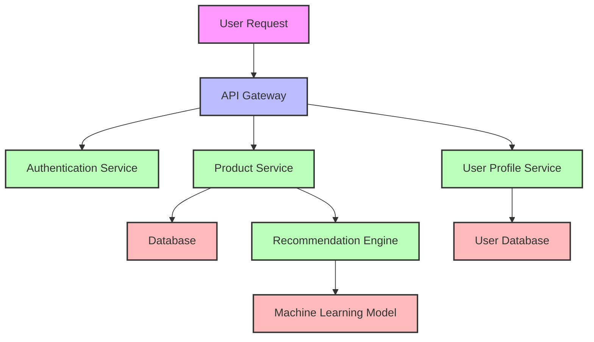
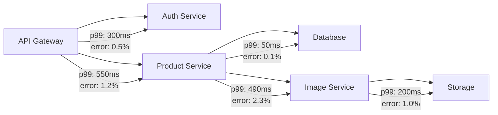

# Traces Visualization

## Introduction

Traces visualization is a powerful feature in Grafana that helps you understand and troubleshoot complex, distributed systems. In modern microservices architectures, a single user request might travel through dozens of different services before a response is generated. Traces provide a way to visualize the journey of these requests across your system, making it easier to identify performance bottlenecks, errors, and other issues.

In this guide, we'll explore how to use Grafana's Traces visualization panel to effectively analyze trace data, understand request flows, and optimize your applications.

## What Are Traces?

Before diving into visualization, let's understand what traces actually are:

- A **trace** represents the complete journey of a request through your distributed system
- A trace consists of multiple **spans**, where each span represents work done by a single service or component
- Spans contain metadata such as duration, start time, end time, and service name
- Spans have parent-child relationships that show the request flow

Here's a conceptual view of how traces work:



## Setting Up Trace Visualization in Grafana

### Prerequisites

To use traces visualization in Grafana, you need:

1. A Grafana instance (v7.0 or newer)
2. A data source that supports traces, such as:
   - Tempo
   - Jaeger
   - Zipkin
   - X-Ray
   - OpenTelemetry

### Configuring a Trace Data Source

Let's set up Tempo as an example:

1. Navigate to Configuration → Data Sources
2. Click "Add data source"
3. Search for and select "Tempo"
4. Configure the connection:

```javascript
{
  "url": "http://tempo:3100",
  "auth": {
    "type": "none"  // or configure appropriate authentication
  },
  "nodeGraph": {
    "enabled": true  // enables the node graph visualization
  }
}
```

## Creating a Traces Dashboard

Now that we have our data source configured, let's create a dashboard to visualize trace data:

1. Create a new dashboard
2. Add a new panel
3. Select your trace data source (e.g., Tempo)
4. Choose the "Traces" visualization type

The Traces panel is specifically designed to display and analyze distributed trace data, showing the hierarchical relationship between spans.

## Understanding the Traces Visualization Interface

The Traces visualization in Grafana consists of several key components:

### 1. Trace List

The trace list displays available traces matching your query criteria, typically showing:

- Trace ID
- Root service name
- Total trace duration
- Number of spans
- Error status

### 2. Trace View

When you select a trace from the list, the trace view shows:

- A **timeline** displaying spans as horizontal bars, with:
  - Length representing duration
  - Position showing start time relative to the trace start
  - Color indicating service/component
- A **span details** section showing metadata when a span is selected
- **Service breakdown** information

### 3. Node Graph (if enabled)

The node graph provides a topological view of services and their interactions:

- Nodes represent services
- Edges represent calls between services
- Node size can represent request volume or duration

## Working with Trace Visualizations

Let's explore how to use traces effectively:

### Querying Traces

To find relevant traces, you can use various query parameters:

```javascript
{
  "limit": 20,
  "query": "service.name=api-gateway",
  "filters": [
    {"tag": "http.status_code", "operator": "=", "value": "500"},
    {"tag": "duration", "operator": ">", "value": "100ms"}
  ]
}
```

This query would find the 20 most recent traces from the API gateway service that returned a 500 error and took longer than 100ms.

### Analyzing Span Details

When you click on a span in the trace view, you'll see detailed information such as:

- Service name
- Operation name
- Start time and duration
- Tags (key-value metadata)
- Logs
- Process information

### Common Analysis Techniques

Here are some effective ways to use traces:

1. **Identifying bottlenecks**:
   - Look for spans with unusually long durations
   - Check if particular services consistently take longer than others

2. **Error investigation**:
   - Filter for traces containing error spans
   - Examine span logs and tags to understand error causes

3. **Service dependencies**:
   - Use the node graph to visualize service interactions
   - Identify critical paths and potential single points of failure

## Practical Example: Troubleshooting High Latency

Let's walk through a practical example of using traces to troubleshoot high latency in a web application:

1. **Identify slow requests**:
   
   Create a query to find traces with high overall duration:

   ```javascript
   {
     "limit": 10,
     "filters": [
       {"tag": "http.method", "operator": "=", "value": "GET"},
       {"tag": "http.route", "operator": "=", "value": "/products/:id"},
       {"tag": "duration", "operator": ">", "value": "500ms"}
     ]
   }
   ```

2. **Analyze the trace timeline**:

   In our example trace, we might see:
   ```
   [GET /products/:id] 600ms
     ├─ [Authentication] 50ms
     ├─ [Product Service] 530ms
     │   ├─ [Database Query] 30ms
     │   └─ [Image Processing] 490ms
     └─ [Response Generation] 20ms
   ```

3. **Identify the bottleneck**:
   
   From the visualization, it's clear that the image processing step is taking the majority of the time.

4. **Investigate span details**:
   
   Clicking on the Image Processing span reveals:
   ```
   Tags:
     - image.size: 5MB
     - image.format: PNG
     - processing.type: resize
   Logs:
     - Loading image into memory
     - Resizing to 800x600
     - Converting to WebP format
     - Saving processed image
   ```

5. **Form a hypothesis**:
   
   Based on the trace data, we might hypothesize that processing large PNG images is causing the latency.

6. **Validate and fix**:
   
   We could implement image format optimization and caching, then use trace visualization again to confirm the improvement.

## Advanced Features

### Trace Comparison

Grafana allows you to compare two traces side by side, which is useful for:
- Before/after comparisons when optimizing performance
- Comparing successful requests against failed ones
- Understanding variations in request patterns

To compare traces:
1. Select a trace
2. Click "Compare with..."
3. Select another trace for comparison

### Service Graph

The service graph visualization builds upon trace data to show relationships between services:



This visualization helps identify:
- Service dependencies
- Performance characteristics of service-to-service communication
- Error rates between services

## Best Practices for Trace Visualization

1. **Use consistent span naming** to make traces more readable
2. **Add relevant tags** to spans for better filtering and context
3. **Implement sampling strategies** to reduce data volume while preserving important traces
4. **Correlate traces with logs and metrics** for complete observability
5. **Set up alerts** based on trace duration or error counts

## Summary

Traces visualization in Grafana is a powerful tool for understanding and troubleshooting distributed systems. By visualizing the journey of requests through your services, you can:

- Identify performance bottlenecks
- Debug errors and exceptions
- Understand service dependencies
- Optimize system performance
- Improve overall application reliability

Effective use of trace visualization requires proper instrumentation of your applications, a good understanding of your system architecture, and familiarity with the Grafana trace visualization interface.

## Additional Resources

- Explore OpenTelemetry for instrumenting your applications
- Learn about exemplars to connect metrics and traces
- Practice analyzing traces from open-source demo applications

## Exercises

1. Configure a Tempo data source in your Grafana instance
2. Create a dashboard with a Traces panel and explore available trace data
3. Identify the service with the highest latency in a sample trace
4. Compare a fast trace with a slow trace for the same endpoint and identify differences
5. Use span tags to filter traces for a specific user or customer