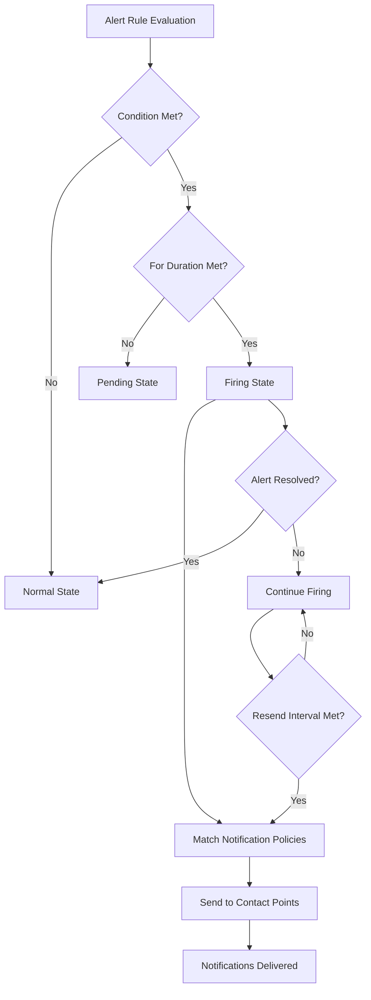

# Alerting Overview

## Introduction

Monitoring systems like Grafana are essential for observing the health and performance of your applications and infrastructure. However, simply visualizing data isn't enough - you need to know when something requires attention. This is where **Grafana Alerting** comes in.

Grafana Alerting is a powerful, unified alerting system that enables you to:

- Define conditions that trigger alerts based on your metrics, logs, and other data sources
- Notify the right people or systems when problems occur
- Manage and track the lifecycle of alerts
- Create and enforce consistent alerting policies across your entire organization

Whether you're monitoring server CPU usage, API response times, business KPIs, or complex system behaviors, Grafana Alerting provides the tools to detect, notify, and respond to critical conditions in your environment.

## Key Concepts in Grafana Alerting

Before diving into the details, let's understand the fundamental components of Grafana Alerting:

### Alert Rules

Alert rules are the core of the alerting system. Each rule:

- Defines a condition to evaluate (e.g., "CPU usage > 90% for 5 minutes")
- Specifies how frequently to evaluate the condition
- Determines the severity and other metadata for triggered alerts
- Can generate one or multiple alerts based on the data being evaluated

Here's a simple example of an alert rule definition in YAML:

```yaml
groups:
  - name: server-health
    rules:
    - alert: HighCPULoad
      expr: avg by(instance) (cpu_usage_percent) > 90
      for: 5m
      labels:
        severity: warning
      annotations:
        summary: High CPU load on {{ $labels.instance }}
        description: CPU load is above 90% for 5 minutes on {{ $labels.instance }}
```

### Alert States

Alerts move through various states as they're evaluated:

- **Normal**: The condition is not met; everything is working as expected
- **Pending**: The condition is met, but hasn't been true for long enough to trigger (waiting for the `for` duration)
- **Firing**: The condition has been met for the required duration and the alert is active
- **NoData**: The query returned no data to evaluate
- **Error**: There was a problem evaluating the alert rule

### Alert Instances

A single alert rule can generate multiple alert instances. For example, a rule that monitors CPU usage across 10 servers could generate 10 separate alerts - one for each server that exceeds the threshold.

### Contact Points

Contact points define where notifications should be sent when alerts fire. Grafana supports numerous notification channels, including:

- Email
- Slack
- PagerDuty
- WebHooks
- Microsoft Teams
- Discord
- And many more

### Notification Policies

Notification policies determine:

- Which contact points receive notifications for specific alerts
- How alerts are grouped
- When to send notifications (including muting times)
- How often to resend notifications for unresolved alerts

### Silences

Silences temporarily prevent notifications for matching alerts without modifying the underlying alert rules. They're useful for:

- Planned maintenance periods
- Preventing notification storms during known issues
- Temporarily muting specific alerts while investigating

## The Alert Evaluation Process

Let's walk through the lifecycle of an alert in Grafana:



1. The alert rule is evaluated at its configured interval
2. If the condition is met, the alert transitions to `Pending` state
3. If the condition remains true for the duration specified in the `for` field, the alert transitions to `Firing`
4. When an alert begins firing:
   - Notification policies are evaluated to determine which contact points to notify
   - Notifications are sent according to policy settings
   - The alert stays in `Firing` state until the condition is no longer true
   - If configured, reminder notifications may be sent at specified intervals

## Setting Up Your First Alert Rule

Let's create a simple alert rule to monitor high CPU usage on a server:

### Through the Grafana UI

1. Navigate to **Alerting** in the left sidebar
2. Click **Alert Rules** and then **New alert rule**
3. Configure the query to retrieve CPU usage data:

```sql
SELECT mean("usage_idle") 
FROM "cpu" 
WHERE $timeFilter 
GROUP BY time($__interval), "host" 
```

4. Set the condition: `WHEN last() OF A IS BELOW 10`
5. Set evaluation behavior:
   - Evaluate every: `1m`
   - For: `5m`
6. Add alert details:
   - Rule name: `High CPU Usage`
   - Folder: `Server Health`
   - Severity: `warning`
   - Summary: `High CPU usage on {{ $labels.host }}`
7. Click **Save** to create the alert rule

### Using the Grafana API

You can also create alert rules programmatically:

```bash
curl -X POST -H "Content-Type: application/json" \
  -H "Authorization: Bearer YOUR_API_KEY" \
  --data '{
    "folderUid": "server-health",
    "ruleGroup": "cpu",
    "title": "High CPU Usage",
    "condition": "C",
    "data": [
      {
        "refId": "A",
        "queryType": "timeSeriesQuery",
        "datasourceUid": "INFLUXDB_UID",
        "model": {
          "query": "SELECT mean(\"usage_idle\") FROM \"cpu\" WHERE $timeFilter GROUP BY time($__interval), \"host\"",
          "rawQuery": true
        }
      },
      {
        "refId": "B",
        "queryType": "reduce",
        "datasourceUid": "__expr__",
        "model": {
          "expression": "A",
          "reducer": "last",
          "type": "reduce"
        }
      },
      {
        "refId": "C",
        "queryType": "threshold",
        "datasourceUid": "__expr__",
        "model": {
          "expression": "B",
          "type": "threshold",
          "evaluator": {
            "params": [10, 0],
            "type": "lt"
          }
        }
      }
    ],
    "noDataState": "NoData",
    "execErrState": "Error",
    "for": "5m",
    "annotations": {
      "summary": "High CPU usage detected"
    },
    "labels": {
      "severity": "warning"
    }
  }' \
  https://your-grafana-instance/api/v1/provisioning/alert-rules
```

## Configuring Notification Channels

To ensure the right people are notified when alerts fire, you'll need to set up contact points and notification policies:

### Contact Point Example (Slack)

1. Navigate to **Alerting > Contact points**
2. Click **New**
3. Enter a name like `team-slack`
4. Select `Slack` as the integration
5. Configure the Slack settings:
   - Webhook URL: `https://hooks.slack.com/services/T00000000/B00000000/XXXXXXXX`
   - Channel name: `#alerts`
6. Click **Save contact point**

### Notification Policy Example

1. Navigate to **Alerting > Policies**
2. Edit the default policy or create a new one
3. Set matching labels (e.g., `team=backend`)
4. Set the contact point (e.g., `team-slack`)
5. Configure grouping (e.g., group by `alertname, instance`)
6. Set timing options (e.g., group wait: `30s`, group interval: `5m`, repeat interval: `4h`)
7. Save your policy

## Best Practices for Effective Alerting

### 1. Alert on Symptoms, Not Causes

Focus your alerts on user-impacting issues rather than internal metrics that might not affect service:

✅ DO: "API response time > 2 seconds"
❌ DON'T: "Database connection pool at 80% capacity"

### 2. Use Appropriate Thresholds

Set thresholds that balance between:
- Catching real issues early enough to prevent impact
- Avoiding false positives that lead to alert fatigue

### 3. Include Actionable Information

Alert notifications should include:
- What happened and when
- Which service/component is affected
- Severity and impact
- Links to dashboards or runbooks
- Potential resolution steps

### 4. Implement Alert Severity Levels

Use consistent severity levels across all alerts:

- **Critical**: Service is down or severely degraded, requires immediate attention
- **Warning**: Service is degraded or approaching critical thresholds, needs investigation soon
- **Info**: Non-urgent information that might require attention eventually

### 5. Test Your Alerts

Regularly test alert rules to ensure they:
- Fire when expected
- Deliver notifications to the right people
- Contain useful information for troubleshooting

## Grafana Alerting vs. Other Solutions

Grafana Alerting offers several advantages over other alerting systems:

| Feature | Grafana Alerting | Traditional Solutions |
|---------|------------------|------------------------|
| Data Sources | Works with any data source | Often limited to specific data formats |
| UI Integration | Tightly integrated with dashboards | Typically separate systems |
| Expression Engine | Powerful multi-stage evaluation | Often limited to simple thresholds |
| Contact Points | Extensive notification options | Usually more limited |
| Multi-dimensional | Alert on multiple dimensions simultaneously | Often one-dimensional |

## Summary

Grafana Alerting provides a comprehensive system for detecting issues in your infrastructure and applications and notifying the right people at the right time. By understanding the key components—alert rules, instances, contact points, and notification policies—you can build an effective alerting strategy that helps maintain the reliability of your systems.

As you get more comfortable with Grafana Alerting, you can explore advanced features like multi-dimensional alerts, custom templates for notifications, and integrating alerts with your existing incident management workflows.

## Additional Resources

- [Grafana Alerting Documentation](https://grafana.com/docs/grafana/latest/alerting/)
- [Alert Rule API](https://grafana.com/docs/grafana/latest/developers/http_api/alerting_provisioning/)
- [Notification Templates Reference](https://grafana.com/docs/grafana/latest/alerting/manage-notifications/template-notifications/)

## Exercise

Try creating an alert rule that:
1. Monitors the error rate of an API endpoint
2. Triggers when the 5-minute error rate exceeds 1%
3. Includes information about which endpoint is failing
4. Sends notifications to both Slack and email

Then test your alert by temporarily increasing the error rate to ensure the alert fires and notifications are delivered correctly.