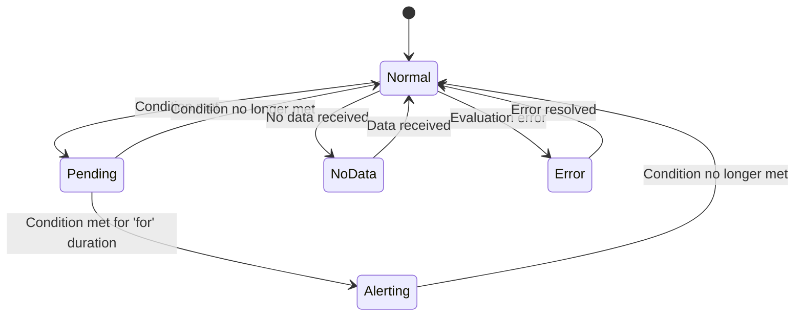

# Alert Rules

## Introduction

Alert rules are the core building blocks of Grafana's alerting system. They define the conditions under which an alert should fire, helping you monitor your systems and applications effectively. Whether you're watching for high CPU usage, monitoring API response times, or tracking business metrics, alert rules enable you to detect problems early and respond before they impact your users.

In this guide, we'll explore how to create, configure, and manage alert rules in Grafana, along with best practices to help you build an effective alerting strategy.

## What are Alert Rules?

Alert rules in Grafana are definitions that specify:

1. **What** to monitor (metrics, logs, or other data)
2. **When** to trigger an alert (the conditions)
3. **How** the alert should behave (evaluation frequency, notification policies)

Each alert rule evaluates your data against defined conditions and changes state (Normal, Pending, Alerting, No Data, or Error) based on the evaluation results.

## Types of Alert Rules

Grafana supports three types of alert rules:

### 1. Grafana-managed rules

These rules are created and managed entirely within Grafana's UI:

- They can query any data source
- They support multi-dimensional alerting
- They offer enhanced configuration options

### 2. Data source-managed rules (Prometheus, Loki, Mimir, etc.)

These rules are stored in the respective data source:

- They use the native alerting capabilities of the data source
- They're edited in Grafana but stored and evaluated by the underlying data source

### 3. Recording rules

These special rules don't generate alerts but pre-compute frequently used expressions:

- They improve query performance
- They simplify complex expressions
- They're stored in the data source (similar to data source-managed rules)

## Creating Alert Rules

Let's walk through the process of creating a Grafana-managed alert rule:

### Step 1: Access the Alert Rules page

Navigate to **Alerting → Alert rules** and click the **New alert rule** button.

### Step 2: Choose rule type

Select **Grafana managed alert** to create a rule managed entirely within Grafana.

### Step 3: Define your queries and expressions

```js
// Example query for monitoring CPU usage
A = query(
  datasource: 'Prometheus',
  expr: 'avg by(instance) (node_cpu_seconds_total{mode="idle"})',
  instant: false
)

// Expression to calculate CPU usage percentage
B = expression(
  refId: 'B',
  type: 'math',
  expression: '100 - ($A * 100)',
  reducer: 'last',
  settings: {}
)
```

### Step 4: Set alert conditions

Define when the alert should trigger:

```js
// Alert when CPU usage exceeds 80%
condition = B > 80
```

### Step 5: Configure alert rule details

Add essential information:

- **Rule name**: "High CPU Usage"
- **Folder**: "Server Monitoring"
- **Group**: "Resource Alerts"
- **Evaluation interval**: "1m" (check every minute)
- **Evaluation group interval**: "1m" (all rules in this group evaluate together)

### Step 6: Add annotations and labels

Annotations provide context, while labels help route the alert to notification policies:

```js
// Annotations (for human context)
annotations: {
  summary: "High CPU usage detected",
  description: "CPU usage for {{ $labels.instance }} is {{ $value | printf '%.2f' }}%"
}

// Labels (for routing and grouping)
labels: {
  severity: "warning",
  category: "resources",
  team: "infrastructure"
}
```

### Step 7: Save the rule

Click **Save** to create your alert rule. Grafana will start evaluating it based on your configured interval.

## Alert Rule States

Alert rules can be in one of several states:

- **Normal**: The condition is not met, everything is working as expected
- **Pending**: The condition is met but hasn't been met long enough to trigger an alert
- **Alerting**: The condition has been met for the required duration and the alert is active
- **No Data**: No data is being received
- **Error**: There was an error during evaluation

Here's a state transition diagram:



## Multi-dimensional Alerting

Grafana's alerting system supports multi-dimensional alerts, allowing a single rule to generate multiple alerts based on labels.

For example, a single alert rule monitoring CPU across multiple servers might generate separate alerts for each server:

```js
// Multi-dimensional query
query(
  datasource: 'Prometheus',
  expr: 'avg by(instance) (rate(node_cpu_seconds_total{mode!="idle"}[5m]) * 100)'
)

// This creates separate alerts for each 'instance' label
```

Each unique combination of labels creates a separate alert instance.

## Alert Rule Expressions

Grafana provides several expression types to build powerful alert conditions:

### Math Expressions

Perform calculations on query results:

```js
// Convert error rate to percentage
100 * (errors_total / requests_total)
```

### Reduce Expressions

Reduce multiple values to a single value:

```js
// Get the maximum value from a time series
reduce(B, 'max')
```

### Threshold Expressions

Compare values against thresholds:

```js
// Check if value exceeds threshold
C > 90
```

### Classic Condition Expressions

Evaluate data using classic threshold checks:

```js
// Check if average is above threshold
classic_condition(
  refId: 'ALERT',
  conditions: [
    {
      evaluator: {
        params: [90],
        type: 'gt'
      },
      operator: {
        type: 'and'
      },
      query: {
        params: ['A']
      },
      reducer: {
        params: [],
        type: 'avg'
      },
      type: 'query'
    }
  ]
)
```

## Alert Rule Folders and Namespaces

Organizing alert rules effectively is crucial for maintainability:

- **Folders**: Group related alert rules in Grafana
- **Namespaces**: Logical groupings used by data sources like Prometheus
- **Groups**: Collections of rules that are evaluated together

Good organization helps with:
- Finding rules quickly
- Assigning responsibilities to teams
- Managing alert rule permissions

## Best Practices for Alert Rules

### 1. Be specific and precise

Write alert conditions that clearly identify the problem:

```js
// Bad: Might trigger with normal spikes
cpu_usage > 50

// Better: Accounts for sustained problems
avg_over_time(cpu_usage[15m]) > 80
```

### 2. Add context in annotations

Include helpful information for troubleshooting:

```js
annotations: {
  summary: "High memory usage on {{ $labels.instance }}",
  description: "Memory usage is {{ $value | printf '%.2f' }}%, which exceeds the threshold of 90%",
  dashboard_url: "https://grafana.example.com/d/server-metrics"
}
```

### 3. Use appropriate evaluation intervals

Balance responsiveness against resource usage:

- Critical systems: 10-30 seconds
- Important systems: 1-5 minutes
- Non-critical metrics: 5-15 minutes

### 4. Implement proper thresholds

Avoid alert fatigue by setting reasonable thresholds:

```js
// Graduated thresholds
severity: "warning" when response_time > 500ms
severity: "critical" when response_time > 1000ms
```

### 5. Add "for" duration to reduce noise

Only alert when the condition persists:

```js
// Wait for 5 minutes of high CPU before alerting
rule.for = "5m"
```

### 6. Use consistent labeling

Establish a labeling convention for effective routing:

```js
labels: {
  severity: "critical",  // impact level
  category: "performance",  // problem type
  service: "payment-api",  // affected system
  team: "platform"  // responsible team
}
```

## Real-world Examples

### Example 1: Service Availability Monitoring

This alert rule monitors HTTP service availability:

```js
// Query to fetch error rate
A = query(
  datasource: 'Prometheus',
  expr: 'sum(rate(http_requests_total{status=~"5.."}[5m])) by (service) / sum(rate(http_requests_total[5m])) by (service) * 100',
  instant: false
)

// Alert when error rate exceeds 5%
B = A > 5

// Add "for" duration to prevent alerts on brief spikes
rule.for = "2m"

// Add context for responders
annotations: {
  summary: "High error rate detected for {{ $labels.service }}",
  description: "Service {{ $labels.service }} has {{ $value | printf '%.2f' }}% error rate over the last 5 minutes",
  runbook_url: "https://runbooks.example.com/services/troubleshooting.md"
}

// Add routing labels
labels: {
  severity: "critical",
  category: "availability",
  team: "{{ $labels.service_owner }}"
}
```

### Example 2: Database Connection Pool Exhaustion

This alert detects potential connection pool problems:

```js
// Query to get pool utilization percentage
A = query(
  datasource: 'Prometheus',
  expr: 'sum(db_connections_current) by (database) / sum(db_connections_max) by (database) * 100',
  instant: false
)

// Alert when pool utilization exceeds 85%
B = A > 85

// Add "for" duration to prevent alerts on brief spikes
rule.for = "5m"

// Add context for responders
annotations: {
  summary: "Database connection pool nearly exhausted",
  description: "Database {{ $labels.database }} has {{ $value | printf '%.2f' }}% of connections in use",
  dashboard_url: "https://grafana.example.com/d/database-metrics"
}

// Add routing labels
labels: {
  severity: "warning",
  category: "resources",
  team: "database"
}
```

## Alert Rule Provisioning

For organizations that follow Infrastructure as Code practices, alert rules can be provisioned using YAML files:

```yaml
apiVersion: 1

groups:
  - orgId: 1
    name: Server Monitoring
    folder: Infrastructure
    interval: 1m
    rules:
      - uid: high_cpu_usage
        title: High CPU Usage
        condition: C
        data:
          - refId: A
            datasourceUid: prometheus
            model:
              expr: 'avg by(instance) (rate(node_cpu_seconds_total{mode!="idle"}[5m]) * 100)'
          - refId: B
            relativeTimeRange:
              from: 600
              to: 0
            datasourceUid: __expr__
            model:
              conditions:
                - evaluator:
                    params:
                      - 80
                    type: gt
                  operator:
                    type: and
                  query:
                    params:
                      - A
                  reducer:
                    type: last
                  type: query
              refId: C
        noDataState: NoData
        execErrState: Error
        for: 5m
        annotations:
          description: "Instance {{ $labels.instance }} has high CPU usage: {{ $value | printf \"%.2f\" }}%"
          summary: High CPU usage detected
        labels:
          severity: warning
```

This YAML can be placed in Grafana's provisioning directory or applied via API.

## Summary

Alert rules are the foundation of effective monitoring in Grafana. They allow you to detect problems early by defining conditions that identify when systems are not behaving as expected. By following best practices and organizing your alerts thoughtfully, you can build a robust alerting system that helps maintain the reliability of your applications and infrastructure.

Well-crafted alert rules should be:
- Specific and actionable
- Contextual and informative
- Appropriately sensitive
- Consistently organized

## Additional Resources

To further develop your Grafana alerting skills:

- **Official Documentation**: Explore the [Grafana Alerting documentation](https://grafana.com/docs/grafana/latest/alerting/) for in-depth details
- **Prometheus Alerting**: Learn about [PromQL for alerting](https://prometheus.io/docs/prometheus/latest/querying/basics/)
- **Alerting Best Practices**: Review [SRE principles for effective alerting](https://sre.google/workbook/alerting-on-slos/)

## Exercises

1. Create an alert rule that monitors memory usage across multiple servers and alerts when usage exceeds 90% for more than 10 minutes.

2. Develop a multi-dimensional alert rule that monitors API response times across different endpoints and generates separate alerts for each endpoint with response times exceeding 500ms.

3. Configure a Grafana-managed alert rule with multiple conditions that alerts when both database connections are above 80% AND query latency is above 200ms.

4. Create an alert rule with different severity levels: "warning" at 70% disk usage and "critical" at 90% disk usage.

5. Set up a recording rule that pre-calculates a complex expression you use frequently, then create an alert rule that uses this recording rule.