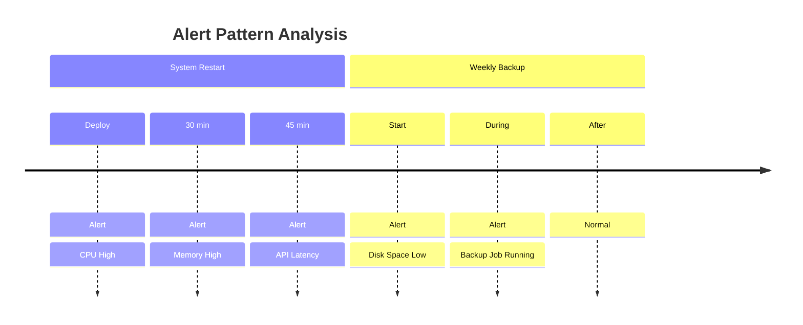

import Tabs from '@theme/Tabs';
import TabItem from '@theme/TabItem';

# Alert History

## Introduction

Alert History in Grafana Alerting provides a chronological record of all alert state changes and notifications that have occurred in your monitoring system. This feature is essential for troubleshooting, compliance, and understanding the performance of your alerts over time. By examining alert history, you can identify patterns, recognize recurring issues, and optimize your alerting strategy.

In this guide, we'll explore how to access, interpret, and leverage alert history in Grafana to improve your monitoring workflows.

## Understanding Alert History

Alert history in Grafana captures several key pieces of information:

- **State changes**: When alerts transition between states (Normal, Pending, Alerting, No Data, Error)
- **Notification attempts**: Records of when notifications were sent and their delivery status
- **Silences and mutes**: Periods when alerts were intentionally suppressed
- **Annotations and comments**: User-added context about specific alert instances

Each of these components helps create a comprehensive timeline of your alerting system's behavior.

## Accessing Alert History

To access the Alert History in Grafana:

1. Navigate to the main Grafana menu (☰)
2. Select **Alerting**
3. Click on the **History** tab

This will display a chronological list of all alert instances and their state changes.

```
Alerting → History
```

## Alert History Interface

The Alert History interface displays alert events in a table format with the following columns:

- **Rule Name**: The name of the alert rule
- **Previous State**: The state before the change
- **Current State**: The state after the change
- **Time**: When the state change occurred
- **Duration**: How long the alert was in the previous state
- **Annotations**: Additional context for the alert instance

## Filtering and Searching Alert History

You can narrow down alert history using the built-in filters:


<Tabs>
    <TabItem value="ui" label="Using the UI">
        - Click on the <strong>Filter</strong> button in the History view
        Select from filter options:
        - Rule name
        - Alert state
        - Time range
        - Labels
        Apply filters to see matching results
    </TabItem>
    <TabItem value="api" label="Using the API">
        <p>You can also query alert history via the Grafana API:</p>

        ```javascript
        // Example API request to get alert history
        fetch('/api/alerting/history', {
        method: 'GET',
        headers: {
        'Content-Type': 'application/json',
        'Authorization': 'Bearer YOUR_API_KEY'
    },
        params: {
        ruleUid: 'YOUR_RULE_ID',
        from: '2023-01-01T00:00:00Z',
        to: '2023-01-02T00:00:00Z'
    }
    })
        .then(response => response.json())
        .then(data => console.log(data))
        .catch(error => console.error('Error:', error));
        ```

    </TabItem>
</Tabs>

## Analyzing Alert History

Alert history is not just a record but a powerful analytical tool. Here are some ways to leverage it:

### Identifying Alert Patterns

By examining alert history, you can identify patterns such as:

- Alerts that trigger at specific times (e.g., during deployments)
- Recurring issues that might indicate deeper problems
- Correlation between different alerts



### Alert Performance Metrics

Alert history can be used to calculate important metrics about your alerting system:

| Metric | Description | Calculation |
|--------|-------------|------------|
| Mean Time Between Alerts (MTBA) | Average time between alert occurrences | Total time period / Number of alerts |
| Mean Time To Recovery (MTTR) | Average time to resolve alerts | Sum of all alert durations / Number of alerts |
| False Positive Rate | Percentage of alerts that weren't actionable | (Non-actionable alerts / Total alerts) × 100 |

## Alert History Retention

By default, Grafana retains alert history for 90 days. You can configure this retention period in your Grafana configuration:

```ini
[alerting]
history_retention_days = 90
```

For longer retention or compliance requirements, you might want to export alert history to external systems.

## Exporting Alert History

You can export alert history for record-keeping, analysis, or compliance purposes:


<Tabs>
    <TabItem value="csv" label="Export as CSV">
        <ol>
            <li>Navigate to the Alert History view</li>
            <li>Apply any desired filters</li>
            <li>Click the <strong>Export</strong> button</li>
            <li>Select <strong>CSV</strong> as the export format</li>
            <li>A file will download containing the filtered alert history</li>
        </ol>
    </TabItem>
    <TabItem value="api" label="Programmatic Export">
        <p>For automated exports, use the Grafana API with your preferred scripting tool:</p>

        ```python
        import requests
        import pandas as pd
        import datetime

        # Set up authentication and parameters
        api_key = "YOUR_API_KEY"
        grafana_url = "https://your-grafana-instance.com"
        days_to_export = 30

        # Calculate date range
        end_date = datetime.datetime.now().isoformat()
        start_date = (datetime.datetime.now() - datetime.timedelta(days=days_to_export)).isoformat()

        # Make API request
        headers = {"Authorization": f"Bearer {api_key}"}
        response = requests.get(
        f"{grafana_url}/api/alerting/history",
        headers=headers,
        params={"from": start_date, "to": end_date}
        )

        # Convert to pandas DataFrame and export
        if response.status_code == 200:
        alert_data = response.json()
        df = pd.DataFrame(alert_data)
        df.to_csv(f"alert_history_{start_date[:10]}_to_{end_date[:10]}.csv", index=False)
        print(f"Exported {len(df)} alert history records")
        else:
        print(f"Error: {response.status_code} - {response.text}")
        ```

    </TabItem>
</Tabs>

## Real-World Use Cases

### Incident Investigation

When an incident occurs, alert history provides crucial context for understanding what happened:

1. **Before the incident**: Were there warning signs in other alerts?
2. **During the incident**: Which alerts fired, in what order, and how quickly?
3. **After resolution**: Did all related alerts clear properly?

### Compliance and Audit

For regulated industries, alert history serves as an audit trail:

- Documenting when issues occurred and how quickly they were addressed
- Providing evidence of monitoring for compliance requirements
- Tracking notification delivery for critical alerts

### Alert Optimization

Analyzing alert history helps improve your alerting strategy:

- **Reduce noise**: Identify and tune frequently firing alerts that may be too sensitive
- **Fill gaps**: Find conditions that should have triggered alerts but didn't
- **Improve grouping**: See which alerts commonly fire together and could be grouped

## Practical Example: Analyzing Alert Storms

Alert storms occur when many alerts fire simultaneously, often overwhelming responders. Let's see how to use alert history to analyze and prevent them:

```javascript
// Sample code to analyze alert density over time
function analyzeAlertDensity(alertHistory, timeWindowMinutes = 15) {
  // Group alerts by time windows
  const timeWindows = {};
  
  alertHistory.forEach(alert => {
    const timestamp = new Date(alert.time);
    const windowKey = Math.floor(timestamp.getTime() / (timeWindowMinutes * 60 * 1000));
    
    if (!timeWindows[windowKey]) {
      timeWindows[windowKey] = {
        start: new Date(windowKey * timeWindowMinutes * 60 * 1000),
        count: 0,
        alerts: []
      };
    }
    
    timeWindows[windowKey].count++;
    timeWindows[windowKey].alerts.push(alert);
  });
  
  // Find windows with high alert counts (potential alert storms)
  const potentialStorms = Object.values(timeWindows)
    .filter(window => window.count > 10)
    .sort((a, b) => b.count - a.count);
  
  return potentialStorms;
}

// Example output:
// [
//   {
//     start: "2023-06-15T02:30:00.000Z",
//     count: 24,
//     alerts: [...]
//   },
//   ...
// ]
```

Using this kind of analysis, you can:

1. Identify the root causes of alert storms
2. Implement alert grouping for related issues
3. Set up alerting dependencies to prevent cascading notifications
4. Add delay or dampening to avoid notification fatigue

## Summary

Alert History in Grafana Alerting is a powerful feature that provides:

- A chronological record of all alert state changes
- Tools for filtering and searching alert events
- The ability to export history for long-term storage
- Insights that help optimize your alerting strategy
- Evidence for compliance and audit requirements

By leveraging alert history effectively, you can improve incident response, reduce alert fatigue, and create a more efficient monitoring system.

## Additional Resources

- [Grafana Alerting Documentation](https://grafana.com/docs/grafana/latest/alerting/)
- [Alert Rule Management](https://grafana.com/docs/grafana/latest/alerting/manage-alerts/)
- [Notification Policies](https://grafana.com/docs/grafana/latest/alerting/notifications/)

## Exercises

1. **Alert History Exploration**:
- Set up a test alert that fires periodically
- Observe how its history is recorded
- Try silencing it and see how that appears in history

2. **Alert Pattern Analysis**:
- Export 30 days of alert history
- Create a visualization of alert frequency by time of day
- Identify any patterns in when alerts most commonly fire

3. **Alert Optimization**:
- Find your top 5 most frequently firing alerts
- Analyze their history to determine if they could be tuned
- Implement changes and monitor how the alert history changes