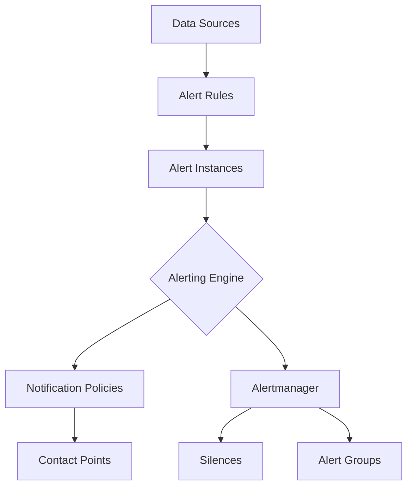

# Grafana-Managed Alerts

## Introduction

Grafana-Managed Alerts are a powerful feature of Grafana Alerting that allows you to create, configure, and manage alert rules directly within the Grafana interface. Unlike traditional Prometheus alerting, which requires external configuration, Grafana-Managed Alerts provide an integrated experience for monitoring your systems and applications.

With Grafana-Managed Alerts, you can:
- Create alert rules based on any data source
- Define complex alert conditions with multiple queries
- Configure notification channels and message templates
- Organize alerts into logical groups
- Visualize alert states in dashboards

This guide will walk you through understanding and implementing Grafana-Managed Alerts in your monitoring environment.

## Understanding Grafana-Managed Alerts Architecture

Grafana-Managed Alerts are part of the unified Grafana Alerting system. Before diving into creating alerts, it's important to understand the key components:

- **Alert Rules**: Definitions of conditions that determine when an alert should fire
- **Alert Instances**: Individual evaluations of an alert rule against specific labels
- **Contact Points**: Destinations for notifications (email, Slack, etc.)
- **Notification Policies**: Rules that determine how, when, and where notifications are sent
- **Silences**: Configurations to suppress notifications for specific alerts
- **Alert Groups**: Logical groupings of related alerts



## Creating Your First Grafana-Managed Alert

Let's create a simple alert that monitors CPU usage and triggers when it exceeds 80%.

### Step 1: Navigate to the Alerting section

In the Grafana sidebar, click on **Alerting**. This will take you to the Grafana Alerting UI.

### Step 2: Create a new alert rule

Click on **Alert Rules** and then **+ New alert rule**. You'll be presented with the alert rule creation form.

### Step 3: Configure the alert rule

1. **Rule name**: Give your alert a descriptive name, like "High CPU Usage"

2. **Rule type**: Select "Grafana managed alert"

3. **Folder**: Choose an existing folder or create a new one to organize your alerts

4. **Configure query and alert condition**:
   ```sql
   SELECT mean("usage_idle") FROM "cpu" WHERE $timeFilter GROUP BY time($__interval) fill(null)
   ```

5. **Set threshold**: Define when the alert should fire. For our CPU example:
   - Condition: `when last() of A is below 20`
   - This translates to CPU idle time below 20%, meaning usage above 80%

6. **Configure alert evaluation behavior**:
   - Evaluate every: `1m` (evaluate the rule every minute)
   - For: `5m` (alert only if condition is true for 5 consecutive minutes)

7. **Add labels** to help with organization:
   - Severity: `warning`
   - Category: `system`

8. **Add annotations** to provide additional context:
   - Summary: `High CPU usage detected`
   - Description: `CPU usage has exceeded 80% for more than 5 minutes`

### Step 4: Save the alert rule

Click **Save** to create your alert rule. Grafana will start evaluating it based on your configuration.

## Advanced Alert Configuration

For more complex monitoring scenarios, Grafana-Managed Alerts offer advanced configuration options.

### Multi-Dimensional Alerts

You can create alerts that operate across multiple dimensions by using template variables and label matching.

For example, to monitor CPU usage across all hosts in a cluster:

```sql
SELECT mean("usage_idle") FROM "cpu" WHERE "host" =~ /^$hostname$/ AND $timeFilter GROUP BY time($__interval), "host" fill(null)
```

This will create separate alert instances for each host that matches the condition.

### Using Math and Expressions

Grafana allows you to combine metrics and apply transformations using math expressions:

```javascript
$A + $B < $C * 1.5
```

For example, to alert when free disk space is less than 10% of total capacity:

1. Query A: `SELECT last("free") FROM "disk"`
2. Query B: `SELECT last("total") FROM "disk"`
3. Expression: `$A / $B * 100 < 10`

### Alert Rule with Multiple Conditions

You can create more sophisticated alerts by combining multiple conditions:

```javascript
// Alert if both CPU usage is high AND memory usage is high
($A < 20) && ($B < 15)
```

Where:
- Query A monitors CPU idle percentage
- Query B monitors available memory percentage

## Alert Notifications and Routing

After creating alert rules, you need to configure how and where notifications are sent.

### Creating Contact Points

Contact Points define where notifications are sent. To create a new contact point:

1. Go to **Alerting** > **Contact points**
2. Click **+ Add contact point**
3. Select the integration type (Slack, Email, etc.)
4. Configure the necessary information

For a Slack notification:

```json
{
  "recipient": "#alerts",
  "title": "{{ .CommonLabels.alertname }}",
  "message": "{{ .CommonAnnotations.summary }}
{{ .CommonAnnotations.description }}",
  "url": "{{ .ExternalURL }}"
}
```

### Configuring Notification Policies

Notification policies determine which alerts go to which contact points:

1. Go to **Alerting** > **Notification policies**
2. Configure the root policy or add nested policies
3. Use label matchers to route different alerts

For example, to route critical alerts to a different channel:

```yaml
- name: Critical Alerts
  match:
    severity: critical
  contact_point: on-call-team
  group_by: ['alertname']
  repeat_interval: 10m
```

## Organizing and Managing Alerts

As your alert rules grow, organization becomes crucial for maintenance.

### Using Alert Groups

Group related alerts together for better organization:

```yaml
groups:
  - name: System Health
    folder: Infrastructure
    rules:
      - name: High CPU Usage
        # rule configuration...
      - name: Low Disk Space
        # rule configuration...
```

### Implementing Alert Silence

To temporarily suppress notifications for maintenance or known issues:

1. Go to **Alerting** > **Silences**
2. Click **New Silence**
3. Configure the matcher to target specific alerts
4. Set a duration for the silence

```yaml
matchers:
  - name: alertname
    value: High CPU Usage
    isRegex: false
comment: "System maintenance window"
startsAt: "2023-09-15T14:00:00Z"
endsAt: "2023-09-15T18:00:00Z"
```

## Real-World Example: Full Stack Monitoring

Let's create a comprehensive monitoring setup for a web application with frontend, backend, and database components.

### 1. Database Availability Alert

```sql
SELECT last("uptime_seconds") FROM "database_stats" WHERE $timeFilter GROUP BY time($__interval)
```

Alert when: `last() of A is below 1`
Labels:
- severity: critical
- component: database

### 2. API Latency Alert

```sql
SELECT mean("response_time") FROM "api_metrics" WHERE $timeFilter GROUP BY time($__interval)
```

Alert when: `last() of A is above 500`
Labels:
- severity: warning
- component: backend

### 3. Error Rate Alert

```sql
SELECT sum("error_count") / sum("request_count") * 100 FROM "application_metrics" WHERE $timeFilter GROUP BY time($__interval)
```

Alert when: `last() of A is above 5`
Labels:
- severity: warning
- component: application

### 4. Notification Policy Configuration

```yaml
# Root policy
route:
  receiver: default-email
  group_by: ['alertname', 'component']
  repeat_interval: 4h
  routes:
    # Critical database issues
    - match:
        severity: critical
        component: database
      receiver: database-team-pager
      repeat_interval: 10m
    # All other alerts
    - match_re:
        component: backend|application
      receiver: application-team-slack
      group_by: ['alertname', 'instance']
```

## Troubleshooting Grafana-Managed Alerts

When working with Grafana-Managed Alerts, you might encounter some common issues:

### No Data Alerts

If you're not receiving any data for your alert queries:

1. Verify data source connectivity
2. Check time range settings
3. Validate query syntax
4. Ensure metrics are being collected

### False Positives/Negatives

To reduce alert noise:

1. Adjust the "For" duration to prevent short spikes from triggering alerts
2. Use percentile-based thresholds instead of averages
3. Implement multi-condition checks
4. Consider using the "No Data" and "Error" handling options appropriately

### Alert History and Debugging

To investigate alert history:

1. Go to **Alerting** > **Alert rules**
2. Click on the specific rule
3. View the "State history" tab
4. Examine evaluation details and timing

## Best Practices for Grafana-Managed Alerts

When implementing alerts, follow these best practices:

1. **Be selective**: Only alert on actionable conditions that require human intervention
2. **Use meaningful names**: Clear, descriptive names help during incidents
3. **Include context**: Add detailed annotations to help responders understand the issue
4. **Group related alerts**: Prevent alert storms by grouping related notifications
5. **Set appropriate thresholds**: Base thresholds on historical data, not guesses
6. **Implement runbooks**: Link to troubleshooting guides in alert annotations
7. **Review regularly**: Periodically review and refine alert rules

## Summary

Grafana-Managed Alerts provide a powerful, integrated approach to monitoring and alerting within the Grafana platform. By leveraging this feature, you can:

- Create sophisticated alert rules based on any data source
- Configure targeted notifications based on alert severity and type
- Organize and manage alerts effectively
- Build a comprehensive monitoring solution

With the knowledge from this guide, you're now equipped to implement effective alerting strategies for your applications and infrastructure using Grafana's native capabilities.

## Additional Resources

For further learning and reference:

- [Grafana Alerting Documentation](https://grafana.com/docs/grafana/latest/alerting/)
- Practice creating different types of alerts for various metrics
- Experiment with different notification channels and routing configurations
- Try implementing alert dashboards to visualize alert states