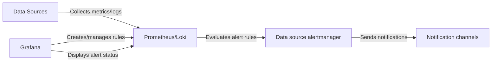

# Data Source-Managed Alerts

## Introduction

Data source-managed alerts (sometimes called "native alerts") are a powerful feature within Grafana's alerting ecosystem that allows certain data sources to handle alert evaluation directly. Unlike Grafana-managed alerts where the Grafana server evaluates alert conditions, data source-managed alerts offload this responsibility to the data source itself, which can improve performance and enable specialized alerting capabilities.

In this tutorial, you'll learn:
- What data source-managed alerts are and how they differ from Grafana-managed alerts
- Which data sources support managed alerts
- How to create and configure data source-managed alerts
- Best practices for implementing these alerts in your monitoring environment

## Understanding Data Source-Managed Alerts

### What Are Data Source-Managed Alerts?

Data source-managed alerts are alert rules that are created and executed within the data source itself rather than being evaluated by Grafana. This means the data source:

1. Stores the alert rule definitions
2. Evaluates the alert conditions 
3. Determines the alert state
4. Generates notifications when alerts fire

Grafana simply provides the interface to create, view, and manage these alerts, while the actual processing happens within the data source.

### Supported Data Sources

As of this writing, the primary data sources that support managed alerts are:

- **Prometheus** - For alerting on metrics data
- **Loki** - For alerting on log data
- **Mimir** - For scaled Prometheus alerting
- **Alertmanager** - For alert management

Each data source implements alerting in its own way, with features and limitations specific to its architecture.

### Comparing with Grafana-Managed Alerts

| Feature | Data Source-Managed Alerts | Grafana-Managed Alerts |
| ------- | -------------------------- | ---------------------- |
| Evaluation location | Within the data source | Within Grafana |
| Performance impact on Grafana | Low | Higher |
| Consistency during Grafana outages | Continue functioning | Stop functioning |
| Configuration complexity | Varies by data source | Unified across all data sources |
| Multi-data source alerts | Not supported | Supported |
| Alerting expressions | Data source specific | Grafana expressions |

## Creating Data Source-Managed Alerts

Let's walk through the process of creating a data source-managed alert using Prometheus as an example.

### Prerequisites

- A functioning Grafana instance (version 8.0+)
- A configured Prometheus data source
- Appropriate permissions to create and manage alerts

### Step-by-Step Guide

#### 1. Navigate to Alerting

Go to the Grafana menu and select "Alerting" to open the alerting UI.

#### 2. Create a New Alert Rule

Click on "New alert rule" to start creating a new alert. You'll see different options for creating Grafana-managed alerts or data source-managed alerts.

#### 3. Select Prometheus Rule Type

Select "Prometheus" under the "Data source rule" section. This indicates you want to create a data source-managed rule that will be stored and evaluated in Prometheus.

#### 4. Define Your Alert Rule

```
alert: HighCPUUsage
expr: avg by(instance) (cpu_usage_percent) > 80
for: 5m
labels:
  severity: critical
  category: system
annotations:
  summary: High CPU usage on {{ $labels.instance }}
  description: CPU usage has been above 80% for more than 5 minutes on {{ $labels.instance }}
```

In this example, we're defining an alert that triggers when CPU usage exceeds 80% for 5 minutes.

#### 5. Configure Rule Settings

Fill in the following fields:
- **Rule name**: A descriptive name for your alert rule
- **Namespace**: The Prometheus namespace where this rule will be stored
- **Group**: The rule group for organizing related rules
- **For**: How long the condition must be true before firing (e.g., 5m)

#### 6. Save the Rule

Click "Save" to create your data source-managed alert. Prometheus will now store and evaluate this rule.

## Working with Prometheus-Managed Alerts

### Alert Rule Syntax

Prometheus alert rules consist of:

- `alert`: The name of the alert
- `expr`: The PromQL expression that defines the alert condition
- `for`: Duration the condition must be true before firing
- `labels`: Key-value pairs for categorizing alerts (used for routing)
- `annotations`: Additional information about the alert (displayed in notifications)

### Example PromQL Alert Expressions

#### Example 1: Service Availability

```
alert: ServiceDown
expr: up{job="api-service"} == 0
for: 2m
labels:
  severity: critical
annotations:
  summary: Service {{ $labels.job }} is down
  description: The service {{ $labels.job }} has been down for more than 2 minutes.
```

#### Example 2: Error Rate

```
alert: HighErrorRate
expr: sum(rate(http_requests_total{status=~"5.."}[5m])) / sum(rate(http_requests_total[5m])) > 0.05
for: 10m
labels:
  severity: warning
annotations:
  summary: High error rate detected
  description: Error rate is above 5% for the last 10 minutes
```

### Alert States

Data source-managed alerts can have the following states:

- **Normal**: The alert condition is false
- **Pending**: The alert condition is true but hasn't been true for the required duration
- **Firing**: The alert condition is true and has been true for the required duration

## Working with Loki-Managed Alerts

Loki, Grafana's log aggregation system, also supports data source-managed alerts. These are particularly useful for alerting on log patterns or log volumes.

### Example Loki Alert

```
alert: TooManyErrorLogs
expr: sum(count_over_time({app="api"} |= "ERROR"[5m])) > 100
for: 5m
labels:
  severity: warning
annotations:
  summary: High number of error logs
  description: More than 100 error logs detected in the last 5 minutes
```

This alert fires when more than 100 error logs are detected in a 5-minute window.

## Data Flow for Data Source-Managed Alerts

Here's a diagram showing how data flows in a data source-managed alert system:



## Best Practices

### When to Use Data Source-Managed Alerts

- When you need alerts to continue functioning even if Grafana is down
- For high-volume metrics where offloading evaluation improves performance
- When you want to leverage data source-specific alerting capabilities

### When to Use Grafana-Managed Alerts

- When you need to alert on data from multiple data sources
- When you need advanced Grafana expressions
- For simpler setups where you prefer a unified alerting interface

### Performance Considerations

- Data source-managed alerts reduce load on Grafana servers
- However, they can increase load on your data sources
- Consider resource allocation for your data sources if implementing many alert rules

### Organizational Tips

- Use consistent naming conventions for alert rules
- Group related alerts together
- Use labels effectively to categorize and route alerts
- Document alert thresholds and rationale

## Troubleshooting

### Common Issues

#### Alert Rules Not Saving

Ensure your Grafana instance has proper access to write rules to your data source. For Prometheus, check that the `rule_files` configuration is correctly set up.

#### Alerts Not Firing

1. Verify the alert expression directly in the data source query interface
2. Check for syntax errors in your alert expression
3. Ensure the alert condition is actually being met

#### Alert Notifications Not Being Received

1. Check that your data source's alertmanager is correctly configured
2. Verify notification channel settings
3. Check for any network issues between components

## Real-World Examples

### Scenario 1: Infrastructure Monitoring

A common use case is monitoring server infrastructure. Here's how you might set up data source-managed alerts:

1. **CPU Usage Alert**:
```
alert: HighCPUUsage
expr: avg by(instance) (node_cpu_seconds_total{mode="idle"}) > 80
for: 5m
```

2. **Memory Alert**:
```
alert: HighMemoryUsage
expr: (node_memory_MemTotal_bytes - node_memory_MemAvailable_bytes) / node_memory_MemTotal_bytes * 100 > 90
for: 5m
```

3. **Disk Space Alert**:
```
alert: LowDiskSpace
expr: (node_filesystem_avail_bytes / node_filesystem_size_bytes) * 100 < 10
for: 10m
```

### Scenario 2: Application Monitoring

For monitoring a web application:

1. **High Latency Alert**:
```
alert: HighLatency
expr: histogram_quantile(0.95, sum(rate(http_request_duration_seconds_bucket[5m])) by (le, service)) > 2
for: 5m
```

2. **Error Rate Alert**:
```
alert: ErrorSpike
expr: sum(rate(http_requests_total{status=~"5.."}[5m])) / sum(rate(http_requests_total[5m])) > 0.05
for: 5m
```

## Summary

Data source-managed alerts are a powerful feature in Grafana's alerting ecosystem that allows alert rules to be stored and evaluated directly by supported data sources like Prometheus and Loki. This approach offers performance benefits and continued alerting functionality even during Grafana outages.

Key points to remember:
- Data source-managed alerts are evaluated by the data source, not by Grafana
- They're ideal for high-volume metrics and critical alerts that must function even if Grafana is down
- Each data source has its own alert syntax and capabilities
- You can create these alerts through the Grafana UI but they're stored in the data source

## Further Learning

To deepen your understanding of data source-managed alerts, consider:

1. Exploring the specific alerting documentation for your data sources
2. Studying PromQL or LogQL to write more effective alert expressions
3. Learning about alert routing and silencing in Alertmanager
4. Practicing with different alert scenarios to understand evaluation behavior

## Exercises

1. Create a Prometheus-managed alert that fires when a service is down for more than 1 minute.
2. Create a Loki-managed alert that detects when a specific error pattern appears in your logs.
3. Set up an alert that monitors the rate of increase of a specific metric and alerts on sudden changes.
4. Configure different notification channels for different severity levels of alerts.