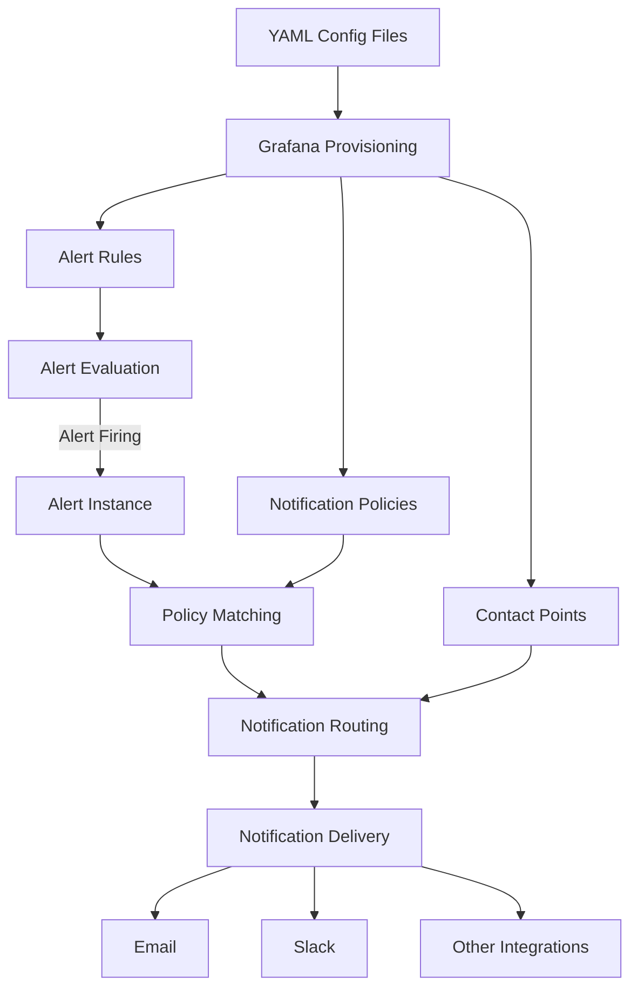

# Alert Provisioning

## Introduction

Alert provisioning is a powerful feature in Grafana Alerting that allows you to define, manage, and deploy alert rules as code instead of manually creating them through the Grafana UI. This approach follows the "Infrastructure as Code" (IaC) principle, enabling you to automate your alerting setup, maintain version control, and ensure consistency across different Grafana environments.

In this guide, you'll learn how to provision alert rules, notification policies, and contact points in Grafana using YAML configuration files. By the end, you'll be able to create and manage your alerting infrastructure efficiently using version-controlled code.

## What is Alert Provisioning?

Alert provisioning refers to the process of automatically creating and updating alert configurations from externally managed files. Rather than manually clicking through the Grafana interface to set up alerts, you define them in configuration files that Grafana automatically loads when it starts or when triggered to reload.

Key benefits of alert provisioning include:

- **Version control**: Track changes to your alerting setup over time
- **Automation**: Integrate alert creation into CI/CD pipelines
- **Consistency**: Ensure identical alert configurations across development, staging, and production environments
- **Backup & recovery**: Easily restore alert configurations if needed
- **Scalability**: Manage large numbers of alerts more efficiently

## Provisioning Methods

Grafana supports two main approaches for provisioning alerts:

1. **File-based provisioning**: Using YAML files in the Grafana provisioning directory
2. **API-based provisioning**: Using the Grafana HTTP API to manage alert resources

This guide will focus primarily on file-based provisioning, as it aligns better with the IaC philosophy.

## Prerequisites

Before you start provisioning alerts, make sure you have:

- Grafana v9.0 or later installed
- Access to the Grafana server's file system or configuration management system
- Basic understanding of YAML syntax
- Familiarity with Grafana alerting concepts (alert rules, notification policies, contact points)

## File-based Alert Provisioning

### Directory Structure

By default, Grafana looks for provisioning files in the following directory:

```
/etc/grafana/provisioning/
```

For alert provisioning specifically, you'll need to create the following structure:

```
/etc/grafana/provisioning/alerting/
├── alert_rules/
│   └── example_rules.yaml
├── contact_points/
│   └── example_contacts.yaml
└── notification_policies/
    └── example_policies.yaml
```

If you're using Docker, you can mount these directories from your host machine to the container.

### Provisioning Alert Rules

Alert rules define the conditions that trigger alerts. Let's create a simple alert rule that monitors CPU usage.

Create a file named `cpu_alert.yaml` in the `alert_rules` directory:

```yaml
apiVersion: 1

groups:
  - name: CPU Alerts
    folder: Server Monitoring
    interval: 60s
    rules:
      - name: High CPU Usage
        condition: C
        for: 5m
        annotations:
          summary: High CPU usage detected
          description: CPU usage has exceeded 80% for 5 minutes
        labels:
          severity: warning
          category: resource
        data:
          - refId: A
            datasourceUid: PBFA97CFB590B2093
            model:
              expr: 100 - (avg by(instance) (irate(node_cpu_seconds_total{mode="idle"}[5m])) * 100)
              intervalMs: 1000
              maxDataPoints: 43200
              refId: A
          - refId: B
            datasourceUid: PBFA97CFB590B2093
            model:
              expr: 80
              intervalMs: 1000
              maxDataPoints: 43200
              refId: B
          - refId: C
            relativeTimeRange:
              from: 600
              to: 0
            datasourceUid: __expr__
            model:
              conditions:
                - evaluator:
                    params:
                      - 0
                    type: gt
                  operator:
                    type: and
                  query:
                    params:
                      - A
                  reducer:
                    type: last
                  type: query
              expression: $A > $B
              intervalMs: 1000
              maxDataPoints: 43200
              refId: C
              type: math
```

Let's break down this configuration:

1. `apiVersion`: Specifies the version of the provisioning API
2. `groups`: Contains a list of alert rule groups
   - `name`: The name of the group
   - `folder`: The dashboard folder where the alerts will be stored
   - `interval`: How often the rules in this group should be evaluated
   - `rules`: The list of alert rules in this group
     - `name`: The name of the alert rule
     - `condition`: The reference ID of the condition expression
     - `for`: The duration for which the condition must be true before an alert fires
     - `annotations`: Additional information about the alert
     - `labels`: Key-value pairs for categorization and routing
     - `data`: The queries and expressions that define the alert condition

### Provisioning Contact Points

Contact points define how alerts are delivered to recipients. Let's create a file named `contact_points.yaml` in the `contact_points` directory:

```yaml
apiVersion: 1

contactPoints:
  - name: email-team
    receivers:
      - uid: email-team-receiver
        type: email
        settings:
          addresses: team@example.com
          singleEmail: false
  
  - name: slack-alerts
    receivers:
      - uid: slack-alerts-receiver
        type: slack
        settings:
          url: https://hooks.slack.com/services/YOUR_SLACK_WEBHOOK_URL
          title: "{{ .CommonLabels.alertname }}"
          text: "{{ .CommonAnnotations.description }}"
```

This configuration defines two contact points:
1. An email contact point that sends alerts to team@example.com
2. A Slack contact point that posts alerts to a Slack channel using a webhook

### Provisioning Notification Policies

Notification policies determine how alerts are routed to contact points based on labels. Let's create a file named `notification_policies.yaml` in the `notification_policies` directory:

```yaml
apiVersion: 1

policies:
  - orgId: 1
    receiver: slack-alerts
    group_by: ['alertname', 'category']
    routes:
      - receiver: email-team
        group_by: ['alertname', 'category', 'instance']
        matchers:
          - severity = critical
        group_wait: 30s
        group_interval: 5m
        repeat_interval: 4h
        mute_time_intervals: []
```

This configuration:
1. Sets `slack-alerts` as the default receiver for all alerts
2. Groups alerts by `alertname` and `category`
3. Creates a route that:
   - Sends alerts with `severity: critical` to the `email-team` contact point
   - Groups these critical alerts by `alertname`, `category`, and `instance`
   - Waits 30s before sending the first notification
   - Waits 5m before sending updates for the same group
   - Repeats notifications every 4h if the alert persists

## Applying Provisioned Configurations

Grafana automatically loads provisioning files at startup. If you've added or modified provisioning files while Grafana is running, you can apply the changes in two ways:

### 1. Restart Grafana

The simplest way to apply changes is to restart the Grafana service:

```bash
sudo systemctl restart grafana-server
```

Or for Docker:

```bash
docker restart grafana
```

### 2. API Reload (Grafana v9.1+)

For a zero-downtime reload, you can use the Grafana API (requires admin access):

```bash
curl -X POST -H "Authorization: Bearer YOUR_API_KEY" http://your-grafana-instance/api/admin/provisioning/alerting/reload
```

## Real-world Example: Monitoring a Web Service

Let's create a more comprehensive example that monitors a web service, checking for high response times, error rates, and availability.

Create a file named `web_service_alerts.yaml` in the `alert_rules` directory:

```yaml
apiVersion: 1

groups:
  - name: Web Service Monitoring
    folder: Application Monitoring
    interval: 30s
    rules:
      - name: High Response Time
        condition: C
        for: 2m
        annotations:
          summary: High response time detected
          description: Average response time has exceeded 500ms for 2 minutes
          dashboard_url: ${__dashboardUid}/d/abc123/web-service-overview
        labels:
          severity: warning
          category: performance
          service: web-api
        data:
          - refId: A
            datasourceUid: PBFA97CFB590B2093
            model:
              expr: avg(rate(http_request_duration_seconds_sum{job="web-api"}[5m]) / rate(http_request_duration_seconds_count{job="web-api"}[5m])) * 1000
              intervalMs: 1000
              maxDataPoints: 43200
              refId: A
          - refId: B
            datasourceUid: PBFA97CFB590B2093
            model:
              expr: 500
              intervalMs: 1000
              maxDataPoints: 43200
              refId: B
          - refId: C
            relativeTimeRange:
              from: 600
              to: 0
            datasourceUid: __expr__
            model:
              expression: $A > $B
              type: math
              refId: C
              
      - name: High Error Rate
        condition: C
        for: 1m
        annotations:
          summary: High error rate detected
          description: Error rate has exceeded 5% for 1 minute
          dashboard_url: ${__dashboardUid}/d/abc123/web-service-overview
        labels:
          severity: critical
          category: errors
          service: web-api
        data:
          - refId: A
            datasourceUid: PBFA97CFB590B2093
            model:
              expr: sum(rate(http_requests_total{job="web-api",status=~"5.."}[5m])) / sum(rate(http_requests_total{job="web-api"}[5m])) * 100
              intervalMs: 1000
              maxDataPoints: 43200
              refId: A
          - refId: B
            datasourceUid: PBFA97CFB590B2093
            model:
              expr: 5
              intervalMs: 1000
              maxDataPoints: 43200
              refId: B
          - refId: C
            relativeTimeRange:
              from: 600
              to: 0
            datasourceUid: __expr__
            model:
              expression: $A > $B
              type: math
              refId: C
```

This example includes two alert rules:
1. A warning alert when response times exceed 500ms
2. A critical alert when the error rate exceeds 5%

Both alerts include links to a dashboard for further investigation.

## Visualizing Alert Provisioning Flow

Here's a diagram showing how alert provisioning fits into the overall alert flow:



## Best Practices

### 1. Use Version Control

Store your provisioning files in a Git repository to track changes and collaborate with team members:

```bash
git init
git add provisioning/
git commit -m "Initial alert provisioning configuration"
```

### 2. Validate YAML Files

Before applying changes, validate your YAML files to avoid syntax errors:

```bash
yamllint provisioning/alerting/alert_rules/*.yaml
```

### 3. Use Templates for Reusable Configuration

For teams managing many similar services, consider using a templating system like Jsonnet or Helm to generate your YAML files from reusable templates.

### 4. Include Documentation

Add comments in your YAML files to explain the purpose of each alert and any complex expressions:

```yaml
rules:
  - name: High CPU Usage
    # This alert detects sustained high CPU usage that might indicate
    # a resource constraint or runaway process
    condition: C
    for: 5m
    ...
```

### 5. Use Meaningful Naming Conventions

Adopt a consistent naming convention for your alert rules, groups, and contact points to make them easier to manage:

```
[Service/Component]_[Metric]_[Condition]
```

For example: `API_ResponseTime_High` or `Database_DiskSpace_Low`

## Troubleshooting

### Common Issues

1. **Alert rules not appearing in Grafana**
   - Check file permissions on provisioning directories
   - Verify YAML syntax is correct
   - Look for errors in Grafana logs: `/var/log/grafana/grafana.log`

2. **Alert evaluation errors**
   - Ensure datasource UIDs are correct for your environment
   - Verify expressions are valid for your data source type

3. **Notifications not being sent**
   - Check that contact point settings are correct (URLs, email addresses)
   - Verify notification policy routes are matching your alert labels
   - Check Grafana's alerting logs for delivery errors

## Summary

In this guide, you've learned how to provision Grafana alerts using configuration files, enabling you to manage your alerting infrastructure as code. You've seen how to provision alert rules, contact points, and notification policies, as well as how to apply changes and follow best practices.

Alert provisioning brings the benefits of infrastructure as code to your monitoring setup, making it more maintainable, reproducible, and scalable. By mastering these techniques, you'll be able to build robust alerting systems that evolve with your applications.

## Exercises

To reinforce your understanding of alert provisioning, try these exercises:

1. Create an alert rule that monitors memory usage and triggers when it exceeds 90%
2. Set up a multi-tier notification policy that routes different severity alerts to different contact points
3. Provision a contact point that integrates with a service you use (PagerDuty, OpsGenie, etc.)
4. Create a template for generating alert rules for multiple similar services
5. Set up a CI pipeline that validates your provisioning files before deploying them

## Additional Resources

- [Grafana Official Documentation on Alert Provisioning](https://grafana.com/docs/grafana/latest/alerting/provision-alerting-resources/)
- [Grafana Alerting Best Practices](https://grafana.com/docs/grafana/latest/alerting/fundamentals/alert-rules/best-practices/)
- [Managing Grafana as Code](https://grafana.com/blog/2020/02/26/how-to-configure-grafana-as-code/)