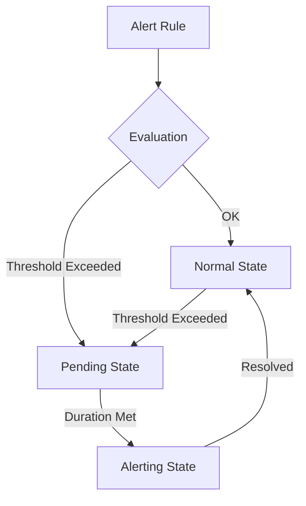

# Alert Troubleshooting

## Introduction

When working with Grafana's alerting system, you may occasionally encounter situations where alerts don't behave as expected. Alert troubleshooting is a critical skill that helps you identify and resolve issues with your alerting configuration, ensuring your monitoring system remains reliable and effective.

This guide will walk you through common alert problems, their potential causes, and step-by-step solutions. By the end, you'll be equipped with the knowledge to diagnose and fix alerting issues in your Grafana environment.

## Common Alert Problems and Solutions

### 1. Alerts Not Firing

One of the most common issues is when alerts are configured but don't trigger when conditions are met.

#### Potential Causes:

- **Evaluation interval issues**: The alert evaluation interval is too long
- **Query timing problems**: The time range in your query doesn't match with when the issue occurred
- **Alert rule configuration errors**: Thresholds are set incorrectly
- **Data source connectivity issues**: Grafana can't access your data source

#### Troubleshooting Steps:

1. **Check alert rule configuration**

```javascript
// Example alert rule
{
  "name": "High CPU Usage",
  "type": "alerting",
  "conditions": [
    {
      "evaluator": {
        "params": [90, 0],
        "type": "gt"  // Alert when value is greater than 90%
      },
      "operator": {
        "type": "and"
      },
      "query": {
        "params": ["A", "5m", "now"]
      },
      "reducer": {
        "params": [],
        "type": "avg"
      },
      "type": "query"
    }
  ],
  "executionErrorState": "alerting",
  "frequency": "60s",
  "handler": 1,
  "noDataState": "no_data"
}
```

2. **Verify the data source is working**

Navigate to the data source configuration page and click "Test Connection" to ensure Grafana can communicate with your data source.

3. **Test the alert query manually**

Run the query used in your alert rule directly in the Explore view to verify it returns the expected data:

```sql
-- Example Prometheus query to check CPU usage
sum(rate(node_cpu_seconds_total{mode!="idle"}[1m])) by (instance) / sum(rate(node_cpu_seconds_total[1m])) by (instance) * 100
```

4. **Check Grafana logs**

Look for any error messages related to alerting:

```bash
# Check for alerting-related errors in Grafana logs
grep "alerting" /var/log/grafana/grafana.log | grep "error"
```

### 2. False Positive Alerts

Another common issue is receiving alert notifications when there's no actual problem.

#### Potential Causes:

- **Threshold set too low**: The alert threshold is too sensitive
- **Noisy data**: Temporary spikes triggering alerts
- **Missing filtering**: Alert query lacks proper filtering conditions

#### Troubleshooting Steps:

1. **Adjust alert conditions with proper thresholds**

Review your alert thresholds and consider adjusting them based on historical data patterns:

```javascript
// Before: Too sensitive
{
  "evaluator": {
    "params": [80, 0],  // Alerting when CPU > 80%
    "type": "gt"
  }
}

// After: More appropriate threshold
{
  "evaluator": {
    "params": [90, 0],  // Alerting when CPU > 90%
    "type": "gt"
  }
}
```

2. **Implement alert dampening with proper "for" duration**

Configure your alert to persist for a certain duration before triggering:

```javascript
// Setting a "for" duration of 5 minutes
{
  "for": "5m",
  "conditions": [...]
}
```

3. **Refine your query with better filtering**

```sql
-- Before: No filtering for specific instances
sum(rate(node_cpu_seconds_total{mode!="idle"}[1m])) by (instance) / sum(rate(node_cpu_seconds_total[1m])) by (instance) * 100

-- After: Filtering out development environments
sum(rate(node_cpu_seconds_total{mode!="idle", environment="production"}[1m])) by (instance) / 
sum(rate(node_cpu_seconds_total{environment="production"}[1m])) by (instance) * 100
```

### 3. Inconsistent Alert Notifications

Sometimes alerts fire correctly but notifications aren't delivered consistently.

#### Potential Causes:

- **Contact point configuration issues**: Incorrect email addresses or webhook URLs
- **Notification throttling**: Rate limiting of notification channels
- **Network connectivity issues**: Grafana server can't reach notification endpoints

#### Troubleshooting Steps:

1. **Verify contact point configuration**

Check your contact point configuration for any errors:

```javascript
// Example contact point configuration
{
  "name": "Email Team",
  "type": "email",
  "settings": {
    "addresses": "team@example.com",
    "singleEmail": false
  }
}
```

2. **Test notification channel**

Use the "Test" button in the contact point UI to send a test notification and verify it's received.

3. **Check notification logs**

```bash
# Examine notification-related log entries
grep "notifier" /var/log/grafana/grafana.log
```

4. **Review rate limits**

Check if your notification system has rate limits that might be affecting delivery:

```javascript
// Example email provider rate limits
{
  "rate_limit": 100,  // Maximum 100 emails per hour
  "burst_limit": 10   // Maximum 10 emails in a burst
}
```

## Advanced Troubleshooting Techniques

### Using the Grafana Alerting State History

Grafana keeps a record of alert state changes that can be invaluable for troubleshooting:

1. Navigate to Alerting → State history
2. Filter by the specific alert rule you're investigating
3. Examine the state transitions and annotations



### Alert Rule Testing Mode

Grafana allows you to test alert rules before enabling them:

1. Create or edit an alert rule
2. Use the "Test" button to evaluate it against historical data
3. Review the results to determine if the rule behaves as expected

```javascript
// Example test result
{
  "state": "Alerting",
  "evaluations": [
    {
      "time": "2023-07-15T14:00:00Z",
      "value": 95.2,
      "threshold": 90,
      "condition": "gt",
      "result": true
    },
    {
      "time": "2023-07-15T14:01:00Z",
      "value": 96.1,
      "threshold": 90,
      "condition": "gt",
      "result": true
    }
  ]
}
```

### Examining Alert Evaluation Metrics

Grafana exposes internal metrics about its alerting system that you can monitor:

```javascript
// Example Prometheus queries for alerting metrics
grafana_alerting_rule_evaluations_total{status="ok"} // Successful evaluations
grafana_alerting_rule_evaluations_total{status="failed"} // Failed evaluations
grafana_alerting_rule_evaluation_duration_seconds // Evaluation duration
```

## Real-World Troubleshooting Scenarios

### Scenario 1: Intermittent Alert Firing

**Problem**: A CPU usage alert for a database server fires intermittently during the day, even though the system appears stable.

**Investigation**:
1. Examining the CPU usage patterns shows regular, brief spikes during automated backup processes
2. The alert is configured with a threshold of 80% but no minimum duration

**Solution**:
```javascript
// Updated alert rule with "for" clause
{
  "name": "Database CPU Alert",
  "condition": "CPU usage > 80%",
  "for": "5m", // Alert only if condition persists for 5 minutes
  "annotations": {
    "description": "High CPU usage detected on database server {{instance}} for more than 5 minutes"
  }
}
```

### Scenario 2: Missing Alerts During Outage

**Problem**: During a network outage, no alerts were received for several affected services.

**Investigation**:
1. The alert condition was configured with `noDataState: "ok"`
2. When the data source couldn't be reached, alerts automatically went to OK state

**Solution**:
```javascript
// Updated alert configuration
{
  "name": "Service Availability",
  "conditions": [...],
  "noDataState": "alerting", // Change to alerting to trigger on data absence
  "executionErrorState": "alerting", // Also alert on execution errors
  "annotations": {
    "description": "Unable to reach service or evaluate alert condition"
  }
}
```

## Grafana Alert Debugging Tools

### Alert Inspector

The Alert Inspector provides detailed information about alert evaluations:

1. Navigate to your alert rule
2. Click the "Inspector" button
3. Review the evaluation details

```javascript
// Sample inspector output
{
  "rule_id": "abc123",
  "state": "alerting",
  "evaluations": [
    {
      "timestamp": "2023-07-15T10:00:00Z",
      "value": 95.6,
      "condition": {
        "type": "threshold",
        "value": 90
      },
      "result": true
    }
  ],
  "error": null
}
```

### Alert Testing API

For automated testing or CI/CD pipelines, you can use the Grafana API to test alert rules:

```bash
# Example API call to test an alert rule
curl -X POST \
  -H "Authorization: Bearer $GRAFANA_API_KEY" \
  -H "Content-Type: application/json" \
  -d '{"dashboard": {"id": 1}, "panelId": 2, "range": {"from": "now-1h", "to": "now"}}' \
  https://your-grafana-instance/api/alerts/test
```

## Summary

Troubleshooting Grafana alerts involves a systematic approach to identify and resolve issues that prevent alerts from functioning correctly. By understanding common problems and their solutions, you can maintain a reliable alerting system that notifies you of genuine issues without unnecessary noise.

Remember these key points:

1. Verify your alert rule configuration, especially thresholds and evaluation intervals
2. Test your alert queries directly in the Explore view
3. Use appropriate "for" durations to prevent false positives from transient spikes
4. Check notification channel configurations and test them regularly
5. Use Grafana's built-in tools like State History and Alert Inspector for deeper investigation

## Additional Resources

- [Grafana Alerting Documentation](https://grafana.com/docs/grafana/latest/alerting/)
- [Grafana Alerting Troubleshooting Guide](https://grafana.com/docs/grafana/latest/alerting/troubleshoot-alerting/)
- [Prometheus Alerting Best Practices](https://prometheus.io/docs/practices/alerting/)

## Practice Exercises

1. Create an alert rule for a service with appropriate thresholds and "for" duration, then intentionally trigger it to test its behavior.

2. Configure a multi-condition alert that fires only when both CPU and memory usage are high simultaneously.

3. Set up an alert dashboard that shows the current state of all your alerts and their recent history.

4. Create a notification policy with different contact points for different severity levels of alerts.