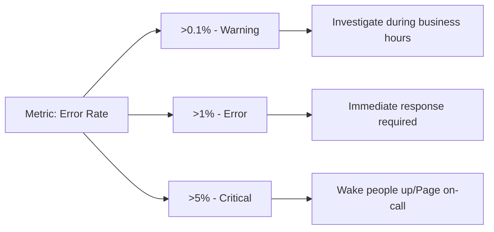

# Alerting Best Practices

## Introduction

Effective alerting is a critical component of any modern monitoring solution. When implemented properly, alerts help you identify and respond to issues before they impact users. However, poorly configured alerts can lead to alert fatigue, missed critical issues, and unnecessary stress for engineering teams.

This guide covers essential best practices for creating, managing, and responding to alerts in Grafana. Following these guidelines will help you build a reliable alerting system that maintains the right balance between actionability and signal-to-noise ratio.

## Understanding Alert Components in Grafana

Before diving into best practices, let's quickly review the key components of Grafana's alerting system:

- **Alert Rules**: Conditions that determine when an alert should fire
- **Alert Instances**: Individual alerts generated when conditions are met
- **Alert Groups**: Collections of related alerts
- **Notification Policies**: Rules that determine how alerts are routed to receivers
- **Silences**: Temporary suppressions of specific alerts
- **Contact Points**: Destinations where notifications are sent (email, Slack, etc.)

## Alerting Best Practices

### 1. Follow the "Actionable Alerts" Principle

**Every alert should be actionable**. When an alert fires, the recipient should know exactly what's happening and what action to take.

#### Example of a poor alert:
```
[ALERT] High CPU usage on server prod-app-01
```

#### Example of an improved, actionable alert:
```
[ALERT] High CPU usage (95%) on server prod-app-01 for >5 minutes
Impact: May affect customer response times
Action: Check for runaway processes or scale horizontally
Runbook: https://internal-docs/runbooks/high-cpu
```

### 2. Implement Multi-level Alerting Thresholds

Use multiple thresholds to create different severity levels for the same metric.



In Grafana Alert rules, this can be implemented by creating multiple rules with different thresholds:

```yaml
# Warning level
- name: ErrorRateWarning
  expr: sum(rate(http_requests_errors_total[5m])) / sum(rate(http_requests_total[5m])) > 0.001
  labels:
    severity: warning
  annotations:
    summary: "Error rate above 0.1%"
    
# Error level
- name: ErrorRateError
  expr: sum(rate(http_requests_errors_total[5m])) / sum(rate(http_requests_total[5m])) > 0.01
  labels:
    severity: error
  annotations:
    summary: "Error rate above 1%"
```

### 3. Establish Clear Alert Ownership

Every alert should have a clear owner (team or individual) who is responsible for responding.

Add ownership labels to your alert rules:

```yaml
- name: HighErrorRate
  expr: sum(rate(http_requests_errors_total[5m])) / sum(rate(http_requests_total[5m])) > 0.05
  labels:
    severity: critical
    team: frontend
    service: checkout
  annotations:
    summary: "High error rate in checkout service"
```

Then configure notification policies to route alerts based on these labels:

```yaml
routes:
  - receiver: frontend-team
    matchers:
      - team=frontend
```

### 4. Include Relevant Context in Alert Messages

Good alerts provide all the context needed to understand and respond to the issue:

- Clear description of the problem
- Affected system/service
- Severity level
- Impact on users
- Troubleshooting steps or runbook link
- Graphs or visualizations when possible

In Grafana, use annotations to add this context:

```yaml
- name: APILatencyHigh
  expr: histogram_quantile(0.99, sum(rate(api_request_duration_seconds_bucket[5m])) by (le, service)) > 0.5
  labels:
    severity: warning
  annotations:
    summary: "High API latency detected"
    description: "The 99th percentile latency for {{ $labels.service }} is {{ $value }}s, which exceeds the 0.5s threshold"
    impact: "Users may experience slower response times"
    action: "Check backend services and database query performance"
    dashboard: "https://grafana.example.com/d/api-performance"
    runbook: "https://internal-docs/runbooks/high-api-latency"
```

### 5. Use Appropriate Evaluation Intervals and For Durations

Avoid alerting on transient spikes by using appropriate durations:

- **For Duration**: How long a condition must be true before alerting
- **Evaluation Interval**: How often the rule is evaluated

Here's a general guideline:

| Alert Type | Evaluation Interval | For Duration |
|------------|---------------------|--------------|
| Critical | 30s - 1m | 1-2m |
| Warning | 1-5m | 5-15m |
| Information | 5-15m | 15-60m |

Example in Grafana:

```yaml
- name: HighCPUUsage
  expr: avg by (instance) (cpu_usage_idle) < 10
  for: 5m
  eval_interval: 1m
  labels:
    severity: warning
  annotations:
    summary: "High CPU usage on {{ $labels.instance }}"
```

### 6. Implement Alert Grouping Effectively

Group related alerts to reduce noise and provide better context. In Grafana, this can be done through notification policies:

```yaml
routes:
  - receiver: database-team
    group_by: ['alertname', 'cluster', 'service']
    group_wait: 30s
    group_interval: 5m
    repeat_interval: 4h
    matchers:
      - service=~"database.*"
```

This configuration:
- Groups alerts by name, cluster, and service
- Waits 30s before sending notifications for new groups
- Waits 5m before sending updates to an existing group
- Waits 4h before resending an alert if it hasn't been resolved

### 7. Set Up Proper Alert Testing

Test your alerts in non-production environments before deploying them to production.

In Grafana 9.0+, you can use test alert rules:

```javascript
// Example for testing in Grafana UI
// Go to Alerting > Alert Rules > New Alert Rule
// Configure your rule, then use "Test rule" before saving

// You can also test expressions separately
// Go to Alerting > New > Test data source queries
// Enter your query and see the results
```

### 8. Document Alert Remediation Steps

For each alert type, document:
- What the alert means
- How to diagnose the issue
- Steps to resolve it
- When to escalate

In Grafana, link to runbooks in your alert annotations:

```yaml
annotations:
  runbook: "https://wiki.example.com/runbooks/high_error_rate"
```

### 9. Regularly Review and Refine Your Alerts

Schedule regular reviews of your alerting system:
- Remove alerts that no longer provide value
- Adjust thresholds based on real-world data
- Update remediation steps as systems evolve
- Check for gaps in coverage

A practical approach is to keep an "alert journal" where you document:
- Alert fires that led to incidents
- False positives and their causes
- Missed incidents that should have triggered alerts

### 10. Use Composite Alerts for Complex Conditions

For complex scenarios, create composite alerts that combine multiple conditions:

```yaml
- name: ServiceDegradation
  expr: (rate(http_errors_total[5m]) / rate(http_requests_total[5m]) > 0.05) and (rate(http_requests_total[5m]) > 10)
  for: 5m
  labels:
    severity: warning
  annotations:
    summary: "Service experiencing degradation"
    description: "Error rate above 5% with significant traffic volume"
```

This alert only fires when both conditions are true:
1. Error rate is above 5%
2. Traffic volume is significant (>10 requests per second)

## Practical Example: Implementing a Complete Alerting Strategy

Let's walk through implementing a comprehensive alerting strategy for a web application.

### Step 1: Define Service Level Objectives (SLOs)

Start by defining what "healthy" means for your application:

```yaml
# Example SLOs
- Availability: 99.9% uptime
- Latency: 95% of requests < 200ms
- Error Rate: < 0.1% of requests
```

### Step 2: Create Multi-level Alerts for Each SLO

```yaml
# Availability Alerts
- name: AvailabilityWarning
  expr: avg_over_time(probe_success[10m]) < 0.995
  for: 5m
  labels:
    severity: warning
    
- name: AvailabilityCritical
  expr: avg_over_time(probe_success[5m]) < 0.99
  for: 1m
  labels:
    severity: critical

# Latency Alerts
- name: LatencyWarning
  expr: histogram_quantile(0.95, sum(rate(http_request_duration_seconds_bucket[5m])) by (le)) > 0.2
  for: 5m
  labels:
    severity: warning
    
- name: LatencyCritical
  expr: histogram_quantile(0.95, sum(rate(http_request_duration_seconds_bucket[5m])) by (le)) > 0.5
  for: 2m
  labels:
    severity: critical

# Error Rate Alerts
- name: ErrorRateWarning
  expr: sum(rate(http_requests_errors_total[5m])) / sum(rate(http_requests_total[5m])) > 0.001
  for: 5m
  labels:
    severity: warning
    
- name: ErrorRateCritical
  expr: sum(rate(http_requests_errors_total[5m])) / sum(rate(http_requests_total[5m])) > 0.01
  for: 2m
  labels:
    severity: critical
```

### Step 3: Configure Notification Policies

Structure your notification policies to ensure alerts reach the right people at the right time:

```yaml
# Root route
routes:
  # Critical alerts go to PagerDuty
  - receiver: pagerduty
    matchers:
      - severity=critical
    continue: true
    
  # Frontend team alerts
  - receiver: frontend-slack
    matchers:
      - team=frontend
    group_by: ['alertname', 'service']
    
  # Backend team alerts
  - receiver: backend-slack
    matchers:
      - team=backend
    group_by: ['alertname', 'service']
    
  # Default route (if no match)
  - receiver: default-slack
```

### Step 4: Set Up Contact Points

```yaml
# Contact point configurations
receivers:
  - name: pagerduty
    pagerduty_configs:
      - service_key: "your-pagerduty-service-key"
        
  - name: frontend-slack
    slack_configs:
      - channel: "#frontend-alerts"
        title: "{{ .GroupLabels.alertname }}"
        text: "{{ range .Alerts }}{{ .Annotations.description }}
{{ end }}"
        
  - name: backend-slack
    slack_configs:
      - channel: "#backend-alerts"
        title: "{{ .GroupLabels.alertname }}"
        text: "{{ range .Alerts }}{{ .Annotations.description }}
{{ end }}"
        
  - name: default-slack
    slack_configs:
      - channel: "#general-alerts"
        title: "{{ .GroupLabels.alertname }}"
        text: "{{ range .Alerts }}{{ .Annotations.description }}
{{ end }}"
```

## Common Alerting Anti-patterns to Avoid

### 1. Alert Spam

**Problem**: Sending too many alerts leads to alert fatigue, causing important alerts to be ignored.
**Solution**: Implement proper grouping, set appropriate thresholds, and regularly clean up noisy alerts.

### 2. Alerting on Non-Actionable Events

**Problem**: Alerts that don't require any action waste time and resources.
**Solution**: For each alert, ask: "What action would someone take when receiving this?" If there's no clear answer, it should probably be a dashboard metric, not an alert.

### 3. Lack of Alert Context

**Problem**: Alerts without context require additional investigation, delaying response.
**Solution**: Include relevant metrics, links to dashboards, and runbook references in alert notifications.

### 4. Relying on Email for Critical Alerts

**Problem**: Email is not reliable for urgent notifications, as it may be delayed or overlooked.
**Solution**: Use dedicated alerting channels like PagerDuty, OpsGenie, or phone calls for critical issues.

### 5. Missing Alerts for Key User Journeys

**Problem**: Technical alerts might miss user-impacting issues.
**Solution**: Implement synthetic monitoring and alerts for key user journeys in addition to technical metrics.

## Summary

Effective alerting is a balance between providing timely notifications for critical issues while avoiding overwhelming your team with noise. The best practices outlined in this guide will help you:

1. Create actionable alerts with clear ownership
2. Implement meaningful alert thresholds and durations
3. Provide rich context in alert notifications
4. Set up proper alert routing and grouping
5. Regularly review and refine your alerting strategy

By following these best practices, you'll build a robust alerting system that helps your team respond effectively to issues and maintain high-quality service for your users.

## Additional Resources

- [Grafana Alerting Documentation](https://grafana.com/docs/grafana/latest/alerting/)
- [Prometheus Alerting Best Practices](https://prometheus.io/docs/practices/alerting/)
- [Google's SRE Book: Practical Alerting](https://sre.google/sre-book/practical-alerting/)
- [Site Reliability Engineering Workbook: Implementing SLOs](https://sre.google/workbook/implementing-slos/)

## Exercises

1. Audit your existing alerts and identify any that aren't actionable. How would you improve them?
2. Create a multi-level alerting strategy for a service of your choice using warning and critical thresholds.
3. Design a notification routing policy that ensures alerts reach the appropriate teams.
4. Implement composite alerts for a complex scenario in your application.
5. Set up a regular alert review process for your team.