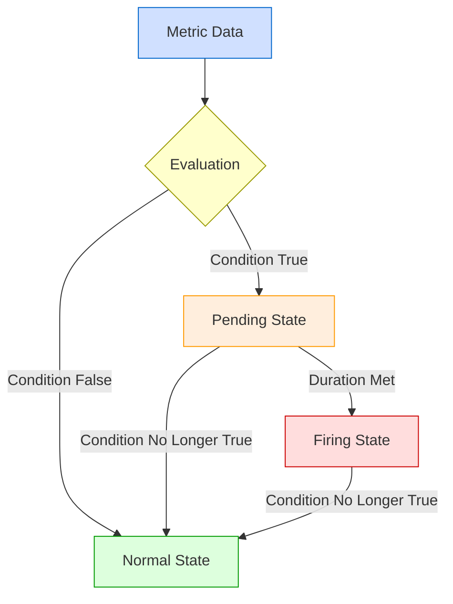

# Alert Conditions

## Introduction

Alert conditions are the heart of Grafana's alerting system. They define the specific criteria that must be met before an alert is triggered. Understanding how to properly configure alert conditions allows you to create precise monitoring rules that notify you only when truly necessary, reducing alert fatigue while ensuring you catch important events in your systems.

In this guide, we'll explore how alert conditions work in Grafana Alerting, how to configure them effectively, and provide practical examples for common monitoring scenarios.

## What Are Alert Conditions?

Alert conditions are expressions that evaluate your time series data and determine when an alert should fire. They typically include:

1. **A query or metric** - The data you want to monitor
2. **A condition** - The logical comparison to perform
3. **A threshold** - The value that triggers the alert
4. **Duration** - How long the condition must be true before firing

When these conditions are met, Grafana will change the alert state to "Pending" and then to "Firing" after the configured evaluation period.

## Basic Alert Condition Structure

In Grafana, alert conditions are configured as part of alert rules. Let's look at how to create a basic alert condition:

```javascript
// Basic alert condition structure
// A (query/metric) condition B (threshold) for C (duration)
avg() of query(A, 5m, now) is above 80 for 5m
```

This simple condition means: "If the average value of metric A exceeds 80 for at least 5 minutes, trigger an alert."

## Creating Alert Conditions

### Step 1: Access the Alerting Interface

Navigate to Grafana's alerting section by clicking on the bell icon in the left sidebar, then select "Alert rules."

### Step 2: Create a New Alert Rule

Click the "New alert rule" button to begin creating an alert with conditions.

### Step 3: Define Your Query

First, you need to define what data you want to monitor. This is done through Grafana's query editor:

```javascript
// Example PromQL query for CPU usage
100 - (avg by(instance) (rate(node_cpu_seconds_total{mode="idle"}[5m])) * 100)
```

### Step 4: Set the Condition

After defining your query, you need to set the condition that will trigger the alert:

```javascript
// Alert condition for CPU usage over 80%
IS ABOVE 80
```

### Step 5: Define Evaluation Behavior

Set how long the condition must be true before the alert fires:

```javascript
// Alert will fire if condition is true for 5 minutes
FOR 5m
```

## Types of Alert Conditions

Grafana supports several types of conditions for different monitoring needs:

### Threshold Conditions

The most common type of alert condition compares a metric against a fixed threshold.

```javascript
// Simple threshold condition
IS ABOVE 90
IS BELOW 10
IS OUTSIDE RANGE 10 TO 90
IS WITHIN RANGE 10 TO 90
```

### Multiple Conditions with Math and Functions

You can create more complex conditions using math, aggregations, and functions:

```javascript
// Complex condition example
(sum(rate(http_requests_total{status=~"5.."}[5m])) / sum(rate(http_requests_total[5m]))) * 100 > 5
```

This condition triggers when the error rate (HTTP 5xx status codes) exceeds 5% of total requests.

### Time-Based Conditions

Some alerts need to consider patterns over time:

```javascript
// Check if there are no data points received for 5 minutes
count_over_time(up[5m]) == 0
```

## Practical Examples

Let's explore some real-world examples of alert conditions for common monitoring scenarios:

### Example 1: High CPU Usage Alert

This alert triggers when CPU usage remains above 85% for more than 5 minutes:

```javascript
// CPU usage alert
avg by(instance) (100 - (rate(node_cpu_seconds_total{mode="idle"}[5m]) * 100)) > 85
```

### Example 2: Service Availability Alert

This alert fires when an endpoint returns non-200 status codes:

```javascript
// Service availability alert
sum(rate(http_requests_total{status!="200",route="/api/important"}[5m])) > 0
```

### Example 3: Disk Space Alert

Alert when disk space is running low (less than 10% free):

```javascript
// Low disk space alert
100 * (node_filesystem_free_bytes / node_filesystem_size_bytes) < 10
```

### Example 4: Spike Detection

Alert on sudden spikes in error rates:

```javascript
// Error rate spike detection
increase(app_exceptions_total[5m]) > 10
```

## Best Practices for Alert Conditions

Follow these guidelines to create effective alert conditions:

### 1. Avoid Alert Noise

Configure thresholds carefully to avoid alert fatigue:

```javascript
// Instead of a fixed threshold that might be too sensitive
http_request_duration_seconds > 0.1

// Consider using percentiles for more robust alerting
histogram_quantile(0.95, sum(rate(http_request_duration_seconds_bucket[5m])) by (le)) > 0.5
```

### 2. Use Appropriate Time Windows

Choose evaluation periods that match your system's behavior:

```javascript
// For metrics that fluctuate frequently, use longer evaluation periods
FOR 15m

// For critical systems that need immediate attention
FOR 1m
```

### 3. Include Labels and Annotations

Make your alerts informative by adding context:

```javascript
// Example labels and annotations configuration
labels:
  severity: warning
  category: performance
annotations:
  summary: "High CPU usage on {{$labels.instance}}"
  description: "CPU usage is above 85% for 5 minutes on {{$labels.instance}}"
```

## Advanced Alert Conditions

For more complex monitoring needs, Grafana offers advanced condition configurations:

### Multi-Dimensional Alerts

Alert on specific dimensions of your metrics:

```javascript
// Alert on high latency for specific API endpoints
max by(endpoint) (http_request_duration_seconds{endpoint=~"/api/.*"}) > 1
```

### Alerting on Absent Metrics

Detect when metrics stop reporting:

```javascript
// Alert when metric stops reporting
absent(up{job="important-service"} == 1)
```

### Relative Change Alerts

Alert on significant changes from normal:

```javascript
// Alert when traffic drops by more than 50% compared to last hour
sum(rate(http_requests_total[5m])) < sum(rate(http_requests_total[5m] offset 1h)) * 0.5
```

## Visualizing Alert Conditions

Grafana provides powerful visualization tools to help you set appropriate alert conditions. Let's create a diagram to illustrate how alert conditions work:



## Debugging Alert Conditions

When your alert conditions aren't working as expected, Grafana provides several debugging tools:

1. **Test Rule**: You can test your alert rule before saving it to see how it evaluates
2. **State History**: View the history of state changes for your alert
3. **Silence**: Temporarily silence alerts while you work on fixing issues

Example of using the alert testing feature:

```javascript
// Alert test
// In the Grafana UI, you can simulate how your alert would behave 
// using historical data by clicking "Test Rule"
```

## Summary

Alert conditions are the foundation of effective monitoring in Grafana. By understanding how to create precise, actionable conditions, you can build an alerting system that notifies you of real problems while avoiding unnecessary alerts. Remember these key points:

- Alert conditions consist of queries, thresholds, and durations
- Choose appropriate thresholds and evaluation periods for your specific use case
- Use labels and annotations to provide context for alert notifications
- Leverage Grafana's advanced features for complex monitoring needs

With the knowledge from this guide, you should be able to create effective alert conditions that help you maintain the health and performance of your systems.

## Additional Resources

- [Grafana Alerting Documentation](https://grafana.com/docs/grafana/latest/alerting/)
- [PromQL for Alert Conditions](https://prometheus.io/docs/prometheus/latest/querying/basics/)
- [Alert Condition Best Practices](https://grafana.com/blog/2020/02/25/step-by-step-guide-to-setting-up-prometheus-alertmanager-with-slack-pagerduty-and-gmail/)

## Exercises

1. Create an alert condition that triggers when memory usage exceeds 90% for more than 10 minutes.
2. Design an alert condition that detects when your application's error rate exceeds 1% of total requests.
3. Build a multi-condition alert that fires when both CPU usage is high and disk space is low.
4. Create an alert condition that detects when a service hasn't reported metrics for 5 minutes.