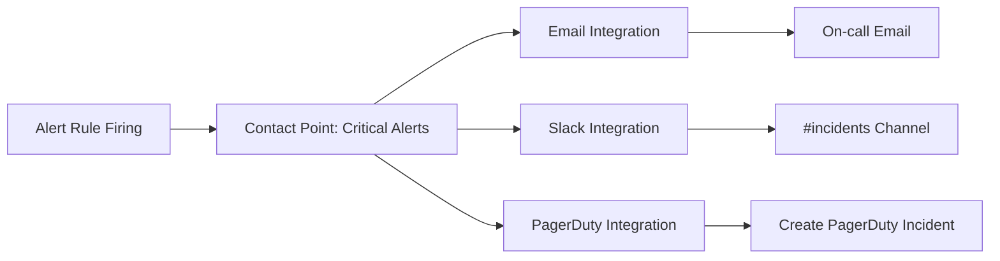

# Contact Points

## Introduction

Contact points are a crucial component of Grafana's alerting system. They define **how** and **where** alert notifications are sent when alert rules are triggered. Contact points enable you to route alert notifications to the right people through various communication channels like email, Slack, PagerDuty, or webhook integrations.

In this guide, you'll learn how to create, configure, and manage contact points in Grafana Alerting, empowering you to set up an effective notification system for your monitoring needs.

## Understanding Contact Points

A contact point consists of one or more notification integrations, each configured to send alerts to a specific destination. Contact points are the communication endpoints for alert notifications, ensuring your team is promptly informed when something goes wrong.

### Key Concepts

- **Contact Point**: A named endpoint that defines where alert notifications are sent
- **Integration**: A specific notification method within a contact point (email, Slack, etc.)
- **Notification Policy**: Determines which contact points receive notifications for specific alerts
- **Notification Templates**: Define the structure and content of alert notifications

## Creating a Contact Point

To create a new contact point in Grafana:

1. Navigate to **Alerting** in the left sidebar
2. Click the **Contact points** tab
3. Click **+ Add contact point**
4. Provide a name and select an integration type
5. Configure the integration settings
6. Click **Save contact point**

## Available Integrations

Grafana supports numerous notification integrations. Here are some of the most commonly used:

| Integration | Description |
|-------------|-------------|
| Email | Send notifications to email addresses |
| Slack | Send messages to Slack channels or users |
| PagerDuty | Create incidents in PagerDuty |
| Webhook | Send HTTP POST requests to custom endpoints |
| Microsoft Teams | Send messages to Teams channels |
| Discord | Send messages to Discord channels |
| Google Chat | Send messages to Google Chat rooms |
| OpsGenie | Create alerts in OpsGenie |
| VictorOps | Create incidents in VictorOps |
| Telegram | Send messages to Telegram chats |

## Example: Configuring an Email Contact Point

Let's create a contact point that sends alert notifications via email:

```jsx
// In the Grafana UI:
// Name: "DevOps Team Email"
// Integration: "Email"

// Configuration:
{
  "addresses": "devops@example.com, oncall@example.com",
  "singleEmail": false,
  "message": "{{ template \"default.message\" . }}",
  "subject": "[{{ .Status | toUpper }}] {{ .CommonLabels.alertname }}"
}
```

This configuration sends notifications to two email addresses and customizes the subject line to include the alert status and name.

## Example: Setting Up a Slack Contact Point

Here's how to configure a Slack contact point:

```jsx
// In the Grafana UI:
// Name: "Production Alerts"
// Integration: "Slack"

// Configuration:
{
  "recipient": "#production-alerts",
  "token": "${SLACK_API_TOKEN}",
  "title": "{{ template \"slack.default.title\" . }}",
  "text": "{{ template \"slack.default.text\" . }}",
  "mentionChannel": "here",
  "mentionUsers": "U012A3CDE,U234B5FGH"
}
```

This sends notifications to a Slack channel and mentions specific users and everyone currently active in the channel.

## Using Multiple Integrations

A single contact point can include multiple integrations to send the same alert to different destinations. This is useful for ensuring critical alerts reach your team through various channels.

Example of a contact point with multiple integrations:



## Notification Templates

Templates allow you to customize the content of your notifications. Grafana uses the Go templating language to enable dynamic content based on alert data.

### Example Template for a Webhook Integration

```jsx
// Template Name: "custom_webhook.tmpl"
{{define "custom_webhook" -}}
{
  "summary": "{{.CommonLabels.alertname}}",
  "timestamp": "{{$time}}",
  "status": "{{.Status}}",
  "instance": "{{.CommonLabels.instance}}",
  "severity": "{{.CommonLabels.severity}}",
  "description": "{{.CommonAnnotations.description}}",
  "values": [
    {{range .Alerts -}}
      {
        "labels": {{ .Labels | toJSON }},
        "annotations": {{ .Annotations | toJSON }},
        "value": "{{ .ValueString }}"
      },
    {{end -}}
  ]
}
{{- end}}
```

## Testing Contact Points

Before relying on a contact point in production, it's important to test it. Grafana provides a convenient way to test contact points:

1. Navigate to the Contact points tab
2. Find your contact point in the list
3. Click the three dots menu (⋮)
4. Select **Test**
5. A test notification will be sent through the configured integration(s)

## Common Contact Point Patterns

### Tiered Alerting

Create different contact points for different alert severities:

- **Low Severity**: Email notification to a general team address
- **Medium Severity**: Slack message to the relevant team channel
- **High Severity**: PagerDuty incident + SMS + Slack with @here mention

### Business Hours vs. After Hours

Configure different contact points based on time of day:

- **Business Hours**: Slack notifications to team channel
- **After Hours**: PagerDuty to notify on-call personnel

### Team-Based Routing

Create contact points for different teams:

- **DevOps Team**: Notifications to devops@example.com and #devops Slack channel
- **Database Team**: Notifications to dba@example.com and #database Slack channel

## Working with Contact Points Programmatically

You can also manage contact points using the Grafana HTTP API:

```bash
# Create a new contact point
curl -X POST -H "Content-Type: application/json" \
  -H "Authorization: Bearer YOUR_API_KEY" \
  http://your-grafana-instance/api/alertmanager/grafana/config/api/v1/receivers \
  -d '{
    "name": "api-created-contact-point",
    "grafana_managed_receiver_configs": [
      {
        "type": "email",
        "name": "email-notification",
        "settings": {
          "addresses": "team@example.com"
        }
      }
    ]
  }'
```

## Troubleshooting Contact Points

If you're not receiving alert notifications, check these common issues:

1. **Integration Configuration**: Verify that API tokens, email addresses, and other settings are correct
2. **Network Connectivity**: Ensure Grafana can reach the external service (Slack, email server, etc.)
3. **Rate Limiting**: Some services impose rate limits on notifications
4. **Authentication**: Check if credentials or tokens have expired
5. **Notification Policies**: Verify that your notification policies correctly route alerts to this contact point

## Exercise: Creating a Multi-Channel Contact Point

Try creating a contact point that sends critical alerts to multiple channels:

1. Create a new contact point named "Critical Systems Alert"
2. Add an email integration that sends to your team's email
3. Add a Slack integration that posts to a team channel
4. Configure custom templates for better readability
5. Test the contact point to ensure notifications are delivered properly

## Summary

Contact points are the communication endpoints in Grafana Alerting that determine where and how alert notifications are delivered. By configuring the right contact points, you can ensure that the right people are notified through the right channels when issues arise.

Key takeaways:

- Contact points define **where** notifications are sent when alerts fire
- A single contact point can have multiple integrations for different notification channels
- Templates allow you to customize notification content
- Testing contact points is crucial before using them in production
- You can create sophisticated notification strategies using different contact points for different scenarios

## Additional Resources

- [Grafana Alerting Documentation](https://grafana.com/docs/grafana/latest/alerting/)
- [Notification Templates Reference](https://grafana.com/docs/grafana/latest/alerting/manage-notifications/template-notifications/)
- [Alert Notification Troubleshooting](https://grafana.com/docs/grafana/latest/alerting/troubleshoot-alerts/)