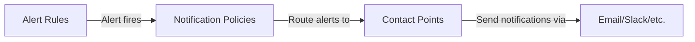

# Notification Policies

## Introduction

Notification policies are a crucial component of Grafana's alerting system. They define **how**, **when**, and **where** alert notifications are sent when an alert rule fires. Think of notification policies as the traffic controllers of your alerting system - they determine the routing rules for your alerts, ensuring that the right people or systems are notified about specific alerts at the right time.

In this guide, we'll explore how notification policies work in Grafana, how to configure them effectively, and how they fit into the overall alerting workflow.

## Understanding Notification Policies

### What is a Notification Policy?

A notification policy is a set of rules that determines:

1. Which contact points receive notifications for specific alerts
2. When those notifications are sent (including grouping, timing, and muting)
3. How alerts are grouped together in notifications

Notification policies work together with contact points and alert rules to create a complete alerting workflow:



### The Notification Policy Tree

Grafana organizes notification policies in a hierarchical tree structure. At the top is the root policy, which serves as the default policy. You can then create nested policies with more specific matching criteria.

When an alert fires, Grafana evaluates it against all notification policies, starting from the most specific and moving up to more general ones, until it finds a matching policy.

## Configuring Notification Policies

To access notification policies in Grafana:

1. Navigate to the Alerting section in the Grafana sidebar
2. Select "Notification policies"

### Creating a Root Notification Policy

The root policy is created automatically and serves as the fallback for all alerts. You can configure it with these settings:

- **Default contact point**: The default destination for all alerts
- **Group by**: How alerts are grouped in notifications
- **Timing options**: When and how frequently notifications are sent

Example root policy configuration:

```yaml
default_contact_point: "email-team"
group_by: ['alertname', 'grafana_folder']
group_wait: 30s
group_interval: 5m
repeat_interval: 4h
```

### Creating Nested Notification Policies

To create more specific routing rules, you can add nested policies:

1. In the Notification policies page, click "Add nested policy"
2. Define the matching criteria (labels that alerts must match)
3. Configure the policy settings
4. Add the policy to the tree

Here's an example of a nested policy structure:

```yaml
# Root policy
- contact_point: general-alerts
  group_by: ['alertname', 'grafana_folder']
  
  # Nested policy for database alerts
  - matchers: [severity = 'critical', service = 'database']
    contact_point: database-team
    group_by: ['instance']
    
    # Further nested policy for specific DB cluster
    - matchers: [cluster = 'production-main']
      contact_point: database-oncall
      mute_timings: ['business-hours']
      group_wait: 10s
```

## Important Configuration Options

### Matchers

Matchers determine which alerts a policy applies to. They work on the labels attached to your alerts:

```yaml
matchers:
  - severity = 'critical'
  - service =~ 'database.*'  # Regex matching
  - environment != 'testing'
```

### Group By

The "group by" option controls how alerts are grouped in notifications:

```yaml
# Group alerts by name and environment
group_by: ['alertname', 'environment']

# Group all matching alerts together
group_by: []

# Preserve all labels, essentially no grouping
group_by: ['...']
```

### Timing Options

These settings control notification timing:

- **Group wait**: Initial delay before sending a notification after an alert fires
- **Group interval**: Minimum time between sending update notifications
- **Repeat interval**: How often to resend notifications for active alerts

```yaml
# Example timing settings
group_wait: 30s       # Wait 30s after first alert
group_interval: 5m    # Send updates every 5 minutes
repeat_interval: 4h   # Repeat notifications every 4 hours
```

### Mute Timings

You can configure periods when notifications are suppressed:

```yaml
mute_timings: ['weekends', 'maintenance-window']
```

## Practical Examples

### Example 1: Different Teams for Different Services

In this example, we'll route alerts to different teams based on the service that's affected:

```yaml
# Root policy
- contact_point: general-ops
  group_by: ['alertname', 'severity']
  
  # Database team
  - matchers: [service = 'database']
    contact_point: database-team
    group_by: ['instance']
  
  # Frontend team
  - matchers: [service = 'frontend']
    contact_point: frontend-team
    group_by: ['cluster']
    
  # Infrastructure team - critical alerts
  - matchers: [category = 'infrastructure', severity = 'critical']
    contact_point: infra-oncall
    group_wait: 0s  # No delay for critical infra alerts
```

### Example 2: Different Notification Policies for Working Hours

This example shows how to route alerts differently during working hours vs. after hours:

```yaml
# Root policy
- contact_point: email-general
  group_by: ['alertname']
  
  # During business hours - use Slack
  - matchers: [severity = 'warning']
    contact_point: slack-support
    mute_timings: ['after-hours']
    
  # After hours - page on-call for critical only
  - matchers: [severity = 'critical']
    contact_point: pagerduty-oncall
    mute_timings: ['business-hours']
```

## Working with Notification Policies via API

You can manage notification policies programmatically using Grafana's API:

```bash
# Get all notification policies
curl -X GET -H "Authorization: Bearer $GRAFANA_API_KEY" \
  https://your-grafana-instance/api/v1/provisioning/policies

# Update notification policies
curl -X PUT -H "Authorization: Bearer $GRAFANA_API_KEY" \
  -H "Content-Type: application/json" \
  -d @policies.json \
  https://your-grafana-instance/api/v1/provisioning/policies
```

## Best Practices

### Policy Organization

1. **Start simple**: Begin with a basic policy structure and add complexity as needed
2. **Use consistent labels**: Create a standardized set of labels for your alerts
3. **Think hierarchically**: Structure policies from most specific to most general

### Performance Considerations 

1. **Avoid over-grouping**: Too many "group by" values can lead to notification storms
2. **Set reasonable timing**: Configure appropriate intervals to avoid notification fatigue
3. **Use mute timings**: Suppress non-critical alerts during maintenance or off-hours

### Labels and Matching

1. **Use descriptive labels**: Make labels like `severity`, `environment`, and `service` consistent
2. **Leverage regex matching**: Use regex (`=~`) for flexible matching
3. **Combine matchers**: Use multiple matchers to create precise routing rules

## Troubleshooting

### Common Issues

1. **Alerts not being routed**: Check your label matchers and ensure alerts have the expected labels
2. **Too many notifications**: Review your grouping and timing settings
3. **Missing notifications**: Verify that contact points are configured correctly

### Debugging Tips

Use Grafana's built-in tools to troubleshoot notification policies:

1. Check the Alert instances view to see which labels your alerts have
2. Review the state history to see how alerts were processed
3. Test your notification policies with the alert testing feature

```yaml
# Example test alert with labels to match policies
labels:
  severity: critical
  service: database
  instance: db-prod-01
```

## Summary

Notification policies are a powerful feature in Grafana Alerting that give you fine-grained control over how, when, and where alert notifications are sent. They allow you to:

- Route different alerts to different teams or channels
- Control the timing and frequency of notifications
- Group related alerts together
- Silence notifications during specific periods

By effectively configuring notification policies, you can ensure the right people are notified about the right issues at the right time, reducing alert fatigue and improving your team's ability to respond to problems quickly.

## Additional Resources

- [Grafana Official Documentation on Notification Policies](https://grafana.com/docs/grafana/latest/alerting/manage-notifications/notifications/)
- [Alert Grouping Best Practices](https://grafana.com/docs/grafana/latest/alerting/fundamentals/alert-rules/rule-evaluation/)
- [Contact Point Configuration Guide](https://grafana.com/docs/grafana/latest/alerting/manage-notifications/create-manage-contact-points/)

## Exercises

1. Create a notification policy structure for a hypothetical application with frontend, backend, and database components
2. Configure different notification timing settings for warnings vs. critical alerts
3. Set up a policy that only notifies during business hours for non-critical alerts
4. Create a policy that routes alerts to different teams based on which part of your infrastructure is affected