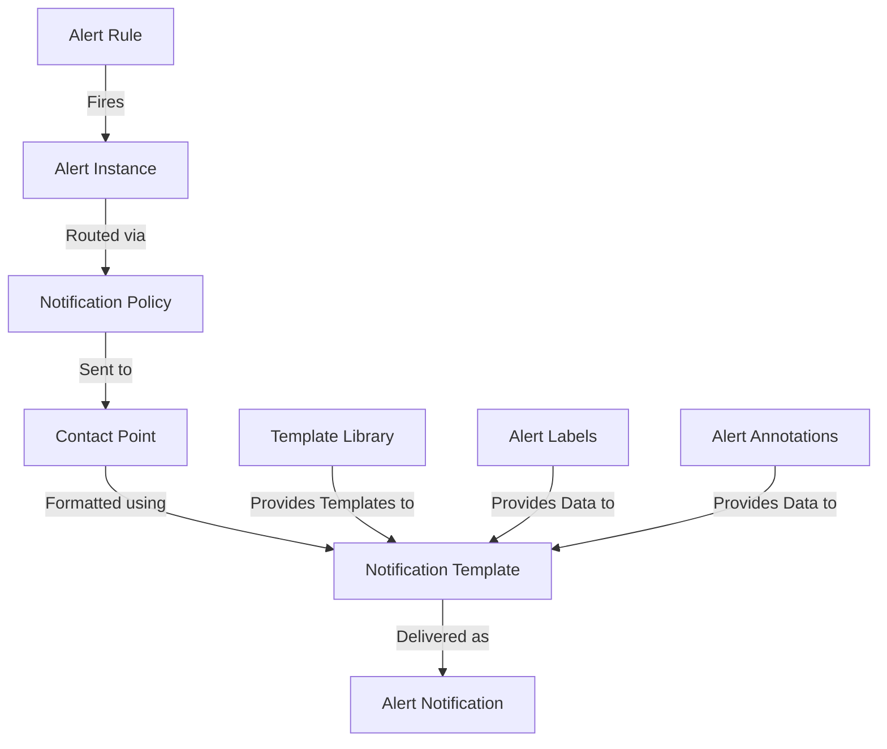

# Notification Templates

## Introduction

Notification templates in Grafana Alerting allow you to customize the content and format of alert notifications sent to various contact points. Instead of sending generic alert messages, templates enable you to include specific alert details, format the information according to your needs, and create a more useful notification experience for your team.

In this guide, you'll learn how to create and configure notification templates in Grafana, understand the templating syntax, and see practical examples of templates for different notification channels.

## Understanding Notification Templates

### What are Notification Templates?

Notification templates are customizable message formats that determine what information is included in your alert notifications and how it's presented. Templates use Grafana's template language, which is based on Go's [text/template](https://golang.org/pkg/text/template/) package, with some additional functions and data structures specific to Grafana alerting.

### Why Use Notification Templates?

- **Customization**: Tailor notifications to include exactly the information you need
- **Consistency**: Maintain uniform formatting across all alert notifications
- **Clarity**: Format alerts to highlight the most important information
- **Integration**: Optimize notifications for different channels (Slack, email, etc.)

## Template Basics

Grafana uses the Go templating language for notification templates. Here's a quick overview of the basic syntax:

| Syntax | Description |
|--------|-------------|
| `{{ .Variable }}` | Outputs the value of a variable |
| `{{ if condition }}...{{ else }}...{{ end }}` | Conditional statement |
| `{{ range .Items }}...{{ end }}` | Iteration over a collection |
| `{{ template "name" . }}` | Include another template |
| `{{ define "name" }}...{{ end }}` | Define a new template |

## Available Variables in Templates

When crafting notification templates, you have access to various data about the alert:

- `{{ .Labels }}` - Labels attached to the alert
- `{{ .Annotations }}` - Annotations providing additional alert information
- `{{ .StartsAt }}` - When the alert started firing
- `{{ .EndsAt }}` - When the alert stopped firing (if resolved)
- `{{ .Values }}` - The values of the alert's condition
- `{{ .GeneratorURL }}` - URL to the Grafana dashboard or panel
- `{{ .SilenceURL }}` - URL to silence the alert
- `{{ .DashboardURL }}` - URL to the dashboard containing the alerting rule
- `{{ .PanelURL }}` - URL to the panel containing the alerting rule
- `{{ .Fingerprint }}` - Unique identifier for the alert

## Creating Your First Template

Let's create a simple notification template for Slack:

```
{{ define "myalert.slack.title" }}
  [{{ .Status | toUpper }}] {{ .Labels.alertname }}
{{ end }}

{{ define "myalert.slack.message" }}
  *Alert:* {{ .Labels.alertname }}
  *Severity:* {{ .Labels.severity }}
  *Summary:* {{ .Annotations.summary }}
  *Description:* {{ .Annotations.description }}
  *Started:* {{ .StartsAt | since }}
  {{ if ne .Status "resolved" }}
  *Value:* {{ index .Values 0 }}
  {{ end }}
{{ end }}
```

This template creates two sections:
1. A title that shows the alert status and name
2. A message body with details about the alert

## Setting Up Templates in Grafana

To use templates in Grafana:

1. Navigate to **Alerting** in the Grafana sidebar
2. Select **Contact points**
3. Create a new contact point or edit an existing one
4. In the integration settings, you'll find options to add custom templates

### Example: Email Template Configuration

Here's an example of configuring an email contact point with a custom template:

```
{{ define "email.subject" }}
[{{ .Status | toUpper }}] {{ .Labels.alertname }}
{{ end }}

{{ define "email.message" }}
<h2>Alert: {{ .Labels.alertname }}</h2>
<p><strong>Severity:</strong> {{ .Labels.severity }}</p>
<p><strong>Summary:</strong> {{ .Annotations.summary }}</p>
<p><strong>Description:</strong> {{ .Annotations.description }}</p>
<p><strong>Started:</strong> {{ .StartsAt.Format "2006-01-02 15:04:05" }}</p>
{{ if eq .Status "firing" }}
<p><strong>Current Value:</strong> {{ index .Values 0 }}</p>
{{ end }}
<hr />
<p><a href="{{ .GeneratorURL }}">View in Grafana</a></p>
{{ end }}
```

## Template Functions

Grafana extends the Go template language with several useful functions:

| Function | Description | Example |
|----------|-------------|---------|
| `toUpper` | Converts text to uppercase | `{{ .Status \| toUpper }}` |
| `toLower` | Converts text to lowercase | `{{ .Status \| toLower }}` |
| `title` | Converts to title case | `{{ .Status \| title }}` |
| `reReplaceAll` | Regex replacement | `{{ reReplaceAll "pattern" "replacement" .Text }}` |
| `stringSlice` | Creates a slice of strings | `{{ stringSlice "a" "b" "c" }}` |
| `join` | Joins a slice with a separator | `{{ join .Labels ", " }}` |
| `safeHtml` | Marks string as safe HTML | `{{ .Body \| safeHtml }}` |
| `since` | Time since timestamp | `{{ .StartsAt \| since }}` |

## Advanced Template Techniques

### Conditional Formatting

You can use conditions to change how alerts are displayed based on their properties:

```
{{ define "alert.message" }}
  {{ if eq .Labels.severity "critical" }}
  🚨 *CRITICAL ALERT* 🚨
  {{ else if eq .Labels.severity "warning" }}
  ⚠️ *WARNING* ⚠️
  {{ else }}
  ℹ️ *INFO* ℹ️
  {{ end }}
  
  {{ .Annotations.summary }}
{{ end }}
```

### Looping Through Labels and Annotations

Loop through all labels or annotations to display them:

```
{{ define "alert.details" }}
*Alert Details:*
{{ range $key, $value := .Labels }}
  - {{ $key }}: {{ $value }}
{{ end }}

*Additional Information:*
{{ range $key, $value := .Annotations }}
  - {{ $key }}: {{ $value }}
{{ end }}
{{ end }}
```

### Grouping Alerts in Notifications

When multiple alerts fire simultaneously, you can format them as a group:

```
{{ define "alerts.summary" }}
{{ len .Alerts }} alert(s) {{ .Status }}:
{{ range .Alerts }}
  - {{ .Labels.alertname }}: {{ .Annotations.summary }}
{{ end }}
{{ end }}
```

## Real-World Examples

### Slack Notification Template

Here's a comprehensive template for Slack notifications:

```
{{ define "custom.slack.title" }}
[{{ .Status | toUpper }}] {{ if .Alerts.Firing }}{{ .Alerts.Firing | len }} firing{{ end }}{{ if and .Alerts.Firing .Alerts.Resolved }} and {{ end }}{{ if .Alerts.Resolved }}{{ .Alerts.Resolved | len }} resolved{{ end }} alert(s)
{{ end }}

{{ define "custom.slack.message" }}
{{ if .Alerts.Firing }}
*Firing Alerts:*
{{ range .Alerts.Firing }}
• *{{ .Labels.alertname }}* - {{ .Annotations.summary }}
  *Severity:* {{ .Labels.severity }}
  *Started:* {{ .StartsAt | since }}
  *Value:* {{ index .Values 0 }}
  *Dashboard:* <{{ .DashboardURL }}|View Dashboard>
{{ end }}
{{ end }}

{{ if .Alerts.Resolved }}
*Resolved Alerts:*
{{ range .Alerts.Resolved }}
• *{{ .Labels.alertname }}* - {{ .Annotations.summary }}
  *Severity:* {{ .Labels.severity }}
  *Resolved:* {{ .EndsAt | since }}
  *Dashboard:* <{{ .DashboardURL }}|View Dashboard>
{{ end }}
{{ end }}
{{ end }}
```

### Email Notification Template

A template formatted for email notifications:

```
{{ define "custom.email.subject" }}
[Grafana] {{ .Status | toUpper }}: {{ range .Alerts.Firing }}{{ .Labels.alertname }}{{ end }}{{ if gt (len .Alerts.Firing) 1 }} and {{ sub (len .Alerts.Firing) 1 }} more{{ end }}
{{ end }}

{{ define "custom.email.html" }}
<!DOCTYPE html>
<html>
<head>
  <style>
    body { font-family: Arial, sans-serif; }
    .alert { padding: 15px; margin-bottom: 10px; border-radius: 4px; }
    .firing { background-color: #ffebee; border-left: 5px solid #f44336; }
    .resolved { background-color: #e8f5e9; border-left: 5px solid #4caf50; }
    h3 { margin-top: 0; }
    table { border-collapse: collapse; width: 100%; }
    th, td { text-align: left; padding: 8px; border-bottom: 1px solid #ddd; }
    th { background-color: #f2f2f2; }
  </style>
</head>
<body>
  <h2>Grafana Alert Notification</h2>
  
  {{ if .Alerts.Firing }}
  <h3>Firing Alerts ({{ .Alerts.Firing | len }})</h3>
  {{ range .Alerts.Firing }}
  <div class="alert firing">
    <h3>{{ .Labels.alertname }}</h3>
    <p><strong>Summary:</strong> {{ .Annotations.summary }}</p>
    <p><strong>Description:</strong> {{ .Annotations.description }}</p>
    <table>
      <tr>
        <th>Severity</th>
        <td>{{ .Labels.severity }}</td>
      </tr>
      <tr>
        <th>Started</th>
        <td>{{ .StartsAt.Format "Jan 02, 2006 15:04:05 MST" }}</td>
      </tr>
      <tr>
        <th>Value</th>
        <td>{{ index .Values 0 }}</td>
      </tr>
    </table>
    <p><a href="{{ .DashboardURL }}">View Dashboard</a> | <a href="{{ .SilenceURL }}">Silence Alert</a></p>
  </div>
  {{ end }}
  {{ end }}
  
  {{ if .Alerts.Resolved }}
  <h3>Resolved Alerts ({{ .Alerts.Resolved | len }})</h3>
  {{ range .Alerts.Resolved }}
  <div class="alert resolved">
    <h3>{{ .Labels.alertname }}</h3>
    <p><strong>Summary:</strong> {{ .Annotations.summary }}</p>
    <table>
      <tr>
        <th>Severity</th>
        <td>{{ .Labels.severity }}</td>
      </tr>
      <tr>
        <th>Started</th>
        <td>{{ .StartsAt.Format "Jan 02, 2006 15:04:05 MST" }}</td>
      </tr>
      <tr>
        <th>Resolved</th>
        <td>{{ .EndsAt.Format "Jan 02, 2006 15:04:05 MST" }}</td>
      </tr>
    </table>
    <p><a href="{{ .DashboardURL }}">View Dashboard</a></p>
  </div>
  {{ end }}
  {{ end }}
</body>
</html>
{{ end }}
```

### PagerDuty Template

A template for PagerDuty notifications:

```
{{ define "custom.pagerduty.summary" }}
[{{ .Status | toUpper }}] {{ range .Alerts.Firing }}{{ .Labels.alertname }}{{ end }}{{ if gt (len .Alerts.Firing) 1 }} and {{ sub (len .Alerts.Firing) 1 }} more{{ end }}
{{ end }}

{{ define "custom.pagerduty.details" }}
{{ if .Alerts.Firing }}
Firing Alerts:
{{ range .Alerts.Firing }}
- Alert: {{ .Labels.alertname }}
  Summary: {{ .Annotations.summary }}
  Severity: {{ .Labels.severity }}
  Started: {{ .StartsAt.Format "2006-01-02 15:04:05 MST" }}
  Value: {{ index .Values 0 }}
  Dashboard: {{ .DashboardURL }}
{{ end }}
{{ end }}

{{ if .Alerts.Resolved }}
Resolved Alerts:
{{ range .Alerts.Resolved }}
- Alert: {{ .Labels.alertname }}
  Summary: {{ .Annotations.summary }}
  Severity: {{ .Labels.severity }}
  Started: {{ .StartsAt.Format "2006-01-02 15:04:05 MST" }}
  Resolved: {{ .EndsAt.Format "2006-01-02 15:04:05 MST" }}
  Duration: {{ duration (sub .EndsAt.Unix .StartsAt.Unix) }}
  Dashboard: {{ .DashboardURL }}
{{ end }}
{{ end }}
{{ end }}
```

## Notification Template Best Practices

1. **Keep it concise**: Include only the most important information in the initial notification
2. **Use proper formatting**: Make use of bold, italic, and other formatting options for readability
3. **Include actionable links**: Add links to dashboards, silence URLs, and runbooks
4. **Group related alerts**: Combine related alerts to reduce notification fatigue
5. **Show context**: Include relevant metric values and threshold information
6. **Use conditional formatting**: Adjust message format based on severity or alert type
7. **Test your templates**: Always verify how your templates render with different alert scenarios
8. **Consider the notification channel**: Format differently for email, Slack, PagerDuty, etc.

## Troubleshooting Templates

### Common Template Errors

1. **Variable not found**: Make sure you're using available variables (e.g., `.Labels.alertname`)
2. **Incorrect function usage**: Check the syntax of template functions
3. **Missing end tags**: Ensure all `if`, `range`, and `define` blocks have matching `end` tags
4. **Incorrect indexing**: When accessing array values, use the correct index format (e.g., `index .Values 0`)

### Debugging Tips

- Use the `{{ printf "%#v" .Variable }}` debug technique to see the full structure of a variable
- Test templates with sample data before implementing them in production
- Start with simple templates and gradually add complexity

### Validating Templates

Grafana doesn't have a built-in template validator, but you can:

1. Create a test alert rule with similar labels and annotations
2. Trigger the alert manually
3. Check if the notification renders as expected

## Advanced Template Examples

### Creating a Template with a Runbook Link

```
{{ define "myalert.message" }}
  {{ if .Annotations.runbook_url }}
  [🔧 Runbook]({{ .Annotations.runbook_url }})
  {{ end }}
  
  {{ .Annotations.description }}
  
  {{ if .Labels.service }}
  *Service:* {{ .Labels.service }}
  {{ end }}
{{ end }}
```

### Severity-Based Formatting

```
{{ define "severity.color" }}
  {{ if eq .Labels.severity "critical" }}#FF0000{{ end }}
  {{ if eq .Labels.severity "warning" }}#FFA500{{ end }}
  {{ if eq .Labels.severity "info" }}#5BC0DE{{ end }}
{{ end }}
```

### Including Metric Data

```
{{ define "metrics.details" }}
Current Value: {{ humanizePercentage (index .Values 0) }}
Threshold: {{ .Annotations.threshold }}{{ if .Annotations.unit }}{{ .Annotations.unit }}{{ end }}

{{ if .Annotations.grafana_url }}
[View Graph]({{ .Annotations.grafana_url }})
{{ end }}
{{ end }}
```

## Workflow Diagram

The following diagram illustrates how notification templates fit into the Grafana Alerting workflow:



## Summary

Notification templates are a powerful feature in Grafana Alerting that allow you to customize how alert notifications appear across different contact points. With templates, you can:

- Format alert information for better readability
- Include relevant context and actionable links
- Optimize notifications for different channels
- Group related alerts to reduce notification fatigue
- Apply conditional formatting based on alert properties

By mastering notification templates, you can significantly improve your team's alert response workflow and ensure that the right information reaches the right people in the most effective format.

## Additional Resources

- Practice creating different templates for various notification channels
- Experiment with different formatting techniques for critical vs. non-critical alerts
- Create a library of reusable templates for your organization
- Consider implementing a standard for alert notifications across teams

## Exercises

1. Create a basic template that displays alert name, severity, and a summary
2. Extend your template to include conditional formatting based on severity
3. Build a template that groups multiple alerts by service or component
4. Design a template specifically optimized for mobile notifications
5. Create a comprehensive template that includes links to dashboards, runbooks, and silence URLs