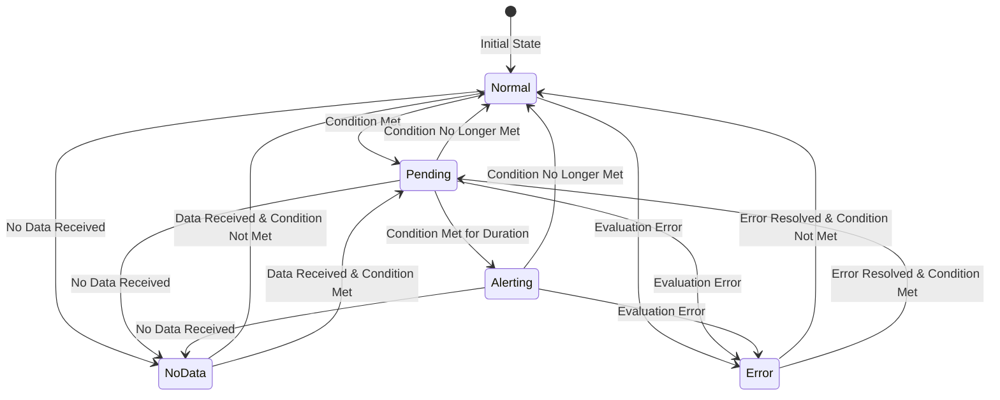

# Alert States

## Introduction

Alert states are a fundamental concept in Grafana Alerting that help you understand the current condition of your monitored systems. When you set up alerts in Grafana, each alert rule can exist in different states that reflect the health and status of the resources you're monitoring. Understanding these states is crucial for effective alerting and incident response.

In this guide, we'll explore the different alert states in Grafana, how they transition between each other, and how to interpret and work with them in your monitoring setup.

## Core Alert States

In Grafana Alerting, there are several core states that an alert rule can be in at any given time:

### Normal

The `Normal` state indicates that the alert rule is being evaluated and the condition is not met. This is the ideal state, signifying that everything is functioning as expected.

### Alerting

The `Alerting` state indicates that the alert rule is being evaluated and the condition is met. This means that something abnormal has been detected and requires attention.

### Pending

The `Pending` state is a transitional state between `Normal` and `Alerting`. When an alert condition is met for the first time, the alert doesn't immediately transition to the `Alerting` state. Instead, it enters the `Pending` state for a defined period (known as the "pending period"). This helps prevent alert flapping due to transient issues.

### No Data

The `No Data` state indicates that the alert rule is being evaluated but there is no data to evaluate. This could mean that your data source is not returning any data for the query, which might indicate a problem with your data collection.

### Error

The `Error` state indicates that there was an error during the evaluation of the alert rule. This could be due to various issues such as a malformed query, problems with the data source, or other evaluation errors.

## Alert State Transitions

Understanding how alerts transition between states is essential for configuring effective alerting policies. Let's explore the typical flow of alert state transitions:

<div className="mermaid-wrapper">

</div>

The state transitions follow these rules:

1. All alerts begin in the `Normal` state upon creation.
2. When a condition is met, the alert moves to `Pending` for the configured pending period.
3. If the condition remains true throughout the pending period, the alert transitions to `Alerting`.
4. If at any point the condition is no longer met, the alert returns to `Normal`.
5. If data stops flowing or an error occurs, the alert transitions to `NoData` or `Error` respectively.

## Configuring Alert States

You can configure how Grafana handles different alert states in your alert rules. Here's how to set up basic alert state configurations using the Grafana UI:

### Setting Up Alert Rules with State Configurations

1. Navigate to the Alerting section in Grafana
2. Create a new alert rule or edit an existing one
3. Configure the following state-related settings:

**Pending Period:**
```
For: 5m
```

This tells Grafana to wait 5 minutes in the `Pending` state before transitioning to `Alerting` if the condition remains true.

**No Data Handling:**
```
If no data or all values are null: NoData
```

This configures how the alert should behave when no data is received.

**Error Handling:**
```
If execution error or timeout: Alerting
```

This determines what state the alert should transition to if there's an evaluation error.

## Practical Example: Database Connection Monitoring

Let's walk through a practical example of how alert states work when monitoring database connections.

### Scenario

You want to monitor the number of active connections to your database and alert when it exceeds a certain threshold.

### Alert Rule Configuration

```javascript
// Alert rule query
max(mysql_global_status_threads_connected) > 100
```

**Alert settings:**
```
For: 2m
No Data: NoData
Error: Error
```

### Alert State Lifecycle

1. **Normal State**: The connection count is below 100
2. **Connection Spike**: At 10:00 AM, the connections jump to 120
3. **Pending State**: The alert enters `Pending` state at 10:00 AM
4. **Decision Point**: At 10:02 AM (after 2 minutes):
   - If connections are still above 100, the alert transitions to `Alerting`
   - If connections have dropped below 100, the alert returns to `Normal`
5. **Database Outage**: If the database goes down completely at 10:05 AM
   - The alert transitions to `NoData` as no metrics are being received

### Visualizing the States

Here's how this scenario would look in the Grafana Alert UI:

```
10:00 AM | Normal    | 95 connections
10:01 AM | Pending   | 120 connections
10:02 AM | Alerting  | 130 connections
10:03 AM | Alerting  | 125 connections
10:04 AM | Alerting  | 105 connections
10:05 AM | NoData    | No data points
```

## Alert State API

For users integrating with Grafana programmatically, Grafana provides API endpoints to fetch the current state of alerts. Here's a basic example of fetching alert states using the API:

```bash
# Fetch all alert states
curl -H "Authorization: Bearer YOUR_API_KEY" https://your-grafana-instance/api/alertmanager/alerts

# Response example
[
  {
    "labels": {
      "alertname": "HighDatabaseConnections",
      "severity": "warning",
      "instance": "database-1"
    },
    "annotations": {
      "summary": "High number of database connections",
      "description": "Database connection count is high: 130"
    },
    "state": "alerting",
    "activeAt": "2023-04-12T10:02:00Z",
    "value": "130"
  }
]
```

## Best Practices for Alert States

When working with alert states in Grafana, consider these best practices:

1. **Configure appropriate pending periods**: Set pending periods that match the criticality of the system. Critical systems might have shorter pending periods (1-2 minutes), while less critical systems can have longer ones (5-15 minutes).

2. **Handle NoData and Error states appropriately**: Decide whether a lack of data is itself an alert condition. For critical metrics, you might want to treat `NoData` as `Alerting`.

3. **Use Alert State for routing**: Configure notifications differently based on alert states. For example, `Pending` alerts might only notify Slack, while `Alerting` might escalate to PagerDuty.

4. **Review Alert State history**: Regularly check the history of alert state transitions to identify patterns and tune your alerting rules.

5. **Group similar alerts**: Configure alert grouping to prevent floods of notifications when multiple related systems enter an `Alerting` state simultaneously.

## Troubleshooting Alert States

If your alerts aren't transitioning states as expected, check these common issues:

1. **Data resolution vs. evaluation interval**: If your data points are too sparse compared to your evaluation interval, you might miss condition changes.

2. **Pending period too long/short**: If your pending period is too long, you might respond too late to issues. If it's too short, you might get alerted for transient problems.

3. **Alert condition too sensitive**: If your threshold is too close to normal operation values, you might get frequent transitions between `Normal` and `Pending`.

4. **NoData configuration**: If you're seeing unexpected `NoData` states, check if your query is correctly formatted and if the data source is healthy.

## Summary

Alert states in Grafana help you understand the current condition of your monitored systems. The core states—`Normal`, `Pending`, `Alerting`, `NoData`, and `Error`—each provide important information about your alert rules and the systems they monitor.

By understanding how alerts transition between states and configuring the state-related settings appropriately, you can create an alerting system that effectively balances responsiveness with stability, helping your team to address issues promptly without being overwhelmed by false positives.

## Additional Resources

- [Grafana Alerting Documentation](https://grafana.com/docs/grafana/latest/alerting/)
- [Alert Rules Best Practices](https://grafana.com/docs/grafana/latest/alerting/fundamentals/alert-rules/best-practices/)

## Exercises

1. **Exercise 1**: Create an alert rule that monitors CPU usage and enters the `Alerting` state when usage exceeds 80% for more than 5 minutes.

2. **Exercise 2**: Configure an alert rule with different actions for different states (e.g., send a Slack message for `Pending` and create a PagerDuty incident for `Alerting`).

3. **Exercise 3**: Set up a dashboard that displays the current state of all your alert rules, grouped by service.

4. **Exercise 4**: Create an alert rule that treats `NoData` as an `Alerting` condition and test what happens when you temporarily disable the data source.