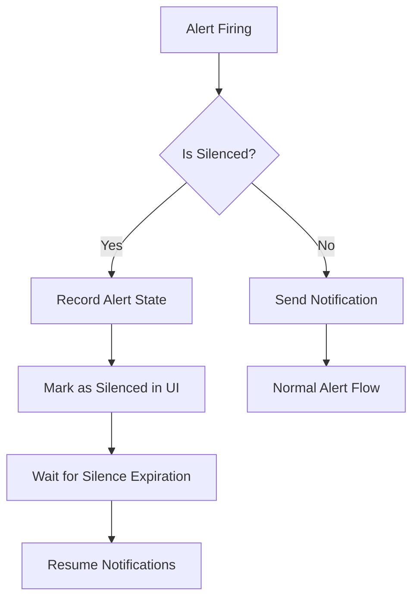

# Alert Silencing

## Introduction

Alert silencing is a crucial feature in Grafana's alerting system that allows you to temporarily mute notifications for specific alerts without disabling your entire alerting setup. This capability is especially valuable during planned maintenance, known issues, or when troubleshooting to prevent alert fatigue—a condition where teams begin to ignore alerts due to an overwhelming number of notifications.

In this guide, you'll learn how to effectively use Grafana's alert silencing features to maintain a clean and efficient monitoring environment.

## Understanding Alert Silencing

Alert silencing in Grafana works by creating "silences"—rules that suppress notifications for alerts matching specific criteria for a defined period. Unlike completely disabling alerts, silencing:

- Keeps alerts active and evaluating in the background
- Prevents notifications from being sent
- Shows silenced alerts in the UI with a "silenced" status
- Can be precisely targeted using labels
- Has a clear expiration time

## Silencing vs. Disabling Alerts

Before we dive into implementation, it's important to understand the difference between silencing and disabling alerts:

| Feature | Silencing | Disabling |
| ------- | --------- | --------- |
| Alert evaluation | Continues | Stops |
| Alert state recording | Continues | Stops |
| Notifications | Suppressed | None |
| Duration | Temporary (with expiration) | Until manually re-enabled |
| Visibility | Visible (marked as silenced) | Hidden |
| Use case | Maintenance windows, known issues | Deprecated alerts, permanent changes |

## Creating Alert Silences

Grafana offers multiple ways to silence alerts. Let's explore each approach:

### Method 1: Using the Grafana UI

1. Navigate to the Alerting section in your Grafana instance
2. Select the "Silences" tab
3. Click "New Silence"
4. Configure your silence:

```
Silence start and end time: Define the period for silence
Matching labels: Target specific alerts by their labels
Comment: Add context for team visibility
```

### Method 2: Using the Grafana HTTP API

You can programmatically create silences using Grafana's API:

```bash
curl -X POST -H "Content-Type: application/json" \
  -H "Authorization: Bearer YOUR_API_KEY" \
  http://your-grafana-instance/api/alertmanager/grafana/api/v2/silences \
  -d '{
    "matchers": [
      {
        "name": "alertname",
        "value": "HighCPUUsage",
        "isRegex": false
      }
    ],
    "startsAt": "2023-04-10T15:00:00Z",
    "endsAt": "2023-04-10T17:00:00Z",
    "createdBy": "operations-team",
    "comment": "Scheduled maintenance window"
  }'
```

### Method 3: Using Grafana Provisioning

For infrastructure-as-code approaches, you can provision silences in your configuration:

```yaml
apiVersion: 1

silences:
  - name: maintenance-window
    matchers:
      - name: env
        value: production
        isRegex: false
    startsAt: 2023-04-10T15:00:00Z
    endsAt: 2023-04-10T17:00:00Z
    createdBy: operations-team
    comment: Scheduled maintenance window
```

## Targeting Alerts with Labels

The power of Grafana's silencing system comes from its label-based targeting. You can silence alerts based on any combination of labels.

### Basic Label Matching

```
alertname = "HighCPUUsage"
```
This will silence all alerts with the name "HighCPUUsage".

### Environment-Specific Silencing

```
env = "staging"
```
This will silence all alerts from the staging environment.

### Complex Label Combinations

```
service = "payment-api" AND severity = "warning"
```
This will silence only warning-level alerts from the payment API.

## Visualization of Alert Silencing Flow



## Best Practices for Alert Silencing

To get the most out of Grafana's alert silencing capabilities, follow these best practices:

1. **Set appropriate durations**: Always set realistic end times for silences to prevent accidentally silencing alerts indefinitely.

2. **Add detailed comments**: Include information about why the silence was created, who created it, and any relevant ticket numbers.

3. **Use specific targeting**: Target silences as precisely as possible using labels to avoid accidentally silencing critical alerts.

4. **Regular silence audits**: Periodically review active silences to ensure they're still necessary.

5. **Notification of silences**: Consider notifying team members when important alerts are silenced.

## Practical Example: Silencing During Deployments

Let's walk through a common scenario: silencing alerts during an application deployment.

### Scenario

You're deploying a new version of your payment service and expect some brief downtime and potential false alarms during the transition period.

### Implementation Steps

1. Identify the labels that target your payment service alerts:

```
service = "payment-api"
```

2. Create a silence that covers your deployment window plus a buffer:

```bash
curl -X POST -H "Content-Type: application/json" \
  -H "Authorization: Bearer YOUR_API_KEY" \
  http://your-grafana-instance/api/alertmanager/grafana/api/v2/silences \
  -d '{
    "matchers": [
      {
        "name": "service",
        "value": "payment-api",
        "isRegex": false
      }
    ],
    "startsAt": "2023-04-10T15:00:00Z",
    "endsAt": "2023-04-10T16:30:00Z",
    "createdBy": "deployment-team",
    "comment": "Payment API v2.3 deployment - JIRA: DEP-1234"
  }'
```

3. After deployment, verify alerts are functioning correctly once the silence expires.

## Managing Existing Silences

Grafana provides tools to manage silences after they've been created:

### Viewing Active Silences

Navigate to the Silences tab in the Alerting section to see all active and pending silences.

### Extending a Silence

If your maintenance window is taking longer than expected:

1. Find the silence in the UI
2. Click "Edit" 
3. Update the end time
4. Save the changes

### Expiring a Silence Early

If you complete work ahead of schedule:

1. Find the silence in the UI
2. Click "Expire"
3. Confirm the action

## Summary

Alert silencing is a powerful feature in Grafana that helps you maintain a healthy alerting system by temporarily suppressing notifications during expected disruptions. By using labels for precise targeting and setting appropriate durations, you can prevent alert fatigue while ensuring your team stays informed about unexpected issues.

Key takeaways:
- Silencing mutes notifications without disabling alert evaluation
- Use labels for precise targeting of which alerts to silence
- Always set an appropriate end time for silences
- Add detailed comments for team awareness
- Regularly audit silences to prevent forgotten silences

## Additional Resources

- [Grafana Alerting Documentation](https://grafana.com/docs/grafana/latest/alerting/)
- [Alert Fatigue and How to Avoid It](https://grafana.com/blog/2020/12/08/avoiding-alert-fatigue-with-grafana-alerting/)
- [Grafana HTTP API Reference](https://grafana.com/docs/grafana/latest/http_api/)

## Exercises

1. Create a silence for all development environment alerts that expires in 1 hour.
2. Design a silencing strategy for a database migration that only silences database-related alerts.
3. Write a script that would create a silence via the API for a specific service during its scheduled weekly maintenance window.