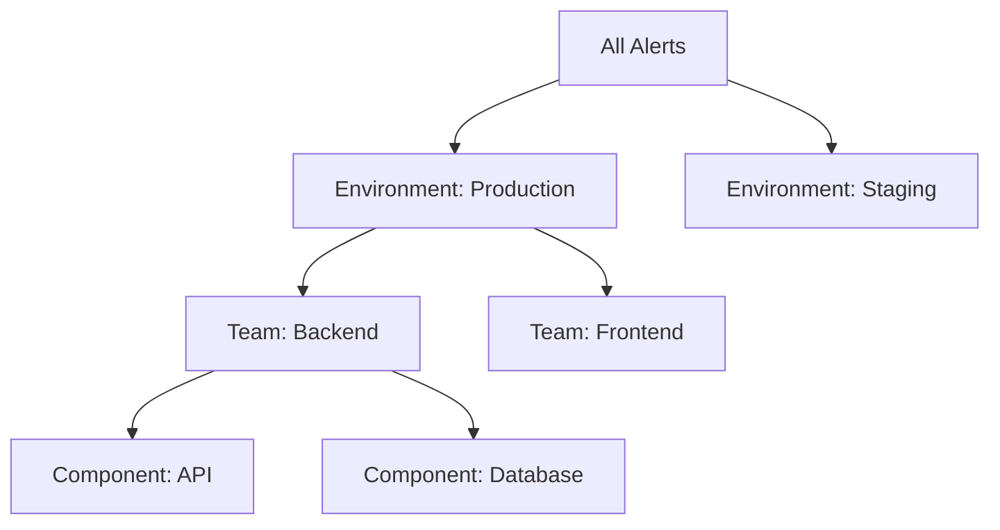

# Alert Grouping

## Introduction

Alert grouping is a powerful feature in Grafana Alerting that helps you organize related alerts together. When monitoring complex systems, you might have dozens or even hundreds of alerts firing simultaneously. Without proper organization, this can quickly become overwhelming and make it difficult to identify and address the underlying issues.

Alert grouping solves this problem by allowing you to combine related alerts based on common labels or attributes. This creates a more manageable alert experience and helps teams respond more effectively to incidents.

## Understanding Alert Grouping

### What is Alert Grouping?

Alert grouping is the process of combining multiple related alerts into logical groups based on shared characteristics. Instead of receiving individual notifications for each alert, you receive consolidated notifications for groups of related alerts.

### Why Use Alert Grouping?

Alert grouping offers several key benefits:

1. **Reduced Noise**: Consolidate multiple related alerts into a single notification
2. **Improved Context**: See patterns and relationships between alerts
3. **Better Incident Response**: Focus on addressing the root cause rather than individual symptoms
4. **Streamlined Communication**: Communicate about related issues as a single incident
5. **Organized Alert Management**: Manage and track related alerts together

## Alert Grouping in Grafana

Grafana provides several ways to group alerts:

### 1. Grouping by Labels

The most common method of grouping alerts is by labels. Labels are key-value pairs attached to alerts that provide context and metadata.

```javascript
// Example alert rule with labels
{
  "alertname": "HighCPUUsage",
  "severity": "critical",
  "cluster": "production",
  "service": "api-gateway"
}
```

You can configure Grafana to group alerts that share common label values. For example, grouping by `cluster` and `service` would combine all alerts from the same service in the same cluster.

### 2. Using Group By in Notification Policies

Notification policies in Grafana allow you to define how alerts are grouped when sending notifications:

```yaml
receivers:
  - name: 'team-api-pager'
    grafana_managed_receiver_configs:
      - uid: 'uid-for-receiver'
        name: 'team-api-pager'
        type: 'pagerduty'
        settings:
          severity: 'critical'
group_by: ['alertname', 'cluster', 'service']
```

In this example, alerts will be grouped by `alertname`, `cluster`, and `service` labels when sending notifications to PagerDuty.

## Implementing Alert Grouping

Let's explore how to implement alert grouping in Grafana through a step-by-step process:

### Step 1: Plan Your Grouping Strategy

Before implementing alert grouping, consider:
- What logical groupings make sense for your infrastructure?
- Which teams are responsible for which components?
- What level of detail is needed in alerts?

### Step 2: Define Consistent Labels

Create a consistent labeling strategy across your alert rules:

```javascript
// Good labeling strategy
{
  "alertname": "APIHighLatency",
  "severity": "warning",
  "component": "api",
  "team": "backend",
  "environment": "production"
}
```

### Step 3: Configure Notification Policies

Navigate to **Alerting** > **Notification Policies** in Grafana and create policies that use appropriate grouping:

1. Create a new notification policy
2. Specify the group by labels (e.g., `team`, `component`, `environment`)
3. Set routing to appropriate receivers

### Step 4: Test Your Grouping

Trigger test alerts to verify your grouping works as expected:

```javascript
// Test alerts with similar labels
[
  {
    "alertname": "HighMemoryUsage",
    "component": "database",
    "team": "data",
    "environment": "production"
  },
  {
    "alertname": "SlowQueries",
    "component": "database",
    "team": "data",
    "environment": "production"
  }
]
```

If your grouping is configured correctly, these alerts should appear together in notifications.

## Alert Grouping Best Practices

To get the most out of alert grouping in Grafana:

### 1. Use Hierarchical Grouping

Create a hierarchy of labels from general to specific:



### 2. Limit Group Size

Avoid creating groups that are too large or too small:
- Too large: Groups become unwieldy and lose their organizational benefit
- Too small: You lose the consolidation benefit of grouping

Aim for groups of 3-10 related alerts for optimal management.

### 3. Consider Alert Timing

Alerts that fire at different times might still be related. Configure the group interval to determine how long Grafana waits to group alerts:

```yaml
group_wait: 30s      # Wait 30s to send a notification for a new group
group_interval: 5m   # Wait 5m before sending updated notification for a group
repeat_interval: 4h  # Wait 4h before resending a notification
```

### 4. Use Templating in Notifications

Customize notification templates to show grouped alerts effectively:

```golang
{{ define "alert_summary" }}
Cluster: {{ .GroupLabels.cluster }}
Service: {{ .GroupLabels.service }}
Alerts:
{{ range .Alerts }}
  - {{ .Labels.alertname }}: {{ .Annotations.summary }}
{{ end }}
{{ end }}
```

## Real-World Example: Monitoring a Microservice Architecture

Let's look at a practical example of using alert grouping in a microservice environment:

### Scenario

You have a microservice architecture with:
- Multiple services (auth, users, products, orders)
- Multiple environments (dev, staging, production)
- Various metrics (latency, error rate, resource usage)

### Alert Rule Configuration

```javascript
// Sample alert rules for different services

// Auth service - high latency
{
  "alertname": "HighLatency",
  "service": "auth",
  "environment": "production",
  "severity": "warning"
}

// Auth service - high error rate
{
  "alertname": "HighErrorRate",
  "service": "auth",
  "environment": "production",
  "severity": "critical"
}

// Orders service - high CPU usage
{
  "alertname": "HighCPUUsage",
  "service": "orders",
  "environment": "production",
  "severity": "warning"
}
```

### Notification Policy Configuration

Group alerts by `service` and `environment`:

```yaml
group_by: ['service', 'environment']
```

### Result

When issues occur, instead of receiving three separate alerts, you get grouped notifications:

**Group 1: Auth Service Issues (Production)**
- HighLatency: Auth service response time exceeds threshold
- HighErrorRate: Auth service error rate exceeds threshold

**Group 2: Orders Service Issues (Production)**
- HighCPUUsage: Orders service CPU usage exceeds threshold

This grouping makes it immediately clear that the auth service is experiencing multiple issues and should be prioritized.

## Summary

Alert grouping is an essential feature in Grafana Alerting that helps tame the complexity of modern monitoring by organizing related alerts. By thoughtfully configuring how your alerts are grouped, you can:

- Reduce alert fatigue by consolidating related notifications
- Improve incident response through better contextual awareness
- Create a more organized and manageable alerting system

The key to successful alert grouping lies in creating a consistent labeling strategy, implementing hierarchical grouping, and tailoring your notification policies to match your team's workflow and responsibilities.

## Additional Resources

- [Grafana Alerting Documentation](https://grafana.com/docs/grafana/latest/alerting/)
- [Alert Grouping Configuration Examples](https://grafana.com/docs/grafana/latest/alerting/unified-alerting/notification-policies/)

## Exercises

1. **Design an Alert Grouping Strategy**: Create a labeling and grouping strategy for a web application with frontend, backend, and database components deployed across development and production environments.

2. **Configure Group Timing**: Experiment with different values for `group_wait`, `group_interval`, and `repeat_interval` to find the optimal balance between timely notifications and effective grouping.

3. **Create Custom Notification Templates**: Design notification templates that effectively communicate both the common attributes of a group and the unique details of individual alerts.