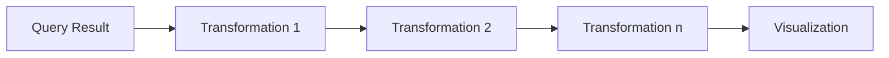

# Transformation Basics

## Introduction

Transformations are a powerful feature in Grafana that allow you to process and reshape your query results before they are visualized. Think of transformations as a middle layer between your data source and your visualization panels. They enable you to:

- Combine data from multiple queries
- Perform calculations on your data
- Rename, filter, or organize fields
- Convert data structures between different formats
- Create new data based on existing data

Whether you're working with time series, tables, or logs, transformations help you get your data into the right shape for effective visualization without having to modify your original data sources or queries.

## Why Use Transformations?

Before diving into how transformations work, let's understand why they're valuable:

1. **Data Source Limitations**: Sometimes your data source cannot produce data in the exact format you need.
2. **Multiple Data Sources**: You may need to combine data from different data sources.
3. **Complex Visualizations**: Certain visualizations require data in specific formats.
4. **Data Enhancement**: You might want to add calculated fields or apply functions to your data.
5. **Data Cleanup**: You may need to filter out noise, rename fields, or organize your data.

## The Transformation Pipeline

Grafana applies transformations in a sequential pipeline, with each transformation taking the output of the previous transformation as its input.



This pipeline concept is powerful because it allows you to build complex data manipulations by chaining simple transformations together.

## Basic Transformation Types

Grafana provides several built-in transformations. Here are some of the most fundamental ones:

### 1. Reduce

The Reduce transformation aggregates all rows in a field into a single value using a function like mean, sum, min, max, etc.

**Example:**

Let's say you have time series data showing CPU usage over time:

```
Time                CPU Usage
2023-01-01 12:00    45%
2023-01-01 12:05    62%
2023-01-01 12:10    58%
2023-01-01 12:15    51%
```

After applying the Reduce transformation with the "mean" function, you get:

```
Field    Value
CPU Usage    54%
```

### 2. Group By

The Group By transformation groups data by field values and processes calculations on each group.

**Example:**

If you have server metrics across different regions:

```
Time                Server    Region    CPU Usage
2023-01-01 12:00    srv-01    us-east   45%
2023-01-01 12:00    srv-02    us-west   62% 
2023-01-01 12:00    srv-03    us-east   38%
2023-01-01 12:00    srv-04    us-west   55%
```

After applying Group By on the "Region" field and calculating the mean of "CPU Usage":

```
Region    Mean CPU Usage
us-east   41.5%
us-west   58.5%
```

### 3. Join By Field

The Join transformation combines data from multiple queries based on a common field.

**Example:**

Query A results (CPU metrics):
```
Server    CPU Usage
srv-01    45%
srv-02    62% 
```

Query B results (Memory metrics):
```
Server    Memory Usage
srv-01    70%
srv-02    55% 
```

After applying Join on the "Server" field:

```
Server    CPU Usage    Memory Usage
srv-01    45%          70%
srv-02    62%          55%
```

### 4. Add Field From Calculation

This transformation lets you create a new field based on a calculation using existing fields.

**Example:**

Starting with:
```
Server    Free Disk (GB)    Total Disk (GB)
srv-01    250               500
srv-02    300               750
```

After adding a calculation for "Disk Usage %" with the formula `(1 - (Free Disk / Total Disk)) * 100`:

```
Server    Free Disk (GB)    Total Disk (GB)    Disk Usage %
srv-01    250               500                50%
srv-02    300               750                60%
```

## Basic Transformation Implementation

Let's walk through how to add transformations to a panel in Grafana:

1. **Navigate to your panel** in edit mode.
2. **Find the Transformations tab** in the panel editor (usually below the Query tab).
3. **Click "Add transformation"** to see the list of available transformations.
4. **Select a transformation** from the dropdown menu.
5. **Configure the transformation** based on your needs.
6. **Add more transformations** if needed - they will be applied in sequence.

### Example: Creating a Server Overview Dashboard

Let's imagine we're building a dashboard that shows an overview of server performance. We have queries that return CPU, memory, and disk metrics, but we want to organize them in a unified table.

**Step 1:** Create queries to get the metrics:
- Query A: Gets CPU metrics by server
- Query B: Gets memory metrics by server
- Query C: Gets disk metrics by server

**Step 2:** Add a Join transformation to combine data:
1. Add the Join transformation
2. Select "Outer join" mode
3. Choose "Server" as the join field

**Step 3:** Add a Group By transformation to organize by server environment:
1. Add the Group By transformation after the Join
2. Group by the "Environment" field
3. Calculate averages for each metric within environments

**Before transformations (Query Results):**

Query A:
```
Server    Environment    CPU Usage
srv-01    Production     75%
srv-02    Production     62%
srv-03    Development    45%
```

Query B:
```
Server    Environment    Memory Usage
srv-01    Production     80%
srv-02    Production     65%
srv-03    Development    50%
```

Query C:
```
Server    Environment    Disk Usage
srv-01    Production     60%
srv-02    Production     55%
srv-03    Development    30%
```

**After Join transformation:**
```
Server    Environment    CPU Usage    Memory Usage    Disk Usage
srv-01    Production     75%          80%             60%
srv-02    Production     62%          65%             55%
srv-03    Development    45%          50%             30%
```

**After Group By transformation:**
```
Environment    Avg CPU Usage    Avg Memory Usage    Avg Disk Usage
Production     68.5%            72.5%               57.5%
Development    45%              50%                 30%
```

## Common Use Cases

Here are some practical scenarios where transformations prove valuable:

### 1. Calculating Service Level Indicators (SLIs)

You can use transformations to calculate error rates, latencies, and availability metrics from raw data:

```
// Input data from queries
Request Count: 1,000
Error Count: 25

// After Add Field from Calculation transformation
Request Count: 1,000
Error Count: 25
Error Rate: 2.5%  // Calculated as (Error Count / Request Count) * 100
```

### 2. Capacity Planning

Combine current usage with historical growth rates to predict future resource needs:

```
// After Join and Add Field transformations
Resource    Current Usage    Monthly Growth    3-Month Projection
CPU         65%              3%               74%
Memory      70%              5%               85%
Storage     55%              8%               79%
```

### 3. Anomaly Detection

Use math functions to calculate standard deviations or percentage differences:

```
// After transformations
Metric             Current    Historical Avg    Deviation
Response Time      320ms      240ms             +33%
Error Rate         2.5%       0.8%              +213%
CPU Utilization    85%        60%               +42%
```

## Best Practices

To get the most out of Grafana transformations:

1. **Start simple** and add transformations incrementally.
2. **Preview your results** after each transformation to ensure it's doing what you expect.
3. **Name your fields clearly** before applying transformations to make selections easier.
4. **Consider performance** when working with large datasets - complex transformations can be resource-intensive.
5. **Document your transformations** in dashboard notes to help others understand your data processing.
6. **Use variables** when appropriate to make transformations more dynamic.

## Limitations and Considerations

While transformations are powerful, they have some limitations:

- They operate on the client-side in your browser, not at the data source level.
- Complex transformations on large datasets can impact dashboard performance.
- Transformations apply only to the panel where they are configured.
- Some transformations may not work well with all visualization types.

## Summary

Transformations in Grafana provide a flexible way to shape your data for optimal visualization without modifying your underlying data sources or queries. By understanding the basic transformation types and how to combine them, you can create more informative and effective dashboards.

Key takeaways:
- Transformations process your data between the query and the visualization
- They can be chained together in a pipeline for complex data manipulation
- Common transformations include Reduce, Group By, Join, and Add Field from Calculation
- They're essential for combining data from multiple sources and creating calculated fields
- Best results come from starting simple and building up your transformation pipeline

## Additional Resources

To continue learning about Grafana transformations:

- Explore the full list of transformations in your Grafana instance
- Practice building transformation pipelines with sample data
- Try creating a dashboard that combines data from different sources

## Exercises

1. Create a dashboard that shows the top 5 CPU-consuming servers using the Limit transformation.
2. Build a transformation pipeline that calculates the percentage change in metrics compared to last week.
3. Use the Group By transformation to compare metrics across different environments (Production vs. Development).
4. Create a health score calculation for your services by combining multiple metrics with weighted importance.