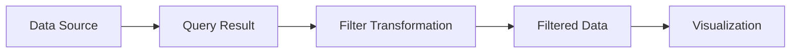

# Filter Transformations

## Introduction

Filter transformations are powerful tools in Grafana that allow you to reduce and refine your dataset before visualization. Rather than displaying all available data points, filters let you focus on specific subsets of data that are most relevant to your analysis. This targeted approach not only improves the clarity of your visualizations but also enhances dashboard performance by reducing the data that needs to be processed and rendered.

In this guide, we'll explore how filter transformations work in Grafana, when to use them, and how to implement them effectively in your dashboards.

## What Are Filter Transformations?

Filter transformations act as data sieves, allowing you to include or exclude specific data points based on conditions you define. They operate on the query results before the data is passed to the visualization, giving you precise control over what information is displayed.



## Types of Filter Transformations in Grafana

Grafana offers several filter transformation options:

1. **Filter by name** - Include or exclude data based on field names
2. **Filter by value** - Include or exclude data based on field values
3. **Filter data by query** - Keep only data from specific queries
4. **Filter by refID** - Filter based on the reference ID of queries

Let's explore each of these in detail.

## Filter by Name

The "Filter by name" transformation allows you to include or exclude fields based on their names. This is useful when your query returns many fields, but you only need a subset of them for your visualization.

### Configuration Options

- **Mode**: Select whether to include or exclude the specified fields
- **Names**: Specify field names to include or exclude (supports regex patterns)

### Example

Let's say your query returns temperature, humidity, pressure, and wind speed data, but you only want to display temperature and humidity:

```javascript
// Input data
[
  {
    "fields": [
      { "name": "time", "values": [1616511600000, 1616515200000, 1616518800000] },
      { "name": "temperature", "values": [22.1, 22.5, 23.0] },
      { "name": "humidity", "values": [45, 47, 48] },
      { "name": "pressure", "values": [1013, 1012, 1011] },
      { "name": "wind_speed", "values": [5.2, 5.5, 6.0] }
    ]
  }
]

// Filter by name transformation (Include: temperature, humidity)
// Output data
[
  {
    "fields": [
      { "name": "time", "values": [1616511600000, 1616515200000, 1616518800000] },
      { "name": "temperature", "values": [22.1, 22.5, 23.0] },
      { "name": "humidity", "values": [45, 47, 48] }
    ]
  }
]
```

## Filter by Value

The "Filter by value" transformation allows you to filter rows based on the values in specific fields. This is particularly useful for focusing on data points that meet certain criteria.

### Configuration Options

- **Field**: The field to apply the filter to
- **Condition**: Choose from equals, not equals, greater than, less than, etc.
- **Value**: The value to compare against

### Example

Filter to show only temperature readings above 22.5°C:

```javascript
// Input data
[
  {
    "fields": [
      { "name": "time", "values": [1616511600000, 1616515200000, 1616518800000] },
      { "name": "temperature", "values": [22.1, 22.5, 23.0] }
    ]
  }
]

// Filter by value transformation (temperature > 22.5)
// Output data
[
  {
    "fields": [
      { "name": "time", "values": [1616518800000] },
      { "name": "temperature", "values": [23.0] }
    ]
  }
]
```

## Filter Data by Query

This transformation allows you to keep data only from specific queries when you have multiple queries in a panel.

### Configuration Options

- **Query IDs to keep**: Select which query results to include in the visualization

### Example

If you have two queries (A and B) in your panel, and you want to show only the results from query A:

```javascript
// Input data (combined results from queries A and B)
[
  // Query A results
  {
    "refId": "A",
    "fields": [
      { "name": "time", "values": [1616511600000, 1616515200000] },
      { "name": "server_A_cpu", "values": [65, 72] }
    ]
  },
  // Query B results
  {
    "refId": "B",
    "fields": [
      { "name": "time", "values": [1616511600000, 1616515200000] },
      { "name": "server_B_cpu", "values": [45, 48] }
    ]
  }
]

// Filter data by query transformation (keep only query A)
// Output data
[
  {
    "refId": "A",
    "fields": [
      { "name": "time", "values": [1616511600000, 1616515200000] },
      { "name": "server_A_cpu", "values": [65, 72] }
    ]
  }
]
```

## Filter by refID

Similar to filtering by query, this transformation lets you include or exclude data based on the reference ID of queries.

### Configuration Options

- **Mode**: Select whether to include or exclude the specified refIDs
- **RefIDs**: Specify the reference IDs to include or exclude

This is particularly useful when working with complex dashboards that have many queries, and you want to create a focused view of specific data sources.

## Real-World Applications

### Example 1: Monitoring Critical System Metrics

Imagine you're monitoring a production server with dozens of metrics. To create a "Critical Alerts" panel, you could:

1. Query all system metrics
2. Use "Filter by value" to only show metrics outside acceptable thresholds
   - CPU usage > 80%
   - Memory usage > 90% 
   - Disk space < 10%

This creates an at-a-glance view of only the metrics that require attention.

### Example 2: Data Analysis Dashboard

For a business analytics dashboard showing customer data:

1. Query all customer transactions
2. Use "Filter by value" to focus on high-value customers (transaction amount > $1000)
3. Apply another "Filter by name" to show only relevant fields (customer name, purchase amount, date)

This creates a focused view for analyzing high-value customer behavior.

## Step-by-Step Implementation

Let's walk through implementing a filter transformation on a dashboard:

1. Create your panel and add your data source query
2. Navigate to the Transform tab in the panel editor
3. Click "Add transformation" and select the appropriate filter type
4. Configure the filter according to your requirements
5. Preview the results to ensure the transformation is working as expected
6. Apply and save your dashboard

## Best Practices

- **Use filters early in your transformation chain** to reduce the amount of data processed by subsequent transformations
- **Combine multiple filters** when necessary to achieve more complex filtering logic
- **Be careful with regex patterns** in name filters - test them thoroughly to ensure they match exactly what you intend
- **Document your filtering logic** in dashboard notes or panel descriptions to help others understand your dashboard design

## Performance Considerations

Filter transformations can significantly improve dashboard performance by reducing the amount of data that needs to be processed and rendered. This is especially important for:

- Dashboards with large datasets
- Panels with complex visualizations
- Dashboards that are frequently refreshed

However, complex filter conditions may add some processing overhead. In most cases, the benefits of reduced data volume outweigh this cost.

## Summary

Filter transformations are essential tools in Grafana that allow you to refine and focus your data before visualization. By including only the most relevant data points, you can create clearer, more targeted visualizations and improve dashboard performance.

Key points to remember:
- Use "Filter by name" to include or exclude specific fields
- Use "Filter by value" to filter rows based on field values
- Use "Filter data by query" or "Filter by refID" to filter based on query results
- Combine multiple filters for more complex filtering logic
- Apply filters early in your transformation chain for better performance

## Exercises

1. Create a dashboard that shows server metrics, then apply a filter transformation to show only metrics where CPU usage is above 70%.
2. Create a multi-query panel that pulls data from different sources, then use filter transformations to create a combined view showing only specific metrics from each source.
3. Challenge: Create a dashboard with a time series panel that dynamically filters data based on a template variable selection.

## Additional Resources

- [Grafana Transformations Documentation](https://grafana.com/docs/grafana/latest/panels/transformations/)
- [Grafana Community Forums](https://community.grafana.com/) - Great place to ask questions about complex transformation scenarios
- [Grafana Dashboard Examples](https://grafana.com/grafana/dashboards/) - Browse for examples that demonstrate effective use of transformations