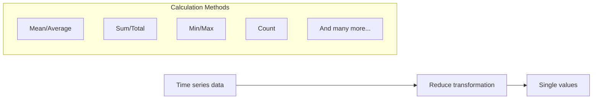

# Reduce Transformations

## Introduction

When working with time series data in Grafana, you'll often need to condense a series of values into a single value for display purposes. This is where the **Reduce transformation** comes in. It allows you to take multiple data points and reduce them to a single value using various calculation methods like average, sum, maximum, or minimum.

Reduce transformations are particularly useful when you want to:

- Display a current value instead of a complete history
- Compare key metrics at a glance using stat panels or gauges
- Create summary tables showing totals or averages
- Simplify complex time series data for executive dashboards

## Understanding Reduce Transformations

### Basic Concept

The Reduce transformation in Grafana processes each field in your query results independently, applying one or more calculation functions to the values in that field, and then returning a single value per calculation.



### Available Calculations

Grafana offers numerous calculations for reduce transformations, including:

- **Basic statistics**: min, max, mean, median, sum, count
- **Advanced statistics**: standard deviation, variance
- **First/last values**: first, last, first_not_null, last_not_null
- **Thresholds**: allIsNull, allIsZero, changeCount
- **Range calculations**: diff, diffperc, range
- And many more

## How to Apply a Reduce Transformation

Here's a step-by-step guide to applying a reduce transformation to your Grafana dashboard:

1. Create or edit a panel in your Grafana dashboard
2. Configure your data source query to return time series data
3. Click on the "Transform" tab in the panel editor
4. Click the "Add transformation" button
5. Select "Reduce" from the transformation options
6. Choose which calculations you want to apply
7. Configure the mode (either "Series to rows" or "Reduce fields")

### Example Configuration

```javascript
// Example of a reduce transformation configuration
{
  "id": "reduce",
  "options": {
    "reducers": ["mean", "max", "last"],
    "mode": "reduceFields"
  }
}
```

## Practical Examples

### Example 1: Server Health Dashboard

Let's create a server health dashboard that shows current CPU usage, memory utilization, and disk space metrics using reduce transformations.

**Step 1: Query the time series data**

First, set up queries to pull server metrics for the past hour:

```sql
SELECT 
  time, 
  cpu_usage, 
  memory_used, 
  disk_used 
FROM server_metrics 
WHERE time > now() - 1h
```

**Step 2: Apply the Reduce transformation**

Now, apply a reduce transformation to show only the current (last) values:

1. Add a "Reduce" transformation
2. Select the "last" calculation
3. Set mode to "Series to rows"

**Input data (time series):**
```
Time               | cpu_usage | memory_used | disk_used
------------------:|----------:|------------:|----------:
2023-05-01 10:00:00|       45% |        65% |       78%
2023-05-01 10:05:00|       48% |        67% |       78%
2023-05-01 10:10:00|       52% |        70% |       79%
2023-05-01 10:15:00|       47% |        68% |       79%
```

**Output data (after reduce):**
```
Metric      | Last value
-----------:|----------:
cpu_usage   |       47%
memory_used |       68%
disk_used   |       79%
```

### Example 2: Sales Dashboard with Multiple Calculations

For a sales dashboard, you might want to see the total sales for the period, the average daily sales, and the highest single-day sales figure.

**Step 1: Query sales data**

```sql
SELECT 
  date, 
  daily_sales 
FROM sales_data 
WHERE date >= '2023-04-01' AND date <= '2023-04-30'
```

**Step 2: Apply Reduce transformation with multiple calculations**

1. Add a "Reduce" transformation
2. Select "sum", "mean", and "max" calculations
3. Set mode to "Reduce fields"

**Input data:**
```
Date       | daily_sales
----------:|------------:
2023-04-01 |      $1,200
2023-04-02 |      $1,450
...        |         ...
2023-04-30 |      $1,350
```

**Output data (after reduce):**
```
Calculation | Value
-----------:|------------:
Sum         |     $42,500
Mean        |      $1,417
Max         |      $2,300
```

## Common Modes and Their Uses

Grafana provides two main modes for reduce transformations:

### 1. Reduce Fields (Series to rows)

This mode converts each time series into a single row, with the calculations applied to each series independently. This is useful when:

- You want to see summary statistics for each series side by side
- You're working with multiple metrics that you want to compare
- You need to maintain separate identities for different series

### 2. Reduce Rows (All values to single row)

This mode applies the calculation across all values in all series, producing a single value. This is useful when:

- You want an aggregate view of all your data
- The series represent parts of a whole
- You're looking for global min/max values across all metrics

## Tips and Best Practices

- **Choose appropriate calculations**: Select calculations that make sense for your data. For example, using "sum" on temperature readings probably doesn't make sense, but "average" or "max" would.

- **Combine with other transformations**: Reduce works well after other transformations. For instance, you might first apply a filter transformation and then reduce the filtered results.

- **Keep it simple**: Only include calculations that provide valuable insights. Too many calculations can make your panel cluttered and harder to interpret.

- **Use clear labels**: Rename your fields after reduction to make sure the purpose of each calculated value is clear.

- **Consider time ranges**: Remember that the reduce transformation applies to whatever time range is selected in your dashboard. Make sure your conclusions account for this.

## How Reduce Differs from Aggregations

While both reduce transformations and query aggregations can produce similar results, they serve different purposes:

- **Query aggregations** (like SQL's GROUP BY) happen at the data source level, reducing the amount of data that needs to be transferred to Grafana.

- **Reduce transformations** happen within Grafana after the data is retrieved, allowing for:
  - More flexibility with calculation methods
  - Dynamic changes based on dashboard time ranges
  - The ability to apply transformations to data from multiple queries or data sources

## Summary

Reduce transformations in Grafana are a powerful way to distill time series data into meaningful single values. They allow you to:

- Convert time series into single values using various calculation methods
- Create more focused, at-a-glance dashboards
- Highlight key metrics without the distraction of historical trends
- Apply multiple calculations to the same dataset for comparative analysis

By mastering reduce transformations, you can create more informative and user-friendly dashboards that communicate key information effectively to your audience.

## Additional Resources

- [Grafana Documentation: Reduce transformation](https://grafana.com/docs/grafana/latest/panels/transformations/types-options/#reduce)
- [Grafana Transformation Overview](https://grafana.com/docs/grafana/latest/panels/transformations/)
- [Calculation Types Reference](https://grafana.com/docs/grafana/latest/panels/calculation-types/)

## Exercises

1. Create a dashboard panel showing the average, minimum, and maximum CPU usage from a time series dataset.

2. Build a summary panel showing total sales, average order value, and total number of customers from an e-commerce dataset.

3. Create a server uptime dashboard that shows the percentage of time that each server was online using the reduce transformation.

4. Compare the results of using "reduceFields" mode versus "Series to rows" mode on the same dataset and observe the differences.