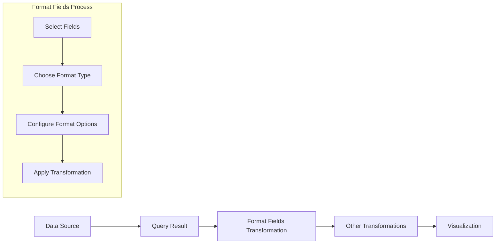

# Format Fields

## Introduction

The Format Fields transformation in Grafana is a powerful tool that allows you to modify how your data is displayed without changing the underlying data source. This transformation applies formatting rules to your fields, enabling you to customize the presentation of string, numeric, and date values in your visualizations.

When working with data from different sources, the raw values might not always be in the most readable or presentable format. The Format Fields transformation helps you standardize how these values appear across your dashboards, making your visualizations more intuitive and user-friendly.

## When to Use Format Fields

You should consider using the Format Fields transformation when you need to:

- Add units or symbols to numeric values
- Format dates in a specific way
- Convert values to different formats (e.g., bytes to KB, MB, etc.)
- Apply string formatting rules like capitalization or templating
- Create consistent formatting across multiple panels
- Make data more human-readable without modifying the source

## Basic Concepts

Before diving into examples, let's understand the core components of the Format Fields transformation:

### Field Selection

You can apply formatting to:
- Specific fields by name
- All fields of a certain type (string, number, time)
- Fields matching a pattern

### Format Types

Grafana provides several format types:
- **Numeric formats** - For formatting numbers with units, decimals, etc.
- **String formats** - For text manipulation
- **Date formats** - For formatting timestamps
- **Special formats** - For specific data types like bytes, percentages, etc.

## Using Format Fields Transformation

Let's walk through how to apply the Format Fields transformation step by step:

1. Open your Grafana dashboard and navigate to the panel you want to modify
2. Click on the panel title and select "Edit"
3. In the panel editor, navigate to the "Transform" tab
4. Click "Add transformation" and select "Format fields"
5. Configure your formatting rules for the desired fields

## Practical Examples

Let's explore some common use cases for the Format Fields transformation.

### Example 1: Formatting Numeric Values

Suppose you have a panel showing CPU usage as raw decimal values (e.g., 0.7523). You can format these values as percentages with two decimal places.

```
Original data:
[
  {
    "cpu_usage": 0.7523,
    "memory_usage": 0.4328,
    "time": 1615478400000
  }
]
```

After applying Format Fields to format `cpu_usage` and `memory_usage` as percentages:

```
Transformed data:
[
  {
    "cpu_usage": "75.23%",
    "memory_usage": "43.28%",
    "time": 1615478400000
  }
]
```

Configuration:
1. Add a Format Fields transformation
2. Select fields: `cpu_usage`, `memory_usage`
3. Choose format: `Percent (0.0-1.0)`
4. Set decimal places: `2`

### Example 2: Formatting Date Fields

If you have timestamp data that appears as epoch milliseconds, you can format it to be human-readable.

```
Original data:
[
  {
    "event": "Server restart",
    "timestamp": 1615478400000
  }
]
```

After applying Format Fields to the `timestamp` field:

```
Transformed data:
[
  {
    "event": "Server restart",
    "timestamp": "2021-03-11 15:00:00"
  }
]
```

Configuration:
1. Add a Format Fields transformation
2. Select field: `timestamp`
3. Choose format: `YYYY-MM-DD HH:mm:ss`

### Example 3: String Manipulation

You can also format string fields, for example, to standardize case or add prefixes/suffixes.

```
Original data:
[
  {
    "status": "critical",
    "service": "api-gateway"
  }
]
```

After applying Format Fields to capitalize the `status` field:

```
Transformed data:
[
  {
    "status": "CRITICAL",
    "service": "api-gateway"
  }
]
```

Configuration:
1. Add a Format Fields transformation
2. Select field: `status`
3. Choose string operation: `uppercase`

## Advanced Usage: Combining Transformations

Format Fields becomes even more powerful when combined with other transformations. For instance, you might:

1. Use a "Reduce" transformation to aggregate your data
2. Then apply Format Fields to format the aggregated values
3. Finally, use "Organize fields" to arrange them in a specific order

This combination allows you to create highly customized and readable visualizations from complex data sources.

## Format Field Options Reference

Here's a reference of some common format options available:

### Numeric Formats
- **Percent (0.0-1.0)** - Formats values between 0-1 as percentages
- **Bytes (IEC/SI)** - Formats values as bytes with appropriate units (KB, MB, GB, etc.)
- **Scientific notation** - Displays numbers in scientific notation
- **Locale format** - Formats numbers according to locale settings

### Date Formats
- **YYYY-MM-DD HH:mm:ss** - Standard date-time format
- **From Now** - Relative time (e.g., "2 hours ago")
- **Unix Timestamp** - Seconds or milliseconds since epoch

### String Formats
- **Uppercase/Lowercase** - Changes the case of text
- **Regular expression replacement** - Applies regex patterns to transform text

## Implementation Example: Creating a Dashboard with Formatted Fields

Let's create a simple example of a dashboard that uses Format Fields transformation effectively.

Imagine you have a time series data of server metrics:

```
[
  {
    "timestamp": 1615478400000,
    "cpu_usage": 0.6523,
    "memory_bytes": 1073741824,
    "server_status": "online"
  },
  {
    "timestamp": 1615482000000,
    "cpu_usage": 0.7845,
    "memory_bytes": 1288490188,
    "server_status": "online"
  }
]
```

Here's how you would set up Format Fields to make this data more readable:

1. Add a Format Fields transformation
2. Configure field formats:
   - Format `timestamp` as `YYYY-MM-DD HH:mm:ss`
   - Format `cpu_usage` as `Percent (0.0-1.0)` with 2 decimal places
   - Format `memory_bytes` as `Bytes (IEC)` to show as GB
   - Format `server_status` as `uppercase`

The result would look like:

```
[
  {
    "timestamp": "2021-03-11 15:00:00",
    "cpu_usage": "65.23%",
    "memory_bytes": "1.00 GiB",
    "server_status": "ONLINE"
  },
  {
    "timestamp": "2021-03-11 16:00:00",
    "cpu_usage": "78.45%",
    "memory_bytes": "1.20 GiB",
    "server_status": "ONLINE"
  }
]
```

## Workflow Diagram

Here's a visual representation of how the Format Fields transformation fits into your data visualization pipeline:



## Common Pitfalls and Tips

### Things to Watch Out For
- Formatting doesn't change the actual data values, only how they're displayed
- Some visualizations might override your formatting with their own settings
- Complex formatting can impact dashboard performance

### Best Practices
- Use consistent formatting across similar panels
- Document your formatting choices for future reference
- Start with the simplest formatting that meets your needs
- Use Format Fields for display purposes, not for data calculations

## Summary

The Format Fields transformation in Grafana is a versatile tool that helps you present your data in a more readable and meaningful way. By applying appropriate formatting to numeric, string, and date fields, you can create dashboards that are easier to understand and interpret at a glance.

Key points to remember:
- Format Fields changes display values, not the underlying data
- You can format specific fields or all fields of a certain type
- Grafana supports various format types for numbers, strings, and dates
- Format Fields works well in combination with other transformations

## Additional Resources

To deepen your understanding of Grafana transformations:

- Experiment with the Format Fields transformation on your own data
- Try creating a dashboard that uses Format Fields in conjunction with other transformations
- Review the official Grafana documentation for the most up-to-date options and examples

## Practice Exercise

Create a dashboard that displays server metrics with the following requirements:
1. CPU usage shown as a percentage with one decimal place
2. Memory usage converted from bytes to appropriate units (KB, MB, GB)
3. Timestamps formatted as "MM/DD/YYYY HH:mm"
4. Status fields displayed in uppercase with color-coding based on values

This exercise will help you become familiar with the various formatting options available in the Format Fields transformation.