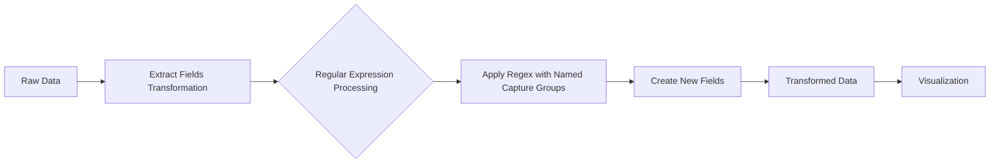

# Extract Fields Transformation

## Introduction

The Extract Fields transformation is a powerful feature in Grafana that allows you to parse structured data from text fields in your dataset. This transformation is particularly useful when working with log data, JSON strings, or any text that contains multiple pieces of information in a structured format.

In many real-world scenarios, you'll encounter text strings that contain valuable information embedded within them. For example, log messages often include timestamps, severity levels, and other structured data within a single text field. The Extract Fields transformation helps you break down this text into separate fields, making it easier to analyze, visualize, and filter your data.

## How Extract Fields Works

The Extract Fields transformation uses regular expressions (regex) to identify and extract data from text fields. By defining patterns that match specific parts of your text, you can parse out individual values and convert them into dedicated fields in your dataset.

Let's break down the process:

1. You select a text field from your data source that contains structured information
2. You define a regular expression with named capture groups
3. Grafana applies this regex to each value in the selected field
4. The captured values become new fields in your dataset

## Basic Syntax

The core of the Extract Fields transformation is the regular expression with named capture groups. The syntax for a named capture group is:

```
(?<fieldName>pattern)
```

Where:
- `fieldName` is the name of the new field you want to create
- `pattern` is the regex pattern that matches the data you want to extract

## Step-by-Step Usage Guide

### Step 1: Access Transformations

After adding a panel to your dashboard and configuring your data source:

1. Navigate to the panel editor
2. Select the "Transform" tab
3. Click the "Add transformation" button
4. Choose "Extract fields" from the dropdown menu

### Step 2: Configure the Transformation

1. **Source**: Select the field containing the text you want to parse
2. **Mode**: Choose between "Regular expression" or "Delimiter" (we'll focus on regex in this guide)
3. **Regular expression**: Enter your regex pattern with named capture groups
4. **Replace all fields**: Toggle this option to replace the original fields with only the extracted fields

### Step 3: Apply and Visualize

Once configured, Grafana will apply the transformation and display the extracted fields in your visualization.

## Examples

Let's look at some practical examples of using the Extract Fields transformation.

### Example 1: Parsing Log Messages

Imagine you have log data with messages in the following format:

```
[2023-10-15 14:22:31] ERROR [user=admin] Failed login attempt from IP 192.168.1.105
```

You can extract the timestamp, log level, username, and IP address using this regex:

```
\[(?<timestamp>.*?)\] (?<level>\w+) \[user=(?<username>.*?)\].*?IP (?<ip_address>[\d\.]+)
```

**Input data:**
```json
[
  {
    "message": "[2023-10-15 14:22:31] ERROR [user=admin] Failed login attempt from IP 192.168.1.105"
  },
  {
    "message": "[2023-10-15 14:23:45] INFO [user=john] Successful login from IP 192.168.1.210"
  }
]
```

**Output after transformation:**
```json
[
  {
    "message": "[2023-10-15 14:22:31] ERROR [user=admin] Failed login attempt from IP 192.168.1.105",
    "timestamp": "2023-10-15 14:22:31",
    "level": "ERROR",
    "username": "admin",
    "ip_address": "192.168.1.105"
  },
  {
    "message": "[2023-10-15 14:23:45] INFO [user=john] Successful login from IP 192.168.1.210",
    "timestamp": "2023-10-15 14:23:45",
    "level": "INFO",
    "username": "john",
    "ip_address": "192.168.1.210"
  }
]
```

### Example 2: Parsing JSON Strings

Sometimes your data source might return JSON as a string. You can extract fields from it:

```
\{"id":"(?<id>.*?)","name":"(?<name>.*?)","status":"(?<status>.*?)"\}
```

**Input data:**
```json
[
  {
    "json_string": "{\"id\":\"1001\",\"name\":\"Server A\",\"status\":\"online\"}"
  },
  {
    "json_string": "{\"id\":\"1002\",\"name\":\"Server B\",\"status\":\"offline\"}"
  }
]
```

**Output after transformation:**
```json
[
  {
    "json_string": "{\"id\":\"1001\",\"name\":\"Server A\",\"status\":\"online\"}",
    "id": "1001",
    "name": "Server A",
    "status": "online"
  },
  {
    "json_string": "{\"id\":\"1002\",\"name\":\"Server B\",\"status\":\"offline\"}",
    "id": "1002",
    "name": "Server B",
    "status": "offline"
  }
]
```

### Example 3: Using Delimiter Mode

For simpler cases, you can use the "Delimiter" mode instead of regular expressions:

1. Set the **Mode** to "Delimiter"
2. Enter your delimiter (like `,` or `|`)
3. Provide field names for each extracted part

For example, with CSV-like data:

**Input data:**
```json
[
  {
    "metrics": "cpu,0.75,80%"
  },
  {
    "metrics": "memory,4.2,65%"
  }
]
```

**Configuration:**
- Delimiter: `,`
- Field names: `resource,value,utilization`

**Output after transformation:**
```json
[
  {
    "metrics": "cpu,0.75,80%",
    "resource": "cpu",
    "value": "0.75",
    "utilization": "80%"
  },
  {
    "metrics": "memory,4.2,65%",
    "resource": "memory",
    "value": "4.2",
    "utilization": "65%"
  }
]
```

## Real-World Applications

### Application Monitoring

Extract method names, response times, and status codes from API logs to create visualizations showing endpoint performance:

```
endpoint: (?<endpoint>/api/\w+) | status: (?<status>\d+) | time: (?<response_time>\d+)ms
```

### Server Metrics Parsing

Parse combined server metrics that arrive in a structured format:

```
HOST=(?<hostname>[\w\-]+) CPU=(?<cpu_usage>[\d\.]+)% MEM=(?<memory_usage>[\d\.]+)GB DISK=(?<disk_usage>[\d\.]+)%
```

### IoT Device Readings

Extract sensor readings from IoT devices that send combined data:

```
Device:(?<device_id>\w+) Temp:(?<temperature>[\d\.]+)C Humidity:(?<humidity>[\d\.]+)%
```

## Data Flow Diagram

Here's a visualization of how data flows through the Extract Fields transformation:



## Best Practices

1. **Test your regex patterns** outside Grafana first using tools like regex101.com
2. **Start with simple patterns** and gradually add complexity
3. **Use descriptive field names** that clearly identify the content
4. **Consider performance** when working with large datasets - complex regex can be CPU-intensive
5. **Be careful with optional captures** as they might create inconsistent data structures
6. **Combine with other transformations** like "Filter fields by name" to clean up your final dataset

## Common Challenges and Solutions

### Challenge: Inconsistent Data Formats

Sometimes the structure of your text data can vary, making it difficult to create a single regex pattern.

**Solution:** Use multiple Extract Fields transformations with different patterns and source fields.

### Challenge: Complex Nested Structures

When dealing with deeply nested data, a single regex might not be sufficient.

**Solution:** Apply multiple transformations in sequence, extracting one level at a time.

### Challenge: Special Characters

Special characters in your data can interfere with regex patterns.

**Solution:** Escape special characters with a backslash (`\`) and test thoroughly.

## Summary

The Extract Fields transformation is a versatile tool in Grafana that allows you to:

- Parse structured data from text fields
- Convert unstructured or semi-structured data into analyzable fields
- Clean and prepare data for meaningful visualizations
- Extract valuable information from logs and other text-based sources

By mastering this transformation, you'll be able to work with a much wider range of data sources and create more insightful dashboards in Grafana.

## Further Learning

To deepen your knowledge of Extract Fields and related concepts:

1. Learn more about regular expressions - they're the key to unlocking the full power of this transformation
2. Explore other Grafana transformations that can be combined with Extract Fields
3. Practice with different data formats like JSON, CSV, and unstructured logs
4. Try these exercises:
   - Extract HTTP status codes and response times from web server logs
   - Parse structured error messages to categorize by error type
   - Extract metadata from JSON strings embedded in database records

## Exercise: Practice with Log Data

Try to create a regex pattern that extracts information from this application log format:

```
2023-10-15T08:45:12.345Z | AppServer23 | WARNING | User authentication | user=john.doe@example.com | attempt=3 | ip=10.0.0.15
```

Your goal is to extract:
- Timestamp
- Server name
- Log level
- Message
- Username
- Attempt number
- IP address

Once you've created a working regex pattern, apply it to a test dataset and create a Grafana visualization that shows:
1. Authentication attempts by user
2. Distribution of log levels
3. Authentication attempts by server

This exercise will help you gain practical experience with the Extract Fields transformation in a real-world scenario.