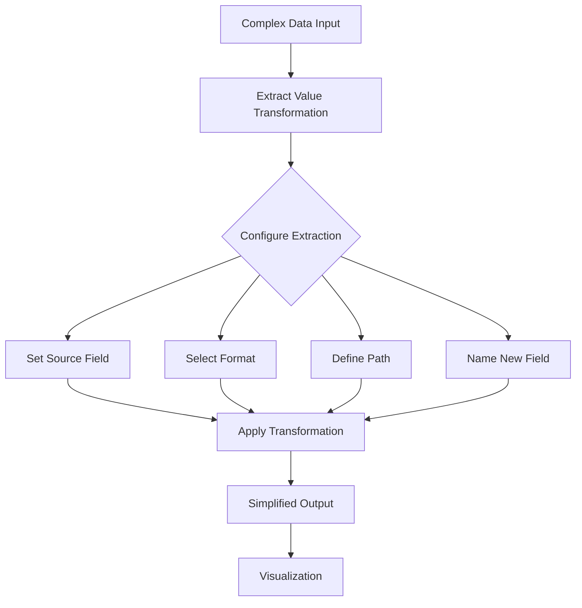

# Extract Value Transformation

## Introduction

The Extract Value transformation is a powerful feature in Grafana's data transformation toolkit that allows you to extract specific values from complex data structures. This transformation is particularly useful when working with nested JSON objects, arrays, or when you need to extract specific parts of your data for clearer visualization.

In many real-world scenarios, data sources return complex, nested data structures that aren't immediately suitable for visualization. The Extract Value transformation helps you pull out just the values you need, making your data more focused and your visualizations more meaningful.

## Understanding Extract Value

The Extract Value transformation works by:

1. Taking a source field containing complex data (like JSON objects)
2. Extracting a specific value from that data using a path or expression
3. Creating a new field with the extracted values

This process simplifies complex data structures into flat, easy-to-visualize values.

## Basic Usage

Let's explore how to use the Extract Value transformation with a simple example.

### Example Scenario

Imagine you have a data source that returns JSON objects containing weather information for different cities:

```json
[
  {
    "city": "New York",
    "weather": {
      "temperature": 22,
      "humidity": 65,
      "conditions": "Partly Cloudy"
    }
  },
  {
    "city": "London",
    "weather": {
      "temperature": 18,
      "humidity": 70,
      "conditions": "Rainy"
    }
  }
]
```

### Step-by-Step Application

1. **Add the Extract Value Transformation**:
   - In your Grafana dashboard, edit the panel displaying this data
   - Navigate to the Transform tab
   - Click "Add transformation" and select "Extract value"

2. **Configure the Transformation**:
   - Set "Source" to the field containing your JSON data
   - Set "Format" to "JSON" (since our source data is in JSON format)
   - Enter the path to extract (e.g., `weather.temperature`) 
   - Give your new field a name (e.g., "Temperature")

3. **Apply the Transformation**:
   - Grafana will create a new field containing only the temperature values
   - This simplified data is now ready for visualization

### Before and After

**Before transformation**:
```
+----------+--------------------------------+
| city     | weather                        |
+----------+--------------------------------+
| New York | {"temperature":22,"humidity":65,"conditions":"Partly Cloudy"} |
| London   | {"temperature":18,"humidity":70,"conditions":"Rainy"} |
+----------+--------------------------------+
```

**After transformation (extracting temperature)**:
```
+----------+--------------------------------+-------------+
| city     | weather                        | Temperature |
+----------+--------------------------------+-------------+
| New York | {"temperature":22,"humidity":65,"conditions":"Partly Cloudy"} | 22 |
| London   | {"temperature":18,"humidity":70,"conditions":"Rainy"} | 18 |
+----------+--------------------------------+-------------+
```

## Advanced Features

### Extracting Multiple Values

You can add multiple Extract Value transformations to extract different values from the same source field:

1. Add another Extract Value transformation
2. Use a different path (e.g., `weather.humidity`)
3. Name your new field (e.g., "Humidity")

This allows you to extract multiple values from complex structures.

### Using JSONPath Expressions

For more advanced extraction, Grafana supports JSONPath expressions:

- `$.weather.temperature` - Extracts the temperature
- `$.weather.conditions` - Extracts the weather conditions
- `$[*].weather.temperature` - Extracts temperatures from an array of objects

### Working with Arrays

When your source field contains arrays, you can use array indices in your path:

- `temperatures[0]` - Extracts the first temperature in an array
- `data[1].value` - Extracts the value from the second item in a data array

## Real-World Applications

### Application Monitoring

When monitoring applications, APIs often return detailed JSON responses. Extract Value helps you focus on critical metrics:

```json
{
  "apiStatus": {
    "response": {
      "time": 230,
      "statusCode": 200,
      "errors": []
    },
    "server": {
      "load": 0.75,
      "memory": 62
    }
  }
}
```

You could extract:
- Response time: `apiStatus.response.time`
- Server load: `apiStatus.server.load`
- Memory usage: `apiStatus.server.memory`

This creates a focused dashboard that highlights the most important metrics.

### IoT Sensor Data

IoT platforms often deliver data in complex structures. For example:

```json
{
  "deviceId": "sensor-101",
  "timestamp": "2023-09-15T14:30:00Z",
  "readings": {
    "temperature": 22.5,
    "humidity": 48,
    "pressure": 1013,
    "battery": 87
  },
  "location": {
    "latitude": 40.7128,
    "longitude": -74.0060
  }
}
```

Extract Value lets you pull out specific sensor readings (like temperature) for clearer visualization.

## Practical Example Walkthrough

Let's create a dashboard that monitors CPU usage from a system that returns data in this format:

```json
{
  "timestamp": "2023-09-15T15:00:00Z",
  "system": {
    "hostname": "web-server-01",
    "cpu": {
      "usage_percent": 65,
      "temperature": 52,
      "cores": [
        {"id": 0, "usage": 70},
        {"id": 1, "usage": 60}
      ]
    },
    "memory": {
      "total": 16384,
      "used": 8192
    }
  }
}
```

### Extracting and Visualizing CPU Usage

1. **Add Data Source**: Configure your data source to retrieve the system information
2. **Create a Time Series Panel**: Add a new panel to your dashboard
3. **Add Extract Value Transformations**:
   - Add transformation to extract `system.cpu.usage_percent` and name it "CPU Usage (%)"
   - Add transformation to extract `system.cpu.temperature` and name it "CPU Temperature (°C)"
4. **Configure Visualization**: Set up your time series visualization to show both metrics
5. **Add Thresholds**: Add thresholds to highlight when CPU usage exceeds normal levels

By using Extract Value, you've created a focused dashboard that specifically tracks CPU metrics.

## Flow Diagram



## Common Issues and Solutions

### Issue: Extraction Returns Null Values

**Possible causes**:
- The path is incorrect
- The data structure doesn't match what you expect
- The field you're trying to extract doesn't exist in all rows

**Solutions**:
- Double-check your path syntax
- Use Grafana's Inspect feature to examine your raw data
- Consider adding a Debug transformation before Extract Value to see the data structure

### Issue: Working with Inconsistent Data

If your data structure varies between rows, you might need to:
1. Use multiple Extract Value transformations for different patterns
2. Add a Filter transformation to handle specific cases
3. Consider preprocessing your data before it reaches Grafana

## Summary

The Extract Value transformation is a powerful tool that helps you extract specific values from complex data structures. By extracting only the values you need, you can create more focused, meaningful visualizations.

Key points to remember:
- Extract Value works best with structured data like JSON
- You can extract multiple values from the same source
- For complex structures, JSONPath offers advanced extraction capabilities
- This transformation is especially useful for API responses, IoT data, and application monitoring

## Additional Resources

- **Grafana Documentation**: Explore the official documentation for more details on data transformations
- **JSONPath Reference**: Learn more about advanced JSONPath expressions for complex data extraction
- **Data Visualization Best Practices**: Understand how to create effective visualizations with your extracted data

## Practice Exercise

Try this exercise to reinforce your understanding:

1. Create a mock data source that returns data about different stores with this structure:
```json
[
  {
    "store": "Store A",
    "sales": {
      "daily": 5200,
      "weekly": 36400,
      "products": {
        "electronics": 15000,
        "clothing": 12000,
        "food": 9400
      }
    },
    "customers": 342
  }
]
```

2. Use Extract Value transformations to:
   - Extract daily sales
   - Extract electronics sales
   - Calculate the percentage of electronics sales to total weekly sales

This exercise will help you practice extracting nested values and combining them with other transformations for analysis.