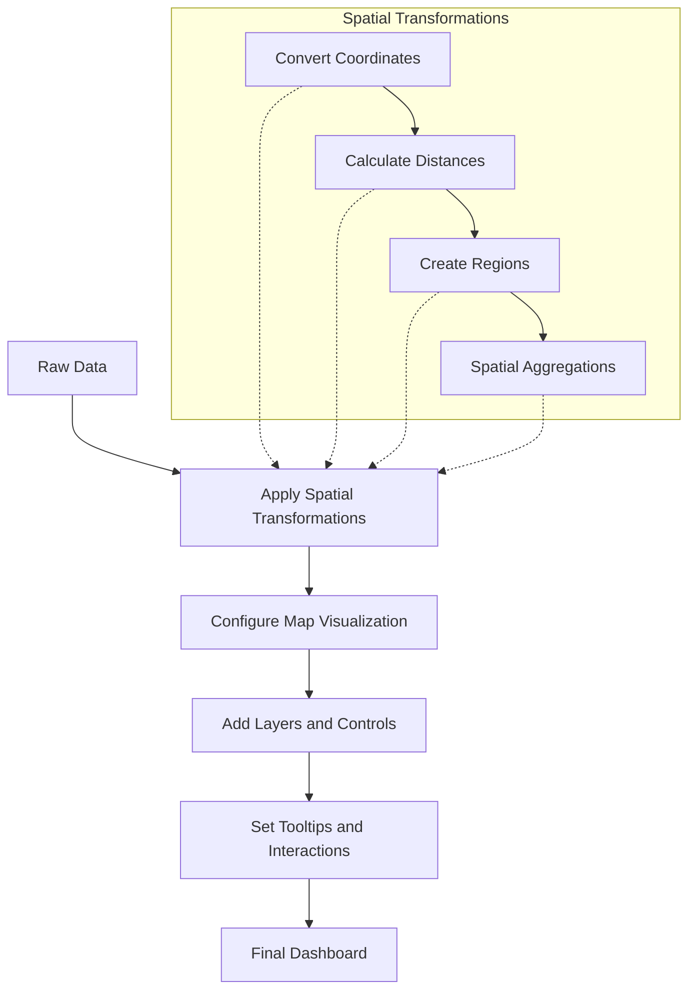

# Spatial Operations

## Introduction

Spatial operations in Grafana allow you to transform and manipulate geospatial data for visualization on maps and geographical dashboards. These transformations convert data containing geographical coordinates into formats that Grafana's mapping visualizations can understand and display effectively.

Whether you're tracking IoT devices, analyzing regional metrics, or visualizing location-based events, spatial operations provide the tools to prepare your data for geographical representation.

## Understanding Spatial Data in Grafana

Geospatial data in Grafana typically consists of:

- **Point data**: Single locations defined by latitude and longitude coordinates
- **Line data**: Connected sequences of points creating paths or routes
- **Polygon data**: Closed shapes defining regions or boundaries
- **GeoJSON**: A standard format for representing geographical features

Grafana's spatial operations help you convert between these formats and perform calculations that enhance your geographical visualizations.

## Common Spatial Transformations

### 1. Coordinates to Geo Points

This transformation converts latitude and longitude columns in your data into a format suitable for map visualizations.

#### Example:

Consider sensor data with separate latitude and longitude columns:

```json
[
  { "sensor_id": "A1", "temperature": 22.5, "latitude": 40.7128, "longitude": -74.0060 },
  { "sensor_id": "B2", "temperature": 25.1, "latitude": 34.0522, "longitude": -118.2437 },
  { "sensor_id": "C3", "temperature": 18.7, "latitude": 51.5074, "longitude": -0.1278 }
]
```

Applying the "Coordinates to Geo Points" transformation:

```javascript
// Configuration
{
  type: "coordinatesToGeoPoints",
  options: {
    latitudeField: "latitude",
    longitudeField: "longitude",
    geoPointField: "location"
  }
}
```

The result would be:

```json
[
  { "sensor_id": "A1", "temperature": 22.5, "location": { "lat": 40.7128, "lng": -74.0060 } },
  { "sensor_id": "B2", "temperature": 25.1, "location": { "lat": 34.0522, "lng": -118.2437 } },
  { "sensor_id": "C3", "temperature": 18.7, "location": { "lat": 51.5074, "lng": -0.1278 } }
]
```

### 2. Calculate Distance

This transformation computes the distance between two geographical points.

#### Example:

Let's calculate the distance between each sensor and a central office location:

```javascript
// Configuration
{
  type: "calculateDistance",
  options: {
    sourceLatField: "latitude",
    sourceLngField: "longitude",
    destinationLatValue: 37.7749, // San Francisco office
    destinationLngValue: -122.4194,
    outputField: "distance_km",
    unit: "kilometers"
  }
}
```

Applied to our sensor data:

```json
[
  { 
    "sensor_id": "A1", 
    "temperature": 22.5, 
    "latitude": 40.7128, 
    "longitude": -74.0060,
    "distance_km": 4136.1
  },
  { 
    "sensor_id": "B2", 
    "temperature": 25.1, 
    "latitude": 34.0522, 
    "longitude": -118.2437,
    "distance_km": 559.2
  },
  { 
    "sensor_id": "C3", 
    "temperature": 18.7, 
    "latitude": 51.5074, 
    "longitude": -0.1278,
    "distance_km": 8636.7
  }
]
```

### 3. Create Bounding Box

This transformation generates geographical boundaries around points, useful for creating regions of interest or filter areas.

#### Example:

Creating a bounding box around sensor locations:

```javascript
// Configuration
{
  type: "createBoundingBox",
  options: {
    latField: "latitude",
    lngField: "longitude",
    padding: 0.1, // degrees
    outputField: "region"
  }
}
```

The result would include new fields representing the region boundaries:

```json
{
  "region": {
    "northLat": 51.6074,
    "southLat": 34.0422,
    "westLng": -118.3437,
    "eastLng": -0.0278
  }
}
```

## Practical Applications

### Application 1: Tracking Fleet Vehicles

Imagine you're building a dashboard to monitor a delivery fleet. You have data coming from vehicle GPS devices that includes:

```json
[
  {
    "vehicle_id": "TRK-001",
    "timestamp": "2023-10-15T14:30:00Z",
    "lat": 37.7749,
    "lng": -122.4194,
    "speed": 35,
    "fuel_level": 65
  },
  ...
]
```

Using spatial transformations:

1. First, convert coordinates to GeoPoints:

```javascript
{
  type: "coordinatesToGeoPoints",
  options: {
    latitudeField: "lat",
    longitudeField: "lng",
    geoPointField: "location"
  }
}
```

2. Then, calculate distances to delivery destinations:

```javascript
{
  type: "calculateDistance",
  options: {
    sourceLatField: "lat",
    sourceLngField: "lng",
    destinationLatField: "destination_lat",
    destinationLngField: "destination_lng",
    outputField: "distance_to_delivery",
    unit: "kilometers"
  }
}
```

3. Finally, visualize on a map with time-series tracking:

```javascript
// Map panel configuration
{
  type: "geomap",
  options: {
    layers: [
      {
        type: "markers",
        location: {
          mode: "geojson",
          geojson: "location"
        },
        tooltip: [
          { field: "vehicle_id", title: "Vehicle" },
          { field: "speed", title: "Speed (km/h)" },
          { field: "distance_to_delivery", title: "Distance to Destination (km)" }
        ]
      }
    ]
  }
}
```

### Application 2: Regional Performance Analysis

For a business tracking sales performance by region:

1. Start with sales data that includes store locations:

```json
[
  {
    "store_id": "S-123",
    "latitude": 40.7128,
    "longitude": -74.0060,
    "sales": 12500,
    "transactions": 843
  },
  ...
]
```

2. Use spatial transformations to group by geographical regions:

```javascript
{
  type: "groupByGeoRegion",
  options: {
    latField: "latitude",
    lngField: "longitude",
    regionType: "state",
    outputField: "state"
  }
}
```

3. Aggregate metrics by region:

```javascript
{
  type: "groupBy",
  options: {
    fields: {
      state: {
        operation: "groupby"
      },
      sales: {
        operation: "sum"
      },
      transactions: {
        operation: "sum"
      }
    }
  }
}
```

The result visualized on a choropleth map provides a powerful regional analysis dashboard.

## Advanced Spatial Operations

### Working with GeoJSON

GeoJSON is a standardized format for representing geographical features. Grafana allows importing and transforming GeoJSON data:

```javascript
// Example: Convert data to GeoJSON format
{
  type: "convertToGeoJSON",
  options: {
    latField: "latitude",
    lngField: "longitude",
    metricField: "value",
    geometryType: "Point"
  }
}
```

This creates properly formatted GeoJSON for map layers:

```json
{
  "type": "FeatureCollection",
  "features": [
    {
      "type": "Feature",
      "geometry": {
        "type": "Point",
        "coordinates": [-74.0060, 40.7128]
      },
      "properties": {
        "value": 75,
        "sensor_id": "A1"
      }
    },
    ...
  ]
}
```

### Geospatial Calculations

Grafana supports various geospatial calculations that can enhance your data:

- **Spatial joins**: Combining datasets based on spatial relationships
- **Buffer creation**: Creating zones around points at specified distances
- **Intersection detection**: Determining if geometries overlap

```javascript
// Example: Create a 5km buffer around points
{
  type: "createBuffer",
  options: {
    sourceField: "location",
    radiusField: "buffer_distance",
    radiusUnit: "kilometers",
    outputField: "coverage_area"
  }
}
```

## Visualization Flow

The typical workflow for spatial operations in Grafana follows this pattern:



## Best Practices

1. **Pre-process coordinates**: Ensure your latitude and longitude values are valid before applying transformations
2. **Use appropriate units**: Match distance units (km, miles) to your audience's expectations
3. **Consider performance**: Spatial operations on very large datasets can be resource-intensive
4. **Layer order matters**: Place background layers first, then add data layers on top
5. **Provide context**: Include base maps and reference information to help viewers orient themselves

## Troubleshooting Common Issues

| Problem | Possible Cause | Solution |
|---------|---------------|----------|
| Points not showing on map | Coordinate fields not properly identified | Verify latitude and longitude field mappings |
| Incorrect distances | Wrong unit selected | Check if you're using kilometers, miles, or meters appropriately |
| Map shows wrong region | Latitude/longitude values swapped | Ensure latitude is the vertical coordinate (-90 to 90) and longitude is horizontal (-180 to 180) |
| Performance issues | Too many data points | Consider clustering or sampling data points |

## Summary

Spatial operations in Grafana provide powerful tools for transforming geographical data into insightful visualizations. By converting coordinates, calculating distances, creating regions, and applying other geospatial transformations, you can build interactive map-based dashboards that provide geographical context to your metrics and data.

These transformations bridge the gap between raw data containing location information and sophisticated map visualizations that help stakeholders understand geographical patterns and relationships.

## Exercise: Building a Weather Station Dashboard

To practice spatial operations, try building a weather station dashboard:

1. Start with a dataset containing weather station readings with latitude/longitude coordinates
2. Apply the "Coordinates to Geo Points" transformation to create location fields
3. Use the "Calculate Distance" transformation to find the nearest stations to a point of interest
4. Visualize temperature variations using a heatmap layer
5. Add tooltips showing detailed weather information at each station

By completing this exercise, you'll gain hands-on experience with Grafana's spatial operations and create a practical geographical dashboard.