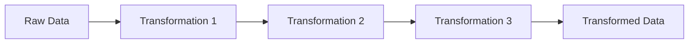
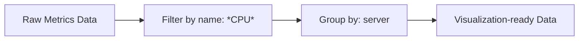
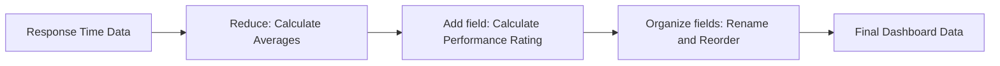
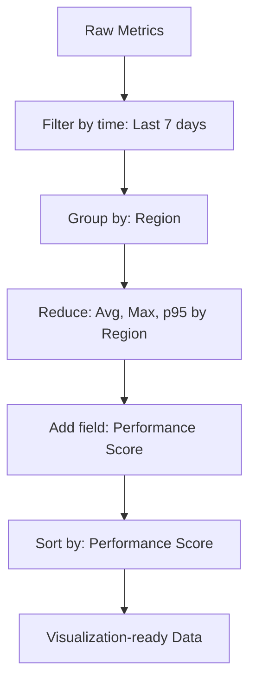
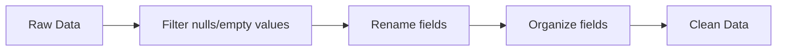
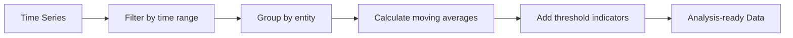
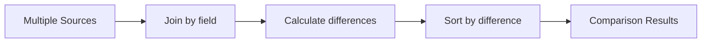

# Transformation Chaining

## Introduction

Transformation chaining is a powerful technique in Grafana that allows you to apply multiple transformations to your data in sequence. This approach enables you to create complex data processing pipelines by connecting simple transformation steps, where the output of one transformation becomes the input for the next.

By combining transformations, you can reshape, filter, calculate, and format your data in numerous ways before visualizing it, allowing for much more advanced analytics capabilities than what would be possible with a single transformation alone.

## Understanding Transformation Chaining

### What is a Transformation Chain?

A transformation chain is a sequence of transformations applied one after another. Each transformation in the chain performs a specific operation on the data it receives and passes the result to the next transformation in line.



### Why Use Transformation Chains?

- **Simplify complex data processing tasks** by breaking them down into smaller, more manageable steps
- **Create reusable data processing patterns** that can be applied to different data sources
- **Gain greater flexibility** in how you prepare your data for visualization
- **Reduce the need for external data processing tools** by handling more data manipulation within Grafana

## Basic Transformation Chaining

Let's explore a simple example of transformation chaining to understand how it works in practice.

### Example 1: Filter and Group Time Series Data

Imagine you have a dataset from multiple servers with CPU, memory, and disk metrics, and you want to focus only on CPU metrics grouped by server:

1. First, apply a **Filter by name** transformation to keep only CPU metrics
2. Then, apply a **Group by** transformation to organize data by server name

Here's what the chain would look like:



### Implementation Steps

1. Add your data source to a dashboard panel
2. Open the panel editor and navigate to the **Transform** tab
3. Click **Add transformation** and select **Filter by name**
4. In the **Match** field, enter `*CPU*` to filter for CPU metrics
5. Click **Add transformation** again to add a second transformation
6. Select **Group by** and choose the `server` field in the **Group by** options
7. Apply the changes and observe how your data is transformed step by step

### Input Data (Before Transformations)

```
| timestamp           | metric       | server   | value |
|---------------------|--------------|----------|-------|
| 2023-01-01 12:00:00 | CPU Usage    | server-1 | 75.2  |
| 2023-01-01 12:00:00 | Memory Usage | server-1 | 68.5  |
| 2023-01-01 12:00:00 | Disk I/O     | server-1 | 15.3  |
| 2023-01-01 12:00:00 | CPU Usage    | server-2 | 42.1  |
| 2023-01-01 12:00:00 | Memory Usage | server-2 | 53.7  |
| 2023-01-01 12:00:00 | Disk I/O     | server-2 | 8.9   |
```

### After First Transformation (Filter by name)

```
| timestamp           | metric    | server   | value |
|---------------------|-----------|----------|-------|
| 2023-01-01 12:00:00 | CPU Usage | server-1 | 75.2  |
| 2023-01-01 12:00:00 | CPU Usage | server-2 | 42.1  |
```

### Final Output (After Group by)

```
| server   | CPU Usage |
|----------|-----------|
| server-1 | 75.2      |
| server-2 | 42.1      |
```

## Advanced Transformation Chains

Let's look at more complex examples that showcase the true power of transformation chaining.

### Example 2: Data Aggregation and Calculation

In this example, we'll process server response time data to calculate performance metrics:

1. Apply a **Reduce** transformation to calculate average response times
2. Use a **Add field from calculation** transformation to add a field for threshold analysis
3. Apply a **Organize fields** transformation to rename and reorder fields for clarity



### Implementation Steps

1. Start with a time series of server response times
2. Add a **Reduce** transformation and select `Mean` as the calculation
3. Add an **Add field from calculation** transformation
   - Select `Binary operation` as the mode
   - Set the left field to your mean response time
   - Set the operation to `/` (divide)
   - Set the right value to your SLA target (e.g., 200ms)
   - Name the output field `performance_ratio`
4. Add an **Organize fields** transformation
   - Rename fields for clarity (e.g., rename "Mean" to "Avg Response Time (ms)")
   - Reorder fields to your preference
5. Apply all transformations

### Example 3: Time Series Processing and Alerting Preparation

This example shows how to prepare data for alerting by focusing on recent data and identifying outliers:

1. Use a **Filter data by query** transformation to focus on a specific service
2. Apply a **Filter data by value** transformation to focus on the last 24 hours
3. Add a **Sort by** transformation to order by timestamp descending
4. Use a **Limit** transformation to focus on the 100 most recent data points
5. Apply an **Add field from calculation** transformation to flag values above threshold

## Real-World Practical Examples

### Monitoring Application Performance

Let's build a transformation chain for monitoring a web application's performance across multiple regions:



### Implementation Details:

1. **Filter by time**: Focus on the last 7 days of data
   ```
   Transformation: Filter data by time range
   Settings: from = now-7d, to = now
   ```

2. **Group by Region**: Organize metrics by geographic region
   ```
   Transformation: Group by
   Fields: Region
   ```

3. **Calculate Statistics**: Compute key performance indicators
   ```
   Transformation: Reduce
   Calculations: mean, max, p95
   ```

4. **Performance Scoring**: Create a composite score based on metrics
   ```
   Transformation: Add field from calculation
   Mode: Binary operation
   Formula: mean * 0.5 + max * 0.2 + p95 * 0.3
   Output field name: performance_score
   ```

5. **Sort Results**: Order regions by performance
   ```
   Transformation: Sort by
   Field: performance_score
   Sort: Descending
   ```

### Anomaly Detection Pipeline

This example shows how to create a simple anomaly detection system using transformation chains:

```
Raw Time Series Data
↓
Filter by time: Last 24 hours
↓
Add field: Rolling average (10 min window)
↓
Add field: Standard deviation
↓
Add field: Current value - Rolling average
↓
Add field: Is Anomaly (abs deviation > 3 * std dev)
↓
Filter data by value: Show only anomalies
```

## Tips for Effective Transformation Chaining

1. **Start simple and build gradually**: Begin with one or two transformations and add more as needed
2. **Check intermediate results**: Verify the output of each transformation before adding the next one
3. **Consider performance**: More transformations mean more processing time, especially with large datasets
4. **Document your chains**: Add annotations or documentation to explain complex transformation chains
5. **Look for reusable patterns**: Create template dashboards with common transformation chains
6. **Use the debug mode**: Enable Grafana's debug mode to inspect data at each transformation step

## Common Transformation Chain Patterns

### Data Cleanup Chain



### Time Series Analysis Chain



### Comparison Analysis Chain



## Debugging Transformation Chains

When working with complex transformation chains, it's important to understand how to debug issues:

1. **Isolate transformations**: Temporarily disable transformations to identify which one is causing issues
2. **Use the debug view**: In the Grafana panel editor, enable the debug view to see the data at each step
3. **Check data types**: Ensure that transformations are receiving the expected data types
4. **Look for error messages**: Grafana will often provide error messages when transformations fail

## Exercise: Building Your First Transformation Chain

Now it's your turn to practice! Try building a transformation chain that:

1. Filters a dataset to show only error status codes (>= 400)
2. Groups the errors by endpoint
3. Calculates the error frequency and average response time for each endpoint
4. Sorts endpoints by error frequency in descending order

Think about which transformations you would need to apply and in what order.

## Summary

Transformation chaining is a powerful feature in Grafana that allows you to create complex data processing pipelines by combining multiple transformations. By applying transformations in sequence, you can reshape, filter, calculate, and format your data to meet your visualization and analysis needs.

Key takeaways:
- Transformation chains process data step by step, with each transformation building on the previous one
- You can use transformation chains to simplify complex data processing tasks
- Common patterns like data cleanup, time series analysis, and comparison analysis can be implemented with transformation chains
- Debugging tools help identify issues in complex transformation chains

With practice, you'll be able to create sophisticated transformation chains that unlock deeper insights from your data without needing external data processing tools.

## Additional Resources

- Grafana documentation on [Transformations](https://grafana.com/docs/grafana/latest/panels/transformations/)
- Grafana blog: [Advanced Data Manipulation with Transformations](https://grafana.com/blog/2020/07/08/how-were-improving-dashboard-building-with-the-grafana-8.0-transformations/)
- Grafana community forums for transformation examples and troubleshooting
- Practice creating various transformation chains using the Grafana Play sandbox environment