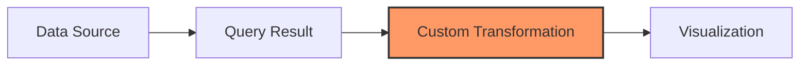

# Custom Transformations

## Introduction

Custom transformations in Grafana provide a powerful way to manipulate your data using JavaScript expressions. While Grafana offers many built-in transformations, sometimes you need more specialized logic to prepare your data for visualization. Custom transformations let you write your own data processing code directly within Grafana, unlocking nearly unlimited flexibility in how you transform and reshape your data.

In this guide, you'll learn how to create and use custom transformations to solve common data manipulation problems that can't be addressed with standard transformations alone.

## Prerequisites

To get the most from this guide, you should:
- Have a basic understanding of Grafana dashboards and panels
- Be familiar with JavaScript fundamentals
- Understand JSON data structures
- Have some experience with data manipulation concepts

## Understanding Custom Transformations

Custom transformations allow you to write JavaScript code that processes your query results. The code runs directly in your browser and can manipulate your data in virtually any way you can imagine.

### How Custom Transformations Work

When you add a custom transformation to your panel, Grafana provides you with:

1. Access to your query results as a JavaScript object
2. A code editor where you can write transformation logic
3. Tools to preview the effect of your transformation

Your custom transformation code processes the incoming data and returns the transformed result that gets passed to your visualization.



## Adding Your First Custom Transformation

Let's start with a basic example to understand how custom transformations work.

### Step 1: Access Transformations

1. Create or edit a panel in your Grafana dashboard
2. Click on the Transform tab in the panel editor
3. Click the "Add transformation" button
4. Select "Add custom transformation"

### Step 2: Write Your Transformation Code

In the code editor, you'll see a template similar to this:

```javascript
/**
 * @param { DataFrame[] } data // incoming data
 * @return { DataFrame[] }     // outgoing data
 */
return function(data) {
  // Return a modified copy of the data
  return data;
};
```

This template provides access to your query results as `data` - an array of DataFrames. Each DataFrame contains your query results and has properties like:

- `fields`: Array containing your data columns
- `length`: Number of rows in your data

### Example: Filtering Data

Let's write a custom transformation that filters out data points below a certain threshold:

```javascript
/**
 * @param { DataFrame[] } data
 * @return { DataFrame[] }
 */
return function(data) {
  // Create a copy to avoid modifying the original data
  const filtered = data.map(frame => {
    // Find the value field index (assuming it's the second field)
    const valueFieldIndex = 1;
    
    // Filter rows where value is greater than 100
    const filteredValues = [];
    const filteredTimes = [];
    
    for (let i = 0; i < frame.length; i++) {
      if (frame.fields[valueFieldIndex].values.get(i) > 100) {
        filteredValues.push(frame.fields[valueFieldIndex].values.get(i));
        filteredTimes.push(frame.fields[0].values.get(i));
      }
    }
    
    // Create a new frame with filtered data
    return {
      ...frame,
      length: filteredValues.length,
      fields: [
        {
          ...frame.fields[0],
          values: {
            buffer: filteredTimes,
            get: (i) => filteredTimes[i],
            toArray: () => filteredTimes,
          },
        },
        {
          ...frame.fields[valueFieldIndex],
          values: {
            buffer: filteredValues,
            get: (i) => filteredValues[i],
            toArray: () => filteredValues,
          },
        },
      ],
    };
  });
  
  return filtered;
};
```

This code filters each DataFrame to only include rows where the value is greater than 100.

## Input and Output Formats

Understanding the data structure that your custom transformation receives and should return is crucial.

### Input Format

Your transformation receives an array of DataFrames. Each DataFrame has:

```javascript
{
  fields: [
    {
      name: "time",         // Field name
      type: "time",         // Field type
      values: {             // Field values container
        get: (index) => {}, // Function to get value at index
        toArray: () => {},  // Function to get all values as array
      },
      config: {}            // Field configuration
    },
    {
      name: "value",
      type: "number",
      values: { /*...*/ },
      config: {}
    }
  ],
  length: 100               // Number of rows
}
```

### Expected Output Format

Your transformation should return data in the same structure - an array of DataFrames.

## Common Transformation Patterns

Here are some practical examples of custom transformations you might use in your dashboards.

### Example 1: Calculating Moving Averages

This transformation calculates a 5-point moving average for each value:

```javascript
/**
 * @param { DataFrame[] } data
 * @return { DataFrame[] }
 */
return function(data) {
  return data.map(frame => {
    const valueField = frame.fields.find(f => f.type === 'number');
    if (!valueField) return frame;
    
    const values = valueField.values.toArray();
    const movingAvg = [];
    const windowSize = 5;
    
    for (let i = 0; i < values.length; i++) {
      if (i < windowSize - 1) {
        // Not enough previous points yet
        movingAvg.push(null);
      } else {
        // Calculate average of current point and previous (windowSize-1) points
        let sum = 0;
        for (let j = 0; j < windowSize; j++) {
          sum += values[i - j];
        }
        movingAvg.push(sum / windowSize);
      }
    }
    
    // Create a new frame with original data and the moving average
    return {
      ...frame,
      fields: [
        ...frame.fields,
        {
          name: '5-point Moving Average',
          type: 'number',
          values: {
            buffer: movingAvg,
            get: (i) => movingAvg[i],
            toArray: () => movingAvg,
          },
          config: {
            color: {
              mode: 'fixed',
              fixedColor: 'green',
            },
          },
        },
      ],
    };
  });
};
```

### Example 2: Calculating Rate of Change

This transformation calculates the percentage change between consecutive data points:

```javascript
/**
 * @param { DataFrame[] } data
 * @return { DataFrame[] }
 */
return function(data) {
  return data.map(frame => {
    const valueField = frame.fields.find(f => f.type === 'number');
    if (!valueField) return frame;
    
    const values = valueField.values.toArray();
    const rateOfChange = [];
    
    for (let i = 0; i < values.length; i++) {
      if (i === 0 || values[i-1] === 0) {
        rateOfChange.push(null); // No previous value or division by zero
      } else {
        const change = ((values[i] - values[i-1]) / values[i-1]) * 100;
        rateOfChange.push(change);
      }
    }
    
    return {
      ...frame,
      fields: [
        ...frame.fields,
        {
          name: 'Rate of Change (%)',
          type: 'number',
          values: {
            buffer: rateOfChange,
            get: (i) => rateOfChange[i],
            toArray: () => rateOfChange,
          },
          config: {
            unit: 'percent',
          },
        },
      ],
    };
  });
};
```

### Example 3: Combining Multiple Queries

This transformation merges data from multiple queries into a single dataset:

```javascript
/**
 * @param { DataFrame[] } data
 * @return { DataFrame[] }
 */
return function(data) {
  // Exit early if there's less than 2 frames
  if (data.length < 2) return data;
  
  // Get time field from first frame
  const timeField = data[0].fields.find(f => f.type === 'time');
  if (!timeField) return data;
  
  // Create a combined frame
  const combinedFrame = {
    length: timeField.values.length,
    fields: [
      {
        name: 'Time',
        type: 'time',
        values: {
          ...timeField.values
        },
        config: { ...timeField.config }
      }
    ]
  };
  
  // Add value fields from all frames
  data.forEach((frame, frameIndex) => {
    const valueField = frame.fields.find(f => f.type === 'number');
    if (valueField) {
      combinedFrame.fields.push({
        name: `Series ${frameIndex + 1}`,
        type: 'number',
        values: {
          ...valueField.values
        },
        config: { ...valueField.config }
      });
    }
  });
  
  return [combinedFrame];
};
```

## Real-World Applications

Let's explore some practical applications of custom transformations in monitoring and analytics scenarios.

### Application Monitoring: Error Rate Analysis

Suppose you have a panel showing application errors, but you want to highlight when error rates exceed normal thresholds:

```javascript
/**
 * @param { DataFrame[] } data
 * @return { DataFrame[] }
 */
return function(data) {
  return data.map(frame => {
    const valueField = frame.fields.find(f => f.name === 'errors');
    if (!valueField) return frame;
    
    const errors = valueField.values.toArray();
    const status = [];
    const threshold = 10; // Error threshold
    
    for (let i = 0; i < errors.length; i++) {
      status.push(errors[i] > threshold ? 'Critical' : 'Normal');
    }
    
    // Add status field to the frame
    return {
      ...frame,
      fields: [
        ...frame.fields,
        {
          name: 'Status',
          type: 'string',
          values: {
            buffer: status,
            get: (i) => status[i],
            toArray: () => status,
          },
          config: {
            mappings: [
              {
                type: 'value',
                options: {
                  'Critical': {
                    color: 'red',
                    index: 0,
                  },
                  'Normal': {
                    color: 'green',
                    index: 1,
                  },
                },
              },
            ],
          },
        },
      ],
    };
  });
};
```

### Financial Data: Calculating Metrics

When working with financial data, you might need to calculate custom metrics:

```javascript
/**
 * @param { DataFrame[] } data
 * @return { DataFrame[] }
 */
return function(data) {
  return data.map(frame => {
    const openField = frame.fields.find(f => f.name === 'open');
    const closeField = frame.fields.find(f => f.name === 'close');
    const highField = frame.fields.find(f => f.name === 'high');
    const lowField = frame.fields.find(f => f.name === 'low');
    
    if (!openField || !closeField || !highField || !lowField) return frame;
    
    const opens = openField.values.toArray();
    const closes = closeField.values.toArray();
    const highs = highField.values.toArray();
    const lows = lowField.values.toArray();
    
    const volatility = [];
    
    for (let i = 0; i < frame.length; i++) {
      // Calculate daily range as percentage of opening price
      const dailyRange = ((highs[i] - lows[i]) / opens[i]) * 100;
      volatility.push(dailyRange);
    }
    
    return {
      ...frame,
      fields: [
        ...frame.fields,
        {
          name: 'Daily Volatility (%)',
          type: 'number',
          values: {
            buffer: volatility,
            get: (i) => volatility[i],
            toArray: () => volatility,
          },
          config: {
            unit: 'percent',
            min: 0,
          },
        },
      ],
    };
  });
};
```

## Best Practices

When creating custom transformations, follow these best practices to ensure your code is efficient and maintainable:

1. **Always create copies of data** instead of modifying the originals
2. **Handle edge cases** like empty datasets, null values, etc.
3. **Add comments** to explain complex logic
4. **Use descriptive field names** for transformed data
5. **Test with various data shapes** to ensure your transformation works in all scenarios
6. **Keep transformations focused** on a single concern
7. **Add appropriate field configurations** like units, color schemes, etc.

## Debugging Custom Transformations

When your transformation doesn't work as expected:

1. **Use `console.log()`** to inspect values at different stages
2. **Check data types** - especially watch for strings when numbers are expected
3. **Look for null values** that might cause errors
4. **Inspect the data structure** using `console.log(JSON.stringify(data, null, 2))`
5. **Start simple** - get a basic version working before adding complexity

## Performance Considerations

Custom transformations run in your browser, so be mindful of performance:

1. **Avoid unnecessary loops** - use array methods when possible
2. **Be cautious with large datasets** - transformations can slow down with thousands of rows
3. **Consider precomputing** certain values to avoid recalculating them
4. **Limit DOM manipulation** - avoid accessing DOM elements in your transformation code

## Summary

Custom transformations provide a powerful way to manipulate your data in Grafana when built-in transformations aren't enough. With JavaScript, you can reshape, combine, filter, and enhance your data to create the exact visualizations you need.

By learning this advanced feature, you've gained the ability to:
- Process data exactly as your use case requires
- Add calculated fields based on your specific needs
- Transform data structures to work with any visualization
- Implement business-specific data manipulations

## Exercises to Practice

1. **Exercise 1:** Create a custom transformation that converts temperature data from Celsius to Fahrenheit.

2. **Exercise 2:** Build a transformation that identifies outliers in a dataset (values more than 2 standard deviations from the mean).

3. **Exercise 3:** Develop a transformation that extracts specific information from string fields using regular expressions.

4. **Exercise 4:** Create a transformation that joins two separate time series based on matching timestamps.

5. **Exercise 5:** Build a custom transformation that implements a simple anomaly detection algorithm.

## Further Resources

- [Grafana Transformation Documentation](https://grafana.com/docs/grafana/latest/panels/transformations/)
- [JavaScript Array Methods](https://developer.mozilla.org/en-US/docs/Web/JavaScript/Reference/Global_Objects/Array)
- [Working with DataFrames in Grafana](https://grafana.com/developers/plugin-tools/introduction/dataframes)