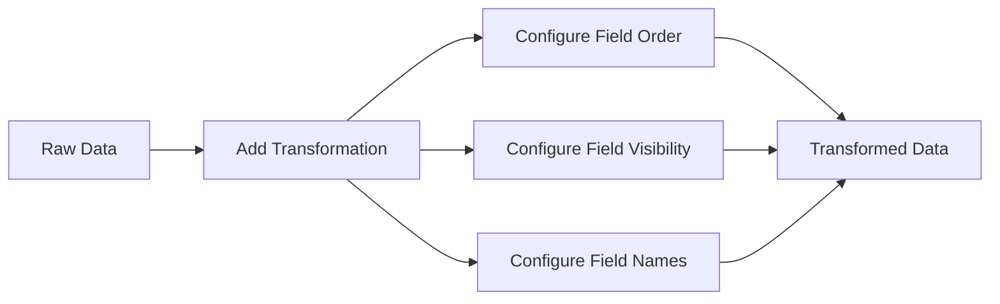

# Organize Fields

## Introduction

Data visualization often requires refining how your data appears before presenting it. The **Organize Fields** transformation in Grafana is a powerful tool that lets you customize how fields from your data source are displayed in your visualizations. It allows you to:

- Reorder fields to control their appearance in visualizations
- Rename fields to make them more meaningful to your audience
- Hide fields that aren't relevant to your current visualization

This transformation doesn't alter your actual data - it simply changes how Grafana displays and organizes the fields before rendering them in your dashboard panels.

## When to Use Organize Fields

You should consider using the Organize Fields transformation when:

- Your data source returns fields with cryptic or technical names
- You want to present fields in a specific order
- You need to hide certain fields to simplify your visualization
- You want to standardize field names across different data sources

## How It Works

The Organize Fields transformation operates on the field level of your data frame. When applied to a panel, it lets you control three key aspects of your data presentation:

1. **Field order** - Change the sequence in which fields appear
2. **Field visibility** - Show or hide specific fields
3. **Field names** - Rename fields for clarity or consistency

Let's explore how to apply this transformation to your data.

## Applying the Organize Fields Transformation

### Step 1: Add the Transformation

1. Edit the panel you want to modify
2. Navigate to the **Transform** tab
3. Click **+ Add transformation**
4. Select **Organize fields** from the dropdown menu

### Step 2: Configure the Transformation

Once added, you'll see a table with all available fields from your data source. Each field has:

- A drag handle (six dots) for reordering
- A checkbox to toggle visibility
- The current field name
- A text box to enter a new name



## Examples

Let's look at some practical examples to understand how the Organize Fields transformation can be applied.

### Example 1: Basic Field Organization

Imagine you have server monitoring data with the following fields:

```
cpu_usage, memory_usage, host_name, timestamp, disk_io, network_in, network_out
```

With Organize Fields, you can:

1. Reorder fields to group related metrics
2. Rename technical fields to user-friendly names
3. Hide fields that aren't relevant to your current visualization

#### Input Data:

```javascript
[
  {
    "cpu_usage": 45.2,
    "memory_usage": 68.7,
    "host_name": "srv-prod-01",
    "timestamp": "2023-06-15T14:30:00Z",
    "disk_io": 12.3,
    "network_in": 24.6,
    "network_out": 18.2
  },
  // Additional data points...
]
```

#### Configuration:

| Field | Visible | Rename to |
|-------|---------|-----------|
| host_name | ✓ | Server |
| cpu_usage | ✓ | CPU Usage (%) |
| memory_usage | ✓ | Memory Usage (%) |
| disk_io | ✓ | Disk I/O (MB/s) |
| network_in | ✓ | Network In (MB/s) |
| network_out | ✓ | Network Out (MB/s) |
| timestamp | ✗ | |

#### Result:

The data will now display with fields in the order specified, with renamed fields and with the timestamp hidden.

### Example 2: Combining Multiple Data Sources

When working with multiple data sources that have different naming conventions, Organize Fields can help create consistency.

Imagine combining metrics from two different monitoring systems:

**System A fields:**
```
server_cpu, server_mem, server_disk
```

**System B fields:**
```
host.cpu_percentage, host.memory_used, host.disk_utilization
```

Using Organize Fields, you can standardize these field names:

#### Configuration for System A:

| Field | Visible | Rename to |
|-------|---------|-----------|
| server_cpu | ✓ | CPU Usage |
| server_mem | ✓ | Memory Usage |
| server_disk | ✓ | Disk Usage |

#### Configuration for System B:

| Field | Visible | Rename to |
|-------|---------|-----------|
| host.cpu_percentage | ✓ | CPU Usage |
| host.memory_used | ✓ | Memory Usage |
| host.disk_utilization | ✓ | Disk Usage |

This creates a consistent experience regardless of which data source you're using.

## Real-World Applications

### Application Monitoring Dashboard

For an application monitoring dashboard, you might have metrics coming from various sources:

- Application metrics (response times, error rates)
- Infrastructure metrics (CPU, memory, disk)
- Custom business metrics

Using Organize Fields, you can:

1. Group related metrics together
2. Rename technical fields to business-friendly terms
3. Hide internal metrics that aren't relevant for business stakeholders

### Time Series Visualization Optimization

When working with time series data, you often want to focus on specific metrics. The Organize Fields transformation can help by:

1. Prioritizing key performance indicators
2. Hiding secondary metrics that add visual clutter
3. Renaming metrics to provide more context (e.g., changing "p95" to "95th Percentile Response Time")

## Best Practices

1. **Be consistent with naming** - Establish naming conventions and stick to them across dashboards
2. **Order fields logically** - Group related fields together for easier interpretation
3. **Hide unnecessary fields** - Remove noise by hiding fields that don't contribute to your visualization
4. **Use clear, descriptive names** - Rename fields to be self-explanatory to your audience
5. **Document transformations** - Add panel descriptions explaining what transformations have been applied

## Advanced Usage

### Combining with Other Transformations

Organize Fields works well in combination with other Grafana transformations. Common combinations include:

1. **Filter data by values** + **Organize fields** - First filter your data, then organize the remaining fields
2. **Join** + **Organize fields** - Join multiple data sources, then standardize field names
3. **Organize fields** + **Add field from calculation** - Organize existing fields, then add calculated fields

## Limitations

- The Organize Fields transformation doesn't modify the actual data structure, only how it's presented
- It can't create new fields (use "Add field from calculation" for that)
- Changes only apply to the current panel, not globally across your dashboard

## Summary

The Organize Fields transformation is a powerful tool in Grafana that allows you to reorder, rename, and hide fields in your data before visualization. It helps create cleaner, more meaningful dashboards without modifying your underlying data sources.

By thoughtfully organizing your fields, you can:
- Improve dashboard readability
- Create consistency across different data sources
- Highlight the most important metrics
- Simplify complex visualizations

## Exercise

Try applying the Organize Fields transformation to a panel with the following scenario:

1. You have a data source returning these fields: `timestamp`, `system_name`, `cpu`, `memory`, `disk`, `network`
2. Create a transformation that:
   - Reorders fields to show `system_name` first, followed by the metrics
   - Renames `system_name` to "Server"
   - Renames the metric fields to include their units (e.g., "CPU (%)")
   - Hides the `timestamp` field

## Further Reading

- Explore other Grafana transformations like "Add field from calculation" and "Filter data by values"
- Learn about Grafana variables to make your transformed dashboards more dynamic
- Investigate Grafana alerting to set notifications based on your organized data