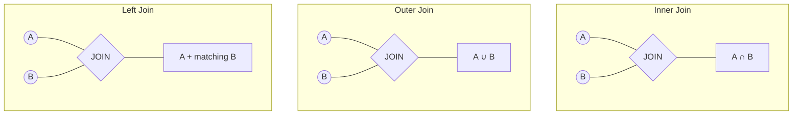
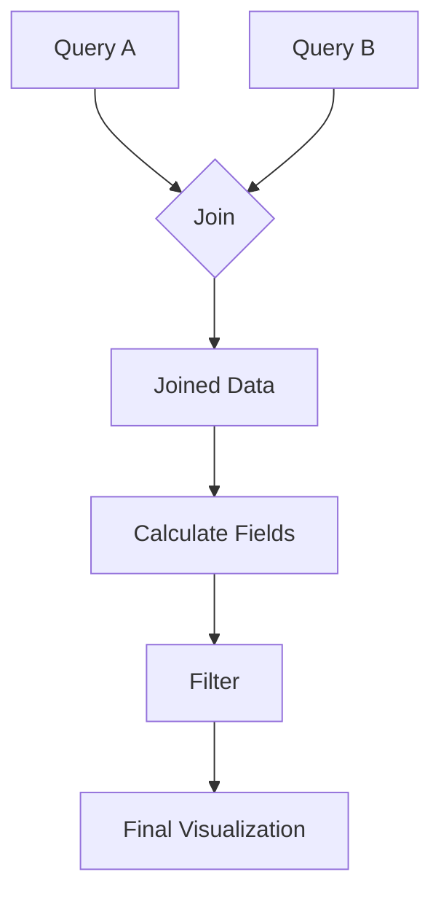

# Join Transformations

## Introduction

When working with data visualization in Grafana, you'll often need to combine data from multiple sources or queries to create meaningful dashboards. This is where **Join transformations** come into play. Join transformations allow you to merge two or more data frames based on a common field, similar to SQL JOIN operations in databases.

In this tutorial, you'll learn:
- What Join transformations are and when to use them
- How to configure different types of joins in Grafana
- Real-world examples of Join transformations
- Best practices and common pitfalls to avoid

## Understanding Join Transformations

### What is a Join Transformation?

A Join transformation combines rows from two or more data frames based on related values between them. If you're familiar with SQL, you can think of this as similar to JOIN operations in a database.

In Grafana, Join transformations work on data frames returned by your queries. A data frame is essentially a table with columns and rows.

### Types of Joins in Grafana

Grafana supports several types of joins:

1. **Inner join** - Returns only rows where there are matches in both data frames
2. **Outer join** - Returns all rows from both data frames, with null values where there is no match
3. **Left join** - Returns all rows from the left (first) data frame and matching rows from the right data frame

Let's visualize these different join types:



## Configuring a Join Transformation

Let's walk through the steps to set up a Join transformation:

1. Create at least two queries that return data frames
2. Navigate to the **Transform** tab in the panel editor
3. Click on **Add transformation** and select **Join by field**
4. Configure the join settings:
   - **Join by field**: Select the field to join on (must exist in both data frames)
   - **Join type**: Choose Inner, Outer, or Left join
   - **Include all fields from**: Optional setting to include all fields from a specific data frame

### Example: Basic Join Configuration

```javascript
// Configuration object for a Join transformation
{
  "id": "joinByField",
  "options": {
    "byField": "time",
    "mode": "inner"
  }
}
```

## Practical Examples

### Example 1: Combining Server Metrics with Events

Let's say you want to visualize server CPU usage alongside deployment events to understand performance impacts. You have:

- Query A: Returns CPU usage over time with fields `time` and `cpu_usage`
- Query B: Returns deployment events with fields `time` and `event_name`

#### Input Data Frames:

**Query A (CPU Usage):**
```
| time                | cpu_usage |
|---------------------|-----------|
| 2023-05-01 10:00:00 | 45        |
| 2023-05-01 10:05:00 | 48        |
| 2023-05-01 10:10:00 | 72        |
| 2023-05-01 10:15:00 | 65        |
| 2023-05-01 10:20:00 | 52        |
```

**Query B (Deployment Events):**
```
| time                | event_name         |
|---------------------|-------------------|
| 2023-05-01 10:08:00 | App Deployment    |
| 2023-05-01 10:18:00 | Config Update     |
```

#### Join Configuration:
- Join by field: `time`
- Join type: `outer`

#### Output Data Frame (After Transform):
```
| time                | cpu_usage | event_name         |
|---------------------|-----------|-------------------|
| 2023-05-01 10:00:00 | 45        | null              |
| 2023-05-01 10:05:00 | 48        | null              |
| 2023-05-01 10:08:00 | null      | App Deployment    |
| 2023-05-01 10:10:00 | 72        | null              |
| 2023-05-01 10:15:00 | 65        | null              |
| 2023-05-01 10:18:00 | null      | Config Update     |
| 2023-05-01 10:20:00 | 52        | null              |
```

Now you can create a visualize that shows both CPU usage and deployment events on the same timeline!

### Example 2: Merging User Data with Transaction Logs

Imagine you want to analyze transaction amounts by user category:

- Query A: Returns user information with fields `user_id` and `category`
- Query B: Returns transaction data with fields `user_id` and `amount`

#### Input Data Frames:

**Query A (User Data):**
```
| user_id | category  |
|---------|-----------|
| 1001    | premium   |
| 1002    | standard  |
| 1003    | premium   |
| 1004    | standard  |
```

**Query B (Transaction Data):**
```
| user_id | amount |
|---------|--------|
| 1001    | 120    |
| 1001    | 75     |
| 1002    | 45     |
| 1003    | 200    |
| 1005    | 60     |
```

#### Join Configuration:
- Join by field: `user_id`
- Join type: `inner`

#### Output Data Frame (After Transform):
```
| user_id | category | amount |
|---------|----------|--------|
| 1001    | premium  | 120    |
| 1001    | premium  | 75     |
| 1002    | standard | 45     |
| 1003    | premium  | 200    |
```

Notice that user_id 1004 is excluded because they have no transactions, and user_id 1005 is excluded because they have no user category data (inner join only includes matches).

## Best Practices

### When to Use Join Transformations

- When you need to combine data from multiple data sources
- When you want to correlate metrics with events
- When you need to enrich your metrics with metadata

### Tips for Effective Joins

1. **Select the right join field**: Ensure the field values match exactly in both data frames
2. **Choose the appropriate join type**:
   - Use inner joins when you only want matched data
   - Use outer joins when you need all data from both frames
   - Use left joins when you want to focus on one data frame but include matching data from another
3. **Consider time synchronization**: When joining time-series data, use time normalization if timestamps don't align exactly
4. **Watch out for cardinality**: Joins can multiply rows, so be careful with high-cardinality data

### Common Pitfalls

- **Missing matches**: When field values don't exactly match between data frames
- **Data type mismatches**: Ensure join fields have compatible data types
- **Performance issues**: Large joins can impact dashboard performance
- **Duplicate column names**: Columns with the same name can cause conflicts

## Advanced Usage: Multi-stage Transformations

For complex dashboards, you can combine Join transformations with other transformations like:

1. Join multiple data sources
2. Apply calculations to the joined data
3. Filter the results
4. Group by and aggregate values



## Summary

Join transformations in Grafana provide a powerful way to combine data from multiple queries or data sources. By using different join types (inner, outer, left), you can control exactly how data is combined.

Key takeaways:
- Joins combine data frames based on matching field values
- Different join types (inner, outer, left) serve different needs
- Proper configuration requires selecting the right join field and type
- Join transformations enable complex, multi-source visualizations

## Additional Resources and Exercises

### Exercises to Try

1. **Basic Join Exercise**: Create two InfluxDB or Prometheus queries and join them by timestamp
2. **Multi-source Join**: Join data from a SQL database with metrics from Prometheus
3. **Advanced Scenario**: Create a dashboard showing service health metrics joined with deployment events and user activity

### Further Reading

- Grafana Official Documentation on Transformations
- Data joining concepts in data analysis
- SQL JOIN concepts (for those wanting to understand the database parallel)

### Next Steps

After mastering Join transformations, explore other powerful transformation types in Grafana such as:

- Reduce transformations
- Group By transformations
- Mathematical operations