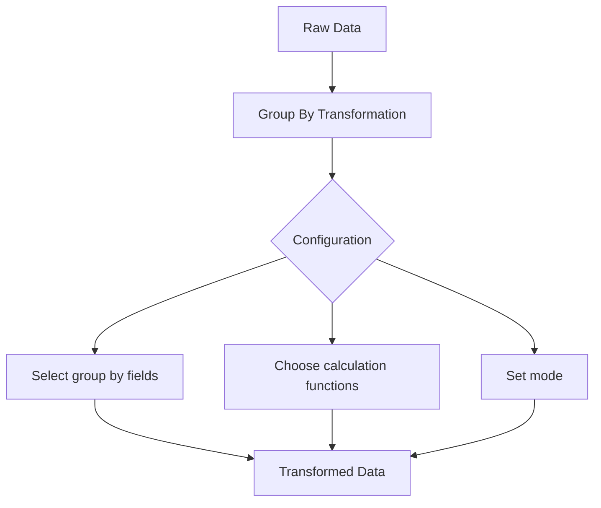

# Group By Transformations

## Introduction

Data visualization becomes more powerful when you can organize and aggregate your data in meaningful ways. Grafana's Group By transformation is a versatile tool that allows you to segment your data into logical groups and perform calculations on those groups. This transformation is particularly useful when dealing with large datasets that need to be summarized or categorized for clearer visualization.

In this guide, we'll explore how the Group By transformation works, how to configure it properly, and some practical scenarios where it proves invaluable for data analysis.

## What is a Group By Transformation?

The Group By transformation in Grafana lets you:

1. **Organize data** by grouping rows that share common field values
2. **Calculate aggregates** (like sum, average, count) for each group
3. **Create new dimensions** from your data to enhance visualization

Think of it like organizing a spreadsheet where you group similar items and create summaries for each category.

## How Group By Works

The Group By transformation operates on your query results in two primary steps:

1. **Grouping**: First, Grafana organizes your data rows by the fields you specify as "group by" fields
2. **Calculation**: Then, it performs calculations on the grouped data using the aggregation functions you select

Let's break down the configuration options:

### Configuration Parameters

- **Fields to group by**: The fields that determine how data is grouped
- **Calculation**: The aggregate function to apply to each group (sum, mean, count, etc.)
- **Mode**: Determines how the transformation handles multiple series

## Basic Example

Let's start with a simple example. Imagine you have server monitoring data with the following fields:
- server_name
- location
- cpu_usage
- memory_usage
- timestamp

You want to group this data by `server_name` and calculate the average CPU and memory usage per server.

Here's how you would configure the Group By transformation:

```
Group by fields: server_name
Calculate: mean
Fields: cpu_usage, memory_usage
```

This would transform your data from many individual measurements per server to just one row per server, showing the average values:

**Before transformation:**
| timestamp | server_name | location | cpu_usage | memory_usage |
|-----------|-------------|----------|-----------|--------------|
| 12:01:00  | server-01   | us-east  | 45        | 60           |
| 12:02:00  | server-01   | us-east  | 48        | 62           |
| 12:03:00  | server-01   | us-east  | 42        | 58           |
| 12:01:00  | server-02   | us-west  | 72        | 80           |
| 12:02:00  | server-02   | us-west  | 75        | 82           |
| 12:03:00  | server-02   | us-west  | 78        | 85           |

**After transformation:**
| server_name | cpu_usage (mean) | memory_usage (mean) |
|-------------|------------------|---------------------|
| server-01   | 45               | 60                  |
| server-02   | 75               | 82.3                |

## Step-by-Step Configuration

To add a Group By transformation to your panel:

1. Navigate to your dashboard and edit the panel you want to transform
2. Click on the **Transform** tab in the panel editor
3. Click the **+ Add transformation** button
4. Select **Group By** from the transformation dropdown menu
5. Configure the transformation with these settings:
   - Select fields to group by
   - Choose calculation functions for the remaining fields
   - Set the mode (typically "Group by all fields" for basic grouping)

Here's how the configuration UI looks:



## Advanced Group By Techniques

### Multiple Group By Fields

You can group by multiple fields to create hierarchical groupings. For example, grouping by both `location` and `server_name` would organize your data first by location, then by server within each location.

**Configuration:**
```
Group by fields: location, server_name
Calculate: mean
Fields: cpu_usage, memory_usage
```

**Result:**
| location | server_name | cpu_usage (mean) | memory_usage (mean) |
|----------|-------------|------------------|---------------------|
| us-east  | server-01   | 45               | 60                  |
| us-west  | server-02   | 75               | 82.3                |

### Multiple Calculations

You can perform different calculations on different fields in the same transformation:

**Configuration:**
```
Group by fields: server_name
Calculations:
  - cpu_usage: mean
  - memory_usage: max
  - timestamp: last
```

This would give you the mean CPU usage, maximum memory usage, and latest timestamp for each server.

### Calculation Types

Grafana's Group By transformation supports various calculation functions:

- **Math operations**: sum, mean, min, max
- **Statistical operations**: count, range (max-min), std dev (standard deviation)
- **Selection operations**: first, last
- **Distribution operations**: percentiles (25th, 75th, 90th, etc.)

Choose the calculation that best represents what you're trying to visualize.

## Real-World Use Cases

### 1. Server Performance Dashboard

**Scenario**: You're monitoring 100 servers across multiple regions and want to visualize performance by region.

**Configuration:**
```
Group by fields: region
Calculate: mean
Fields: cpu_usage, memory_usage, network_io
```

This gives you a regional overview without the noise of individual server data.

### 2. Error Tracking by Application

**Scenario**: You're collecting error logs across multiple applications and want to understand error frequency.

**Configuration:**
```
Group by fields: application, error_type
Calculate: count
Fields: *
```

This helps identify which applications have the most errors and what types of errors are most common.

### 3. Time-Based Aggregation

**Scenario**: You have high-frequency metric data but want to visualize hourly trends.

**Step 1**: First, add a "Add field from calculation" transformation to create an hour field:
```
Mode: Binary operation
Operation: Field with static value
Field: timestamp
Value: Extract hour
Alias: hour
```

**Step 2**: Then add a Group By transformation:
```
Group by fields: hour
Calculate: mean
Fields: metric_values
```

This creates hourly averages from your high-frequency data.

## Common Issues and Solutions

### Issue: Empty Groups

If your grouping produces empty groups, check:
- Are there null values in your group by fields?
- Does your data have the fields you're trying to group by?

**Solution**: Use a "Filter data by values" transformation before Group By to clean your data.

### Issue: Too Many Groups

If your grouping creates too many small groups, consider:

**Solution**: Group by broader categories or add a "Limit" transformation after Group By to show only the top N groups.

### Issue: Incorrect Calculations

If your calculations seem wrong, check:

**Solution**: Ensure you're using the right calculation type for your data type (e.g., don't use "mean" on string fields).

## Best Practices

1. **Start simple**: Begin with a single group by field and add complexity as needed
2. **Preview your data**: Use the transformation preview to check results before saving
3. **Order matters**: Place Group By transformations after data cleaning transformations
4. **Combine with other transformations**: Use Group By with Rename, Filter, and Join transformations for powerful visualizations
5. **Document your transformations**: Add notes explaining complex transformation chains for future reference

## Summary

The Group By transformation is a powerful tool in Grafana's data manipulation toolkit that allows you to:

- Organize data into logical groups
- Perform calculations on those groups
- Create more meaningful visualizations
- Reduce visual noise in your dashboards

By mastering Group By transformations, you'll be able to create more insightful dashboards that focus on the patterns and trends that matter most.

## Additional Resources

- [Official Grafana Transformations Documentation](https://grafana.com/docs/grafana/latest/panels/transformations/)
- Practice Exercise: Try creating a dashboard that shows system metrics grouped by application tier (database, application, web)
- Related Transformation: Explore the "Series to rows" transformation, which works well before Group By for certain data structures

Remember that transformations are non-destructive - they don't change your data source, only how the data is processed for visualization. This means you can experiment freely with different grouping strategies without worrying about damaging your data.