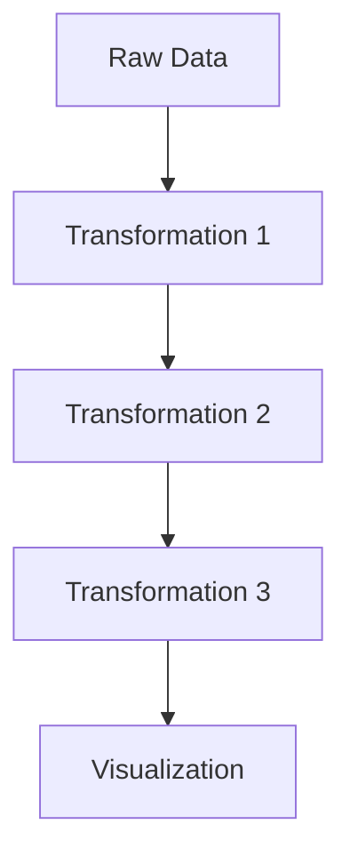

# Calculations

## Introduction

The Calculations transformation is a powerful feature in Grafana that allows you to perform mathematical operations on your query results. Instead of modifying your data source queries or writing complex formulas, you can use Calculations to derive new values, create summary statistics, or manipulate your data directly within Grafana's visualization pipeline.

This transformation is particularly useful when you need to:
- Perform mathematical operations across multiple queries
- Create new metrics based on existing data
- Generate summary statistics like averages, sums, or counts
- Convert units or normalize data

## Understanding Calculations Transformation

At its core, the Calculations transformation takes your query results and applies one or more mathematical functions to create new fields in your dataset. These calculations can be applied to:

1. **Individual fields**: Performing operations on single fields (e.g., multiplying a field by a constant)
2. **Multiple fields**: Combining values from different fields (e.g., calculating the ratio between two metrics)
3. **Entire dataset**: Generating summary statistics (e.g., calculating the mean of all values in a field)

## Basic Usage

Let's explore how to apply the Calculations transformation to your data:

1. Add a panel to your dashboard and configure your data source query
2. Navigate to the **Transform** tab in the panel editor
3. Click **+ Add transformation** and select **Calculations**
4. Choose the calculation mode (see options below)
5. Select the calculation(s) you want to apply
6. View the transformed results in your visualization

## Calculation Modes

The Calculations transformation offers several modes to operate on your data:

### Single row mode (Calculate a single value per field)

This creates a new result with a single row containing the calculated value for each field.


### Single field mode (Calculate a single value across rows for a single field)

This creates a new field with a single-valued calculation based on all values in a selected field.

### Binary operations mode (Calculate a new field based on two other fields)

This allows you to perform arithmetic operations between two fields to create a new field.

### Row-wise mode (Calculate new fields based on formulas)

This performs calculations row by row, creating new fields based on expressions.

## Common Calculations

The Calculations transformation provides numerous built-in functions:

### Basic Statistics

- **Mean**: Calculate the average value
- **Min/Max**: Find the minimum or maximum value
- **Count**: Count the number of values or rows
- **Sum**: Calculate the sum of all values

### Data Analysis

- **Standard Deviation**: Measure the amount of variation in your data
- **Variance**: Calculate the statistical variance
- **Delta**: Calculate the difference between first and last values
- **Step**: Calculate the minimum interval between values

### Special Functions

- **Cumulative Sum**: Calculate a running total
- **Difference**: Calculate the difference between consecutive values
- **Percentage Difference**: Calculate the percentage change between values
- **Unique Values**: Count how many distinct values exist

## Practical Examples

### Example 1: Calculating Averages for Server Metrics

Let's say you're monitoring multiple servers and want to display the average CPU usage across all servers:

1. Query your data source to get CPU metrics for all servers
2. Add a Calculations transformation
3. Choose "Reduce row" mode
4. Select the "Mean" calculation

**Input Data:**
```
Server    | CPU Usage (%)
----------|-------------
Server-1  | 45
Server-2  | 62
Server-3  | 28
Server-4  | 75
```

**Transformation Configuration:**
- Mode: Reduce rows
- Calculation: Mean

**Output Data:**
```
Metric          | Value
----------------|------
CPU Usage_Mean  | 52.5
```

This lets you quickly see the average CPU usage across all servers in a stat panel or gauge.

### Example 2: Calculating the Ratio Between Two Metrics

Suppose you want to calculate a ratio between request count and error count to get an error rate:

1. Query your data source to get both metrics
2. Add a Calculations transformation
3. Choose "Binary operation" mode
4. Select "Divide A by B"
5. Choose "errors" as Field A and "requests" as Field B

**Input Data:**
```
Time      | requests | errors
----------|----------|-------
09:00     | 1240     | 26
09:05     | 1350     | 31
09:10     | 1420     | 22
09:15     | 1510     | 45
```

**Transformation Configuration:**
- Mode: Binary operation
- Operation: Divide
- Field A: errors
- Field B: requests

**Output Data:**
```
Time      | requests | errors | error_rate
----------|----------|--------|----------
09:00     | 1240     | 26     | 0.021
09:05     | 1350     | 31     | 0.023
09:10     | 1420     | 22     | 0.015
09:15     | 1510     | 45     | 0.030
```

Now you can visualize the error rate as a percentage in your dashboard.

### Example 3: Using Row-wise Calculations with Custom Formulas

You can use row-wise calculations to create complex custom formulas:

1. Query your data source to get memory metrics
2. Add a Calculations transformation
3. Choose "Row-wise calculation" mode
4. Enter a custom formula like `(memoryUsed / memoryTotal) * 100` to calculate memory usage percentage

**Input Data:**
```
Time      | memoryUsed | memoryTotal
----------|------------|------------
09:00     | 4.2        | 16
09:05     | 6.8        | 16
09:10     | 5.5        | 16
09:15     | 7.2        | 16
```

**Transformation Configuration:**
- Mode: Row-wise calculation
- Formula: (memoryUsed / memoryTotal) * 100
- Alias: Memory Usage %

**Output Data:**
```
Time      | memoryUsed | memoryTotal | Memory Usage %
----------|------------|-------------|---------------
09:00     | 4.2        | 16          | 26.25
09:05     | 6.8        | 16          | 42.50
09:10     | 5.5        | 16          | 34.38
09:15     | 7.2        | 16          | 45.00
```

## Math Functions and Expressions

In row-wise calculations, you can use a variety of mathematical functions and operators:

### Basic Operators
- Addition: `+`
- Subtraction: `-`
- Multiplication: `*`
- Division: `/`
- Modulo: `%`
- Exponentiation: `^`

### Mathematical Functions
- `abs()`: Absolute value
- `sqrt()`: Square root
- `log()`: Natural logarithm
- `exp()`: Exponential
- `min()`, `max()`: Minimum and maximum values
- `ceil()`, `floor()`: Ceiling and floor functions
- `round()`: Round to nearest integer

### Conditional Expressions
- `if(condition, trueValue, falseValue)`: Conditional logic

### Example Custom Expression

To calculate a "health score" based on multiple metrics:

```
if(cpu > 80, 0, if(cpu > 60, 5, 10)) + if(memory > 90, 0, if(memory > 70, 5, 10))
```

This would create a score between 0-20 based on CPU and memory thresholds.

## Transformation Order

Remember that in Grafana, transformations are applied in sequence. If you have multiple transformations, the output of one becomes the input to the next. You can reorder transformations by dragging them up or down in the transform list.



When using Calculations with other transformations, consider:
1. Filtering data first to reduce the dataset before performing calculations
2. Using Calculations before certain visualizations that require specific data formats
3. Combining Calculations with other transformations to reshape your data completely

## Common Use Cases

The Calculations transformation is especially useful for:

1. **Dashboard summaries**: Calculate totals or averages across multiple services
2. **Rate calculations**: Convert counts to rates by dividing by time intervals
3. **Thresholds and alerts**: Create derived metrics to use for alerting
4. **Normalization**: Convert metrics to percentages or ratios for easier comparison
5. **SLA calculations**: Derive availability percentages and uptimes
6. **Capacity planning**: Calculate utilization rates and growth metrics

## Limitations and Considerations

When using the Calculations transformation, be aware of these limitations:

1. **Performance**: Complex calculations on large datasets may impact dashboard performance
2. **Null values**: Some calculations might not handle null or NaN values as expected
3. **Order dependency**: Results may depend on the order of transformations
4. **Granularity**: Time-based calculations may be affected by the query time range and interval

## Summary

The Calculations transformation is a versatile tool in Grafana that allows you to perform mathematical operations on your data directly within the visualization pipeline. By mastering this transformation, you can:

- Create derived metrics without modifying your data source queries
- Perform complex calculations across multiple data sources
- Generate summary statistics and aggregations
- Build more meaningful visualizations

The ability to transform and manipulate data on the fly makes Calculations an essential part of building informative dashboards in Grafana.

## Additional Resources

To learn more about Grafana Transformations:

- Experiment with the Calculations transformation on your own data
- Try combining Calculations with other transformations like Reduce, Group By, and Join
- Practice creating custom formulas for your specific use cases
- Develop a library of common calculations you can reuse across dashboards

## Practice Exercises

1. Create a dashboard panel that shows the average CPU usage across all your servers
2. Calculate a ratio between successful and failed requests to show an error rate percentage
3. Build a custom health score using multiple metrics and conditional logic
4. Create a panel showing the percentage change in traffic compared to the previous day
5. Use Calculations to normalize different metrics to the same scale for comparison