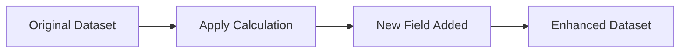

# Add Field from Calculation

## Introduction

Grafana's transformation system allows you to manipulate and enhance your data before visualization. One of the most powerful transformations is **Add field from calculation**, which enables you to create new fields (columns) in your dataset based on calculations from existing fields.

This transformation is particularly useful when you need derived metrics that aren't directly available in your data source. For example, you might want to calculate a percentage, combine multiple fields, or apply mathematical functions to your data.

## How It Works

The "Add field from calculation" transformation creates a new field in your dataset by applying a calculation to one or more existing fields. The calculation can be a simple binary operation (like addition or multiplication) or a complex expression involving multiple fields and functions.



## Basic Configuration

To add a field from calculation:

1. Edit your panel and navigate to the **Transform** tab
2. Click **+ Add transformation**
3. Select **Add field from calculation** from the dropdown menu
4. Configure the calculation using the provided options

You'll need to configure:
- **Mode**: Binary operation or Expression
- **Name**: The name for your new field
- **Calculation**: The actual calculation formula

## Calculation Modes

### Binary Operation Mode

The binary operation mode is straightforward - it applies a mathematical operation between two fields.

Options include:
- Basic operations: Add, Subtract, Multiply, Divide
- Comparison operations: `>`, `<`, `>=`, `<=`, `==`
- Logical operations: `AND`, `OR`

#### Example:

Let's say you have two fields: `cpu_usage` and `memory_usage`, and you want to calculate their sum:

1. Select "Binary operation" mode
2. Set field name to "total_resource_usage"
3. Select "Add" as the operation
4. Choose "cpu_usage" as Field A
5. Choose "memory_usage" as Field B

Original data:
```
| Time                | cpu_usage | memory_usage |
|---------------------|-----------|--------------|
| 2023-01-01 10:00:00 | 45        | 60           |
| 2023-01-01 10:01:00 | 48        | 62           |
| 2023-01-01 10:02:00 | 52        | 65           |
```

After transformation:
```
| Time                | cpu_usage | memory_usage | total_resource_usage |
|---------------------|-----------|--------------|----------------------|
| 2023-01-01 10:00:00 | 45        | 60           | 105                  |
| 2023-01-01 10:01:00 | 48        | 62           | 110                  |
| 2023-01-01 10:02:00 | 52        | 65           | 117                  |
```

### Expression Mode

The expression mode provides much more flexibility, allowing you to use complex formulas involving multiple fields and functions.

#### Example:

Let's calculate CPU utilization percentage based on idle and total CPU time:

1. Select "Expression" mode
2. Set field name to "cpu_utilization_percent"
3. Enter the expression: `100 - (idle_cpu_time / total_cpu_time * 100)`

Original data:
```
| Time                | idle_cpu_time | total_cpu_time |
|---------------------|---------------|----------------|
| 2023-01-01 10:00:00 | 750           | 1000           |
| 2023-01-01 10:01:00 | 700           | 1000           |
| 2023-01-01 10:02:00 | 650           | 1000           |
```

After transformation:
```
| Time                | idle_cpu_time | total_cpu_time | cpu_utilization_percent |
|---------------------|---------------|----------------|-------------------------|
| 2023-01-01 10:00:00 | 750           | 1000           | 25                      |
| 2023-01-01 10:01:00 | 700           | 1000           | 30                      |
| 2023-01-01 10:02:00 | 650           | 1000           | 35                      |
```

## Supported Functions in Expressions

When using expression mode, you have access to many mathematical and logical functions:

### Mathematical Functions
- `abs(x)`: Absolute value
- `ceil(x)`: Round up to nearest integer
- `floor(x)`: Round down to nearest integer
- `log(x)`: Natural logarithm
- `pow(x, y)`: x raised to power y
- `sqrt(x)`: Square root
- `round(x)`: Round to nearest integer

### Statistical Functions
- `min(x, y)`: Minimum of x and y
- `max(x, y)`: Maximum of x and y
- `mean(series)`: Average of values in series
- `sum(series)`: Sum of values in series

### Conditional Function
- `if(condition, then, else)`: If condition is true, return then value, otherwise return else value

## Practical Examples

### Example 1: Calculating Error Rate

If you have data about total requests and error counts, you can calculate the error rate percentage:

Original data:
```
| Time                | total_requests | error_count |
|---------------------|----------------|-------------|
| 2023-01-01 10:00:00 | 1250           | 25          |
| 2023-01-01 10:01:00 | 1300           | 39          |
| 2023-01-01 10:02:00 | 1275           | 28          |
```

Transformation configuration:
- Mode: Expression
- Name: error_rate_percent
- Expression: `(error_count / total_requests) * 100`

Result:
```
| Time                | total_requests | error_count | error_rate_percent |
|---------------------|----------------|-------------|-------------------|
| 2023-01-01 10:00:00 | 1250           | 25          | 2                 |
| 2023-01-01 10:01:00 | 1300           | 39          | 3                 |
| 2023-01-01 10:02:00 | 1275           | 28          | 2.2               |
```

### Example 2: Creating Status Field

You can use the `if` function to create a status field based on thresholds:

Original data:
```
| Time                | response_time_ms |
|---------------------|------------------|
| 2023-01-01 10:00:00 | 120              |
| 2023-01-01 10:01:00 | 250              |
| 2023-01-01 10:02:00 | 450              |
```

Transformation configuration:
- Mode: Expression
- Name: status
- Expression: `if(response_time_ms < 200, 0, if(response_time_ms < 400, 1, 2))`

This creates a status field with:
- 0 for response times under 200ms (good)
- 1 for response times between 200ms and 400ms (warning)
- 2 for response times over 400ms (critical)

Result:
```
| Time                | response_time_ms | status |
|---------------------|------------------|--------|
| 2023-01-01 10:00:00 | 120              | 0      |
| 2023-01-01 10:01:00 | 250              | 1      |
| 2023-01-01 10:02:00 | 450              | 2      |
```

You can then use this status field with thresholds in your visualization to color-code values.

## Real-World Use Cases

### Capacity Planning

Calculate resource utilization percentages to predict when you'll need to scale:

```
utilization_percent = (used_resources / total_resources) * 100
growth_rate = (current_utilization - previous_utilization) / time_period
time_to_capacity = (max_capacity - current_utilization) / growth_rate
```

### Financial Metrics

Convert raw financial data into actionable metrics:

```
profit_margin = (revenue - costs) / revenue * 100
year_over_year_growth = (current_value - previous_year_value) / previous_year_value * 100
```

### Performance Monitoring

Calculate derived metrics for system performance:

```
error_rate = errors / total_requests * 100
apdex_score = (satisfied_requests + (tolerated_requests/2)) / total_requests
```

## Multiple Transformations

You can chain multiple "Add field from calculation" transformations together to create complex derived data. Each new calculated field becomes available for use in subsequent transformations.

For example:
1. First, calculate a utilization percentage
2. Then, create a status field based on that percentage
3. Finally, calculate a trend compared to the previous time period

## Common Issues and Troubleshooting

### Missing Values

If your calculation involves fields that have null or undefined values, the result might be unexpected. You can use the `if` function to handle missing values:

```
if(isNull(field_name), default_value, your_calculation)
```

### Type Conversion

Ensure your fields have the appropriate data types for your calculations. You may need to convert string values to numbers:

```
parseFloat(string_field)
```

### Invalid Expressions

If your calculation doesn't appear, check for syntax errors in your expression. Common issues include:
- Missing parentheses
- Division by zero
- Using field names with spaces without proper quoting

## Summary

The "Add field from calculation" transformation is a powerful tool in Grafana that allows you to derive new insights from your existing data. By creating calculated fields, you can:

- Generate metrics that aren't directly available from your data source
- Normalize data for better comparison
- Create thresholds and status indicators
- Combine multiple metrics into single, actionable values

This transformation is essential for advanced dashboards that need to go beyond simply displaying raw data and instead provide meaningful, derived metrics that support decision-making.

## Exercises

1. **Basic Calculation**: Create a transformation that calculates the difference between two fields.
2. **Percentage Calculation**: Add a field that shows what percentage one field is of another.
3. **Status Indicator**: Create a transformation that generates a status value (0, 1, or 2) based on thresholds you define.
4. **Combined Metric**: Create an "overall health score" by combining multiple metrics with different weights.

## Next Steps

After mastering the "Add field from calculation" transformation, you might want to explore:
- **Organize fields**: To arrange your new calculated fields
- **Filter by value**: To show only rows that meet certain criteria based on your calculated fields
- **Reduce**: To aggregate your calculated fields over time
- **Alert rules**: To set up alerts based on your calculated values